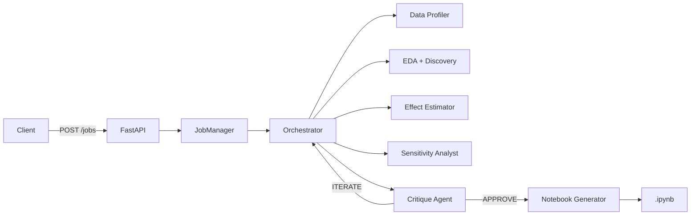

# Causal Orchestrator

Automated causal inference analysis using LLM-coordinated specialist agents.

## What It Does

- Accepts a Kaggle dataset URL and optional treatment/outcome variable hints
- Runs a multi-agent pipeline: data profiling, causal discovery, effect estimation, sensitivity analysis, quality critique
- Produces a Jupyter notebook with findings, executable verification code, and visualizations

## Numbers

- **13 agents** coordinated by an LLM-based orchestrator
- **12 estimation methods**: OLS, IPW, AIPW, PSM, DiD, IV/2SLS, RDD, S/T/X-Learner, Causal Forest, Double ML
- **5 discovery algorithms**: PC, FCI, GES, NOTEARS, LiNGAM
- **345 unit tests**

## Architecture



Agents use the ReAct pattern (observe-reason-act loops) to decide which tools to call based on data characteristics. The orchestrator dispatches agents using LLM reasoning rather than hardcoded routing.

## Quick Start

### Prerequisites

- Python 3.11+
- A Claude API key (or Gemini/Vertex AI)
- Kaggle credentials (for dataset downloads)

### Setup

```bash
git clone <repo-url>
cd causal-orchestrator/backend

# Install dependencies
pip install -e ".[dev]"

# Configure
cat > .env << 'EOF'
CLAUDE_API_KEY=sk-ant-your-key-here
KAGGLE_USERNAME=your_username
KAGGLE_KEY=your_key
EOF

# Start server
uvicorn src.api.main:app --port 8000
```

### Create a job

```bash
curl -X POST http://localhost:8000/jobs \
  -H "Content-Type: application/json" \
  -d '{
    "kaggle_url": "https://www.kaggle.com/datasets/owner/dataset-name",
    "treatment_variable": "treatment_col",
    "outcome_variable": "outcome_col"
  }'
```

### Check status

```bash
curl http://localhost:8000/jobs/{job_id}/status
```

### Download notebook

```bash
curl -O http://localhost:8000/jobs/{job_id}/notebook
```

## Tech Stack

- **Framework**: FastAPI, asyncio, Pydantic
- **LLM providers**: Claude (Anthropic), Gemini (Google AI), Vertex AI
- **Causal inference**: econml, statsmodels, scikit-learn, causallearn
- **Storage**: Firestore (production), local JSON (development)
- **Notebooks**: nbformat
- **Logging**: structlog (JSON structured logging)

## Documentation

| Document | Description |
|----------|-------------|
| [docs/architecture.md](docs/architecture.md) | System design, component boundaries, class hierarchy |
| [docs/pipeline.md](docs/pipeline.md) | Step-by-step pipeline flow, state transitions, error handling |
| [docs/agents.md](docs/agents.md) | All 13 agents: tools, state contracts, ReAct pattern |
| [docs/causal-methods.md](docs/causal-methods.md) | 12 estimation methods, 5 discovery algorithms, sensitivity tests |
| [docs/api-reference.md](docs/api-reference.md) | REST API endpoints, request/response schemas |
| [docs/state-schema.md](docs/state-schema.md) | AnalysisState fields, data models, helper methods |
| [docs/configuration.md](docs/configuration.md) | Environment variables, provider setup |
| [docs/development.md](docs/development.md) | Adding agents, methods, providers; testing patterns |

## License

MIT
