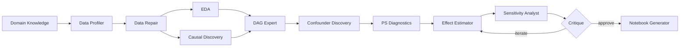

# Causal Inference Orchestrator

An LLM-coordinated multi-agent system that performs end-to-end causal inference analysis on any tabular dataset.

## What This Does

You submit a Kaggle dataset URL. The system downloads the data, then runs 13 AI agents in a pipeline: they profile the dataset, discover causal structure using graph algorithms, estimate treatment effects with multiple statistical methods, run sensitivity analysis, and pass through a critique loop. When the critique agent approves the results, a final agent generates a Jupyter notebook with all findings and executable verification code. The orchestrator uses LLM reasoning to decide agent dispatch order — no hardcoded routing.

Key numbers: 13 specialist agents, 12 estimation methods (OLS, IPW, AIPW, PSM, DiD, IV, RDD, S/T/X-Learners, Causal Forest, Double ML), 5 discovery algorithms (PC, FCI, GES, NOTEARS, LiNGAM).

## How to Run Locally

### Prerequisites

- Python 3.11+
- Node.js 18+
- GCP account with Vertex AI enabled (or Anthropic API key for Claude)
- Kaggle account (for dataset downloads)

### Quick Start

```bash
git clone https://github.com/Axionis47/causal-inference-agent.git
cd causal-inference-agent

# Install backend
cd backend
python3 -m venv .venv
source .venv/bin/activate
pip install -r requirements.txt

# Install frontend
cd ../frontend
npm ci

# Configure
cp backend/.env.example backend/.env
# Edit backend/.env with your API keys

# Start
cd ..
./start.sh
```

- Backend: http://localhost:8000
- Frontend: http://localhost:5173
- API docs: http://localhost:8000/docs

### Alternative: Docker

```bash
docker compose up -d
```

This starts an nginx proxy on port 80, the backend on 8000, and the frontend on 3000.

For the full stack with Redis (distributed rate limiting):

```bash
docker compose --profile full up -d
```

### Make Commands

```bash
make setup          # Install all dependencies
make dev            # Start backend + frontend
make test           # Run all tests
make lint           # Lint backend (ruff) + frontend (eslint)
make typecheck      # Type-check backend (mypy) + frontend (tsc)
make docker-up      # Start via Docker Compose
make docker-down    # Stop Docker Compose
```

## Folder Structure

```
backend/
  src/
    agents/
      base/             # ReActAgent, BaseAgent, AnalysisState, ContextTools
      orchestrator/     # LLM-driven dispatch, parallel merge, critique loop
      specialists/      # Domain agents (profiler, EDA, discovery, estimation, etc.)
      critique/         # Quality review agent
      registry.py       # Decorator-based agent registration
    causal/
      methods/          # 12 estimation methods (OLS, IPW, AIPW, PSM, DiD, IV, RDD, etc.)
      dag/              # Causal graph discovery (PC, FCI, GES, NOTEARS, LiNGAM)
      estimators/       # Estimator abstractions
    api/
      routes/           # FastAPI route handlers
      schemas/          # Pydantic request/response models
      middleware/       # CORS, rate limiting
    llm/                # LLM abstraction (Vertex AI, Claude, Gemini)
    storage/            # Persistence (Firestore for prod, local JSON for dev)
    config/             # Pydantic settings from env vars
    jobs/               # Job lifecycle, concurrency, SSE streaming
    kaggle/             # Dataset download
    logging_config/     # Structured JSON logging (structlog)
  tests/
    unit/               # Unit tests
    integration/        # Integration tests
  benchmarks/           # Dataset benchmarks and runners

frontend/
  src/
    pages/              # HomePage, JobPage, JobsListPage
    components/         # Results display, progress, DAG visualization, agents
    services/           # Axios API client
    hooks/              # React hooks (SSE streaming, job polling)
    store/              # Zustand state management
    types/              # TypeScript type definitions

docs/                   # Architecture diagrams, API reference, pipeline docs
infrastructure/         # Terraform configs
nginx/                  # Reverse proxy config for Docker
scripts/                # Utility scripts

team/                   # Claude Code subagent configurations
  pm/skills/            # Causal inference specialist (10 skills)
  backend/skills/       # Python agent (6 skills)
  frontend/skills/      # TypeScript agent (4 skills)
  qa/skills/            # Testing agent (5 skills)
  docs/skills/          # Documentation agent (5 skills)
```

## Environment Variables

Read from `backend/.env`. See `backend/src/config/settings.py` for all options.

| Variable | Required | Default | Description |
|----------|----------|---------|-------------|
| `LLM_PROVIDER` | yes | `vertex` | LLM backend: `vertex`, `claude`, or `gemini` |
| `GCP_PROJECT_ID` | for vertex | — | Google Cloud project ID |
| `GCP_REGION` | for vertex | `us-central1` | GCP region for Vertex AI |
| `CLAUDE_API_KEY` | for claude | — | Anthropic API key (also accepts `ANTHROPIC_API_KEY`) |
| `GEMINI_API_KEY` | for gemini | — | Google Gemini API key |
| `KAGGLE_USERNAME` | yes | — | Kaggle username for dataset downloads |
| `KAGGLE_KEY` | yes | — | Kaggle API key |
| `ENVIRONMENT` | no | `development` | `development`, `staging`, or `production` |
| `LOG_LEVEL` | no | `INFO` | Logging level |
| `USE_FIRESTORE` | no | `false` | Use Firestore for storage (otherwise local JSON) |
| `LOCAL_STORAGE_PATH` | no | `./data` | Path for local JSON storage |
| `MAX_AGENT_ITERATIONS` | no | `3` | Max critique-retry iterations |
| `AGENT_TIMEOUT_SECONDS` | no | `300` | Per-agent timeout |
| `MAX_CONCURRENT_JOBS` | no | `3` | Max parallel analysis jobs |
| `API_KEY` | no | — | API key for endpoint authentication |
| `REDIS_URL` | no | — | Redis URL for distributed rate limiting |
| `REDIS_ENABLED` | no | `false` | Enable Redis-backed rate limiting |
| `SSE_ENABLED` | no | `true` | Enable server-sent events for progress |
| `CORS_ORIGINS` | no | `localhost:5173,3000` | Allowed CORS origins (JSON list) |

## Architecture

- [Context Diagram](docs/architecture/c4_context.md)
- [Container Diagram](docs/architecture/c4_containers.md)

## Pipeline

The orchestrator runs agents in this order, with LLM reasoning deciding transitions:


```mermaid
graph LR
    A[Domain Knowledge] --> B[Data Profiler]
    B --> C[Data Repair]
    C --> D1[EDA]
    C --> D2[Causal Discovery]
    D1 --> E[DAG Expert]
    D2 --> E
    E --> F[Confounder Discovery]
    F --> G[PS Diagnostics]
    G --> H[Effect Estimator]
    H --> I[Sensitivity Analyst]
    I --> J{Critique}
    J -->|approve| K[Notebook Generator]
    J -->|iterate| H
```

1. **Domain Knowledge** — extracts domain context from dataset metadata
2. **Data Profiler** — statistical profiling, type detection, quality assessment
3. **Data Repair** — handles missing values, outliers, type coercion
4. **EDA + Causal Discovery** — run in parallel; EDA explores distributions while discovery builds a DAG
5. **DAG Expert** — refines the proposed causal graph
6. **Confounder Discovery** — identifies confounders and adjustment sets
7. **PS Diagnostics** — propensity score diagnostics and covariate balance
8. **Effect Estimator** — runs multiple estimation methods, compares results
9. **Sensitivity Analyst** — tests robustness of causal estimates
10. **Critique** — reviews quality; approves or sends back to estimation (max 3 loops)
11. **Notebook Generator** — produces a Jupyter notebook with findings and code

## License

MIT
