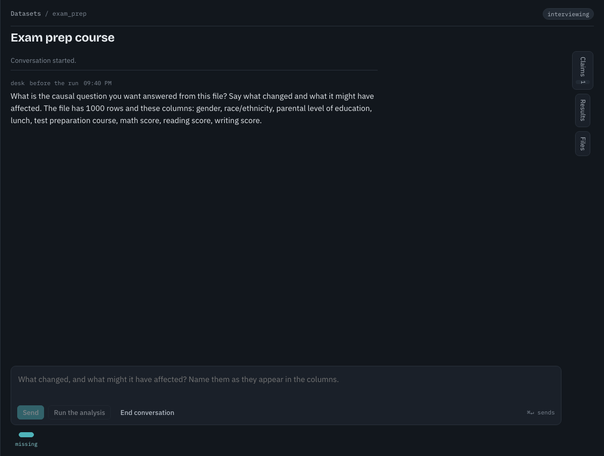
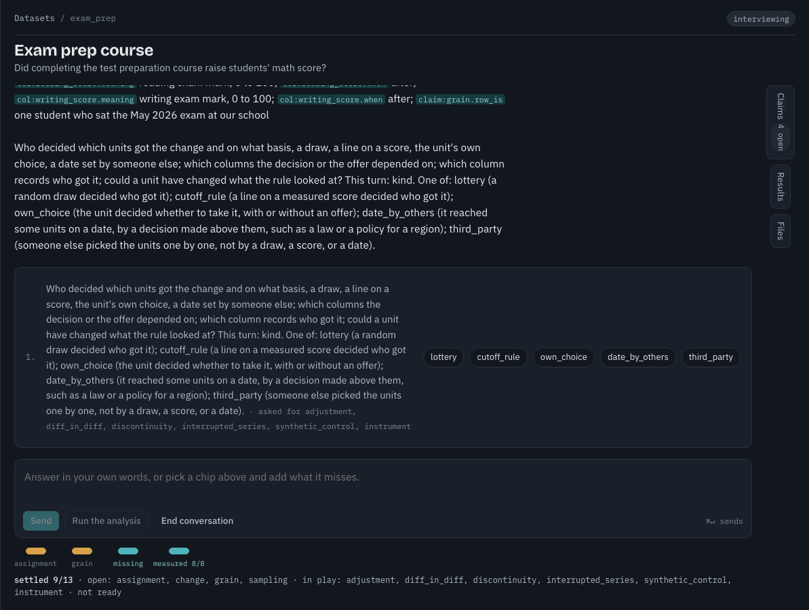
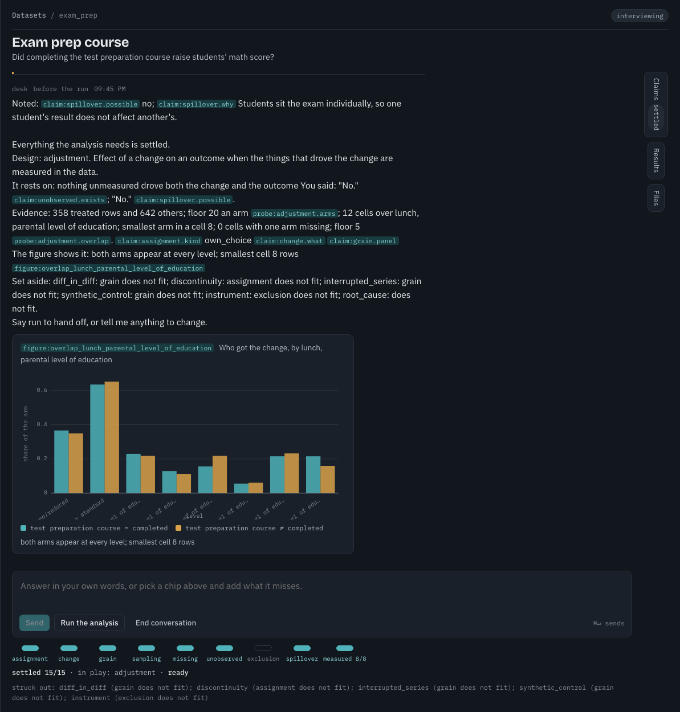
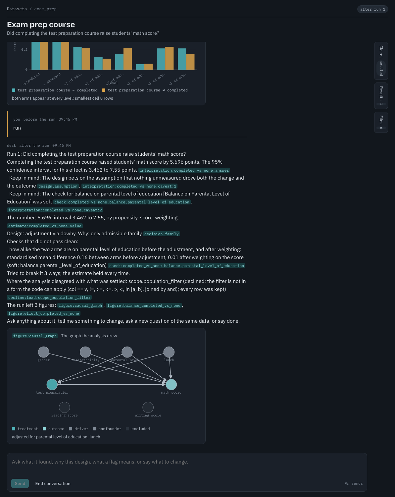
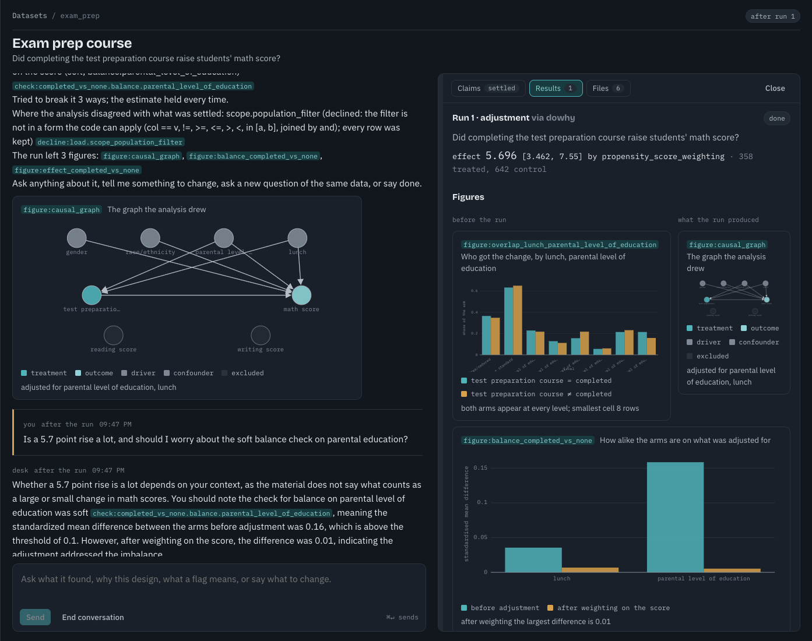
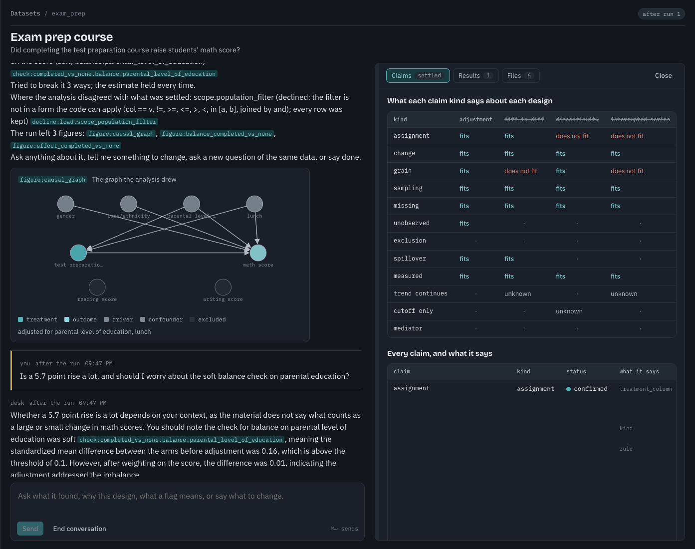

# Causal desk

One CSV and one question of the form "what did this change do to that outcome". The desk asks the question first,
validates it against the file, asks one thing per turn until a family of analysis stands, runs that family's lane on a
context pack, and talks about the result in the person's own words.

Three families are built: adjustment (DoWhy), diff-in-diff (pyfixest), discontinuity (rdrobust). Four more are
declared so the routing can rule them in or out.

## See it

One real run, start to finish, on the Kaggle [Students Performance](https://www.kaggle.com/datasets/spscientist/students-performance-in-exams)
file: 1,000 students, eight columns, and the question "did completing the test preparation course raise students'
math score?". The answers below are the school's own account of how the course was offered.

**1. The desk asks the question first.** Nothing about the data is typed into a form.



**2. One question per turn.** Each answer becomes claims with a source; the chips say what stands. Here every column
has been placed before, at, or after the change, and the desk asks who decided which students got the course.



**3. Ready.** With fifteen claims settled the code rules five families out and one in. The desk shows what the
design rests on, the evidence it checked, and the overlap figure, then waits for "run".



**4. The run.** The adjustment lane on DoWhy weights on a propensity score, reports the effect with its interval, names
the soft balance check, and tries three ways to break the estimate. Every sentence carries the address of the
artifact behind it.



**5. The figures** the run drew beside the one the desk drew before it.



**6. The claims grid.** What each claim kind says about each design, and why the others fell away.



## Run it

```bash
make dev-api      # the API on :8000
make dev-web      # the page on :5173, proxying /api
```

Or one run from the command line: `uv run python -m causal_agent.evals.lane adjustment students "Did completing the prep course raise math scores?"`.

Copy `.env.example` to `.env`; only LangSmith needs a key, and only for tracing.

## Check it

```bash
make check        # everything CI runs: lint, types, tests, the web, the schema
```

`make` alone lists the targets.

## Read about it

- [docs/architecture.md](docs/architecture.md): the layers, a family package, the stores, the wire, the checks.
- [docs/adr/](docs/adr/): the decisions the layout rests on.
- [causal_agent/README.md](causal_agent/README.md): the packages; each has its own README.
