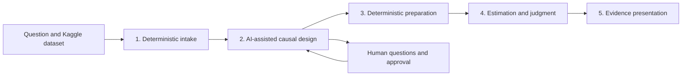

# Auditable Causal AI Harness

*A reliable pipeline that turns a causal question and public dataset into an
evidence-linked design, estimate, and presentation.*

Turning public data into a causal answer is not only a modeling problem. The
system must preserve source evidence, expose assumptions, ask for missing
context, and refuse unsupported conclusions.

This project moves a Kaggle dataset through intake, causal design, data
preparation, estimation, and presentation. Models propose typed artifacts.
Deterministic code checks evidence, lineage, and scientific constraints before
anything can advance.

## Why this project matters

- **Grounded model behavior:** A task receives only declared evidence and must
  cite that evidence in its claims.
- **Reproducible work:** Immutable artifacts carry content hashes, parent
  references, and exact stage identities.
- **Human control:** The system asks bounded questions when critical context is
  missing and requires approval before estimation.
- **Safe failure:** Provider, validation, persistence, and observability failures
  have typed outcomes. The pipeline does not silently substitute another path.

## Pipeline


```mermaid
flowchart LR
    Q["Question and Kaggle dataset"] --> I["1. Deterministic intake"]
    I --> D["2. AI-assisted causal design"]
    D --> P["3. Deterministic preparation"]
    P --> E["4. Estimation and judgment"]
    E --> V["5. Evidence presentation"]
    D --> H["Human questions and approval"]
    H --> D
```

The five stages share one contract system. Each stage opens only the exact
artifacts named by the previous handoff. The full boundary is defined in the
[system contract](docs/product/SYSTEM-CONTRACT.md).

## What the system produces

- An approved causal design with assumptions and identification risks.
- A prepared analysis frame with row-level transformation receipts.
- Estimates for a supported causal method, plus diagnostics and sensitivities.
- A claim judgment bounded by the computed statistical evidence.
- Accessible charts and a presentation summary built from frozen figure data.

## Engineering highlights

| Area | Concrete evidence |
|---|---|
| AI engineering | A [checkpointed design graph](src/causal/design/graph.py) coordinates structured model tasks, human questions, and exact approval. |
| AI infrastructure | [Artifact and handoff contracts](src/causal/shared/contracts.py) preserve hashes, parents, identities, and cross-stage compatibility. |
| Harness engineering | The shared [task runner](src/causal/shared/agenttask.py) scopes evidence, enforces response schemas, and runs bounded corrections. |
| Software engineering | Strict contracts, migrations, idempotent boundaries, and a [full pipeline test](tests/runtime/test_full_pipeline_close.py) cover the complete journey. |
| External integrations | Narrow adapters isolate [Kaggle](src/causal/runtime/kaggle_live.py), [Vertex AI](src/causal/shared/gateway.py), [LangSmith](src/causal/shared/tracing.py), PostgreSQL, and S3-compatible storage. |

## How the harness works

1. The harness selects evidence for one task and applies explicit size limits.
2. It creates a typed envelope with identities, budgets, parents, and allowed
   evidence.
3. The model returns bounded decisions under the registered response schema.
4. Deterministic validation checks structure, citations, lineage, and domain
   rules.
5. A narrow error triggers a targeted correction. Missing critical knowledge
   becomes a bounded human question.
6. A valid result becomes an immutable artifact. An invalid result reaches a
   typed terminal state.

This split keeps language-model judgment useful while code retains
control over persistence, routing, statistical computation, and approval. See
[Harness and Evaluations](docs/HARNESS-AND-EVALUATIONS.md) for the complete
task lifecycle.

## Selected engineering judgment

- Live integration showed that a retired Kaggle endpoint, a Vertex seed range,
  and an incomplete response schema could each invalidate a plausible design.
  The fixes became adapter rules and regression tests.
- The harness once loaded a data dictionary but passed only its identifier to
  the model. The repair preserved the text, scoped it by task, and added visible
  prompt budgets.
- A table with no unique column does not prove that each row is an independent
  unit. The system requires an explicit grain assertion instead of silently
  changing standard errors.

The full cases, rejected alternatives, and remaining limitations are in
[Engineering Judgment](docs/ENGINEERING-JUDGMENT.md).

## Verification

The project pins Python 3.12 and its Python dependencies in `uv.lock`. The full
suite uses Docker for PostgreSQL and MinIO integration tests.

```bash
uv sync --frozen --dev
uv run pytest -q
uv run ruff check .
uv run mypy src
```

macOS iCloud note: A synced checkout can mark `.venv` as hidden and make the
editable package disappear from Python's import path. If that happens, run
`find .venv -flags +hidden -exec chflags nohidden {} +` once after sync.

Latest full verification:

- **pytest:** 1,483 passed, 3 skipped, and 66 warnings in 61.82 seconds;
- **Ruff:** all checks passed;
- **strict mypy:** no issues found in 84 source files.

The pytest warnings come from PyFixest on sparse estimation fixtures. They cover
multicollinearity, changed test-statistic distributions, and a small-fixture
divide-by-zero path. No test failed.

The repository also contains 50 declarative
[evaluation registrations](evals/catalog.v1.yaml). A registration defines an
evaluation boundary, trigger, fixture focus, and hard pass condition. It is not
a claim that 50 live model evaluations run in every test invocation.

Live Kaggle, Vertex AI, and LangSmith smoke checks are separately gated by
credentials and explicit environment flags. Scripted model fixtures test
contracts and failure paths without presenting themselves as live-provider
results.

The evaluation-only `tools/model_quality.py` command adds a human-grounded live
gate over four real-data journeys. `validate` is free, `calibrate` produces an
immutable review packet, and `gate` requires the approved human-gold hash and
passes only when all four journeys satisfy every hard condition.

## Known limitations

- The current product is a single-user local CLI. It has no browser UI or
  multi-user service boundary.
- Version 1 supports randomized experiments, observational AIPW,
  difference-in-differences, and sharp regression discontinuity.
- A live run requires PostgreSQL, S3-compatible storage, Kaggle access, Vertex
  AI credentials, and LangSmith tracing.
- The application has no distributed scheduler, queue, autoscaler, or remote
  worker fleet. Its infrastructure focus is correctness, provenance, and
  reliable execution.

These limits are deliberate and recorded in the
[architecture guide](docs/ARCHITECTURE.md), not hidden behind fallback behavior.

## Explore the project

- [Architecture](docs/ARCHITECTURE.md): stages, trust boundaries, persistence,
  and failure flow.
- [Harness and Evaluations](docs/HARNESS-AND-EVALUATIONS.md): model task control,
  validation, corrections, and evidence.
- [Engineering Judgment](docs/ENGINEERING-JUDGMENT.md): four decisions with
  observed failures, alternatives, verification, and limitations.
- [System Contract](docs/product/SYSTEM-CONTRACT.md): the detailed product and
  execution contract.
- [Decision Ledger](docs/LEDGER.md): the append-only implementation history.
- [Repository History](docs/REPOSITORY-HISTORY.md): the preserved earlier implementation
  and the transition to the current `main`.

## Development note

AI coding tools assisted implementation. The decision ledger records the
constraints, rejected options, fixes, and verification used to review that
work.
