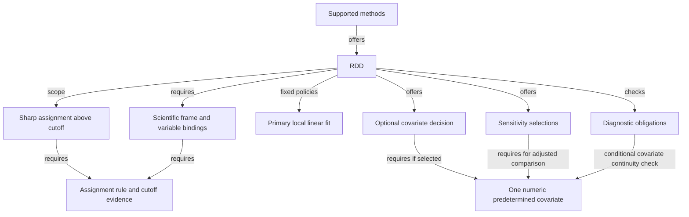

# Analysis library: an explorable graph of supported decisions

Status: implemented and verified; see the [verification report](ANALYSIS-CONSTRAINT-LIBRARY-VERIFICATION.md).  
Planning baseline: current working tree inspected on 2026-09-10.

## 1. Goal and boundaries

Rearrange the analysis library around an explorable capability graph. A design agent
can start with supported methods, inspect a method's decisions, follow an option to
its requirements and deeper choices, and receive deterministic feedback after each
material proposal. The graph supplies focused context while the agent reasons. The
same method requirements must explain the available choices and enforce acceptance.
The library is both a guide during construction and a wall before a design advances.

The graph is the public exploration model, not just an illustration of a sequence
of API calls. A candidate is a set of selections and bindings over that graph. Its
current evaluation determines which branches are available, conditional or blocked.
Reading a branch does not select it, and following one path does not by itself make
a complete design.

Dataset knowledge and analysis requirements meet through the candidate design:

- The dataset notebook describes actual measurements, meanings, source evidence,
  relationships, and unknowns. Its compilation is independent of the causal question.
- The design agent interprets the question, retrieves relevant notebook facts, and
  proposes scientific decisions and column bindings.
- The analysis library exposes what it supports, what each option requires, and
  whether the current proposal satisfies those requirements.
- Repair establishes whether actual data can run the fixed design. It cannot alter
  scientific meaning to force the data to pass.
- Execution runs only the exact approved plan against the exact prepared frame.

This task changes the analysis library first. Implementing the dataset notebook,
the replacement design graph, human-question UI, or a new repair agent is outside
this task. Their required integration contracts are specified here so they can be
built against a stable analysis boundary afterward.

Preserve numerical implementations, source/data lineage, and exact approval
protections. Do not add methods, expand the supported statistical menu, fit effects
while designing, or add an LLM inside the analysis library.

## 2. Verified current state

The public implementation and contracts are in
[interface.py](../src/causal/analysis/interface.py) and
[contracts.py](../src/causal/analysis/contracts.py). Numerical and method-specific
behavior is documented in the [analysis README](../src/causal/analysis/README.md).

| Existing capability | What is already established |
| --- | --- |
| Method discovery | `list_methods()` exposes randomized analysis, AIPW, DiD and sharp RDD, with capability versions. |
| Partial guidance | `retrieve_guidance()` accepts incomplete drafts and returns schemas, explanations, exclusions and unresolved prerequisites. |
| Static assessment | `assess_specification()` reports missing scientific support as `needs_information` and rejects unsupported settings, conflicting design/configuration and incompatible role selections. |
| Observable checks | `preflight()` checks the exact materialized frame without fitting effects. |
| Compilation | `compile_plan()` requires matching successful readiness, specification, data, capability and implementation identities. |
| Execution | `execute()` verifies the approved hash and revalidates the frozen plan before numerical execution. |

The current library is a useful validation foundation, but it does not yet expose
a complete, structured mechanism for successive narrowing.

Verified gaps:

1. Configuration `applicable_options` is generated from the static schema. In
   read-only probes of five partial RDD drafts, the configuration list stayed the
   same while the candidate changed.
2. Some diagnostic and sensitivity applicability is conditional, but local
   applicability is weaker than whole-candidate admissibility. RDD sensitivities
   can appear after a running column and cutoff are supplied while essential
   scientific facts remain unresolved.
3. RDD diagnostic applicability currently checks that certain fact values are
   non-null. A contradictory `sharp_assignment=False` can therefore coexist with
   locally applicable diagnostics, although scientific assessment rejects it.
4. `follow_up_topics` describes documentation navigation, not decision dependencies.
5. `required_columns` reports supplied bindings rather than a complete set of
   unresolved role requirements.
6. Guidance, scientific assessment, selected-diagnostic checks and applicability
   functions do not expose one unified evaluation result.
7. `FixedDesign` requires population, outcome and a reference/hash. It is an
   established-design boundary, not a suitable representation of early exploration.
8. Some diagnostic metadata describes when applicability is resolved, while the
   measurement itself runs during execution. That distinction must become explicit.
9. The current `FixedDesign` does not freeze the full accepted configuration.
   Treatment bindings/states, estimand, unit bindings and adjustment selections can
   change while the existing method/population/outcome/facts object stays the same.
   A new boundary must protect those decisions explicitly.

The probes exercised guidance only. They were not estimator runs or a new full-suite
verification. Existing numerical and interface tests remain the regression baseline.

## 3. Target arrangement

Use one method-owned capability graph, one shared pure evaluator, and a separate
data/numerical path. Graph exploration, guidance and final assessment become views
or wrappers over the same definitions and evaluator, rather than additional policy
engines.

| Responsibility | Owner and behavior |
| --- | --- |
| Method capability graph | Each method owns its decisions, options, configuration schema, fixed policies, fact/role requirements, constraint predicates, diagnostics, sensitivities, explanations and navigable relationships. |
| Candidate evaluation | Shared code evaluates a partial candidate using those definitions and returns structured requirements, choices and issues. |
| Graph exploration | Shared retrieval presents a bounded neighborhood around a requested node, its context, links and option states under the current candidate. |
| Established-design acceptance | A wrapper adds comparison with the fixed scientific design and requires all blocking design requirements to be resolved. |
| Data runnability | Preflight evaluates actual observations for the exact specification and frame. |
| Compilation/execution | Compilation freezes the authorized computations; execution verifies and runs them. |

Keep method-specific content colocated under each existing method package. Add the
common candidate/evaluation contracts to the public contract surface and put shared
evaluation machinery in the existing common layer. Numerical checks and estimators
remain in their current method-owned modules unless a move is necessary to remove
duplicate authority.

Represent the graph with small typed definitions and ordinary deterministic
predicate functions. A method's explanatory text attaches to the same requirement,
decision and option identifiers that its evaluator uses. The existing method
definitions become this graph; do not maintain an independent graph registry with
duplicate rules. A graph database or general-purpose constraint language is not
required.

### 3.1 What the graph represents

Nodes represent method families, decisions, supported options, variable roles,
requirements, fixed policies and checks. Each node has a stable identifier, type,
description and capability version. Requirements carry their evidence expectations;
checks declare whether they run during design, data preflight or execution.

Edges describe relationships such as `offers`, `requires`, `reveals`, `excludes`
and `checked_by`. Dependencies can connect different branches: selecting an
adjustment variable can affect both a diagnostic and a sensitivity choice. A
requirement may be shared by several branches without being duplicated. A fixed
policy is visible context, not a choice the agent can override.

Constraint predicates define whether requirements must hold together or which
alternatives are permitted. Edge connectivity alone is not the acceptance logic.
The evaluator resolves these same predicates for exploration and final assessment.

This is a graph of supported decisions and their dependencies, not the execution
workflow and not the causal graph among dataset variables. It is also not a node
for every possible complete configuration. Column roles are graph nodes; actual
columns are bound from the notebook into the candidate. The number or names of
dataset columns do not change the analysis graph's structure.

### 3.2 Exploration and successive narrowing

The graph definitions are versioned. Evaluation overlays the current candidate's
selections, unknowns and constraint results onto them. That overlay changes as the
agent obtains evidence or revises a decision; exploring a node never mutates it.

Each exploration returns the requested node, a bounded set of related nodes and
edges, local eligibility with reasons, unresolved prerequisites and links to explore
further. It also returns whole-candidate status and a blocker summary. If content
is truncated, return explicit coverage and continuation information; absence from
one response never means that a branch or requirement does not exist.

The agent can inspect siblings, resolve independent requirements in any order,
revisit a choice or abandon a method. Choices narrow the admissible space relative
to the current evidence; correcting an earlier choice can reopen branches. On such
a revision, reevaluate all affected decisions and expose invalidated selections.
Never silently delete a conflicting selection or keep a stale acceptance result.

No fixed traversal order or single root-to-leaf path defines completion. A candidate
is ready only when all applicable design requirements across the selected branches
pass, including dependencies outside the currently displayed neighborhood.

## 4. Common contracts and invariants

### 4.1 Partial candidate

Introduce a `CandidateDraft` that can represent absent scientific fields, absent
column bindings, unresolved facts and incomplete method configuration without
inventing values. It contains:

- the nominated method, when selected;
- partial scientific frame and desired estimand;
- supplied variable bindings and their source references;
- fact or assumption assertions, their declared support and scope;
- proposed method configuration, diagnostics and sensitivities;
- caller-provided candidate/context revision references when available.

The draft does not require an approved design, a fabricated protocol hash, a final
population description, or a materialized prepared frame. Exploration starts at the
graph root even before a family is nominated. Before nomination, evaluation reports
the unresolved method decision; after nomination, it evaluates the selected method's
requirements. Inspecting another method does not implicitly nominate it.

Distinguish explicitly chosen values from fixed implementation policies and
mechanical defaults. Never default a missing scientific fact, cutoff, comparator,
population or measurement meaning. Invalid submitted values remain visible as
issues; a normalized projection cannot silently replace them and become accepted.

### 4.2 Method requirements

Every requirement declares a stable identifier, its target fields, dependencies,
evaluation boundary, expected condition, failure category and explanation reference.
Requirements distinguish:

- factual knowledge, such as a source-reported assignment rule;
- explicitly declared scientific assumptions;
- design choices, such as an estimand or optional covariate;
- variable roles, including permitted kinds and binding cardinality;
- mechanical configuration policies;
- observable data prerequisites;
- execution-time diagnostics.

Return unresolved role slots even before columns are bound. The analysis library
describes what a role requires; it does not scan or invent the dataset's columns.
The design agent matches those requirements to real notebook entries.

An assumption is acceptable only for a requirement that permits an assumption.
An unknown factual assignment rule cannot be supplied as a convenient default.
The library checks the supplied assertion contract; source interpretation and
verification of its support remain responsibilities of the caller's design process.

### 4.3 Evaluation result

Introduce `CandidateEvaluation`, containing:

- candidate fingerprint, evaluation schema version and method capability version;
- overall status: `needs_information`, `rejected`, or `design_ready`;
- requirement results: `satisfied`, `unresolved`, `violated`, or `inapplicable`;
- supplied selections and their origins;
- decision/option states: `available`, `conditional`, `blocked`, or `unsupported`;
- typed dependencies, missing inputs, issues, explanations and resolution targets;
- obligations for later data checks and execution-time computations.

`available` means the local choice is supported under its known prerequisites. It
does not certify the whole candidate, actual data support, or causal validity.
Options dependent on missing facts are conditional. A violated ancestor requirement
blocks its dependent branch. A whole-candidate rejection must remain visible even
when a focused query returns information about an otherwise valid local choice.

The distinction between local eligibility and global readiness is mandatory. In
particular, an RDD candidate with contradicted sharp assignment must not receive a
display that implies its sensitivity menu makes it an admissible sharp-RDD design.

### 4.4 Shared evaluation

Evaluate the candidate without mutations, model calls, I/O to source documents,
human interruptions, or effect fitting. The same explicit inputs and versions must
produce the same evaluation.

Initially, reevaluate all inexpensive design constraints for the selected method
after each material candidate change. Use dependency metadata to explain affected
choices and support generic invalidation; do not make correctness depend on a new
incremental-computation system. Exact-input caching is permitted.

The caller owns candidate history and compares evaluation revisions. Analysis
exposes stable dependencies and current results; it does not maintain a second
conversational state. Independent requirements can be resolved together and in any
order allowed by their dependencies.

Navigation may contain cycles, such as links back to a shared requirement or parent
decision. Traversal uses stable node identifiers and bounded requests. Prerequisite
evaluation must not wait recursively for another node to become ready: predicates
evaluate explicit candidate inputs, including unknowns. Validate definitions for
dangling references and prerequisite cycles that make a branch impossible to enter.
Mutual consistency constraints on supplied fields remain valid checks.

### 4.5 Identity and authority

Dataset, table, column and analysis identities come from the calling pipeline.
Analysis does not generate replacement business identities during evaluation.
Candidate fingerprints and capability versions identify exactly what was checked.

The source-dataset snapshot remains distinct from the prepared-frame identity
produced by `identify_data()`. Data changes, including row order and unused columns,
invalidate old readiness according to the existing full-frame hashing behavior.

Guide, assess and compile using one set of requirements. A local documentation
description must not add an unenforced restriction, and an enforced rule must have
a retrievable explanation.

### 4.6 Complete fixed-design boundary

Introduce a versioned successor to `FixedDesign` that captures the complete accepted
candidate: scientific frame, treatment/comparator bindings and states, estimand,
unit/grain, adjustment variables, assumptions, method configuration, selected
diagnostics/sensitivities, seed and expected executable variable bindings. The caller
also supplies any scientific missingness or population policy that preparation must
preserve. Reference and hash bind this complete canonical payload.

After this boundary, the prepared-data identity and execution provenance can be
bound, but no scientific selection or analysis setting remains freely editable.
Expected aliases/derived variables must already be declared; repair cannot silently
rebind a role to another output. A changed setting requires a new accepted candidate
revision. Final assessment compares the proposed specification with the complete
fixed snapshot, not only the current narrow `FixedDesign` fields.

Update specification/plan contract versions and readers consistently. Preserve old
contracts as historical readers; they must not certify the stronger new boundary.
Keep any serialized executable projection mechanically derived and equality-checked
against the fixed snapshot, rather than independently authored.

## 5. Public API and the agent's pull model

Expose graph navigation and candidate evaluation through a small common interface,
while retaining the existing useful acceptance and numerical entrypoints. The names
below describe the target contract; they do not imply these operations exist today.

| Operation | Planned behavior |
| --- | --- |
| `list_methods()` | Discover supported method families, versions and their graph entry identifiers. |
| `explore_capabilities(draft, at=None, relations=None, limit=..., cursor=None)` | New read-only graph operation. With no node selected, show the root; otherwise return a bounded neighborhood, explanatory context, candidate-conditioned states and global evaluation summary. |
| `evaluate_candidate(draft)` | New pure operation over incomplete scientific/configuration state; returns the common structured evaluation, including missing decisions and invalid selections. Exploration consumes this same evaluator. |
| `retrieve_guidance(method, topic, draft, ...)` | An explanatory compatibility view over graph identifiers, definitions and the same evaluation; existing documentation topics remain navigable. It owns no separate decision rules. |
| `assess_specification(fixed_design, draft)` | Complete fixed-candidate comparison plus the same evaluation; the versioned response exposes an executable normalized specification only when status is `ready`. |
| `identify_data(data, name)` | Preserve exact materialized-frame identity behavior. |
| `preflight(specification, data)` | Preserve observable-data checks, using the same resolved method requirements. |
| `compile_plan(specification, preflight)` | Revalidate the same rules and freeze the exact plan. |
| `execute(approved_plan, data)` | Preserve exact approval, freshness and numerical execution protections. |

The exploration target `at` is a stable graph node identifier. `relations` selects
which declared links to follow; limits and continuation cursors bound the response.
These controls narrow the returned neighborhood, not the underlying correctness
checks. Unknown nodes or relation kinds return typed request errors.

An exploration response contains:

- graph schema/capability versions and the evaluated candidate fingerprint;
- the requested node and a bounded collection of neighboring nodes and typed edges;
- current selections, local eligibility, missing prerequisites and reasons;
- node context, permitted values or role cardinality, and check timing where relevant;
- links to prerequisites, deeper choices, alternatives and explanatory detail;
- overall candidate status, blocker count and retrievable blocker references;
- explicit coverage, truncation and continuation information.

Continuation cursors bind the query, graph version and candidate fingerprint. A
changed draft requires a fresh view rather than combining pages from different
evaluations. Reading an unselected method returns its context while retaining the
actual candidate's status. To assess a switch, the caller submits a separate
hypothetical candidate; the library does not merge choices across methods silently.

Method entry nodes expose the implemented design scope and fixed policies early.
The agent need not traverse dozens of nodes to discover a fundamental unsupported
variant. Conditional branches remain inspectable, with their unmet requirements.
Known unsupported requests return explicit exclusions; they are not represented as
selectable choices and need not enumerate every conceivable unsupported method.

Give revised guidance a versioned structured response with explicit option and
requirement states. Replace the ambiguous use of a static `applicable_options`
list as the primary interface. Update known callers and tests together; do not
retain a second authoritative set of old guidance rules.

Current assessment can include a parsed specification alongside unresolved or
rejected issues. The revised response contract makes executable acceptance explicit;
update callers and tests together. A parsed or normalized draft alone is never an
acceptance signal, under either response version.

The intended agent interaction is:

1. Explore the root or a plausible method's entry node.
2. Follow a decision or option to its context and prerequisite nodes.
3. Pull the corresponding dataset facts from the external notebook, using the
   exposed requirement: for example, what the proposed running column measures,
   its units, and whether source documentation states an assignment threshold.
4. Propose selections, facts and bindings in a candidate and evaluate it.
5. Explore a newly revealed choice, resolve a prerequisite, inspect a sibling, or
   revise an earlier selection according to the returned states and reasons.
6. Request final assessment when all applicable design requirements are resolved.

The agent chooses what to investigate next. Analysis controls which choices and
candidate states are admissible. The repeated loop is explore, obtain evidence,
propose and evaluate; a new method contributes graph definitions, not a new agent
workflow. There is no tool or agent for every nested branch.

## 6. Worked RDD progression

This example describes the current supported numerical menu, not an expansion to
all forms of regression discontinuity.

The graph below illustrates navigable relationships. It is not a required execution
order or the full set of acceptance requirements.

For example, exploring the covariate decision returns its supported cardinality,
meaning and timing requirements, current eligibility, and links to affected checks
and sensitivities. Evidence about a particular column comes from the notebook.
Binding that column updates the candidate; evaluating it updates every dependent
branch, even if only the covariate neighborhood is currently displayed.

| Candidate state or agent request | Context and constraints analysis should return |
| --- | --- |
| "Explore RDD." | Explain the implemented sharp design, above-cutoff treatment direction, local estimand and required scientific/measurement facts. Mark fuzzy RDD, below-cutoff treatment and multiple cutoffs unsupported. |
| "What must I bind?" | Return unresolved running variable, cutoff, units, treatment states, unit identifier, outcome and scientific-frame requirements. Do not require invented bindings before describing them. |
| Running variable selected, cutoff missing | Preserve the binding; identify cutoff, units and remaining scientific support as unresolved. Dependent checks remain conditional. |
| Cutoff supplied, assignment evidence absent | Explain that a chosen threshold does not establish sharp assignment. Keep the branch conditional pending the required facts. |
| Sharp-assignment assertion is false or conflicts with the proposed rule | Reject the incompatible sharp-RDD candidate and block dependent branches. Do not move the cutoff or reinterpret the evidence to pass. |
| Core facts and bindings are supported | Show fixed primary policies: local linear fit, triangular kernel, current bandwidth selector and confidence policy. Distinguish fixed policies from agent-selectable settings. |
| "What optional adjustment can I explore?" | Describe the supported single numeric predetermined covariate, its required meaning/timing and its effect on continuity-check and sensitivity applicability. |
| Covariate added | Evaluate its prerequisites and update dependent diagnostic/sensitivity states. Selecting a column alone does not prove that it is predetermined. |
| "Which sensitivity comparisons are supported?" | Expose half/double bandwidth, local quadratic and alternative kernel comparisons, plus covariate adjustment when its requirements hold. These are prespecified comparisons, not permission to change the primary fit after results. |
| Covariate removed or cutoff changed | Reevaluate affected requirements and selections. Preserve visible reasons for choices that become conditional or inapplicable. |
| Complete candidate | Apply the same rules through final assessment. A supported candidate is ready for the separate repair/runnability boundary. |

Do not present optional scientific choices as automatically beneficial or required.
Do not confuse the prespecified bandwidth selection procedure with choosing the
policy cutoff. Do not compute execution-time diagnostics just to populate this
exploration menu.

## 7. Design acceptance, repair and execution stay separate

### Design boundary

`design_ready` means the supplied scientific/configuration requirements pass the
library's checks. It does not mean that assumptions are proven true. The design
agent/caller still owns grounded source interpretation, causal reasoning, scientific
review and any necessary human clarification.

Only after this stage does the caller establish the complete versioned fixed-design
snapshot described in section 4.6, with its real reference and content hash. The
schema itself grants no approval. Subsequent analysis settings must match that
snapshot; the current narrow `FixedDesign` contract is insufficient for this purpose.

### Feedback ownership

Return typed targets so a caller can distinguish a missing study fact, an unselected
configuration, an unbound role, missing data and an operational failure. The current
`missing_context` category is too broad to decide the route alone.

The library describes the requirement and possible resolution kinds. It does not
ask the human, query the notebook, rewrite evidence, choose another estimand, or
repair the data. The caller selects the appropriate responsible component.

### Runnability boundary

Repair receives the fixed design and explicit preparation permissions from its
caller. Analysis exposes observable preflight failures. Missing columns, unsupported
types or insufficient structural support are different from missing scientific
knowledge.

Rechecking after a permitted repair is necessary because basic input failures can
prevent deeper data checks from running. A repair that would change population,
grain, outcome, treatment/comparator, estimand, adjustment set or a scientific
assumption returns a design conflict; it cannot bypass the fixed-design boundary.

### Diagnostic timing and final execution

Represent when a diagnostic's applicability is resolved separately from when its
measurement runs. Guidance and design acceptance may settle an obligation that is
not numerically evaluated until execution. Correct misleading metadata and do not
dispatch calculations solely from the existing stage label.

After preparation, the caller binds the exact prepared-frame identity, repeats
assessment and preflight, compiles the plan and obtains actual approval for that
plan. Approval of a design intention is not approval of an arbitrary later plan.

Preserve execution's revalidation of the exact data, specification, diagnostics,
sensitivities, seed, capability version and implementation. Preserve primary results
and diagnostic failures as evidence. Numerical failures do not automatically cause
a new design or a search for favorable estimates.

## 8. Implementation order and cutover

1. **Freeze a regression baseline.** Run and record existing interface, method and
   numerical tests. Capture representative current guidance and assessment behavior,
   distinguishing legitimate behavior from the documented guidance gaps.
2. **Define the common contracts.** Add typed graph nodes and edges, stable node
   identifiers, bounded neighborhood responses, the partial candidate, requirements,
   role slots, option states and evaluation result. Version the complete fixed-design
   snapshot and its specification/plan bindings. Define fixed/default/explicit value
   origins and the separate design/data/execution boundaries.
3. **Unify method requirements.** Move existing scientific, configuration,
   diagnostic-selection and applicability decisions into method-owned declarations
   and shared predicate implementations. Expose their navigation and dependency
   relationships as the capability graph. Reuse schema constraints for field types,
   domains and fixed policies rather than restating them.
4. **Implement pure evaluation.** Make RDD the first complete vertical example, then
   implement the identical contract for randomized analysis, AIPW and DiD. RDD-first
   is development sequencing, not a separate public architecture.
5. **Expose graph exploration, guidance and final assessment.** All consume the
   common definitions and evaluation. Implement bounded navigation from the root,
   context retrieval by node, candidate overlays and invalidation feedback. Remove
   superseded option-generation and overlapping applicability/selection paths when
   their replacements become active.
6. **Connect preflight and compilation.** Retain numerical and actual-data behavior
   while sharing resolved requirements and correcting applicability-versus-computation
   timing. Keep low-level numerical imports out of discovery/exploration.
7. **Version and verify the boundary.** Update consumers, examples and capability
   versions for changed admission behavior. Old cached evaluations cannot certify
   new rules. Historical records remain readable; fresh execution requires current
   matching readiness and approval.
8. **Publish the design integration contract.** Document graph exploration,
   feedback targets, immutable candidate references and the final acceptance gate.
   Build the replacement design workflow against this graph only after the tests
   below pass.

This is a replacement of duplicated policy paths, not another evaluator layered
on top of them. Do not change legacy design orchestration or migrate historical
analysis data as part of this analysis-only task.

## 9. Verification and completion criteria

### Shared contract tests

- Every installed method provides the same capability/evaluation contract.
- Every supported decision is reachable from its method entry, and every method
  entry is reachable from the root before any column or method is selected.
- Graph nodes and edges have stable, versioned identifiers; no dangling references
  or unresolvable prerequisite cycles are accepted in method definitions.
- Shared requirements are referenced consistently across branches; selecting one
  choice updates every branch that depends on it.
- Every returned requirement, option and explanation resolves to a real definition.
- Every enforced design rule has retrievable context; retrieval does not invent
  unsupported values or permissions.
- Partial candidates preserve unknowns and never require fabricated scientific data.
- `False`, unknown and absent are distinct, especially for scientific requirements.
- Fixed policies and defaults are visible and cannot override explicit contradictions.
- Focused and unfocused evaluation agree on whole-candidate blockers.
- Browsing, following links and evaluating hypothetical candidates never commit
  selections or alter the caller's candidate history.
- Bounded traversal handles navigation cycles and exposes truncation, coverage and
  continuation. Changing the candidate or graph version invalidates old cursors.
- Unknown information leaves dependent options conditional and inspectable. A
  revised candidate may reopen a previously blocked branch without losing history.
- Exact repeated evaluation is deterministic; changed candidate/version references
  cannot reuse stale feedback.
- Guidance, assessment and compilation agree on the same fully specified choices.

### Successive method scenarios

- Exercise the entire RDD sequence above, including adding/removing the covariate,
  changing cutoff, contradictory assignment and unsupported settings.
- Verify that conditional sensitivity availability cannot imply complete design
  acceptance when scientific prerequisites remain unresolved.
- Exercise randomized unadjusted versus ANCOVA choices and conditional baseline
  checks; AIPW estimand and adjustment requirements; DiD simultaneous versus staggered
  adoption with the corresponding schedule requirements.
- Resolve independent inputs in different orders and obtain equivalent final
  evaluations for equivalent candidate states.
- Changing an upstream choice updates all declared dependent states without requiring
  a method-specific branch in the caller's workflow.

### Boundary and numerical regression

- Discovery, focused context and candidate evaluation import no estimation services
  and perform no fitting or data mutation.
- A design-ready candidate can fail data preflight without becoming a model error.
- Correcting a permitted representational issue can expose a deeper data failure;
  the result remains typed and localized.
- Existing stale-data, stale-specification, capability-change and approval-tampering
  tests continue to pass.
- Changing treatment states, unit/grain, estimand, adjustment columns, configuration,
  diagnostics, sensitivities or seed while retaining the same fixed-design reference
  is rejected. Binding the permitted prepared snapshot without changing those
  decisions remains supported.
- Required/inapplicable diagnostics remain distinguishable from failed/unavailable
  computations. Execution-only checks are not run during exploration.
- Existing successful numerical results remain unchanged unless a separately
  documented correctness fix is required. Tightened rejection of invalid designs
  is versioned and covered explicitly.

### Scalability and final acceptance

- Evaluate candidates bound to arbitrary real column names and varying numbers of
  covariates without adding column-count assumptions or pairwise column scans.
- Return bounded, focused context without hiding global rejection or incomplete
  coverage. Do not enumerate all combinations of configurations.
- Bind different dataset schemas to the same graph role nodes; do not create graph
  branches for every column, column pair or possible complete candidate.
- Demonstrate through a test capability that a new method can use the common
  interface without adding method-specific orchestration to the caller.
- Run the analysis regression suite, relevant repository integration tests, lint
  and strict typing. Record actual results and any pre-existing failures separately.

The task is complete when all four methods expose a navigable graph of supported
decisions, requirements and checks through one shared deterministic contract. The
agent can discover the graph, explore alternatives, narrow a candidate and backtrack
without method-specific orchestration. Exploration, guidance and acceptance cannot
disagree about the same supplied state, and data repair and numerical execution
remain separate, verified boundaries.
