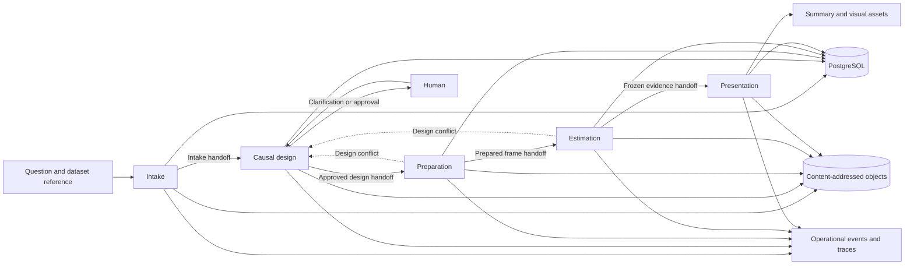
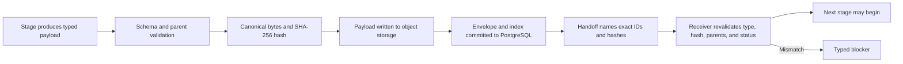

# Architecture

The Auditable Causal AI Harness is one modular Python application with five
stages and one shared contract system. It separates model judgment from the
deterministic work that protects evidence, state, and statistical results.

## Product boundary

The user supplies a causal question and a Kaggle dataset reference. The system
returns a presentation only after design approval, data preparation,
estimation, diagnostics, and claim review reach compatible terminal states.

The only human interface is a local command-line application. The application
does not expose an HTTP server, background worker, browser interface, or
multi-user account system.

## Five-stage workflow

### 1. Deterministic intake

Intake resolves the dataset version, downloads the archive, rejects unsafe
members, profiles admitted tables, and separates measured facts from source
statements. It commits a narrow evidence inventory rather than sending raw
provider responses downstream.

The intake coordinator and live adapter are separate. The
[adapter](../src/causal/runtime/kaggle_live.py) translates the external Kaggle
surface. The [intake coordinator](../src/causal/intake/coordinator.py) owns
product identities, artifacts, and terminal outcomes.

### 2. AI-assisted causal design

The design stage uses a checkpointed graph. Separate model tasks interpret the
question, describe columns, gather role evidence, propose causal context and a
role ledger, and rank only compiler-proven feasible designs.

Deterministic nodes validate every proposal. A human answers only unresolved
critical questions and approves the exact design revision before downstream
work begins. The graph is implemented in the
[design harness](../src/causal/design/graph.py).

### 3. Deterministic preparation

Preparation compiles the approved frame contract into registered operations.
It stabilizes row identity, applies declared repairs, records impact, and
validates the prepared frame.

The stage does not ask a model to rewrite data. Its coordinator executes a
bounded plan and can return a design conflict when the approved design cannot
be made runnable.

### 4. Numerical analysis

The [analysis module](../src/causal/analysis/README.md) computes estimates,
uncertainty, diagnostics, sensitivities and scientific supporting measurements.
The live numerical bundle has no claim judgment or required figure layout.
Supported methods include randomized experiments, AIPW, difference-in-differences
and sharp regression discontinuity.

### 5. Post-analysis

One [LangGraph](../src/causal/post_analysis/graph.py) gives an LLM bounded tools to
interpret frozen evidence, choose visuals and compose cited report sections.
Deterministic code validates source bindings and renders the supplied values.
A separate read-only LLM examines the actual final page previews and evidence.
Only code can release the exact reviewed report and source-bound artifacts.

The [contract and coverage](post_analysis/README.md) document immutable roles,
results and DAG edges, explicit source defects, versioned compatibility, budgets
and recovery. Full application prompts, outputs, tool results and provider-exposed
reasoning summaries are traced in LangSmith, with credential redaction.

## Who decides what

| Responsibility | Model | Deterministic code | Human |
|---|---:|---:|---:|
| Interpret a question and source descriptions | Proposes | Validates evidence and schema | Clarifies when required |
| Choose a supported causal design | Proposes | Checks eligibility and assumptions | Approves the exact revision |
| Repair and prepare rows | No | Compiles and executes operations | No hidden intervention |
| Compute estimates and diagnostics | No | Computes and validates | No hidden intervention |
| Interpret causal evidence | Writes cited claims and qualifications; separately reviews them | Checks sources and coverage | Approves the scientific design |
| Choose chart coverage/layout | Chooses encodings and report organization | Preserves source values, renders and binds review | Receives the frozen bundle |
| Persist, route, retry, or resume work | No | Owns all state transitions | Supplies explicit commands |

This boundary is the main safety property. The model can contribute semantic
judgment without controlling data mutation, persistence, statistical
computation, or authorization.

## Artifact lifecycle

An artifact is a typed result stored with an immutable identity and content
hash. A handoff manifest is the exact list of artifacts that the next stage may
open.

The [artifact envelope](../src/causal/shared/contracts.py) carries the artifact
type, schema version, content hash, analysis identity, stage identity, producer,
parents, sensitivity class, and object locator. A conflicting hash never
overwrites an existing identity.

The receiver does not select a convenient latest artifact. It opens the exact
identity and hash in the handoff. This prevents an old approval from being
combined with a newer frame or estimate.

## State and storage

### PostgreSQL

PostgreSQL stores product indexes, stage states, idempotency records, artifact
envelopes, handoffs, and graph checkpoints. Migrations are ordered and recorded
by filename.

Two connections serve different responsibilities. Product state uses normal
application tables. LangGraph checkpoints use a dedicated saver connection and
a serializer with no pickle fallback.

### Content-addressed object storage

Large or sensitive payloads live in S3-compatible object storage. Their object
keys derive from content hashes. PostgreSQL stores the locator and verified
metadata, not a signed URL.

The [persistence layer](../src/causal/shared/persistence.py) writes an object
before committing its envelope. Replay with identical bytes is harmless. A
hash conflict fails rather than replacing earlier evidence.

### Events and traces

Operational events use a closed schema with stable names and error codes.
LangSmith receives explicit model-gateway spans containing only allowlisted
identities, hashes, settings, corrections, attempts, token counts, and errors.

Trace delivery is part of the production boundary. An unacknowledged trace can
end a run as `failed_observability` while preserving already committed
artifacts. The [tracing layer](../src/causal/shared/tracing.py) owns redaction and
the flush gate.

## External integration boundaries

| Service | Narrow responsibility | Failure behavior |
|---|---|---|
| Kaggle | Resolve an exact dataset version, inventory files, and download bytes | Provider errors become sanitized intake failures. Response bodies do not enter product events. |
| Vertex AI | Execute one structured model call under a fixed profile | Authentication, permission, quota, safety, unsupported schema, and exhausted retry failures have stable codes. |
| LangSmith | Receive redacted model and task traces | Missing production configuration or failed acknowledgement stops progression. |
| PostgreSQL | Store authoritative state and checkpoints | Stale revisions, incompatible state transitions, and lock contention fail immediately. |
| S3-compatible storage | Store content-addressed payload bytes | Missing objects and hash mismatches prevent a receiver from opening a handoff. |

Provider-specific types remain inside their adapters. Product stages depend on
small protocols and typed results, which keeps external API drift from leaking
through the application.

## Reliability flow

### Idempotency and concurrent commands

Every mutating command carries an idempotency key. Replaying the same logical
request is safe. Reusing a key for a different request is rejected.

A PostgreSQL advisory lock protects one analysis. Lock contention returns an
`analysis_busy` blocker instead of waiting in a hidden queue.

### Retries

The shared model gateway retries only registered transient failures and only
within the task budget. Authentication, permission, quota, safety, and schema
failures do not switch models or providers.

### Resume and replay

The design graph resumes only an exact open interrupt. Later deterministic
stages read committed state and replay safely at declared boundaries.

The system never resumes from arbitrary in-memory payloads. Committed
identities remain the source of truth after a process restart.

### Stale-write protection

Human decisions name the interrupt identity, hash, and design revision they
answer. A stale or mismatched decision cannot consume the current interrupt.
The [runtime composition](../src/causal/runtime/composition.py) enforces this
before a graph resume.

### Fail-closed routing

A failed validation, trace gate, handoff, provider call, or scientific wall
has one declared destination. The runtime returns a typed result and records a
stable error code. It does not continue with guessed context or a weaker
method.

## Why one modular application

The stages need shared transactions, schemas, identities, and artifact rules.
Splitting them into network services would add transport and deployment
failure modes without solving a Version 1 requirement.

Module boundaries still isolate each stage. Typed handoffs form a future
transport seam. A later distributed version could place a network protocol at
that seam without changing artifact meaning.

## Deliberate limits and a distributed future

Version 1 is a private local workspace for one operating-system user. It has no
tenant model, service API, queue, autoscaler, or remote worker fleet.

A distributed version would need additional decisions before deployment:

- authentication, tenant isolation, and authorization;
- queue ownership, leases, cancellation, and duplicate delivery;
- remote secret distribution and workload identity;
- per-tenant trace, artifact, and retention policies;
- load, latency, cost, and backpressure objectives;
- compatibility rules for rolling upgrades across workers.

Those concerns are not implied by the current design. They require a new
contract and measurements from a workload that needs distribution.

## Detailed references

- [System Contract](product/SYSTEM-CONTRACT.md)
- [PRD 1: Kaggle intake and storage](product/PRD-001-kaggle-intake-storage.md)
- [PRD 2: Causal design harness](product/PRD-002-causal-design-harness.md)
- [PRD 3: Runnable frame preparation](product/PRD-003-runnable-frame-preparation.md)
- [PRD 4: Estimation and judgment](product/PRD-004-estimation-diagnostics-judgment.md)
- [PRD 5: Evidence presentation](product/PRD-005-evidence-visualization-presentation.md)

Return to the [README](../README.md), continue to
[Harness and Evaluations](HARNESS-AND-EVALUATIONS.md), or read the
[Engineering Judgment](ENGINEERING-JUDGMENT.md) case studies.

The standalone [analysis capability library](../src/causal/analysis/README.md) owns
new versioned configuration, guidance, preflight and approved execution. Existing
pipeline integration retains its historical artifact contracts; the agent cutover
is a separate task.
