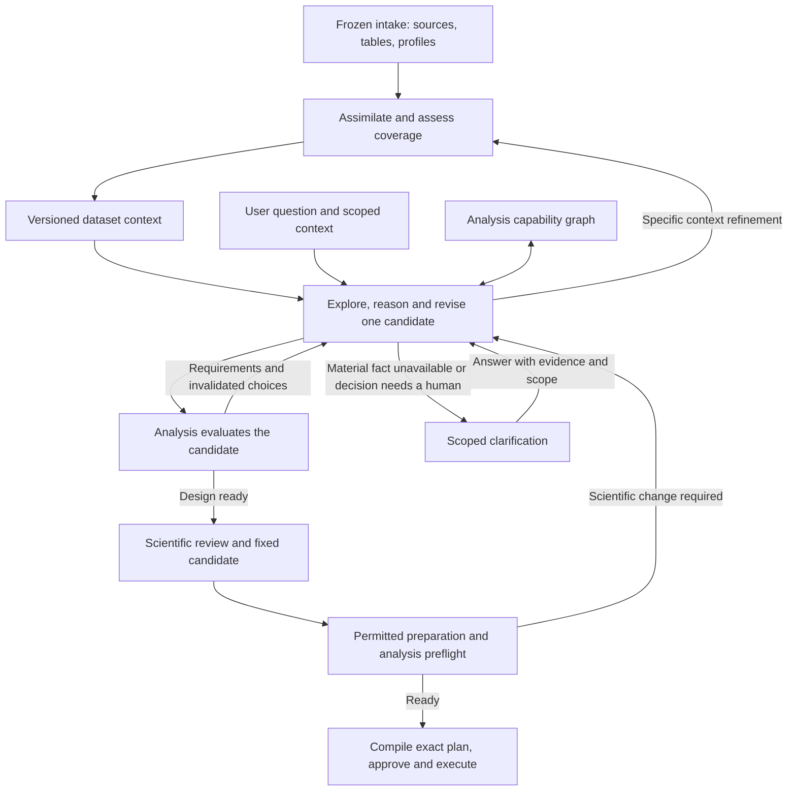

# Consolidated design stage: data context before causal decisions

Status: replacement design-stage plan, updated after completion of the analysis
capability library. The analysis interface was inspected on 2026-09-10. Context
compilation, the replacement design workflow and its repair integration remain
proposed work. This document changes no implementation or product contract.

Give dataset meaning one owner and one versioned context. A design agent queries
that context and explores the completed analysis capability graph. It progressively
constructs one candidate against an exact context revision. Analysis evaluates the
candidate after each material decision and enforces acceptance. The replacement
design stage consumes that interface; it does not reconstruct method rules.

## The completed analysis boundary

The implementation is documented in the [analysis README](../src/causal/analysis/README.md),
with exports in [interface.py](../src/causal/analysis/interface.py) and contracts in
[contracts.py](../src/causal/analysis/contracts.py). The
[verification report](ANALYSIS-CONSTRAINT-LIBRARY-VERIFICATION.md) records its tests;
those tests were not rerun for this planning update.

The interface now supplies graph exploration, deterministic partial-candidate
evaluation, typed feedback, a complete `FixedCandidate`, prepared-data assessment,
preflight, plan compilation and exact approved execution. Treat it as the dependency
for this plan. The retained integration adapter still serves the historical
pipeline; the existing design agent has not automatically adopted this interface.

## Invariants before workflow

1. **Every actual column is accounted for.** Column names and count vary; the
   profile, identity, evidence and coverage contract stays the same. An unknown
   meaning is a valid recorded state. No invented column or default causal role.
2. **Dataset meaning is question-independent.** Concepts, measurement windows,
   encodings and source assertions belong to the notebook. Treatment, outcome,
   adjustment roles and causal assumptions belong to the particular analysis.
3. **One writer per meaning.** The context compiler owns semantic revisions. The
   design agent owns the candidate. Analysis owns method requirements and acceptance.
   Derived views and adapters do not become additional authors of those decisions.
4. **One candidate is authoritative.** Use the library's `CandidateDraft` directly
   inside the design record. Do not maintain a second independently edited method
   configuration, role ledger or compiler fact set.
5. **Every decision has exact inputs.** Candidate, notebook, source snapshot and
   capability revisions identify what was evaluated. No retrieval through a mutable
   dataset-level "latest" pointer when replaying a saved analysis.
6. **Local eligibility is not global readiness.** Every graph view retains overall
   blockers. Changing a choice reevaluates the candidate and invalidates stale
   feedback, pagination and reviews.
7. **Unknown is not false.** Missing, unprocessed, conflicting and unsupported
   information remain distinguishable. Evidence cannot be replaced by a convenient
   assumption when the analysis requirement demands a fact.
8. **Exploration does not commit a choice.** The agent can inspect alternatives and
   evaluate hypothetical candidates. Only an explicit candidate revision changes
   the working design; backtracking preserves previous revisions and reasons.
9. **Identity survives the whole pipeline.** Keep the same `analysis_id` and source
   `dataset_id`; revisions and prepared snapshots are additional references, not
   replacement business identities. Deterministic infrastructure assigns identities.
10. **Acceptance freezes scientific decisions.** Repair must preserve the complete
    fixed candidate and explicit preparation permissions. Data runnability and exact
    execution approval remain later, distinct gates.

## Earlier design audit: replacement motivation

The following findings come from the earlier static design audit. They explain the
replacement, rather than defining the new interface or claiming a fresh audit of
every legacy line after the analysis-library work.

| Finding | Current evidence | Consequence |
| --- | --- | --- |
| Context is an inventory of availability and pointers. Actual source text is reassembled separately for tasks. | `design/entry.py:297`, `design/harness_base.py:250` | There is no complete, reusable interpreted dataset context. |
| A semantic call and a role call run for each processed column. | `design/compile.py:43`, `design/harness_nodes.py:95`, `design/harness_nodes.py:126` | At 24 batches, intent + semantics + roles + causal context + ledger require 51 calls before method investigation and repairs. |
| Deferred columns are recorded but have no downstream production consumer in design. | `design/compile.py:126`; reference search across `src/causal/design` | Unexamined information does not drive a later coverage or retrieval step. |
| Method investigation supplies a task label as its default evidence scope. The filter expects column names for column evidence. | `design/harness_nodes.py:355`, `shared/agenttask.py:106`, `shared/agenttask.py:571` | The method task loses column source/profile evidence. It receives the role ledger, but only references to the measurement map and causal context, and has no semantic retrieval tool. |
| Each source is cut to its first 4,000 characters; the evidence block is capped at 24,000. | `shared/agenttask.py:49`, `shared/agenttask.py:122` | Relevant passages later in a document are inaccessible through this surface. A prefix is still labelled evidenced. |
| Concept reconstruction uses both card IDs and names derived from intent; mismatching IDs can produce proxy links. | `design/compile.py:205` | Identifier agreement is being used as a substitute for an explicit measurement relationship. |
| Catalog retrieval uses dataset identity, while analysis evidence is frozen in intake artifacts. | `design/entry.py:312`; [intake limitations](../src/causal/intake/README.md) | Rebuilding an older analysis can consult later intake lookup rows. |

Paths in the table are relative to `src/causal`. These are static inspection
findings, not new live-run measurements. The repeated work is mostly active code;
neither `compile.py` nor `compiler_v2.py` is an unused alternative executor.

## What ontology means here

An ontology defines the kinds of things in a domain, their meanings, and the
relationships allowed between them. For this application, a small vocabulary is
enough: dataset, table, entity, concept, column, measurement window and source;
relations such as “column measures concept,” “table records entity,” and
“measurement occurs during window.” Formal ontology languages also support
logical constraints and inference; see the [W3C OWL 2 primer](https://www.w3.org/TR/owl-primer/).

The vocabulary is the ontology. Its population with this dataset's concepts,
column mappings and supported assertions is the semantic dataset context. This
can be represented with typed records and relationships in the existing storage.
It does not initially require OWL, a graph database, embeddings or a reasoner.

Keep four meanings of graph distinct:

- **Semantic relationships:** what the data represents and how it was measured.
- **Causal DAG:** proposed causal influences for a particular question, including
  unmeasured concepts, alternatives, assumptions and contrary evidence.
- **Analysis capability graph:** supported decisions, options, prerequisites and
  checks, supplied by the completed analysis library.
- **Execution graph:** which operation runs next, including clarification loops.

An ontology need not be acyclic. A measurement link is not a causal edge, and
an ontology cannot establish causal identification from a table alone.

## One flow with clear ownership

**Intake** preserves bytes, inventories every resource, profiles tables and records
extraction failures. It continues to be deterministic.

**One assimilation agent** owns interpretation of dataset meaning in a reusable
phase before question-specific design. It can read source passages and measured
summaries in bounded turns.
It proposes additions or corrections to the dataset context. Deterministic code
validates references, types and scope, then commits a new immutable revision.
One owner does not imply one enormous prompt or one model response.

**One design agent** reads the notebook and analysis graph, frames the question,
proposes concept/column bindings, causal alternatives, estimand and assumptions,
and explicitly selects the analysis configuration. It receives deterministic
feedback after each material revision. A specialist, if later justified, returns
proposals to this owner rather than creating another authoritative design.

**The design controller** validates references, commits revisions, routes feedback,
tracks bounded progress and calls the analysis interface. It does not duplicate
method eligibility rules. It can inspect existing measured profiles or request
bounded structural measurements; it does not fit effects or dispatch execution-time
diagnostics during design. Diagnostic applicability is resolved by analysis now;
numerical measurements run at their declared later boundary.

**The repair controller** enforces declared transformation permissions and calls
analysis preflight on actual prepared data. Frozen population/missingness policy
text is not itself an executable permission engine. Semantic preservation requires
explicit enforcement in preparation.

## What is authoritative and what is derived

Use one notebook and one design record over the existing immutable evidence store,
followed by the analysis library's accepted/executable artifacts. Their sections
may reference separately stored content; prompts retrieve only the relevant views.

| Record | Contents and authority |
| --- | --- |
| `DatasetContext` | Exact intake/source references; all table and column identities; source coverage; entity and grain descriptions; concepts; explicit measurement links; typed assertions with units, encoding, windows, missing-value meanings and provenance; conflicts and unknowns. |
| `DesignRecord` | Pipeline identities, question and selected source/table references; the actual `CandidateDraft`; scientific rationale and causal alternatives; clarification records; preparation permissions; evaluation and review references. The candidate owns executable scientific choices. Other sections explain or constrain their use. |
| Analysis-owned boundary artifacts | `FixedCandidate`, then the prepared-data `AnalysisSpecification`, preflight, `CompiledPlan`, exact approval and evidence. Produce these through the public library; preserve references to the design record and exact source/context. |

Column cards and the measurement map become views of `DatasetContext`. Role ledgers
come from the candidate's bindings; causal diagrams come from the design record's
scientific rationale. Candidate assertions are explicit scoped selections from the
notebook or declared assumptions. Executable settings are derived by analysis from
the accepted candidate. These views have no independent semantic writers. Task
attempts remain trace/recovery records; a task boundary alone is not a reason for
another authoritative business artifact.

Each assertion needs a stable ID, subject, typed predicate/value, source kind,
source artifact/hash and exact location, epistemic status, scope and revision.
Measured, source-reported, user-stated and inferred are different source kinds;
supported, unknown, conflicted and superseded are different states. Preserve
competing assertions instead of silently replacing one. Code can verify a source
span exists; that check alone cannot prove that the interpretation follows from it.

For example, an illustrative `education` column can have:

- a measured fact: observed codes are 1–5;
- a source assertion: those codes describe education categories;
- a source assertion or unknown: when education was recorded;
- a question-specific hypothesis: education affects both treatment and outcome.

Only the last belongs to the causal proposal. A “confounder” label is not an
intrinsic property of the column. Stable concept IDs come from the context
registry; explicit evidence supports direct/proxy mappings, not matching names.

## Assess information and let later steps query it

“All available data assimilated” means every captured resource and column is
accounted for. Each source has a coverage state such as processed, partial,
unprocessed, unavailable or failed, with a reason. Raw tables remain stored as
data; bounded profiles and declared read-only inspections supply measurements.
Long sources remain retrievable by passage. Exhausting a budget leaves explicit
unprocessed coverage, never a claim that missing context does not exist.

Separate three questions: was the source processed, what does it support, and
is that support sufficient for this design? Readiness is a checklist tied to the
question and method requirements. Meaning may be known while timing is unknown;
random assignment may be documented while the assignment unit is unresolved.
There is no useful single “information quality” percentage.

Keep the notebook as one logical structured document with an overview, resource
inventory, column entries, concepts/relationships, assertions and gaps. A readable
overview is a generated view of those entries. Large profiles and source passages
can remain referenced in the evidence store without making every agent load them.

Relationship discovery starts from documented entities, events, concepts and
measurement windows. Columns can link to these shared subjects and to specifically
supported related columns. Investigate additional candidates only when the evidence
or a design requirement warrants it; never require every column to be compared with
every other column. A unique name is only a candidate identifier, and a date's
physical type does not establish which event it records. Neither implies a causal
role or independence from other measurements.

The initial assimilation accounts for every resource without demanding that every
semantic uncertainty be resolved. It can process batches of columns and source
passages. It must not require one model invocation per column or ask the human to
fill every empty profile slot before design can start.

Provide a small typed query surface, for example:

- `describe_column(context_ref, column_id)` returns meaning, measurements,
  source spans, uncertainty and coverage;
- `find_measurements(context_ref, concept_id)` returns direct and proxy links;
- `read_evidence(context_ref, source_ref, location)` returns a cited passage;
- `list_gaps(context_ref, subjects, predicates)` distinguishes unknown from unprocessed;
- `propose_context_patch(base_ref, assertions)` requests validation and a revision.

Every response names its context revision, returned assertion/source IDs and any
omissions or continuation. Query authorization uses typed scope metadata rather
than parsing evidence IDs. A query response is bounded; the underlying context
does not silently disappear when a prompt fills up. No arbitrary model SQL or
data mutation is needed.

These notebook operations are proposed design work, unlike the already implemented
analysis operations. Analysis requirement identifiers do not automatically describe
dataset meaning. The design agent reads the requirement and translates it into a
specific notebook question with a subject and predicate. For RDD, that might be:
"What does this candidate running column measure?", "What units does it use?", or
"Which source states the assignment threshold and direction?" The controller keeps
the returned evidence attached to the exact requirement and selected columns.

Later design steps submit missing-information requests and proposed semantic
corrections through the assimilation owner. They cannot rewrite the shared
description themselves. A material correction invalidates the consuming design
and its approval; presentation-only changes need not regenerate semantic work.
User statements retain analysis/question scope and are not automatically promoted
to reusable dataset facts. One active context writer plus revision checks prevents
stale patches from overwriting a newer interpretation.

## Consume the analysis graph through one repeatable loop

1. **Open the evidence boundary.** Resolve the immutable intake outcome and exact
   table/profile/source references. Load or compile the reusable notebook. Register
   the analysis-scoped question and obtain a partial `CandidateDraft` without
   fabricating unknown population, outcome, facts or method.
2. **Explore.** Call `explore_capabilities(draft, at, relations, limit, cursor)` at
   the root or a returned node. Read its options, prerequisites and explanatory
   context together with the global candidate status. Follow returned identifiers
   and edge directions rather than constructing method-specific paths in prompts.
3. **Resolve a useful next requirement.** Query the notebook, inspect an available
   source, propose a scientific choice or request clarification. Independent
   requirements can be resolved together; the graph does not prescribe one fixed
   traversal order.
4. **Revise once.** Submit explicit changes to the working candidate. Deterministic
   code validates source/context references and updates both binding metadata and
   executable column fields consistently. Preserve alternative candidates separately
   if they are still under consideration.
5. **Evaluate.** Call `evaluate_candidate(draft)` after every material revision.
   Store its fingerprint, version, requirements, issues and invalidated selections.
   `needs_information` routes to a specific unresolved requirement; `rejected`
   requires revising the incompatible proposal or reporting it unsupported.
6. **Continue or review.** Follow deeper choices, inspect alternatives or backtrack
   using the feedback. Only `design_ready` allows the candidate to advance to
   scientific review and the fixed boundary described below.

Browsing another method does not nominate it. To assess switching to RDD, explicitly
construct a hypothetical candidate with RDD selected and its compatible scientific
fields. Do not silently carry an incompatible configuration from the previous
method. Selecting an option does not resolve its evidence prerequisites.

Graph neighborhoods contain both incoming and outgoing relationships. The caller
respects edge direction and pagination coverage. A new candidate or query invalidates
old continuation cursors. A locally `available` option never overrides a global
blocker, and reaching a leaf never means the candidate is complete.

Track progress as resolved requirements, new evidence or a justified candidate
revision. Repeating the same query or candidate with unchanged inputs is not
progress. Bound retrieval and revision attempts; persist an explicit waiting,
unsupported, operational-failure or budget-exhausted outcome when appropriate.
Resume from the same identities and recorded state instead of restarting silently.

### Binding the notebook to the actual library contract

The concrete shapes are in
[candidate.py](../src/causal/analysis/common/candidate.py).

| Candidate field | Design responsibility |
| --- | --- |
| `candidate_reference`, `context_reference`, `source_dataset_reference` | Supply real immutable references from the design record and intake. The library permits omissions during exploration; this design requires complete references before review. |
| `outcome`, `population`, `estimand`, `unit_grain` | Record explicit scientific choices grounded in the question and available measurements. Keep absent values absent until resolved. |
| `configuration` and role bindings | Read `RoleSlot.role`, `field`, kind and cardinality from analysis. Supply actual executable columns in the indicated configuration field or `outcome.column`. |
| `VariableBinding` | Record the returned role, source column, meaning, source references and any declared expected alias. Bindings are provenance metadata; they do not populate configuration automatically. |
| `facts` | Submit one adjudicated `CandidateAssertion` per name, with scalar value, evidence references, support kind, original answer and applicable scope. Keep unresolved competing assertions in the notebook. |
| Timing assertion scope | Use the selected executable column names expected by analysis. Preserve the corresponding stable notebook column IDs and alias mapping in the design record. |
| Population/missingness policies | Freeze the scientific restrictions and connect them to enforceable preparation permissions. Free text alone does not authorize or validate a transformation. |
| Diagnostics, sensitivities and seed | Make choices within returned capabilities. Show effective fixed policies and mechanical defaults during review; derive final executable settings through analysis. |

For each supplied binding, `expected_alias` or the original column must match an
executable role column. The same role/target pair cannot be repeated. A column may
have multiple scientifically compatible roles where the library permits them;
do not flatten roles into one priority label. The controller resolves stable
notebook identities to exact names once and validates the mapping as a whole.

Analysis permits bindings to be omitted. The design stage must therefore enforce
its own provenance invariant for every selected variable; library acceptance alone
does not prove that a source column exists or that its meaning was correctly read.

## Feedback, clarification and review

Use `ResolutionTarget.kind`, `field` and `requirement_id` to identify the missing
work. The following routing is common across methods.

| Returned target | Next owner/action |
| --- | --- |
| `study_fact` | Look up the exact subject in the notebook; request source-backed context refinement if coverage or interpretation is incomplete. |
| `scientific_assumption` | Design reasoning and scientific review; record an explicit assumption only when the requirement allows it. |
| `scientific_frame` | Resolve the question, population, estimand or measurement definition, with the human when their intent is required. |
| `configuration` | Explore supported options and revise the candidate through the analysis graph. |
| `role_binding` | Match a real notebook measurement to the returned role, type and cardinality. |
| `data_preparation` | Route to permitted preparation at the fixed-design boundary. Escalate a required scientific change back to design. |
| `execution` | Preserve the later obligation and its timing. Do not run it merely to clear the design screen. |
| `request` | Correct the graph/tool request or surface an operational issue; do not ask the human to supply a scientific answer. |

Ask a human when their intent is required or a material requirement remains unknown
or conflicted after relevant accessible evidence has been inspected. An unprocessed
source first requires retrieval, not a claim that the answer does not exist.
Optional unselected branches need not interrupt the user.

Each clarification records the requirement, affected subjects/columns, exact
candidate/context revision, evidence already inspected, the specific missing fact
or decision, and what the answer would enable. Group related questions; deduplicate
by requirement and scope. Preserve original answers, explicit unknown responses
and whether the statement applies to the dataset or only this analysis. A human
response is evidence with provenance, not an automatic override of the library.

After each evaluation, show the user the current proposed design, supported next
choices and material blockers in plain language. Scientific review sees the
question/estimand, measurements, causal rationale, assumptions, evidence conflicts,
effective settings and preparation permissions. Deterministic acceptance cannot
authenticate documents or establish that an identification assumption is true.

## Identity and lineage

The design record keeps one `analysis_id`, the original source `dataset_id`, exact
intake/source snapshot references, selected table/column identities, context revision,
candidate revision, capability version and eventual fixed/plan references. These are
different levels of identity, not competing IDs for the same analysis.

A new prepared frame gets its own content identity and transformation lineage while
remaining part of the same analysis and source dataset. An alias or derived column
is an explicit mapping from source inputs; it does not erase the original identity.
Across source revisions, record mappings explicitly rather than assuming that equal
column names mean equal measurements.

Lineage covers both transformations and support: which source supports an assertion,
which context/candidate was checked, and which exact plan was approved and run.
Queries and retries can remain tool receipts in the execution trace. A business
artifact is needed for a meaningful durable boundary, not for every agent thought
or graph edge visited. Keep existing immutable records readable.

Allocate a candidate revision reference once, then commit its scientific payload
immutably. Store later evaluation, review and execution receipts as references in
workflow state or the lineage view; do not edit the referenced candidate to append
its own downstream results. This avoids circular content hashes and prevents a
review receipt from silently changing the candidate it reviewed.

## Fix the design, then establish runnability

1. Require `evaluate_candidate(candidate).status == design_ready`, complete design
   provenance and successful scientific review under the application's review policy.
2. Use `FixedCandidate.from_candidate(candidate, reference)` with the real accepted
   design reference. It verifies readiness and binds the complete candidate and
   capability version. Constructing the snapshot itself grants no approval.
3. Hand repair that fixed candidate, exact source/context references and enforceable
   preparation permissions. Any anticipated alias or derivation must already be
   declared. A changed scientific choice or analysis setting returns to design and
   creates a new candidate/review revision under the same analysis identity.
4. Identify the actual prepared frame through `identify_data`. Call
   `assess_specification(fixed_candidate, {"dataset": identity})`; analysis derives
   executable settings from the frozen candidate. Advance only on `ready` with an
   actual returned specification.
5. Call `preflight(specification, frame)`. Permitted repairs require fresh frame
   identity, assessment and preflight. A basic failure can hide a deeper structural
   failure, so recheck after each accepted repair. Passing is readiness to attempt
   estimation, not a guarantee that numerical execution succeeds.
6. Compile the exact successful specification/preflight, obtain approval for that
   exact `CompiledPlan`, then execute it. Changed data, configuration or implementation
   requires the corresponding fresh checks and approval; a favorable diagnostic
   result cannot be used to rewrite the prespecified analysis.

Preparation permissions specify the allowed operation, target columns, expected
output mapping and invariants to check before and after it. Review binds those
permissions together with the candidate reference. Enforce all roles of an affected
column; a lower-priority role must not disappear from the repair decision.

### Example: progressing within RDD

Enter the returned RDD node and inspect the supported assignment scope and required
bindings. Query the notebook for the proposed running measurement, units, threshold
rule and assignment evidence. Nominate RDD explicitly and evaluate those facts and
bindings. Missing evidence leaves dependent choices conditional; contradictory
sharp-assignment evidence blocks that branch.

Once the core requirements are satisfied, inspect optional covariate and sensitivity
branches. Selecting an adjustment requires evidence about that particular
measurement's timing. Follow shared requirements to see affected diagnostics and
comparisons. Removing the covariate or revising a cutoff reevaluates those selections.
The caller does not hardcode an RDD sequence: it repeats the same explore, resolve,
revise and evaluate loop used for every method.

## Replacement order and proof of improvement

1. Define notebook/design-record contracts and identity mappings against the
   completed analysis contracts. Freeze retrieval to exact intake artifacts and
   cover the older-analysis/later-intake case before changing orchestration.
2. Implement bounded context reads, complete coverage accounting and source-passage
   retrieval over the existing evidence/profile store. Establish the assimilation
   owner and reusable semantic notebook with question-scoped assertions separated.
3. Build the single explore/resolve/revise/evaluate loop using the public analysis
   interface. Implement the deterministic column/provenance projection, typed
   feedback routing, durable clarification and interruption/resume behavior.
4. Connect scientific review, `FixedCandidate`, permitted preparation, assessment,
   preflight and the existing exact compile/approve/execute boundary. Replace the
   legacy design-to-analysis adapter explicitly; do not fabricate old bundle
   artifacts to make a new candidate appear to have passed the historical gate.
5. Switch the active design entry/runtime to this path once the integration scenarios
   pass. Remove replaced per-column tasks, overlapping proposal/role authorities,
   method-rule registries, prompts and artifact registrations with their callers.
   Preserve historical readers; require an explicit reviewed restart where an old
   design cannot satisfy the new full boundary. Do not mutate historical approvals.

The analysis library remains the method authority throughout this work. Add no
second capability registry or method-specific branching workflow to design. If an
integration need is not exposed, record the precise boundary mismatch rather than
silently implementing competing rules in the caller.

Acceptance should demonstrate that a fact late in a long README is discoverable;
all columns have an honest coverage state; conflicting sources remain visible;
the method designer can retrieve relevant column meaning and timing; a new
question reuses valid dataset semantics; a scoped user answer does not leak;
and a changed material assertion invalidates its dependent design. Run the
existing RCT/AIPW/DiD/RDD and failure-path checks against the replacement.

Also require the following integration scenarios:

- Empty and sparse documentation leave explicit unknowns, while irrelevant optional
  gaps do not interrupt the human. Failed extraction differs from absent evidence.
- Arbitrary column names/counts use the same notebook contract and role mapping;
  processing does not require per-column model calls or all-pairs relationships.
- A column with several roles retains all applicable scientific protections during
  preparation. Alias and scoped timing evidence refer to the intended exact columns.
- The designer discovers methods and traverses returned nodes using the common tool
  surface; no hardcoded RDD/DiD traversal is required in the controller.
- Local option availability cannot bypass a global blocker. Revisions invalidate
  graph cursors, evaluations and reviews; browsing alone changes no selection.
- A missing study fact routes to the notebook first when relevant evidence remains
  accessible. A required human answer is scoped, deduplicated and survives resume.
- Notebook conflicts cannot be submitted as duplicate accepted assertions. A
  documented factual rule cannot be replaced by an unsupported assumption.
- A design-ready proposal can fail data preflight. Permitted repairs recheck actual
  data; scientific changes return to a new accepted candidate revision.
- Repeated tool failures or exhausted budgets stop with an explicit resumable state
  rather than fabricated readiness or an unbounded reasoning loop.
- All stages and retries preserve analysis/source identities, while changed source,
  context, candidate and prepared data have distinct revision references. No stale
  approval survives a material change to its bound inputs.

Compare model calls, repeated source bytes, artifact authority, latency and
clarification counts on the same fixtures. Do not claim success from fewer files
or fewer graph nodes alone. This revision was checked against the completed analysis
interface and documented intake boundary. Implementation and runtime verification
of the replacement design stage remain future work.
