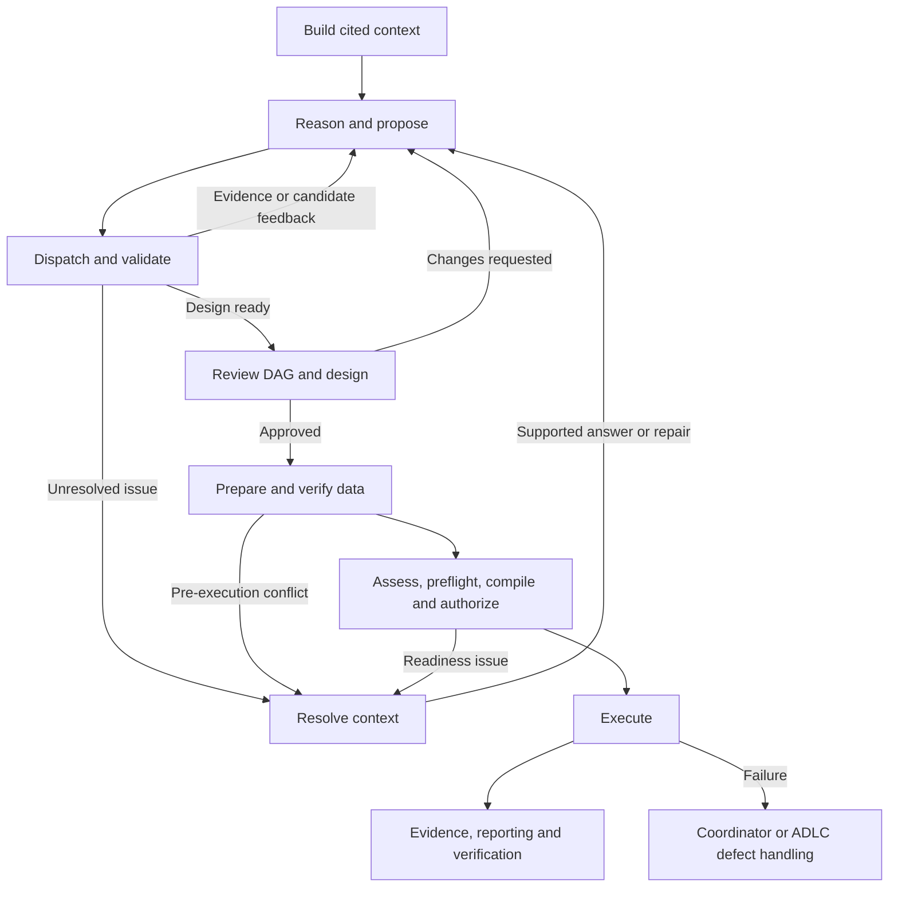

# Design-to-analysis ADLC plan

Status: consolidated implementation plan. The analysis library exists; the new design/preparation integration and fresh acceptance trials are not yet implemented.

Owner: Codex coordinates implementation, independent review, trials, diagnosis and general fixes. This document is the plan for that work.

## 1. Required outcome and development rules

Build a small, working path from cited context through causal design, data preparation and numerical analysis. Expand it through verified development loops. Scalability means supporting more questions, methods and dataset schemas; throughput is not the objective.

**At every implementation gate, exercise one dataset from each analysis family before advancing.** The first four are Rock the Vote, NHEFS, Castle Doctrine and Head Start. A success on one family cannot stand in for the other three. Later, run the second four through the same implementation.

| Family | Representative at every gate | Second dataset |
| --- | --- | --- |
| Randomized experiment | Rock the Vote — `rock_the_vote_rct` | Lalonde/NSW — `lalonde_nsw_rct` |
| AIPW | NHEFS — `nhefs_aipw` | Groupon — `groupon_aipw` |
| Difference-in-differences | Castle Doctrine — `castle_doctrine_did` | Minimum wage — `minimum_wage_did` |
| Sharp RDD | Head Start — `head_start_rdd` | Senate elections — `rd_senate_sharp` |

The source manifests are [the latest four](../evals/four-new-journeys.v1.json) and [the earlier four](../evals/live-journeys.v1.json). All eight are required positive cases. Final acceptance includes each dataset with source-factual context, equivalent renamed/reordered columns, and recoverable sparse context: **24 positive executions on one frozen final build**, plus negative and generated challenge cases.

Supervised completion means only that the human answers context questions and reviews/approves the DAG and causal design, including requesting scientific changes. Preparation and execution proceed automatically afterward. There is no additional human execution-plan approval. Manual specification injection, hand-repaired data, direct estimator invocation or replaced outputs cannot count as a successful workflow. Codex can repair software between trials; the repaired workflow must then pass a fresh trial.

A positive case lacking necessary source evidence or a supported method remains incomplete until that gap is resolved explicitly. An intentionally unanswerable negative case passes by escalating/stopping correctly, but cannot substitute for a successful positive execution. Preserve questions, cohorts and scientific intent; never force eight results by inventing facts or changing the target.

Use the existing [analysis library](ANALYSIS-CONSTRAINT-LIBRARY-PLAN.md) and the authority boundaries in [design consolidation](DESIGN-CONSOLIDATION.md). Keep historical artifacts readable. Prior supervised reports, recorded locally at `output/four-final-20260909/delivery-verification.json`, are numerical/diagnostic baselines, not proof that the new integration works. This generated evidence file is not included in Git.

## 2. Locked stack and minimal architecture

Retain the pinned [project dependencies](../pyproject.toml): Python 3.12, Pydantic 2.13.4, Polars 1.43.2, LangGraph 1.2.11, PostgreSQL checkpoints 3.1.1, LangSmith 0.11.0, the existing Vertex/Gemini 2.5 Flash gateway, PostgreSQL/S3-compatible artifact storage and Graphviz. Numerical work stays in the existing NumPy/SciPy/scikit-learn/pyfixest/rdrobust/rddensity implementations. Verification uses pytest/Hypothesis, Ruff and mypy.

The installed official guidance consists of LangGraph fundamentals, persistence and human-in-the-loop skills, plus LangSmith trace, dataset and evaluator skills. LangGraph skills were installed from `langchain-ai/langchain-skills` at `b7a2a8fc363d1711456f83d24230535c9fff93eb`; LangSmith skills from `langchain-ai/langsmith-skills` at `e8f4120a876b80ced98bce1bb21d6b9f4d62cdb8`. Skills guide implementation; their example CLI installs, cloud uploads and additional model SDKs are not prerequisites for this application.

### Three responsibilities

1. **Context assembly:** deterministic collection, citation, coverage and retrieval.
2. **Design:** question-driven interpretation, capability discovery, candidate evaluation, context clarification and DAG/design approval.
3. **Preparation and run:** permitted transformations, exact-data checks, compilation, authorization, execution and downstream evidence.

Start with **one small persisted design graph**, an ordinary deterministic context builder, and preparation/run coordinators using existing persistence. The three responsibilities do not require three new workflow engines.

The four design node types are:

| Node | Responsibility | Result |
| --- | --- | --- |
| `reason` | Read bounded context and the current requirement/evaluation view; propose one typed next action | A tool request, candidate/DAG proposal, context-resolution request or review request |
| `dispatch` | Validate the action and allowed scope; call an allowed operation; validate results; evaluate every material candidate change | Bounded observation, accepted design revision, typed issue or review-ready state |
| `resolve` | Apply the shared resolution policy; ask only eligible context questions; validate scoped answers and invalidate dependencies | Updated inquiry/answer refs, a declared resume target or an explicit blocked outcome |
| `review` | Present the actual DAG/design and permitted downstream behavior; validate approval/change request; freeze accepted refs | Complete `FixedCandidate` plus bound design approval, or a new design revision |

The model cannot select arbitrary graph destinations, commit records, choose another run's identity, authorize execution or call the estimator. Harness code maps validated actions to the four node types. Helpers within each node remain independently testable; four nodes must not become four opaque functions.

### A real model-to-tool path

Use the existing Vertex structured-response gateway and `AgentTaskEnvelopeV1`. Keep provider automatic function calling disabled. Add one versioned discriminated action contract, `DesignActionV1`, with tool, candidate, resolution and review variants. Render the actual tool names, input schemas and limits into the task. The dispatcher executes the parsed action and returns its observed result to the next reasoning step.

The initial read-only tool surface is the existing `list_methods`, `explore_capabilities`, `evaluate_candidate` and `retrieve_guidance`, plus `retrieve_context` and approved descriptive-data inspections. No arbitrary Python, shell, SQL, network or effect-fitting tool is exposed. Candidate evaluation is mandatory after a proposal even if the model does not explicitly request it. Unsupported requests fail visibly; no advertised tool may lack a working handler and traced round trip.

Use partial state updates and conditional routing. Checkpoint state contains artifact refs, run/revision identity, current action/obligation, pending request ref and budget/progress counters. Construct prompts from allowed source records on demand. Keep numerical results and unrestricted trace access outside design-visible state. These choices follow the official [fundamentals skill](https://github.com/langchain-ai/langchain-skills/blob/b7a2a8fc363d1711456f83d24230535c9fff93eb/config/skills/langgraph-fundamentals/SKILL.md).

### Decomposition policy

The workflow graph controls work; the analysis capability graph defines supported requirements; the causal DAG records scientific assumptions. Keep these distinct.

Split work when ownership, allowed side effects, or a resumable lifecycle changes. Stop splitting when one bounded operation has explicit inputs, permitted actions, outputs and acceptance checks. Use an ordinary function when no separate lifecycle is needed. Add a named subgraph only when a demonstrated case requires independent state/resume or a real access boundary; use inherited checkpointing and explicit input/output projections. A subgraph does not automatically require another agent.

Successive discovery uses the evaluator's unresolved requirements as the initial work queue. Break a requirement into scoped evidence questions processed by the same nodes. Do not first build a recursive work-item scheduler, dependency-DAG engine, plugin discovery framework, graph database, transformation language, specialist-agent memory system or node-catalog service. The boundary catalog is a small set of typed registrations and documentation. Add richer scheduling only after a saved failure demonstrates that the obligation list is insufficient.

For every boundary, document its responsibility, input/output schema, authoritative writer, allowed tools/evidence, acceptance checks, typed errors, retry owner, idempotency/resume behavior and budget. Each new boundary needs a valid case, a failure case and column-invariance coverage from all four families. No node or prompt is created for a particular dataset, column name, column position or method combination.

## 3. Column invariance and context assembly

### What invariance means

For a bijective rename/reordering that preserves values, meanings and all affected evidence references, scientific choices must remain equivalent: method, estimand, population, treatment/comparator meaning, outcome scale, adjustment set, assumptions and preparation permissions. Bindings must correspond under the transformation. Prose, traversal order, local artifact IDs and exact hashes need not match.

The workflow topology must also remain independent of column count. Full source inventory may require linear work/storage; do not claim constant work for arbitrary width. Retrieve bounded relevant pages, preserve explicit remaining coverage, and avoid first-N-column truncation or all-column-pairs expansion. Adding documented-irrelevant columns must preserve the accepted science. New informative or ambiguous columns may legitimately require reconsideration or clarification.

Use opaque snapshot-local subject IDs with physical locators. A name/ordinal can locate a source field but cannot establish its scientific meaning. Identical-valued columns remain distinct. Known transformations carry explicit lineage; independent imports require new bindings or supported identity mapping. Test evaluators keep their known rename bijection private.

Preserve semantic feature ordering, encodings, tie-breaking and random-stream choices through preparation. Paired trials use equivalent declared seeds independent of renamed task-scope labels. Fixed-design numerical results must agree within predeclared method-specific tolerances. Do not expand tolerances to hide an estimator's dependence on physical feature order.

Renaming only the data while leaving documentation unchanged creates an inconsistency. Removing the only meaning evidence creates information loss. Detect and clarify those cases rather than inventing equivalence.

### A faithful base pack, with separate interpretation

Implement one versioned `DatasetContext` using existing source artifacts, field classifications and profiles. Its canonical body is question-independent; inquiry and accepted-answer records point to it from outside. The readable document is a generated view. The agent may summarize and interpret evidence in `DesignRecord`, with scope, citations, uncertainty and dependencies, but cannot replace the source pack with that rewrite.

Known locations in the normalized Kaggle capture are:

| Scope | Captured context |
| --- | --- |
| Dataset | `title`, `subtitle`, `description`, `keywords`, `versionNotes`, `userSpecifiedSources` |
| Table/file | `description`, resource identity, declared format |
| Column | `description`; physical `name`, `type`, `originalType`, `order` |
| Provenance | Owner/creator, license, version/update fields, capture time and hashes |
| Documents | Admitted README, dictionary and source passages with exact locations |
| Measurements | Row/column counts, types, missingness, cardinality, levels, distributions and temporal summaries |

The [field registry](../registries/kaggle-field-classes.v1.json) identifies extraction locations. It does not establish causal truth. Assignment mechanism, timing, confounding and study population often need interpretation or human knowledge. Citations establish origin, not entailment. Preserve source-reported values, measured facts, user statements, hypotheses and approved assumptions as different categories.

Minimum pack sections are identity/producer versions, source/resource inventory, table/column subject map, original typed evidence with artifact hash and JSON pointer/document span, measured-profile refs, availability/conflicts, and coverage. Explicitly distinguish absent, empty, unreadable, failed, withheld, unprocessed and unsupported interpretation. Every admitted resource and column must be accounted for.

Complete file-list pagination or declare partial coverage. Preserve full captured documents with bounded passage retrieval; remove silent 1 MiB truncation. Record metadata/file snapshot consistency and unknown provider fields. Account for useful measured levels/time summaries. Do not mark an unprocessed passage as absent evidence. Only a new source/builder revision can change the base pack; interpretation corrections and human answers retain separate provenance.

Gate checks include deterministic replay, exact citation resolution, complete accounting, question independence, conflict preservation and width/rename tests. Inject a summary that omits an exception or falsely resolves unknown timing: it must not mutate the base pack or satisfy a scientific requirement without support.

## 4. One run identity and explicit artifact lineage

**Reuse `analysis_id` as the single user-facing run identifier from intake through reporting.** Do not add a competing root `run_id` or another run-tracking service. Reuse the current intake idempotency mapping and enforce database uniqueness/collision rejection. Same-key/same-input replay returns the same analysis; same-key/different-input is rejected.

| Identity | Meaning and lifetime |
| --- | --- |
| `analysis_id` | One logical analysis journey; preserved across context answers, repairs, checkpoints and scientific revisions |
| `dataset_id` / source snapshot | Source identity; separate from the analysis using it |
| `stage_run_id` + revision | A particular stage execution/revision beneath the analysis |
| `graph_thread_id` | Persisted LangGraph checkpoint cursor for that resumable stage/revision |
| `task_id`, `attempt_id` | One logical model/tool task and its individual attempts |
| Artifact ID + content hash | Immutable content identity and lineage edge |
| LangSmith trace / evaluation IDs | Observability and trial grouping; never substitutes for the analysis identity |

Resume an existing interrupt with its stored graph thread, stage and revision. A new scientific revision keeps `analysis_id` but receives new subordinate revision/stage/checkpoint identities linked to its predecessor. A fresh independent submission or acceptance variant has its own `analysis_id`; evaluation metadata links related cases without merging their artifacts. The harness injects ownership IDs, not the model.

Reuse `ArtifactEnvelopeV1`, `ArtifactRef`, `HandoffManifestV1`, the committer and existing PostgreSQL tables. Keep the pure analysis library free of application run IDs: persist its outputs in envelopes carrying `analysis_id` and exact parents.

| Record | Authoritative writer and handoff |
| --- | --- |
| `DatasetContext` | Context builder; cites admitted captures/profiles and contains no inquiry-specific state |
| Inquiry and accepted answers | Inquiry/resolution coordinator; original statement, scope, source kind and supersession |
| `DesignRecord` | Design coordinator; candidate, DAG/rationale, interpretations, permissions and evaluation refs in validated revisions |
| `FixedCandidate` and DAG/design approval | Complete analysis-compatible snapshot plus separately persisted reviewer decision bound to the actual reviewed content |
| Preparation specification, frame and receipt | Preparation coordinator; allowed operations, exact input/output identities and column/row lineage |
| Specification, preflight, compiled plan and evidence | Exact outputs of analysis-owned contracts and operations, persisted by the coordinator |
| Execution authorization | Trusted coordinator policy; binds accepted design approval, preparation receipt, plan hash, data identity and policy version |
| `ResolutionCase` | Shared policy coordinator; issue lifecycle, attempts, scope, decisions and resume target |

Views/summaries have no independent scientific authority. Child tasks return scoped proposals against an expected parent revision; only the owning coordinator validates and commits a new immutable revision. Failed drafts stay in attempt/trace history. Do not create a business artifact merely because a helper function ran.

At each handoff, commit producer outputs, send only registered refs/types/roles and originating outcome, validate on the receiver, then record acceptance before processing. Reject missing/stale/incompatible/cross-run inputs with a typed issue. Required receiver checks include actual object/parent hashes, schema compatibility, producer/receiver stage ownership, subject bindings, current scientific revision, valid outcome and relevant approval/authorization. Existing structural handoff checks do not yet cover all these conditions.

Close concrete ownership gaps: an artifact's stage must belong to its `analysis_id`; handoff entries, parents and checkpoint must belong to the expected run and accepted revision chain. Immutable source, context and preparation inputs may be reused from a compatible ancestor revision of the same analysis after validating their exact hashes, ancestry and dependencies. Accepted candidates, DAG/design approvals and execution authorization must match the current accepted scientific revision and chain. Never select an older input merely because it is the latest artifact of its type or shares the run ID. Reusing identical source bytes across runs is allowed through explicit source admission and new run-owned envelopes, not by borrowing another run's approval or candidate. Idempotency keys bind operation version and exact parent refs; duplicate delivery cannot duplicate a logical action.

Extend existing `status(analysis_id)` and `causal status ANALYSIS_ID` with an optional `--lineage` view returning current stage/revision, pending reason/action and artifact-parent links. Select current state from the accepted revision's handoff chain, not the furthest stage ever seen. A reopened design must not display an older completed result as its current outcome. No new dashboard or tracker is required.

## 5. Common resolution and human policy

Adapt analysis requirements/preflight issues and preparation conflicts to one versioned `ResolutionCase`: stable issue/requirement IDs, semantic scope, blocked decision, exact run/context/candidate/data refs, evidence/conflicts, attempted actions, responsible actor, answer schema, status and resume target. Reuse the existing typed question/answer machinery and keep eligibility rules in analysis.

| Finding | Route |
| --- | --- |
| Needed evidence exists but was not inspected | Retrieve it or perform a permitted descriptive measurement before asking |
| External study fact remains missing | Ask a scoped context question explaining what decision it blocks; accept supported information or honest unknown |
| Source conflict or false scientific premise | Preserve the conflict; clarify provenance/intent where answerable; otherwise reject/block the unsupported candidate |
| Scientific choice is unresolved | Clarify intent or present it in DAG/design review; record a choice/assumption separately from a fact |
| Mechanical data mismatch | Apply only a permitted transformation, retain receipts and rerun checks |
| Schema/reference/proposal mistake | Targeted correction with the exact validator feedback |
| Omitted context, parser/tool/program defect | ADLC engineering reproduction and fix; do not disguise it as missing human knowledge |
| Classified transient service failure | Retry under the owning service's existing bounded policy |
| DAG/design approval | Human approves, requests changes or declines the actual scientific design and allowed downstream work |
| Numerical results or execution failure | Downstream evidence/coordinator/ADLC route; no automatic result-driven design revision |

Use one pending question/review packet at a time. Bind responses to run, exact request hash, revision, context and subject IDs. Unknown never means approval. A grouped answer applies only to explicitly named scopes. Stale answers are rejected; duplicate valid answers are idempotent. Reuse accepted facts only when source/scope/dependencies still match. Material DAG/scientific changes require renewed review; mechanical changes within approved permissions only require fresh checks and automatic execution authorization.

Persist the request idempotently before interrupting. Use `Command(resume=...)` with the same persisted thread; never assume pre-interrupt code runs only once. Commits both before and after the interrupt must tolerate process replay. Do not wrap interrupts in a broad catch that swallows suspension. Follow the official [HITL skill](https://github.com/langchain-ai/langchain-skills/blob/b7a2a8fc363d1711456f83d24230535c9fff93eb/config/skills/langgraph-human-in-the-loop/SKILL.md).

Add `supply_context` / `causal supply-context ANALYSIS_ID` for later evidence after a closed `needs_context` outcome. It accepts cited source/answer additions and the expected revision, creates a new overlay or source revision, reopens affected obligations and resumes through public interfaces. It must not fake an old open interrupt, edit the database manually or reuse a stale authorization.

Initial policy defaults: one action per reasoning turn; at most 32 reasoning turns and 32 model-requested tool calls per logical journey; two targeted corrections per logical model request; the gateway's existing maximum three transient physical attempts; eight questions per packet and six context rounds. Deterministic validation calls do not consume a model-tool allowance. Capability/context retrieval defaults to 30 entries, caps at 200, and uses explicit continuations. Retain the shared bounded evidence renderer and retrieval of omitted passages.

These are versioned starting budgets, applied uniformly across the four representatives. Count across resumes/revisions rather than resetting on each node. Repeated action/issue/candidate/context fingerprints without new evidence stop as no progress. Genuine new context can reopen affected work within its declared budget. Any changed budget is recorded as a policy revision and tested across all four; do not increase one dataset's limits to rescue its acceptance score. The Vertex gateway owns transport retries; do not multiply them with a blanket LangGraph retry around model calls and commits.

## 6. Data preparation, analysis wall and result boundary

Preparation is part of every positive journey, including a checked no-op when data is already suitable. Resolve semantic roles to physical input columns; compile permitted casts, recodes, derived variables, reshaping and cohort/missingness operations using existing preparation machinery. No hidden fixture projection may supply a ready-made scientific design.

The preparation specification/receipt records exact input/output identities, operations and parameters, source-to-output column lineage, row membership/count changes, treatment/comparator encoding, units and unit/time grain. A join, recode or exclusion outside the approved permissions returns a design/context conflict. Humans supply facts or review science; the system performs the data work.

The run coordinator then calls the existing analysis API in order:

1. `identify_data` on the prepared frame and build the specification against the complete accepted candidate.
2. `assess_specification`, followed by `preflight` on the actual frame.
3. `compile_plan` only after current successful readiness.
4. Verify semantic preservation and issue the policy-owned exact execution authorization.
5. `execute(ApprovedPlan, data)` and persist its full evidence with run lineage.

Human DAG/design approval includes permission to execute that design under the displayed method version, fixed numerical policies, selected diagnostics/sensitivities and preparation constraints. The coordinator issues `ApprovedPlan` authority with its own actor and a receipt referencing that approval. It must not pretend the human directly approved later-produced plan bytes. Merely constructing approval-shaped fields does not authorize a run. Execution remains inaccessible to the design agent's toolset.

Analysis is a deterministic readiness wall: supported complete choices, required evidence declarations, explicit bindings, actual data prerequisites and exact plan integrity are checked. A pass means ready to attempt computation, not guaranteed convergence or causal truth. Failed/incomplete computations stay visible. A mechanical retry preserves accepted science; a materially changed candidate returns for DAG/design review.

Retain estimates, intervals, p-values, fitted diagnostics and sensitivities for reporting, verification and the separate trace reviewer. Do not feed them into design-visible state, context, memory, tools or human clarification packets. Design receives pre-execution candidate/preparation/preflight feedback only. The current `execute()` returns full evidence to its caller, so the coordinator must own that call and keep its response downstream.

Preselected diagnostics/sensitivities execute under frozen policy. Unfavorable results or nonconvergence cannot automatically select a different method, cutoff, cohort or adjustment set. The outer ADLC may inspect results to find implementation bugs; repairs must preserve scientific intent and pass independent regressions. Add an isolation test that changes result sign, interval, p-value and diagnostic verdict while keeping the approved design fixed: no new design question or scientific revision may result.

## 7. Harness, traces and trial independence

Use the existing task envelope, strict Pydantic outputs, scope/citation checks, committer, event log and LangSmith tracer. Instrument the actual model → action → tool → observation → candidate-evaluation sequence. Generic LangGraph tracing does not automatically expose every custom Vertex call or ordinary analysis function; retain explicit nested spans. Inspect a complete real trace before writing trajectory extraction/evaluators against it.

Every node/tool/interrupt/commit/handoff records `analysis_id`, subordinate stage/task/attempt identity, context/candidate/input/output refs or hashes, concise public decision summary, error/route and relevant prompt/model/validator/policy versions. Preserve exact cited source access, correction history, pending questions, lineage and terminal evidence. Keep credentials redacted and evaluator gold out of design prompts/traces. Record public application decisions, not private model reasoning.

Use local immutable artifacts and `events.ndjson` plus LangSmith trace IDs. Preserve the current required tracing preflight/delivery behavior and report missing delivery honestly. Local code evaluators and exported records are sufficient for the first gates; hosted evaluators, CLI installation, cloud dataset uploads and a judge model are not prerequisites. Official [LangSmith trace](https://github.com/langchain-ai/langsmith-skills/blob/e8f4120a876b80ced98bce1bb21d6b9f4d62cdb8/config/skills/langsmith-trace/SKILL.md) and [evaluator](https://github.com/langchain-ai/langsmith-skills/blob/e8f4120a876b80ced98bce1bb21d6b9f4d62cdb8/config/skills/langsmith-evaluator/SKILL.md) guidance informs this observability/evaluation work.

Trial roles:

- **Codex implementer/coordinator:** implements shared boundaries, preserves attempts, fixes mechanisms and maintains the acceptance/defect ledger. It cannot repair the live scientific artifacts by hand.
- **Simulated human:** sees only the current context question and that case's frozen cited factual dossier. Answers within that knowledge or unknown; sees no desired method, finished candidate, expected estimate, old report or trace diagnosis.
- **Trace reviewer:** locates the first unsupported or lost transition from the actual trace; cannot supply missing facts to the simulated human or alter the active run.
- **Independent design reviewer and verifier:** a fresh gold-free context reviews the DAG/design. Only after acceptance and exact plan authorization does a separate context inspect numerical expectations. Gold-exposed contexts never review later cells.

Run simulated actors without general workspace/tool access, or in a restricted environment containing only their packet/dossier. Instruction-only isolation is insufficient. Mark every answer/review with `actor_type=simulated_human` or `simulated_reviewer` and `evaluation_mode=trial`. Use the same public endpoints as real users. Their authorization is for labeled trial runs; never present it as actual-human approval or silently reuse it in production.

For every defect: preserve the failed attempt → identify the first faulty boundary → make a saved-input reproduction and different-schema counterexample → fix the owning general mechanism → check relevant four-family regressions → rerun the affected live path. Keep outcomes, required/forbidden transitions and scientific invariants as the evaluation target, not exact model narration or one prescribed tool order. No unchanged best-of-N reruns, seed sweeps or mixing stages from different attempts.

## 8. Sequential gates: four representatives at every step

Each gate tests the changed component and its next handoff on **all four representatives**. A failing family blocks that gate. Use deterministic tests and saved replays for narrow defects; make live calls where reasoning/tool behavior is under test. The second four are checked afterward. Do not build a large framework before verifying the smallest common path.

| Gate | Small implementation increment | Exit condition across the four representatives |
| --- | --- | --- |
| G0 — Baseline and contracts | Record code/dependency/complexity baseline; map current IDs, source transformations and API boundaries; define artifact owners, action/resolution schemas, scope rules and trial dossiers | Independent feasibility check for each family against current candidate/preflight/numerical policies; unresolved gaps named; evaluator-only diagnostic specs are never sent to design |
| G1 — Cited context and lineage | Build/retrieve context, preserve coverage, keep inquiry separate; inject `analysis_id` and validate artifact/handoff ownership | Four packs have exact citations/accounting; rename/reorder/width tests pass; cross-run/parent-hash mismatches are rejected; next design input is readable |
| G2 — Minimal reasoning and resolution | Wire the four node types, real structured model-to-tool round trips, candidate evaluation, shared questions and trace correlation | Each family demonstrates evidence → proposal → evaluation, a useful clarification/answer, honest unknown and no-progress handling; no exposed tool without a working handler |
| G3 — Review and preparation | Bind DAG/design approval, freeze the complete candidate, run permitted general preparation and check receipts | All four yield a reviewed design and validated prepared frame; an injected preparation conflict returns through the proper context/design route; renamed bindings preserve meaning |
| G4 — Four complete runs | Connect current analysis assessment/preflight/compile, policy authorization and execution, with forward result handoff | All four complete fresh end-to-end journeys using only context answers and DAG/design review; independent numerical/evidence checks pass; no manual specification or output patching |
| G5 — Transfer and recovery | Run the second four using the same code; exercise restart/reopen, opaque names, decoys and sparse context | All eight development journeys work; closed unknown can reopen via public input; stale approvals/checkpoints and execution-result feedback are rejected |
| G6 — Frozen acceptance | Freeze build, prompts, model profile, seeds, budgets, input/dossier hashes and evaluators | 24/24 positive cells complete on that build; required negative/width/lineage/replay tests pass; all failed attempts and limitations remain in the ledger |

There is no single-dataset-first gate. There is also no requirement to build all-eight polished context/design machinery before connecting execution. The first integrated milestone is four complete runs through the minimal shared implementation. Small fixes rerun the affected boundary across four families; repeat whole live journeys when the change or unresolved concern warrants them, and the full matrix at final acceptance.

At G0, inventory all eight source/question/projection boundaries, even though implementation advances with the four representatives. Older and preprojected fixtures need independent admissibility checks under the new library. Predeclared scientific transformations must either run through general preparation or be labeled as an already-prepared input boundary; a narrower prepared-input test cannot claim raw-source preparation success. Supply source-factual context in its actual scope rather than repeating a full method recipe into every column description.

Recovery tests include: pause/process restart/resume with the same run/checkpoint, duplicate response/commit delivery, a new scientific revision under the same analysis, later context reopening a closed unknown, mechanical re-preparation invalidating exact-data checks, and fresh policy authorization after a permitted correction. Changed science returns to DAG/design review; no new human execution gate is added.

At each gate run relevant contract/behavior/column-invariance checks, lint and strict typing. Run the full required suite for shared-contract migrations and final acceptance. Use the existing complexity checker to report baseline and per-gate deltas, including already-breached dimensions. Remove superseded active orchestration as replacement boundaries pass; do not keep a hidden legacy fallback or increase ceilings to mask growth. No new or worsened breached complexity dimension is accepted without a documented redesign. Functional ADLC acceptance and any pre-existing repository release blocker are reported separately.

## 9. Acceptance evidence and compatibility

Positive acceptance requires a computed primary analysis, no unresolved required/selected computation failures, valid prepared data and plan lineage, and verified forward evidence. `completed_with_limitations` can pass only with its permitted limitations retained; `failed` or `incomplete` cannot count as a positive run. Check exact cohort/row counts, treatment orientation, estimand, units/time scale, adjustment set, seed and uncertainty policy as well as numerical values. Use independently specified calculations or frozen reviewed references for the exact accepted design. Significance and desired effect direction are never acceptance conditions.

The 24 positive cells cover all eight under source-factual, equivalent opaque-rename/reorder, and recoverable sparse conditions. Negative tests cover unknown facts unavailable even to the actor, contradictory premises and faulty bindings. Generated width/decoy tests cover every family with explicit remaining context coverage and fixed topology; additional informative columns are allowed to affect science. The known eight are not unseen holdouts, so avoid universal generalization claims.

One acceptance ledger per batch records every cell's `analysis_id`, variant, exact source/context/data hashes, implementation/model/prompt/policy versions, DAG/candidate/approval/authorization refs, lineage and trace links, interventions, numerical checks and outcome. Keep context verification, DAG/design approval, execution authorization, execution success, numerical verification, handoff verification and workflow acceptance separate. Simulated versus actual-human review is explicit.

Version new artifacts/actions/resolution contracts and add only migrations needed by these boundaries. Keep old readers and historical approvals as historical evidence; they cannot authorize new complete candidates unless they carry the full required scope. New runs use one active authority for each record and the new exact analysis API. Preserve the existing result/reporting consumer contract through a thin verified adapter; presentation redesign is outside this work.

Deliver the shared context/design/preparation/run path, lineage/status view, common escalation/reopen policy, isolated trial runner, trace/defect ledger, and fresh evidence for all eight with the complete final matrix. The plan is saved and the six skills are installed; workflow implementation and acceptance execution are the work defined by these gates.
