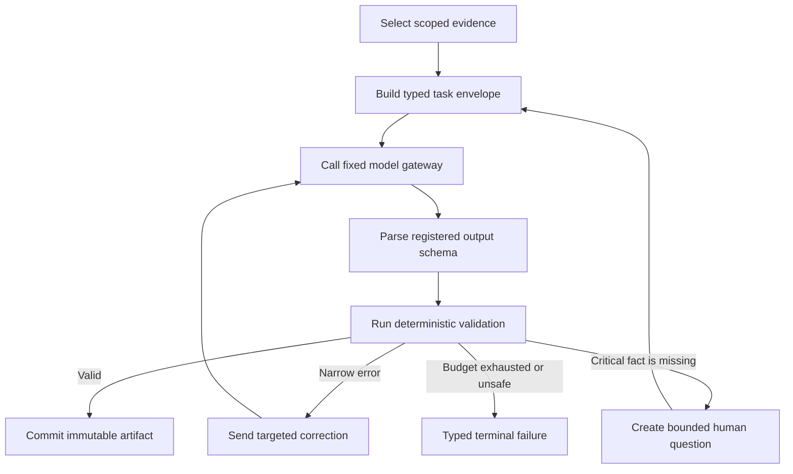

# Harness and Evaluations

The harness turns model output into a bounded proposal rather than trusted
application state. Deterministic code controls context, schemas, corrections,
human questions, persistence, and every terminal outcome.

## What “harness” means here

A harness is the control layer around a model call. It decides what the model
may see, what shape it must return, how the result is checked, and what happens
after success or failure.

The model does not receive a database connection, object store, checkpoint, or
unrestricted retrieval surface. It cannot commit an artifact or choose a
fallback method.

## Complete task lifecycle



Each arrow is an explicit state transition. No branch means “accept the best
available answer.”

## 1. Select and bound evidence

The harness loads only evidence admitted during intake or produced by a prior
validated stage. Every evidence item has an identifier and a classified source
type, such as a measured observation, data dictionary, source statement, or
user confirmation.

Column evidence is filtered to the columns assigned to one task. Dataset-wide
evidence remains available when it applies to every column.

The shared [evidence renderer](../src/causal/shared/agenttask.py) applies two
limits:

- at most 4,000 characters from one evidence item;
- at most 24,000 evidence characters in one task prompt.

An item that does not fit is labeled as withheld because the evidence budget is
full. It does not vanish. This distinction prevents the system from treating a
harness limit as proof that the source did not exist.

The model receives the allowed evidence identifiers beside the rendered text.
Validation later rejects a claim that cites an identifier outside that set.

## 2. Build a typed task envelope

Every model task uses
[`AgentTaskEnvelopeV1`](../src/causal/shared/envelope.py). The envelope includes:

- analysis, stage, task, and attempt identities;
- task and prompt versions;
- declared scope and parent artifacts;
- allowed evidence, retrieval, and tool identifiers;
- token, transient retry, tool-call, and correction budgets;
- output schema and validation versions;
- trace policy and required evaluation identifiers.

The envelope is frozen and rejects undeclared fields. A retry keeps the logical
task identity but receives a new physical attempt identity.

The design task compiler reads declarative task registrations from
[the task registry](../registries/design-tasks.v1.json). This keeps budgets and
version choices out of prompt prose.

## 3. Call the fixed model gateway

The [Vertex gateway](../src/causal/shared/gateway.py) is the only component that
speaks to the live model provider. It applies one frozen model profile with a
fixed model, temperature, token limits, response format, and disabled automatic
function calling.

The production seed comes from the task identity. Live evaluation supplies a
fixed case, task-kind, and scope key so the same journey uses the same seed even
though its isolated analysis and storage identities are fresh. Every seed is
masked to the signed 31-bit range accepted by Vertex AI.

The caller supplies the full registered response schema. The transport passes
that schema to constrained JSON generation. A generic object schema is not an
acceptable substitute because it cannot protect the payload shape.

Provider exceptions become stable application codes. The taxonomy separates
authentication, permission, quota, safety, unavailable model, unsupported
structured output, and exhausted transient retries.

Only retryable transport failures receive another physical attempt. The
gateway does not switch model profiles, regions, or providers.

## 4. Parse and validate the response

The shared [task runner](../src/causal/shared/agenttask.py) first parses the
outer task result. It then parses the registered draft type under strict
Pydantic validation.

A structurally valid response is still only a candidate. Stage-specific walls
check facts that a JSON schema cannot express. Design walls include:

- allowed evidence and source classes;
- registered requirement identifiers and real column scopes;
- committed parent artifacts and exact hashes;
- legal causal roles and method requirements;
- acyclic causal structure;
- unresolved critical context and delivery capacity.

Preparation, estimation, and presentation have their own deterministic walls.
The common validation primitives live in
[shared validation](../src/causal/shared/validation.py).

## 5. Correct a narrow failure

A failed wall returns a stable code, a narrow path, the offending value, and
the legal vocabulary when one exists. The next prompt contains that correction
record and the failing payload.

The correction does not ask the model to “try again” without guidance. It
describes the contract mismatch that must change.

Correction budgets are explicit. Design tasks allow the initial response and
at most two targeted corrections. Exhaustion reaches
`correction_exhausted`; it does not commit the nearest candidate.

The [design graph tests](../tests/design/test_graph.py) cover a correction that
converges and a correction budget that terminates the revision.

## 6. Ask a human only for critical missing context

Some facts cannot be measured from a CSV. Assignment mechanism, treatment
meaning, measurement timing, and table grain can change the estimand or the
validity of its uncertainty.

The [ask gate](../src/causal/design/askgate.py) distinguishes those blocking
facts from assumptions that can remain visible as sensitivities. It groups
questions, names every affected scope, and permits at most five questions in
each of two rounds.

A human answer must match the exact interrupt identity, hash, and design
revision. The runtime rejects a stale answer before it can resume the graph.

Design approval uses the same binding. The approval view includes the actual
design, assumptions, and identification risks, not only an artifact identifier.

## 7. Commit only validated artifacts

A validated result is converted to canonical bytes, hashed, written to object
storage, and indexed in PostgreSQL. The
[artifact committer](../src/causal/shared/persistence.py) validates the artifact
registration and parent rules before the database commit.

Each artifact records its producer, version, sensitivity, parents, stage, and
analysis. A receiver later rechecks those fields through an exact handoff.

Model text cannot directly choose an artifact identifier, object locator, or
downstream route. Those values come from deterministic code.

## 8. Treat observability as a boundary

The [trace redactor](../src/causal/shared/tracing.py) removes credentials and
drops every unapproved or non-scalar field. Explicit gateway spans contain
task identities, hashes, model/evaluation metadata, corrections, attempts, and
token counts, never prompt/response text, reasoning, rows, or gold labels.

Production startup requires a LangSmith project and a successful preflight.
The artifact commit path also checks trace delivery before progression.

An observability failure reaches `failed_observability`. Already committed
artifacts remain available for diagnosis, but downstream stages do not open.

Operational events are separate from traces. They use a closed event schema and
safe dimensions so machine-readable failure routing does not depend on a trace
viewer.

## Evaluation layers

The project uses several forms of evidence. They answer different questions.

### Contract and unit tests

These tests check strict schemas, canonical hashes, routing rules, retries,
validation walls, prompt content, and terminal states. They use deterministic
fixtures and do not claim to measure live model quality.

### Integration and end-to-end tests

Docker-backed tests use real PostgreSQL and MinIO instances. Scripted gateways
drive exact model outputs through the same envelopes, validators, commits, and
stage coordinators used by the live system.

The [full pipeline test](../tests/runtime/test_full_pipeline_close.py) starts
with a realistic table and follows intake, design approval, preparation,
estimation, presentation, and frozen export. It verifies that the delivered
interval contains the known fixture effect.

### Live smoke checks

Live tests are separately gated because they require credentials and may incur
provider cost. They probe the actual Kaggle, Vertex AI, and LangSmith surfaces.

Examples include the
[live Kaggle adapter smoke](../tests/runtime/test_kaggle_live.py),
[Vertex structured-output smoke](../tests/shared/test_gateway.py), and
[LangSmith trace smoke](../tests/shared/test_tracing.py).

A skipped live smoke is reported as skipped. It is not counted as a successful
provider check.

### Live judgment release gate

The evaluation-only [model quality command](../tools/model_quality.py) runs four
full journeys through the same production harness: Lalonde/NSW randomized ITT,
Groupon observational AIPW, minimum-wage simultaneous-adoption DiD, and the
pinned `rdrobust==2.0.0` Senate sharp RDD data. Staggered DiD remains a
deterministic reference case instead of adding another paid journey.

`validate` checks provenance, exact source hashes, schemas, gold separation,
and environment shape without a model call. `calibrate` makes one live pass,
commits an immutable non-gating report, and creates a human-review packet.
`gate` requires the reviewer-approved `HumanGoldV1` hash and makes one fresh
pass. Any hard failure in any journey blocks release; scores are not averaged.

Each journey scores all eight decision boundaries: intent, column semantics,
role evidence, causal context, role ledger, method proposal, claim decision,
and figure-plan decision. It checks exact accepted roles and structural facts,
required and forbidden graph relationships, ask behavior, method/profile,
claim ceilings and qualifications, evidence coverage, tool count, correction
bound, and terminal outcome.

Development may rerun an affected boundary while repairing a general prompt,
schema, context builder, or validator. The release gate never uses automatic
prompt rewriting, best-of-N, seed sweeps, repeated runs until pass, or an LLM
judge. Reports carry fixture/gold/model versions, sanitized task metrics,
stable failure hashes, tokens, latency, and the approved gold hash.

### Final 16-cell matrix controller

The evaluation command also defines one fresh matrix run over four supported
families, two frozen datasets per family, and `rich`/`sparse` context variants.
The deterministic cell identity is `<case-id>--<variant>`. `matrix-validate`
requires exactly 16 unique cells and reports each dataset's reviewed scientific
suitability separately from manifest validity. A structurally valid matrix is
not a claim that every provisional dataset is suitable for a positive causal
result.

`matrix-start` creates durable controller state and advances every cell only as
far as its next product interrupt. It writes an immutable, content-hashed HITL
request for table selection, clarification, or design approval. It never
constructs an `unknown` answer and never approves a design. `matrix-resume`
accepts only a separately supplied response whose run, cell, request hash,
reviewer, and `cell_only` isolation attestation exactly match that request.
The response then enters the existing exact-hash runtime mutation API.
Each request contains only that cell's causal question, frozen source
provenance, and the current interrupt payload; it contains no gold labels or
other cells.

The controller state is operational checkpoint data, not an evaluation report.
After all 16 cells are terminal, `matrix-finalize` commits one create-only,
content-hashed report. It refuses an incomplete cell set or changed execution
content, records dirty-worktree/status/content hashes, and declares an empty
`historical_report_inputs` list. It never scans prior reports or combines cells
from earlier revisions.

Each response is placed in the matching cell subdirectory and filename named by
the request. Its envelope is:

```json
{
  "schema_version": "evaluation-hitl-response.v1",
  "run_id": "matrix-...",
  "cell_id": "dataset--sparse",
  "request_hash": "...",
  "reviewer": "independent-reviewer-id",
  "isolation_attestation": "cell_only",
  "decision": {}
}
```

For table selection, `decision` contains `selected_table`. For clarification it
is a complete `user-context-answer.v1` document copied from the presented
packet. For approval it contains `decision` (`approved`, `changes_requested`, or
`declined`) and `change_requests`. The reviewer identity and isolation claim are
audit metadata; filesystem/service access controls must ensure the reviewer is
actually shown only that cell and never the evaluator-only gold.

```bash
uv run python tools/model_quality.py matrix-validate
uv run python tools/model_quality.py matrix-start \
  --state-file evals/review/final-matrix.state.json \
  --hitl-outbox evals/review/final-matrix-outbox
uv run python tools/model_quality.py matrix-resume \
  --state-file evals/review/final-matrix.state.json \
  --hitl-outbox evals/review/final-matrix-outbox \
  --hitl-inbox /secure/isolated-matrix-responses
uv run python tools/model_quality.py matrix-finalize \
  --state-file evals/review/final-matrix.state.json
```

Sparse cells omit the fixture context from intake and replace fixture metadata,
README text, and column descriptions with a neutral statement. Ask-policy
expectations remain in evaluator-only gold. Raw model thoughts, factual answers,
and approval contents do not enter the report; it records thinking-token counts
and the immutable request/response hashes instead.

### Evaluation registrations

The [evaluation catalog](../evals/catalog.v1.yaml) contains 50 registrations.
Each row names an owner, boundary, fixture focus, trigger, hard pass condition,
and case budget.

The catalog is a coverage contract. It states what must be evaluated when a
boundary changes or a release is prepared. It is not an executable set of 50
live model calls.

## Claim versus proof

| Claim | Implementation proof | Test proof | Evaluation registration |
|---|---|---|---|
| A model sees only declared evidence | [Task evidence rendering](../src/causal/shared/agenttask.py) | [Prompt and scope tests](../tests/design/test_graph.py) | `EV-SYS-002` |
| Model settings and retry behavior are fixed | [Vertex gateway](../src/causal/shared/gateway.py) | [Gateway tests](../tests/shared/test_gateway.py) | `EV-SYS-003` |
| Only compatible artifacts cross stages | [Handoff gate](../src/causal/shared/handoff.py) | [Handoff tests](../tests/shared/test_handoff.py) | `EV-SYS-006` |
| Stale human decisions cannot mutate the run | [Runtime validation](../src/causal/runtime/composition.py) | [Runtime command tests](../tests/runtime/test_composition.py) | `EV-SYS-007` |
| Trace privacy and acknowledgement can block progression | [Tracing boundary](../src/causal/shared/tracing.py) | [Tracing tests](../tests/shared/test_tracing.py) | `EV-SYS-005` |
| The five stages close on one frozen bundle | [Runtime composition](../src/causal/runtime/composition.py) | [Full pipeline close](../tests/runtime/test_full_pipeline_close.py) | `EV-E2E-001` |

## What scripted fixtures prove

Scripted gateways prove orchestration behavior under exact model responses.
They are useful for malformed JSON, unsupported citations, correction budgets,
human interrupts, replay, and stage closure.

They do not prove that a live model will produce the same answer distribution,
latency, or token use. Live pilots and registered release evaluations own those
questions.

The distinction is intentional. A deterministic test should fail because the
contract changed, not because an external model sampled different wording.

Return to the [README](../README.md), review the system in
[Architecture](ARCHITECTURE.md), or read the
[Engineering Judgment](ENGINEERING-JUDGMENT.md) case studies.
