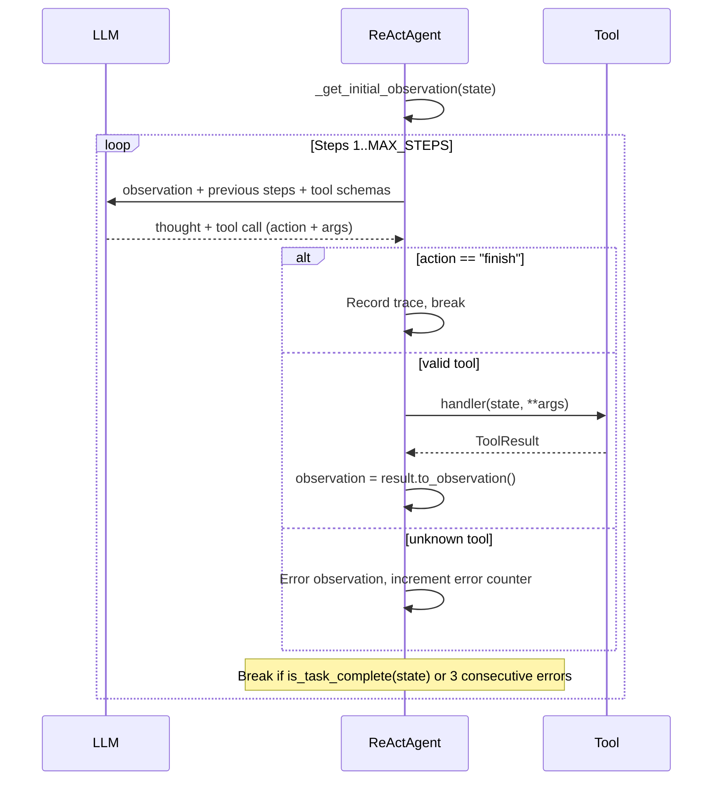

# Agent Catalog

This document covers every agent in the system: what it does, what tools it has, what state it touches, and how the ReAct pattern works.

For state field definitions, see [state-schema.md](state-schema.md). For pipeline ordering and dispatch logic, see [pipeline.md](pipeline.md).

---

## Overview

| # | Agent | Registered Name | Base Class | MAX_STEPS | Required State | Writes State |
|---|-------|----------------|------------|-----------|---------------|-------------|
| 1 | OrchestratorAgent | (not registered) | BaseAgent | N/A | (all) | (indirect) |
| 2 | DomainKnowledgeAgent | `domain_knowledge` | ReActAgent | 12 | `dataset_info` | `domain_knowledge` |
| 3 | DataProfilerAgent | `data_profiler` | ReActAgent + ContextTools | 15 | `dataset_info` | `data_profile`, `dataframe_path` |
| 4 | DataRepairAgent | `data_repair` | ReActAgent + ContextTools | 20 | `data_profile`, `dataframe_path` | `data_repairs` |
| 5 | EDAAgent | `eda_agent` | ReActAgent + ContextTools | 15 | `data_profile`, `dataframe_path` | `eda_result` |
| 6 | CausalDiscoveryAgent | `causal_discovery` | ReActAgent + ContextTools | 15 | `data_profile`, `dataframe_path` | `proposed_dag` |
| 7 | DAGExpertAgent | `dag_expert` | ReActAgent + ContextTools | 12 | `data_profile`, `proposed_dag` | `proposed_dag` |
| 8 | ConfounderDiscoveryAgent | `confounder_discovery` | ReActAgent + ContextTools | 15 | `data_profile`, `dataframe_path` | `confounder_discovery` |
| 9 | PSDiagnosticsAgent | `ps_diagnostics` | ReActAgent + ContextTools | 15 | `data_profile`, `dataframe_path` | `ps_diagnostics` |
| 10 | EffectEstimatorAgent | `effect_estimator` | ReActAgent + ContextTools | 20 | `data_profile`, `dataframe_path` | `treatment_effects` |
| 11 | EffectEstimatorReActAgent | `effect_estimator_react` | ReActAgent | 15 | `data_profile`, `dataframe_path` | `treatment_effects` |
| 12 | SensitivityAnalystAgent | `sensitivity_analyst` | ReActAgent + ContextTools | 15 | `treatment_effects`, `dataframe_path` | `sensitivity_results` |
| 13 | CritiqueAgent | `critique` | ReActAgent | 10 | `treatment_effects` | `critique_history` |
| 14 | NotebookGeneratorAgent | `notebook_generator` | BaseAgent | N/A | `data_profile` | `notebook_path` |

Note: `EffectEstimatorAgent` and `EffectEstimatorReActAgent` are two implementations of the same pipeline step. The standard orchestrator uses `effect_estimator` by default; the react orchestrator swaps in `effect_estimator_react`.

---

## The ReAct Pattern

Most agents (12 of 14) use the ReAct (Reasoning and Acting) pattern from [Yao et al., 2022](https://arxiv.org/abs/2210.03629). The agent operates in a loop:

### Built-in tools

Every ReActAgent has two built-in tools registered automatically:

| Tool | Purpose |
|------|---------|
| `finish` | Signal task completion. Parameters: `summary` (string), `success` (boolean). |
| `reflect` | Pause for self-assessment. Parameters: `current_progress`, `next_steps`, optional `obstacles`. |

### Consecutive error detection

If an agent produces 3 consecutive invalid actions (unknown tool names or tool execution errors), the loop breaks to prevent infinite loops.

### Timeout guard

Each `ReActAgent.execute()` call is wrapped in `asyncio.wait_for(timeout=settings.agent_timeout_seconds)` (default 300 seconds). On timeout, the agent adds a trace and returns state unchanged without marking the job as failed.

---

## Context Tools (ContextTools Mixin)

Most ReActAgent subclasses also inherit from `ContextTools`, which registers pull-based context query tools. Instead of pushing all state into the prompt, agents call these tools to fetch specific information on demand.

Source: `backend/src/agents/base/context_tools.py`

| Tool | Description |
|------|-------------|
| `ask_domain_knowledge` | Search domain knowledge findings by question |
| `get_column_info` | Get dtype, stats, missing count for a specific column |
| `get_dataset_summary` | Get basic dataset stats (rows, columns, types, missing) |
| `list_columns` | Get all column names |
| `get_eda_finding` | Query EDA results by topic (outliers, correlations, balance, missing, multicollinearity, quality_score, distributions) |
| `get_previous_finding` | Get findings from a previous agent by name |
| `get_treatment_outcome` | Get current treatment/outcome variables |
| `get_confounder_analysis` | Get confounder analysis results with ranked confounders |
| `get_profile_for_variables` | Get profile stats for specific variables only |
| `get_dataset_context` | Get semantic context from metadata (domain, tags, descriptions) |
| `analyze_variable_semantics` | Analyze semantic meaning of a variable (immutability, role, temporal position) |
| `get_dag_adjustment_set` | Get proper adjustment set from DAG using backdoor criterion |

---

## Agent Details

### 1. OrchestratorAgent

**File**: `agents/orchestrator/orchestrator_agent.py`
**Base class**: `BaseAgent`
**Pipeline position**: Coordinator (wraps all other agents)

The orchestrator drives the entire pipeline using LLM-based tool calling. It does not register via `@register_agent` because it is instantiated directly by `JobManager`.

**Tools** (dynamically built from registered specialists):

| Tool | Description |
|------|-------------|
| `dispatch_to_agent` | Dispatch a task to a single specialist agent |
| `dispatch_parallel_agents` | Run multiple independent agents concurrently |
| `request_critique` | Ask the critique agent to review the analysis |
| `finalize_analysis` | Mark the analysis complete and trigger notebook generation |

The tool schemas are generated at runtime. `dispatch_to_agent` and `dispatch_parallel_agents` include an `enum` constraint listing all registered specialist names, so the LLM can only dispatch to valid agents.

**Decision loop**: The orchestrator runs up to 15 LLM reasoning turns. Each turn produces a tool call (dispatch, critique, or finalize). The loop terminates when `finalize_analysis` is called or `state.status` reaches a terminal value.

**Parallel dispatch merge strategy**: Creates `copy.copy(state)` per agent, runs via `asyncio.gather`, then copies each agent's `WRITES_STATE_FIELDS` from its copy back to the main state.

There is also a `ReActOrchestrator` variant (`orchestrator/react_orchestrator.py`) that uses the full ReAct loop pattern instead of the tool-calling pattern. Selected via `orchestrator_mode="react"` at `JobManager` initialization.

---

### 2. DomainKnowledgeAgent

**File**: `agents/specialists/domain_knowledge_agent.py`
**Base class**: ReActAgent
**MAX_STEPS**: 12
**Pipeline position**: First (runs before profiling, only when metadata exists)

Reads dataset metadata (Kaggle descriptions, column names, tags) and extracts causal hypotheses, temporal ordering, immutable variables, and domain context. The output is stored as a dict in `state.domain_knowledge` and queried by downstream agents via `ask_domain_knowledge`.

**Tools**:

| Tool | Description |
|------|-------------|
| `read_description` | Read the dataset description |
| `list_columns` | Get list of all column names |
| `investigate_column` | Investigate what a column might mean based on name and description |
| `search_metadata` | Search metadata for specific keywords or phrases |
| `get_tags` | Get dataset tags/categories indicating domain |
| `hypothesize` | Record a hypothesis about causal structure |
| `revise_hypothesis` | Revise a previous hypothesis based on new evidence |
| `set_temporal_ordering` | Record understanding of temporal ordering |
| `mark_immutable` | Mark a variable as immutable (cannot be caused by other variables) |
| `flag_uncertainty` | Flag uncertainties for downstream agents |

---

### 3. DataProfilerAgent

**File**: `agents/specialists/data_profiler.py`
**Base class**: ReActAgent + ContextTools
**MAX_STEPS**: 15
**Pipeline position**: Second (after domain knowledge, before EDA)

Downloads the dataset, saves it as parquet, and produces a `DataProfile` with feature types, distributions, missing values, and causal variable candidates (treatment, outcome, confounders, instruments). Uses domain knowledge hints when available.

**Tools**:

| Tool | Description |
|------|-------------|
| `get_dataset_overview` | Get shape, columns, types, missing values |
| `analyze_column` | Analyze specific column distribution, unique values, statistics |
| `check_treatment_balance` | Check if a column is suitable as a treatment variable |
| `check_column_relationship` | Check relationship between two columns (correlation/association) |
| `check_time_dimension` | Check for time dimension suitable for DiD/panel methods |
| `check_discontinuity_candidates` | Check for running variables for regression discontinuity |
| `finalize_profile` | Finalize data profile with identified causal structure |
| + 12 ContextTools | (see ContextTools table above) |

---

### 4. DataRepairAgent

**File**: `agents/specialists/data_repair.py`
**Base class**: ReActAgent + ContextTools
**MAX_STEPS**: 20
**Pipeline position**: After profiling, before EDA

Fixes data quality issues: missing value imputation, outlier handling, collinearity resolution. Records all repairs for reproducibility in `state.data_repairs`.

**Tools**:

| Tool | Description |
|------|-------------|
| `get_data_summary` | Get summary of current dataset state |
| `check_missing_values` | Analyze missing value patterns |
| `check_outliers` | Detect outliers in numeric columns |
| `check_collinearity` | Check for multicollinearity issues |
| `impute_missing` | Impute missing values |
| `handle_outliers` | Handle outliers through winsorization/transformation |
| `remove_collinear_variables` | Remove or fix collinear variables |
| `finalize_repairs` | Finalize repairs and validate data quality |
| + 12 ContextTools | |

---

### 5. EDAAgent

**File**: `agents/specialists/eda_agent.py`
**Base class**: ReActAgent + ContextTools
**MAX_STEPS**: 15
**Pipeline position**: After repair (runs in parallel with CausalDiscovery)

Performs exploratory data analysis: correlations, distributions, outlier detection, multicollinearity (VIF), covariate balance between treatment/control groups, and overall data quality scoring.

**Tools**:

| Tool | Description |
|------|-------------|
| `get_data_overview` | Get dataset dimensions, variable types, missing data |
| `analyze_variable` | Analyze variable distribution, summary stats, skewness, normality |
| `detect_outliers` | Detect outliers using IQR and Z-score methods |
| `check_covariate_balance` | Check covariate balance between treatment groups |
| `analyze_correlations` | Analyze correlations between variables |
| `check_multicollinearity` | Check for multicollinearity with VIF |
| `finalize_eda` | Finalize EDA with data quality assessment |
| + 12 ContextTools | |

---

### 6. CausalDiscoveryAgent

**File**: `agents/specialists/causal_discovery.py`
**Base class**: ReActAgent + ContextTools
**MAX_STEPS**: 15
**Pipeline position**: After repair (runs in parallel with EDA)

Runs causal graph structure learning algorithms to discover a `CausalDAG`. The agent selects algorithms based on data characteristics (sample size, Gaussianity, linearity) and can run multiple algorithms for comparison.

**Tools**:

| Tool | Description |
|------|-------------|
| `get_data_characteristics` | Get data characteristics for algorithm selection |
| `run_discovery_algorithm` | Run a discovery algorithm (pc, fci, ges, notears, lingam) |
| `inspect_graph` | Inspect discovered graph structure in detail |
| `validate_graph` | Validate discovered graph for causal sensibility |
| `compare_algorithms` | Compare results from different algorithms |
| `finalize_discovery` | Finalize causal discovery with chosen graph |
| + 12 ContextTools | |

---

### 7. DAGExpertAgent

**File**: `agents/specialists/dag_expert.py`
**Base class**: ReActAgent + ContextTools
**MAX_STEPS**: 12
**Pipeline position**: After causal discovery (only if a DAG was produced)

LLM-based expert review of the data-driven DAG. Proposes additional edges based on domain reasoning, marks forbidden edges, and fuses domain knowledge with discovery results. Produces the final validated DAG and computes the adjustment set for effect estimation.

**Tools**:

| Tool | Description |
|------|-------------|
| `analyze_domain` | Analyze dataset domain from metadata for causal context |
| `classify_variable_role` | Classify a variable's causal role (confounder, mediator, etc.) |
| `propose_edge` | Propose a causal edge based on domain reasoning |
| `mark_forbidden_edge` | Mark an edge as forbidden based on domain logic |
| `get_discovery_edges` | Get edges from data-driven causal discovery |
| `fuse_and_validate` | Fuse domain edges with discovery edges to create final DAG |
| `get_adjustment_set` | Get adjustment set for effect estimation using backdoor criterion |
| + 12 ContextTools | |

---

### 8. ConfounderDiscoveryAgent

**File**: `agents/specialists/confounder_discovery.py`
**Base class**: ReActAgent + ContextTools
**MAX_STEPS**: 15
**Pipeline position**: After DAG expert

Identifies potential confounders through statistical testing (correlations, partial correlations) and domain reasoning. Uses the DAG structure when available.

**Tools**:

| Tool | Description |
|------|-------------|
| `get_candidate_variables` | Get candidate variables for confounder investigation |
| `compute_correlation` | Compute Pearson correlation between two variables |
| `compute_partial_correlation` | Compute partial correlation controlling for a third variable |
| `test_confounder_criteria` | Test if a variable meets statistical criteria for confounding |
| `finalize_confounders` | Submit final list of identified confounders |
| + 12 ContextTools | |

---

### 9. PSDiagnosticsAgent

**File**: `agents/specialists/ps_diagnostics.py`
**Base class**: ReActAgent + ContextTools
**MAX_STEPS**: 15
**Pipeline position**: Before effect estimation

Estimates propensity scores and runs diagnostic checks: overlap/common support, covariate balance (SMD), calibration, and sample trimming.

**Tools**:

| Tool | Description |
|------|-------------|
| `estimate_propensity_scores` | Estimate propensity scores using logistic regression |
| `check_overlap` | Check overlap/common support between groups |
| `check_covariate_balance` | Check standardized mean differences between groups |
| `check_calibration` | Check calibration of propensity score model |
| `trim_samples` | Trim samples outside common support region |
| `finalize_diagnostics` | Finalize propensity score diagnostics |
| + 12 ContextTools | |

---

### 10. EffectEstimatorAgent

**File**: `agents/specialists/effect_estimation/agent.py`
**Base class**: ReActAgent + ContextTools
**MAX_STEPS**: 20
**Pipeline position**: After PS diagnostics

Selects and runs causal estimation methods. Uses inline method implementations from `estimation_methods.py` (not the registered `BaseCausalMethod` subclasses from `src/causal/methods/`).

**Tools**:

| Tool | Description |
|------|-------------|
| `get_data_summary` | Get summary statistics of dataset |
| `check_covariate_balance` | Check covariate balance between treatment/control |
| `estimate_propensity_scores` | Estimate propensity scores |
| `run_estimation_method` | Run an estimation method (OLS, IPW, AIPW, matching) |
| `check_method_diagnostics` | Check quality of last estimate |
| `compare_estimates` | Compare results across methods |
| `finalize_estimation` | Finalize with best estimate |
| + 12 ContextTools | |

---

### 11. EffectEstimatorReActAgent

**File**: `agents/specialists/effect_estimator_react.py`
**Base class**: ReActAgent
**MAX_STEPS**: 15
**Pipeline position**: Same as EffectEstimatorAgent (used when orchestrator_mode="react")

Alternative effect estimator that uses the `BaseCausalMethod` registry from `src/causal/methods/`. Used by the react orchestrator mode.

**Tools**:

| Tool | Description |
|------|-------------|
| `inspect_data` | Inspect dataset characteristics |
| `analyze_treatment` | Analyze treatment variable distribution |
| `check_assumptions` | Check assumptions for specific methods |
| `run_method` | Execute a causal inference method |
| `compare_results` | Compare estimates across methods |

---

### 12. SensitivityAnalystAgent

**File**: `agents/specialists/sensitivity_analyst.py`
**Base class**: ReActAgent + ContextTools
**MAX_STEPS**: 15
**Pipeline position**: After effect estimation

Runs robustness checks on estimated treatment effects. Produces `SensitivityResult` entries.

**Tools**:

| Tool | Description |
|------|-------------|
| `get_estimates_summary` | Get summary of treatment effect estimates |
| `compute_e_value` | Compute E-value for sensitivity to unmeasured confounding |
| `compute_rosenbaum_bounds` | Compute Rosenbaum bounds for matched studies |
| `specification_curve` | Run specification curve analysis |
| `placebo_test` | Run placebo tests |
| `subgroup_analysis` | Run subgroup analyses |
| `bootstrap_variance` | Assess estimate precision with bootstrap |
| `finalize_sensitivity` | Finalize sensitivity analysis |
| + 12 ContextTools | |

---

### 13. CritiqueAgent

**File**: `agents/critique/critique_agent.py`
**Base class**: ReActAgent
**MAX_STEPS**: 10
**Pipeline position**: After sensitivity analysis

Evaluates analysis quality across dimensions: methodology, statistical rigor, assumption checking, robustness, reproducibility. Each dimension receives a 1-5 score. Produces a `CritiqueFeedback` with a decision (`APPROVE`, `ITERATE`, or `REJECT`), identified issues, and suggested improvements.

**Tools**:

| Tool | Description |
|------|-------------|
| `get_analysis_summary` | Get overview of analysis (methods, estimates, diagnostics) |
| `check_covariate_balance` | Check actual covariate balance between treatment groups |
| `check_estimate_consistency` | Check consistency across different methods |
| `investigate_outliers` | Investigate influential observations |
| `check_subgroup_effects` | Check effect consistency across subgroups |
| `check_diagnostic_plots` | Check diagnostic visualizations |
| `finalize_critique` | Finalize critique with decision, scores, issues, and improvements |

**Known issue**: The critique agent can loop between `get_analysis_summary` and `check_covariate_balance` without converging to a decision. It auto-finalizes when it hits `MAX_STEPS` (10).

---

### 14. NotebookGeneratorAgent

**File**: `agents/specialists/notebook/agent.py`
**Base class**: BaseAgent (not ReActAgent)
**Pipeline position**: Final step (after critique approval or max iterations)

Generates a Jupyter notebook with 14 sections, each mapped to a pipeline agent's output. Uses LLM for narrative generation (introduction and conclusions) and renders all other sections from state data. Includes executable verification cells (OLS regression, E-value computation, placebo test).

**No tools registered**. Uses `TOOLS = []` and directly calls section renderer functions.

**Section renderers** (called from `execute()`):

| # | Renderer | Async | LLM | Condition |
|---|----------|-------|-----|-----------|
| 1 | `render_introduction` | Yes | Yes | Always |
| 2 | `render_domain_knowledge` | No | No | `state.domain_knowledge` exists |
| 3 | `render_setup_cells` | No | No | Always |
| 4 | `render_data_loading` | No | No | Always |
| 5 | `render_data_profile_report` | No | No | `state.data_profile` exists |
| 6 | `render_data_repairs` | No | No | `state.data_repairs` exists |
| 7 | `render_eda_report` | No | No | Always |
| 8 | `render_causal_structure` | No | No | `state.proposed_dag` exists |
| 9 | `render_confounder_analysis` | No | No | Confounders exist |
| 10 | `render_ps_diagnostics` | No | No | `state.ps_diagnostics` exists |
| 11 | `render_treatment_effects` | No | No | Always |
| 12 | `render_sensitivity` | No | No | `state.sensitivity_results` exists |
| 13 | `render_critique_section` | No | No | `state.critique_history` exists |
| 14 | `render_conclusions` | Yes | Yes | Always |

---

## Adding a New Agent

See [development.md](development.md) for a step-by-step guide to adding new agents to the pipeline.
