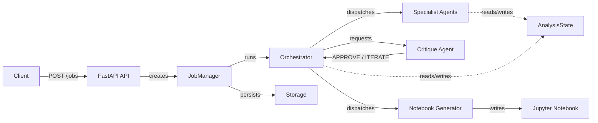
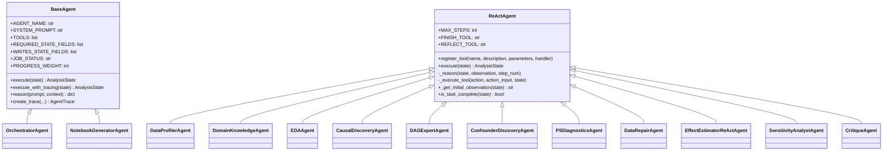
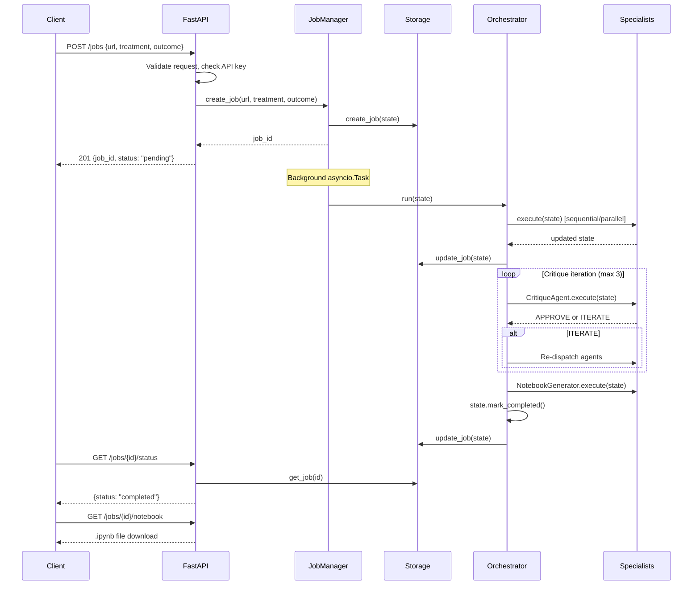

# Architecture

This document describes the system design, component boundaries, and key abstractions of the Causal Orchestrator.

Source root: `backend/src/`

---

## System Overview

The system accepts a dataset URL and an optional treatment-outcome variable pair, runs a multi-agent causal inference pipeline, and produces a Jupyter notebook with findings. It is built as a FastAPI service where each analysis job spawns an asyncio task that coordinates 13 specialist agents.



---

## Directory Layout

```
backend/src/
  api/                    # FastAPI routes, middleware, rate limiting
    main.py               # App factory, CORS, auth dependency
    routes/
      jobs.py             # All job endpoints (10 routes)
      health.py           # Health check endpoints
    rate_limit.py         # slowapi rate limiter (10 req/min on POST /jobs)

  agents/                 # Agent system
    base/                 # Base classes and shared state
      agent.py            # BaseAgent (direct LLM call pattern)
      react_agent.py      # ReActAgent (observe-reason-act loop)
      state.py            # AnalysisState, all data models, JobStatus
      context_tools.py    # ContextTools mixin (pull-based context)
      errors.py           # StateValidationError
    orchestrator/         # Central coordinator
      orchestrator_agent.py    # Tool-based dispatch, parallel merge, critique loop
      react_orchestrator.py    # ReAct-based orchestrator variant
    specialists/          # Domain-specific agents
      data_profiler.py
      domain_knowledge.py
      eda_agent.py
      causal_discovery.py
      dag_expert.py
      confounder_discovery.py
      ps_diagnostics.py
      data_repair.py
      sensitivity_analyst.py
      effect_estimation/       # Package (decomposed from monolith)
        agent.py               # EffectEstimatorReActAgent
        estimation_methods.py  # Inline method implementations
        method_selector.py     # SampleSizeThresholds, method selection
      notebook/                # Package (decomposed from monolith)
        agent.py               # NotebookGeneratorAgent
        helpers.py             # Shared utilities
        sections/              # One renderer per pipeline section (14 files)
    critique/
      critique_agent.py   # CritiqueAgent (ReAct-based quality review)
    registry.py           # @register_agent decorator, create_all_agents()

  causal/                 # Statistical methods layer
    methods/
      base.py             # BaseCausalMethod, @register_method, MethodResult
      ols.py              # OLS regression
      propensity.py       # IPW, AIPW, PSM
      did.py              # Difference-in-Differences
      iv.py               # Instrumental Variables
      rdd.py              # Regression Discontinuity
      metalearners.py     # S-Learner, T-Learner, X-Learner
      causal_forest.py    # Causal Forest (econml)
      double_ml.py        # Double Machine Learning (econml)
    discovery/            # Causal graph discovery algorithms

  llm/                    # LLM abstraction layer
    client.py             # LLMClient Protocol, LLMResponse, get_llm_client()
    claude_client.py      # Anthropic Claude implementation
    gemini_client.py      # Google Gemini API implementation
    vertex_client.py      # Google Vertex AI implementation

  storage/                # Persistence abstraction
    __init__.py           # StorageProtocol, get_storage_client()
    firestore.py          # Firestore implementation (production)
    local_storage.py      # JSON file implementation (development)

  config/                 # Application settings
    settings.py           # Pydantic BaseSettings, all config fields

  jobs/                   # Job lifecycle management
    manager.py            # JobManager: create, run, cancel, timeout

  kaggle/                 # Dataset download and metadata extraction

  logging_config/         # Structured logging (structlog)
    structured.py         # JSON-format structured logger
```

---

## Component Boundaries and Contracts

### LLM Layer

All LLM interaction goes through a `Protocol`-based abstraction. Agents never import a specific provider.

```python
# Protocol (structural typing -- no inheritance required)
class LLMClient(Protocol):
    async def generate(prompt, system_instruction, tools) -> LLMResponse: ...
    async def generate_with_function_calling(prompt, system_instruction, tools, max_iterations) -> dict: ...
    async def generate_structured(prompt, response_schema, system_instruction) -> T: ...

# Unified response
@dataclass
class LLMResponse:
    text: str
    raw: Any = None
    usage: dict[str, int] = {}
```

Provider selection happens in `get_llm_client()` based on `settings.llm_provider`:
- `"claude"` -> `ClaudeClient` (default)
- `"gemini"` -> `GeminiClient`
- `"vertex"` -> `VertexAIClient`

The client is cached as a module-level singleton.

### Storage Layer

Persistence uses the same protocol pattern:

```python
class StorageProtocol(Protocol):
    async def create_job(state) -> str: ...
    async def update_job(state) -> None: ...
    async def get_job(job_id) -> dict | None: ...
    async def list_jobs(status, limit, offset) -> tuple[list[dict], int]: ...
    async def update_job_status(job_id, status, error_message) -> bool: ...
    async def delete_job(job_id, cascade) -> dict: ...
    async def save_results(state) -> None: ...
    async def get_results(job_id) -> dict | None: ...
    async def save_traces(state) -> None: ...
    async def get_traces(job_id) -> list[dict]: ...
```

Selection via `get_storage_client()` based on `settings.use_firestore`:
- `True` -> `FirestoreClient` (production)
- `False` -> `LocalStorageClient` (development, writes JSON to disk)

### Agent Layer

Two base classes define the agent contract:



**BaseAgent** is for agents that make a single LLM call (or a few sequential calls) without a tool loop. The orchestrator and notebook generator use this pattern.

**ReActAgent** implements the observe-reason-act loop from the [ReAct paper](https://arxiv.org/abs/2210.03629). Agents register tools via `register_tool()`, and the loop runs until `finish` is called or `MAX_STEPS` is reached. Built-in tools: `finish` (signal completion) and `reflect` (pause for self-assessment).

**Registration** uses a decorator pattern:

```python
@register_agent("data_profiler")
class DataProfilerAgent(ReActAgent):
    AGENT_NAME = "data_profiler"
    REQUIRED_STATE_FIELDS = ["dataset_info"]
    WRITES_STATE_FIELDS = ["data_profile", "dataframe_path"]
    ...
```

All agents are discovered via `create_all_agents()` which instantiates every registered class. The orchestrator receives these instances through `register_specialist()`.

### Causal Methods Layer

Statistical estimation methods follow a similar registry pattern:

```python
@register_method("ols")
class OLSMethod(BaseCausalMethod):
    METHOD_NAME = "ols"
    ESTIMAND = "ATE"
    ...
```

The `BaseCausalMethod` abstract class requires:
- `fit(df, treatment_col, outcome_col, covariates)` -- fit the model
- `estimate()` -- return a `MethodResult` with estimate, SE, CI, p-value

The method layer lives under `src/causal/methods/` and is separate from the agent layer. However, there is a known code duplication issue: `agents/specialists/effect_estimation/estimation_methods.py` contains inline reimplementations of several methods that do not use the registry.

---

## Key Design Decisions

### Why ReAct over fixed pipelines

Fixed pipelines (run step A, then B, then C) cannot adapt to data characteristics. A ReAct agent can inspect profiling results and decide which methods apply, skip steps that don't make sense for the data, and retry with different parameters on failure. The LLM reasoning layer replaces hardcoded routing logic.

### Why pull-based context over data dumps

Agents could receive all available state as a prompt prefix ("push-based"), but this wastes context window tokens on irrelevant information. Instead, agents use `ContextTools` to query specific fields on demand. The `DomainKnowledgeAgent` writes structured knowledge to state, and downstream agents call tools like `ask_domain_knowledge` or `get_profile_for_variables` to fetch only what they need.

### Why protocol-based abstraction for LLM and storage

Python `Protocol` (structural typing) allows swapping backends without touching agent code. A `ClaudeClient`, `GeminiClient`, or `VertexAIClient` satisfies `LLMClient` as long as it has the right method signatures. No inheritance required, no registration step. Same for `StorageProtocol` with Firestore vs local JSON.

### Why decorator-based registration

`@register_agent("name")` and `@register_method("name")` allow adding new agents or methods by creating a file and decorating a class. No config file edits, no import modifications to a central registry. The import of the module triggers registration. The orchestrator discovers all agents via `create_all_agents()`.

---

## Concurrency Model

The system runs on a single asyncio event loop.

1. **Job lifecycle**: Each `POST /jobs` request creates a background `asyncio.Task` managed by `JobManager`. The task runs the orchestrator, which dispatches agents sequentially (or in parallel for specific steps).

2. **Parallel agent dispatch**: The orchestrator can run agents concurrently using `dispatch_parallel_agents`. It creates `copy.copy(state)` for each agent, runs them via `asyncio.gather`, then merges results by copying the declared `WRITES_STATE_FIELDS` from each agent's copy back to the main state.

3. **Agent timeout**: Each `ReActAgent.execute()` is wrapped in `asyncio.wait_for(timeout=settings.agent_timeout_seconds)` (default 300 seconds).

4. **SSE streaming**: Real-time progress is streamed to clients via Server-Sent Events at `GET /jobs/{job_id}/stream`. The stream sends periodic heartbeats and status updates.

---

## Request Lifecycle



---

## Known Architectural Issues

1. **Shallow copy in parallel dispatch**: `copy.copy(state)` creates shallow copies. Nested mutable objects (lists of `TreatmentEffectResult`, dicts) are shared between copies. Mutations in one parallel agent can corrupt another's view of state.

2. **LLM singleton not resettable in production**: `get_llm_client()` caches the client at module level. `reset_llm_client()` exists but is intended for tests. In production, switching providers requires a process restart.

3. **Global circuit breaker state**: If the LLM provider has a global circuit breaker or retry counter, concurrent jobs share that state, meaning one job's failures can affect another's retry budget.

4. **Silent exception swallowing**: The orchestrator's status persistence callback wraps updates in `try/except` with logging only. If storage writes fail, the job continues running but its state is lost.

5. **State contract enforcement is advisory only**: `REQUIRED_STATE_FIELDS` and `WRITES_STATE_FIELDS` are validated at dispatch time (via `_validate_required_state`), but nothing prevents an agent from reading or writing fields outside its declared contract.

6. **No backpressure on concurrent jobs**: `JobManager` spawns background tasks without limit. There is no queue or worker pool to bound concurrent pipeline executions.

7. **Code duplication between causal layers**: `src/causal/methods/` contains the registered method implementations with `BaseCausalMethod`. `agents/specialists/effect_estimation/estimation_methods.py` contains separate inline implementations of overlapping methods (OLS, IPW, AIPW, PSM, meta-learners). These two codepaths can diverge.
