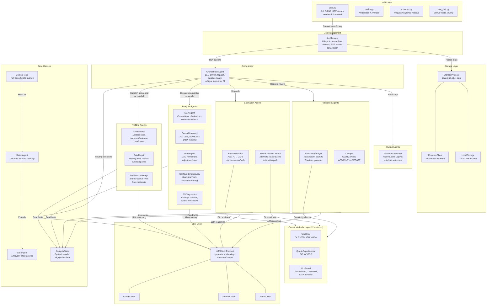

# C4 Level 3 -- Component Diagram (Backend)

Internal components of the FastAPI backend and their dependencies.

```mermaid
graph TB
    subgraph API["API Layer"]
        JOBS["jobs.py<br/><i>Job CRUD, SSE stream,<br/>notebook download</i>"]
        HEALTH["health.py<br/><i>Readiness + liveness</i>"]
        SCHEMAS["schemas.py<br/><i>Request/response models</i>"]
        RATE["rate_limit.py<br/><i>SlowAPI rate limiting</i>"]
    end

    subgraph JobLayer["Job Management"]
        MGR["JobManager<br/><i>Lifecycle, semaphore,<br/>timeout, SSE events,<br/>cancellation</i>"]
    end

    subgraph OrchestratorLayer["Orchestrator"]
        ORCH["OrchestratorAgent<br/><i>LLM-driven dispatch,<br/>parallel merge,<br/>critique loop (max 3)</i>"]
    end

    subgraph Profiling["Profiling Agents"]
        DP["DataProfiler<br/><i>Dataset stats,<br/>treatment/outcome candidates</i>"]
        DR["DataRepair<br/><i>Missing data, outliers,<br/>encoding fixes</i>"]
        DK["DomainKnowledge<br/><i>Extract causal hints<br/>from metadata</i>"]
    end

    subgraph Analysis["Analysis Agents"]
        EDA["EDA Agent<br/><i>Correlations, distributions,<br/>covariate balance</i>"]
        CD["CausalDiscovery<br/><i>PC, GES, NOTEARS<br/>graph learning</i>"]
        DAG["DAGExpert<br/><i>DAG refinement,<br/>adjustment sets</i>"]
        CONF["ConfounderDiscovery<br/><i>Statistical tests,<br/>causal reasoning</i>"]
        PSD["PSDiagnostics<br/><i>Overlap, balance,<br/>calibration checks</i>"]
    end

    subgraph Estimation["Estimation Agents"]
        EE["EffectEstimator<br/><i>ATE, ATT, CATE<br/>via causal methods</i>"]
        EER["EffectEstimator ReAct<br/><i>Alternate ReAct-based<br/>estimation path</i>"]
    end

    subgraph Validation["Validation Agents"]
        SA["SensitivityAnalyst<br/><i>Rosenbaum bounds,<br/>E-values, placebo</i>"]
        CR["Critique<br/><i>Quality review,<br/>APPROVE or ITERATE</i>"]
    end

    subgraph Output["Output Agents"]
        NB["NotebookGenerator<br/><i>Reproducible Jupyter<br/>notebook with code</i>"]
    end

    subgraph Methods["Causal Methods Layer (12 methods)"]
        CLASSICAL["Classical<br/><i>OLS, PSM, IPW, AIPW</i>"]
        QUASI["Quasi-Experimental<br/><i>DiD, IV, RDD</i>"]
        ML["ML-Based<br/><i>CausalForest, DoubleML,<br/>S/T/X-Learner</i>"]
    end

    subgraph LLMLayer["LLM Client"]
        LLMC["LLMClient Protocol<br/><i>generate, tool calling,<br/>structured output</i>"]
        CLAUDE["ClaudeClient"]
        GEMINI["GeminiClient"]
        VERTEX["VertexClient"]
    end

    subgraph StorageLayer["Storage Layer"]
        SP["StorageProtocol<br/><i>save/load jobs, state</i>"]
        FS["FirestoreClient<br/><i>Production backend</i>"]
        LS["LocalStorage<br/><i>JSON files for dev</i>"]
    end

    subgraph Base["Base Classes"]
        BA["BaseAgent<br/><i>Lifecycle, state access</i>"]
        RA["ReActAgent<br/><i>Observe-Reason-Act loop</i>"]
        CT["ContextTools<br/><i>Pull-based state queries</i>"]
        AS["AnalysisState<br/><i>Pydantic model,<br/>all pipeline data</i>"]
    end

    JOBS -->|"Create/cancel/query"| MGR
    MGR -->|"Run pipeline"| ORCH
    ORCH -->|"Dispatch sequential<br/>or parallel"| Profiling
    ORCH -->|"Dispatch sequential<br/>or parallel"| Analysis
    ORCH -->|"Dispatch"| Estimation
    ORCH -->|"Request review"| Validation
    ORCH -->|"Final step"| Output
    EE -->|"Fit + estimate"| Methods
    EER -->|"Fit + estimate"| Methods
    SA -->|"Sensitivity checks"| Methods
    Profiling -->|"LLM reasoning"| LLMC
    Analysis -->|"LLM reasoning"| LLMC
    Estimation -->|"LLM reasoning"| LLMC
    Validation -->|"LLM reasoning"| LLMC
    ORCH -->|"Routing decisions"| LLMC
    LLMC --- CLAUDE
    LLMC --- GEMINI
    LLMC --- VERTEX
    MGR -->|"Persist state"| SP
    SP --- FS
    SP --- LS
    RA -->|"Extends"| BA
    CT -->|"Mixin for"| RA
    Profiling -->|"Read/write"| AS
    Analysis -->|"Read/write"| AS
    Estimation -->|"Read/write"| AS
    Validation -->|"Read/write"| AS
```
