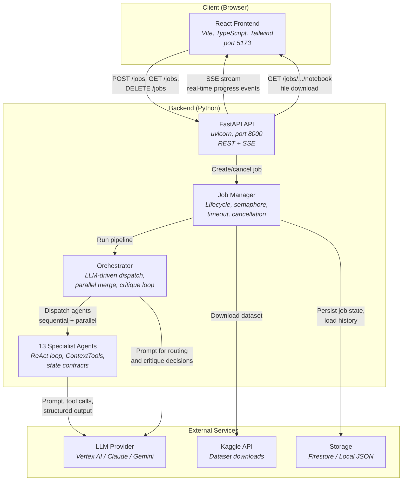

# C4 Level 2 -- Container Diagram

Major deployable units and the data flowing between them.

```mermaid
graph TB
    subgraph Client["Client (Browser)"]
        FE["React Frontend<br/><i>Vite, TypeScript, Tailwind<br/>port 5173</i>"]
    end

    subgraph Server["Backend (Python)"]
        API["FastAPI API<br/><i>uvicorn, port 8000<br/>REST + SSE</i>"]
        JM["Job Manager<br/><i>Lifecycle, semaphore,<br/>timeout, cancellation</i>"]
        ORCH["Orchestrator<br/><i>LLM-driven dispatch,<br/>parallel merge, critique loop</i>"]
        AGENTS["13 Specialist Agents<br/><i>ReAct loop, ContextTools,<br/>state contracts</i>"]
    end

    subgraph External["External Services"]
        LLM["LLM Provider<br/><i>Vertex AI / Claude / Gemini</i>"]
        KG["Kaggle API<br/><i>Dataset downloads</i>"]
        STORE["Storage<br/><i>Firestore / Local JSON</i>"]
    end

    FE -->|"POST /jobs, GET /jobs,<br/>DELETE /jobs"| API
    API -->|"SSE stream<br/>real-time progress events"| FE
    API -->|"GET /jobs/.../notebook<br/>file download"| FE
    API -->|"Create/cancel job"| JM
    JM -->|"Run pipeline"| ORCH
    ORCH -->|"Dispatch agents<br/>sequential + parallel"| AGENTS
    AGENTS -->|"Prompt, tool calls,<br/>structured output"| LLM
    ORCH -->|"Prompt for routing<br/>and critique decisions"| LLM
    JM -->|"Download dataset"| KG
    JM -->|"Persist job state,<br/>load history"| STORE
```
