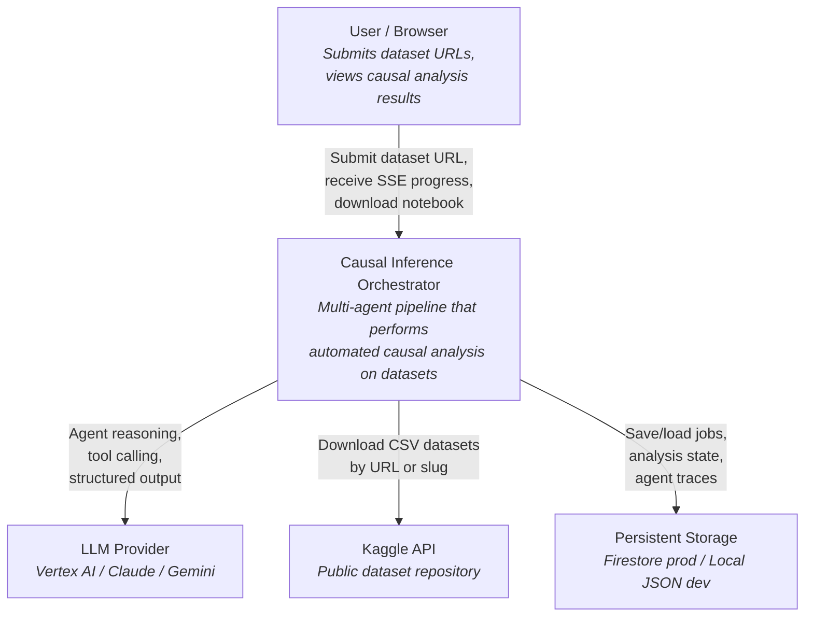

# C4 Level 1 -- System Context

Who uses this system and what external systems does it connect to.

```mermaid
graph TB
    User["User / Browser<br/><i>Submits dataset URLs,<br/>views causal analysis results</i>"]
    CO["Causal Inference Orchestrator<br/><i>Multi-agent pipeline that performs<br/>automated causal analysis on datasets</i>"]
    LLM["LLM Provider<br/><i>Vertex AI / Claude / Gemini</i>"]
    Kaggle["Kaggle API<br/><i>Public dataset repository</i>"]
    Storage["Persistent Storage<br/><i>Firestore prod / Local JSON dev</i>"]

    User -->|"Submit dataset URL,<br/>receive SSE progress,<br/>download notebook"| CO
    CO -->|"Agent reasoning,<br/>tool calling,<br/>structured output"| LLM
    CO -->|"Download CSV datasets<br/>by URL or slug"| Kaggle
    CO -->|"Save/load jobs,<br/>analysis state,<br/>agent traces"| Storage
```
