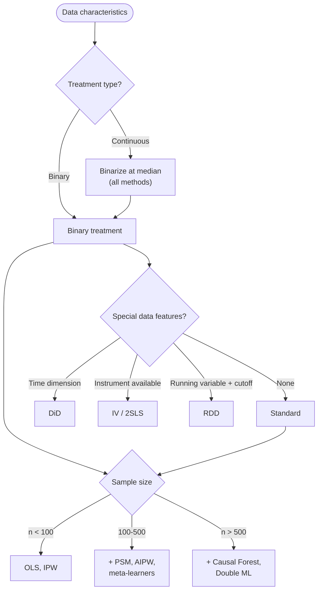

# Causal Methods Catalog

This document covers the 12 registered estimation methods, 5 discovery algorithms, and the sensitivity analysis methods. For how these are used in the pipeline, see [pipeline.md](pipeline.md). For the data models that hold results, see [state-schema.md](state-schema.md).

Source: `backend/src/causal/methods/` (estimation), `backend/src/causal/dag/discovery.py` (discovery)

---

## Method Selection Guide



**Quick selection rules:**
- Always run OLS as a baseline
- For observational data with confounders: IPW, AIPW, PSM
- For treatment effect heterogeneity: meta-learners (S, T, X), Causal Forest
- For panel/repeated data: DiD
- For endogeneity with instruments: IV (2SLS)
- For sharp cutoff designs: RDD

---

## Estimation Methods (12)

All methods inherit from `BaseCausalMethod` and are registered via `@register_method("name")`. Each implements `fit()`, `estimate()`, and `validate_assumptions()`.

### Sample Size Requirements

From `SampleSizeThresholds` in `agents/specialists/effect_estimation/method_selector.py`:

| Tier | Min Per Arm | Min Total | Methods |
|------|------------|-----------|---------|
| Basic | 30 | 50 | OLS, IPW |
| Medium | 50 | 100 | PSM, AIPW |
| ML | 100 | 200 | S-Learner, T-Learner, X-Learner |
| Forest | 200 | 500 | Causal Forest, Double ML |

DiD, IV, and RDD have context-dependent sample requirements.

---

### OLS Regression

**Registered name**: `ols`
**Estimand**: ATE
**File**: `causal/methods/ols.py`
**Library**: statsmodels

Fits `Y ~ T + X` via OLS. The coefficient on `T` estimates the ATE under linear model assumptions.

**Assumptions**: Linearity, conditional ignorability, homoscedasticity, no multicollinearity.

**Diagnostics**: R-squared, F-statistic, VIF, RESET test (functional form), Breusch-Pagan test (heteroscedasticity), normality tests (Shapiro-Wilk, Anderson-Darling). Uses HC1 robust standard errors.

---

### Inverse Probability Weighting (IPW)

**Registered name**: `ipw`
**Estimand**: ATE
**File**: `causal/methods/propensity.py`
**Library**: sklearn (LogisticRegression)

Estimates the ATE by weighting each observation by the inverse of its estimated propensity score. Uses the Hajek (normalized) estimator with propensity score trimming.

**Assumptions**: Conditional ignorability, positivity (all units have non-zero treatment probability), correct propensity score model.

**Diagnostics**: Propensity score distribution (min, max, mean), effective sample size (ESS) per group, extreme weight counts.

---

### Augmented IPW (AIPW / Doubly Robust)

**Registered name**: `aipw`
**Estimand**: ATE
**File**: `causal/methods/propensity.py`
**Library**: sklearn (LogisticRegression, LinearRegression, KFold)

Doubly robust estimator: consistent if either the propensity score model or the outcome model is correctly specified. Uses K-fold cross-fitting (default 5 folds) for nuisance model estimation and influence-function-based standard errors.

**Assumptions**: Conditional ignorability, positivity.

**Diagnostics**: Propensity score overlap (fraction in [0.1, 0.9]), outcome model R-squared for treated/control, cross-fitting fold count.

---

### Propensity Score Matching (PSM)

**Registered name**: `psm`
**Estimand**: ATT
**File**: `causal/methods/propensity.py`
**Library**: sklearn (LogisticRegression, NearestNeighbors)

Matches treated units to control units with similar propensity scores using nearest-neighbor matching on the logit scale. Bootstrap standard errors (500 iterations).

**Assumptions**: Conditional ignorability, positivity, correct propensity score specification.

**Diagnostics**: Match rate, unmatched count, propensity score means by group, common support statistics.

---

### Difference-in-Differences (DiD)

**Registered name**: `did`
**Estimand**: ATT
**File**: `causal/methods/did.py`
**Library**: statsmodels

Estimates the ATT from pre/post treatment changes between treatment and control groups. Supports an explicit `post_col` or automatic time splitting at the median of `time_col`. Uses HC1 robust standard errors or clustered standard errors.

**Assumptions**: Parallel trends (treatment and control follow the same trajectory absent treatment), no spillovers, sharp treatment timing, stable composition.

**Diagnostics**: Pre/post means by group, cell counts, parallel trends test (pre-trend interaction term or two-period change equality test), R-squared.

---

### Instrumental Variables (2SLS)

**Registered name**: `iv`
**Estimand**: LATE (Local Average Treatment Effect)
**File**: `causal/methods/iv.py`
**Library**: statsmodels

Two-stage least squares. First stage regresses treatment on instruments; second stage uses predicted treatment values. Produces corrected 2SLS standard errors via sandwich formula.

**Assumptions**: Relevance (instrument predicts treatment), exclusion (instrument affects outcome only through treatment), independence (instrument is exogenous), monotonicity.

**Diagnostics**: First-stage partial F-statistic (F < 10 = severe weak instrument, F < 16.38 = moderate), first/second stage R-squared, Hansen J test (overidentification when multiple instruments), Durbin-Wu-Hausman endogeneity test.

---

### Regression Discontinuity Design (RDD)

**Registered name**: `rdd`
**Estimand**: LATE
**File**: `causal/methods/rdd.py`
**Library**: statsmodels, scipy.stats

Estimates the treatment effect at a discontinuity cutoff in a running variable. Supports both sharp RDD (deterministic treatment assignment) and fuzzy RDD (via 2SLS). Uses local polynomial regression with IK-style optimal bandwidth selection and HC1 robust standard errors.

**Assumptions**: Continuity of potential outcomes at the cutoff, no manipulation of the running variable, local randomization around the cutoff.

**Diagnostics**: Bandwidth, observations above/below cutoff, raw jump estimate, R-squared, McCrary density test (manipulation detection), covariate balance tests, bandwidth sensitivity analysis.

---

### S-Learner

**Registered name**: `s_learner`
**Estimand**: CATE (reported as ATE via mean)
**File**: `causal/methods/metalearners.py`
**Library**: sklearn (GradientBoostingRegressor, RandomForestRegressor, LinearRegression)

Fits a single model `Y ~ f(X, T)` and estimates CATE as `f(X, T=1) - f(X, T=0)`. Uses honest sample splitting (50/50) and base learner selection via 3-fold cross-validation. Bootstrap standard errors (100 iterations).

**Assumptions**: Conditional ignorability, positivity.

**Diagnostics**: CATE distribution (mean, std, min, max, median, pct positive), honest splitting indicator.

---

### T-Learner

**Registered name**: `t_learner`
**Estimand**: CATE (reported as ATE)
**File**: `causal/methods/metalearners.py`
**Library**: sklearn

Fits separate outcome models for treated and control groups. CATE = `f1(X) - f0(X)`. Honest 50/50 sample splitting. CV-tuned hyperparameters. Bootstrap standard errors (100 iterations).

**Assumptions**: Conditional ignorability, positivity.

**Diagnostics**: CATE distribution, honest splitting indicator.

---

### X-Learner

**Registered name**: `x_learner`
**Estimand**: CATE (reported as ATE)
**File**: `causal/methods/metalearners.py`
**Library**: sklearn (LogisticRegression for propensity)

Three-stage meta-learner designed for imbalanced treatment/control:
1. Fit outcome models per group
2. Compute imputed treatment effects
3. Fit CATE models and weight by propensity score

Honest sample splitting. Bootstrap standard errors (100 iterations).

**Assumptions**: Conditional ignorability, positivity.

**Diagnostics**: CATE distribution, treatment imbalance ratio, honest splitting indicator.

---

### Causal Forest

**Registered name**: `causal_forest`
**Estimand**: CATE (reported as ATE)
**File**: `causal/methods/causal_forest.py`
**Library**: econml.dml.CausalForestDML (preferred), sklearn RandomForestRegressor (fallback)

Uses econml's CausalForestDML when available, which provides valid confidence intervals via BLB (Bag of Little Bootstraps) inference. Falls back to a T-Learner with bootstrap standard errors if econml is not installed.

**Assumptions**: Conditional ignorability, positivity, overlap.

**Diagnostics**: CATE distribution, heterogeneity index, IQR, feature importances (when econml is used).

---

### Double Machine Learning

**Registered name**: `double_ml`
**Estimand**: ATE
**File**: `causal/methods/double_ml.py`
**Library**: econml.dml.LinearDML (preferred), sklearn (fallback)

Estimates the ATE using the Neyman-orthogonal/debiased approach: residualize both treatment and outcome with flexible ML models, then estimate the effect from residuals. Uses econml's LinearDML when available; otherwise, implements manual cross-fitting with StratifiedKFold.

**Assumptions**: Conditional ignorability, positivity, regularity conditions for Neyman orthogonality.

**Diagnostics**: Cross-fitting fold count, ML method used, outcome/treatment residual variance and correlation (manual mode).

---

## Discovery Algorithms (5)

Source: `backend/src/causal/dag/discovery.py`

These algorithms learn causal graph structure from observational data. The `CausalDiscoveryAgent` selects algorithms based on data characteristics and can run multiple algorithms for comparison.

### Interface

```python
CausalDiscovery(
    algorithm: str,      # "pc", "fci", "ges", "notears", "lingam"
    alpha: float = 0.05,
    ci_test: str = "fisherz",
    use_bootstrap: bool = False,
    n_bootstrap: int = 100,
    bootstrap_threshold: float = 0.5,
)
```

Automatic variable selection limits input to the 25 most relevant variables (ranked by mutual information with treatment/outcome) when the dataset has more than 25 features. Minimum requirements: 50 observations, 2+ numeric variables.

### PC Algorithm

**Type**: Constraint-based
**Output**: PDAG (Partially Directed Acyclic Graph)

Starts with a complete undirected graph, removes edges based on conditional independence tests, then orients v-structures. Supports multiple CI tests: Fisher-Z (Gaussian), Kernel HSIC (nonlinear), Chi-square, G-test.

FDR correction (Benjamini-Hochberg) is applied to control false discovery rate. Configurable maximum conditioning set size.

### FCI Algorithm

**Type**: Constraint-based (handles latent confounders)
**Output**: PAG (Partial Ancestral Graph)

Extension of PC that can detect the presence of latent (unmeasured) confounders. Produces bidirected edges to indicate confounding between variable pairs.

### GES (Greedy Equivalence Search)

**Type**: Score-based
**Library**: causallearn (if available)
**Fallback**: PC algorithm

Searches over the space of equivalence classes using a greedy forward/backward procedure to maximize a BIC score. Requires `causallearn` to be installed.

### NOTEARS

**Type**: Continuous optimization
**Output**: DAG (guaranteed acyclic)

Formulates structure learning as a continuous optimization problem with an acyclicity constraint via the exponential matrix trace. L1 regularization for sparsity. Adaptive thresholding via permutation null distribution to determine edge significance.

Parameters: `lambda1` (L1 penalty), `max_iter`, `h_tol` (acyclicity tolerance), `w_threshold`.

### LiNGAM

**Type**: ICA-based
**Library**: causallearn (if available)
**Fallback**: NOTEARS
**Assumption**: Linear relationships with non-Gaussian error terms

Uses Independent Component Analysis to identify the causal ordering and quantify edge strengths. Can identify the full DAG (not just the equivalence class) under the non-Gaussianity assumption.

### Ensemble Discovery

Runs PC, GES, and NOTEARS in combination. Edges that appear across a consensus threshold (default 50% of algorithms) are included in the final graph.

### Bootstrap Stability

Runs a chosen algorithm on 100 bootstrap samples (80% subsampling) and reports edge frequency. Edges exceeding the stability threshold (default 50%) are retained. Provides confidence metrics for each edge.

---

## Sensitivity Analysis Methods

These are implemented as tools in the `SensitivityAnalystAgent` and as verification cells in the generated notebook.

### E-value

Quantifies how strong an unmeasured confounder would need to be (in terms of its association with treatment and outcome) to fully explain away the observed effect. Higher E-values indicate greater robustness.

- E-value > 3: Strong robustness
- E-value 2-3: Moderate robustness
- E-value < 2: Weak robustness

### Rosenbaum Bounds

For matched studies. Determines how large the odds ratio of differential treatment assignment due to unobserved confounding would need to be (Gamma) to change the study conclusion.

### Specification Curve

Runs many alternative model specifications (different covariate sets, functional forms) and plots the distribution of estimates. A tight cluster around the main estimate indicates robustness to specification choices.

### Placebo Test

Randomly permutes treatment assignment and re-estimates the effect 500 times. If the real effect falls far outside the null distribution, the finding is unlikely to be spurious. Provides a permutation p-value.

### Subgroup Analysis

Estimates treatment effects within subgroups (defined by covariates) to check for effect heterogeneity and consistency.

---

## Method Registration

Methods are registered using a decorator pattern identical to agent registration:

```python
from src.causal.methods.base import BaseCausalMethod, register_method

@register_method("my_method")
class MyMethod(BaseCausalMethod):
    METHOD_NAME = "my_method"
    ESTIMAND = "ATE"

    def fit(self, df, treatment_col, outcome_col, covariates=None, **kwargs):
        # Fit model
        self._fitted = True
        return self

    def estimate(self):
        # Return MethodResult
        return MethodResult(...)
```

Discovery via `get_method_registry()` returns all registered methods. Adding a new `.py` file in `causal/methods/` with a `@register_method` decorator is sufficient; no other files need modification.

See [development.md](development.md) for a full walkthrough.

---

## Known Issues

1. **Code duplication between method layers**: `src/causal/methods/` contains `BaseCausalMethod` subclasses used by `EffectEstimatorReActAgent`. `agents/specialists/effect_estimation/estimation_methods.py` contains separate inline implementations used by `EffectEstimatorAgent`. These two codepaths implement overlapping methods (OLS, IPW, AIPW, PSM, meta-learners) and can diverge in behavior.

2. **Bootstrap iteration inconsistency**: Meta-learners use 100 bootstrap iterations for standard errors. PSM uses 500. This inconsistency affects the precision of reported standard errors differently across methods.

3. **Continuous treatment handling**: All methods binarize continuous treatments at the median. This discards dose-response information and can bias estimates. A warning is logged but no continuous-treatment methods are available.

4. **econml dependency is optional**: Causal Forest and Double ML attempt to use `econml` but fall back to simpler implementations (T-Learner, manual cross-fitting) when it is not installed. The fallback implementations may have different statistical properties (e.g., no valid BLB confidence intervals for Causal Forest).
