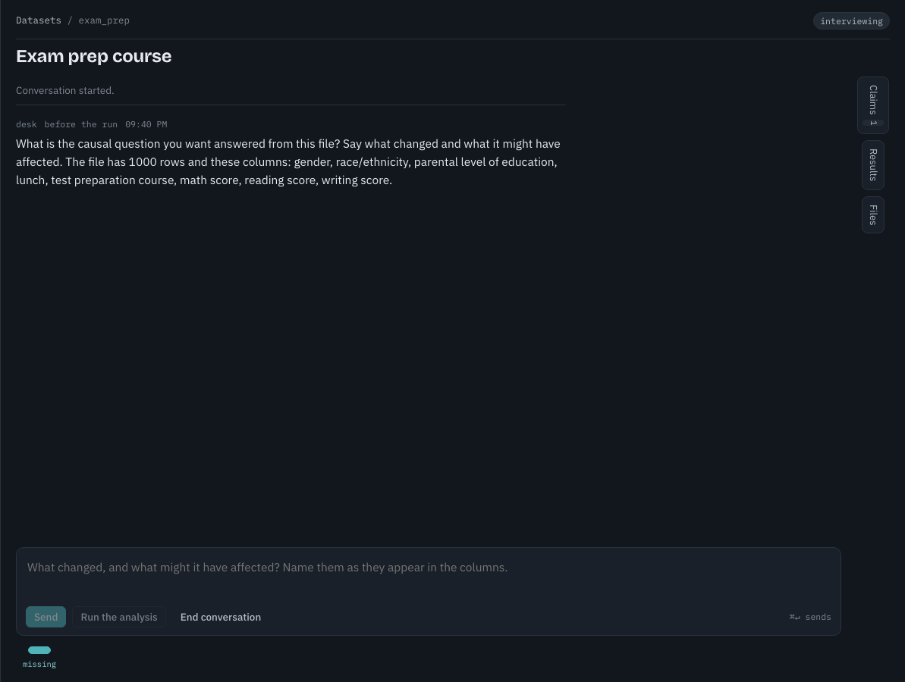
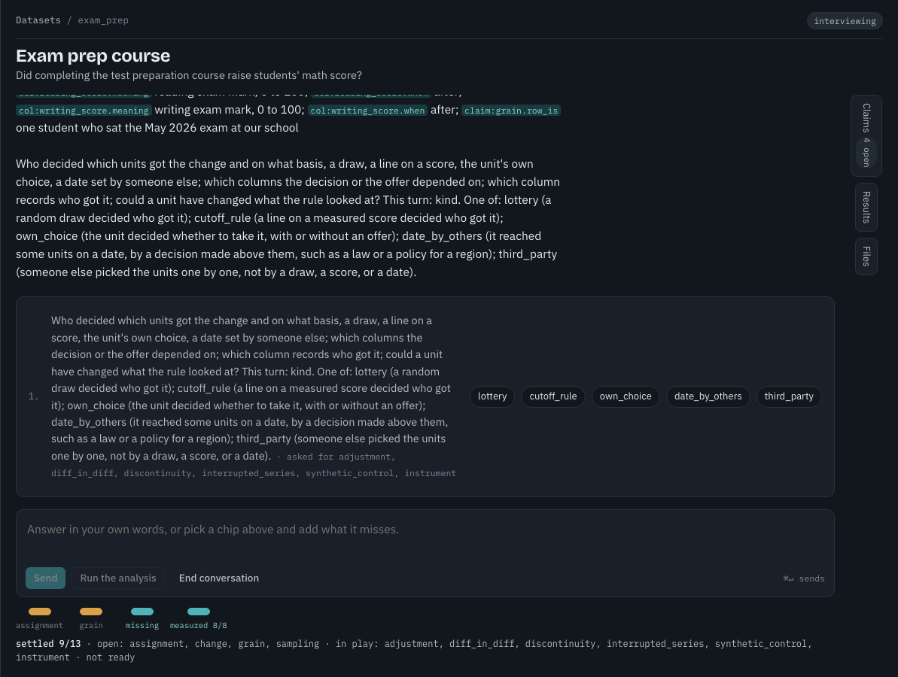
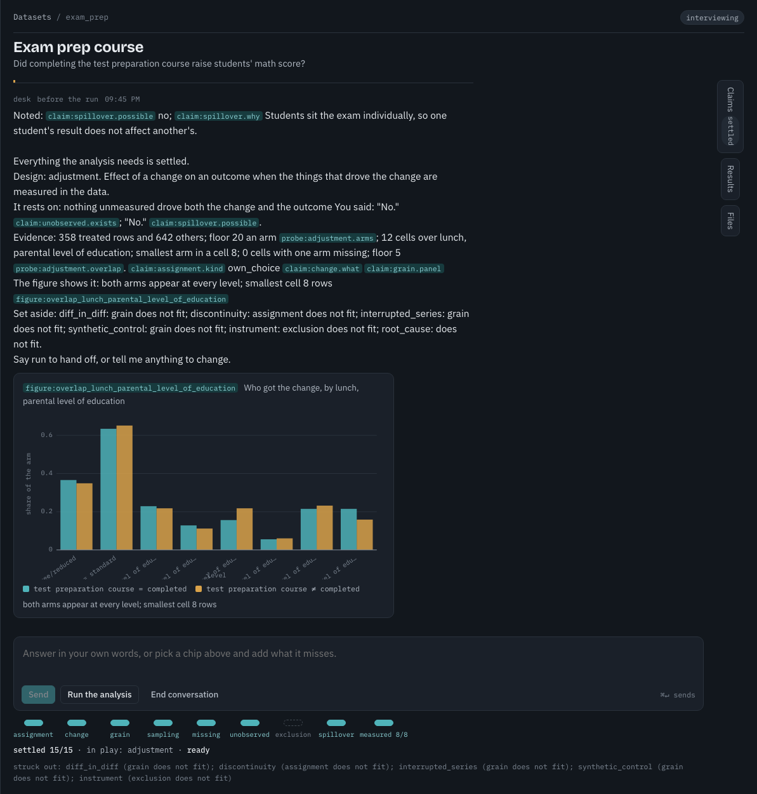
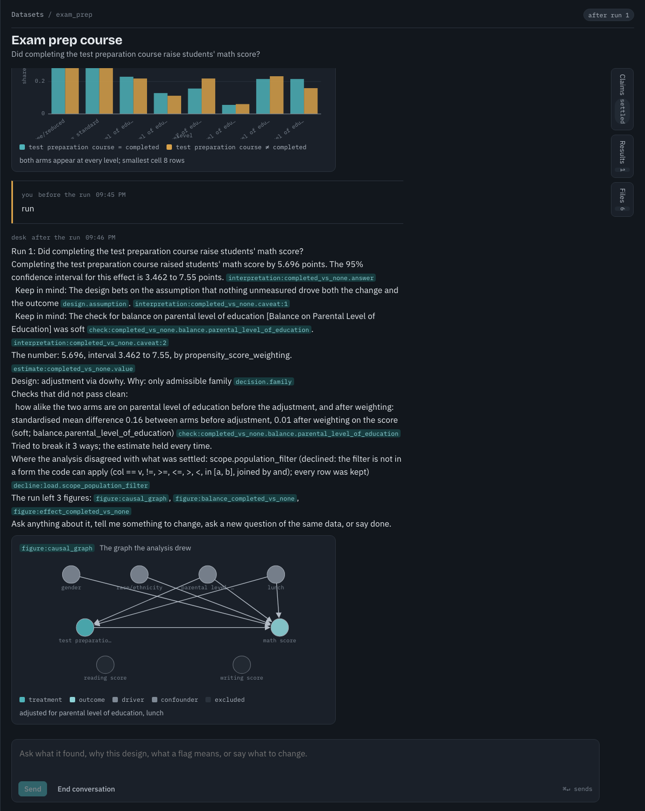
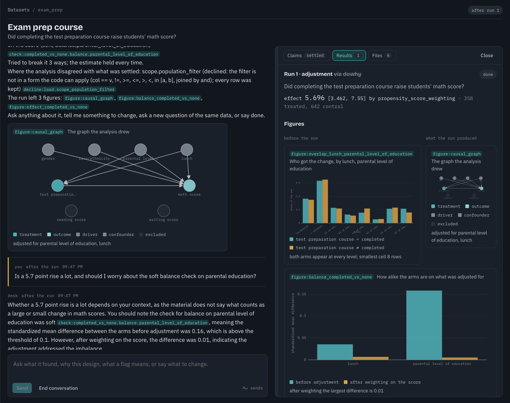
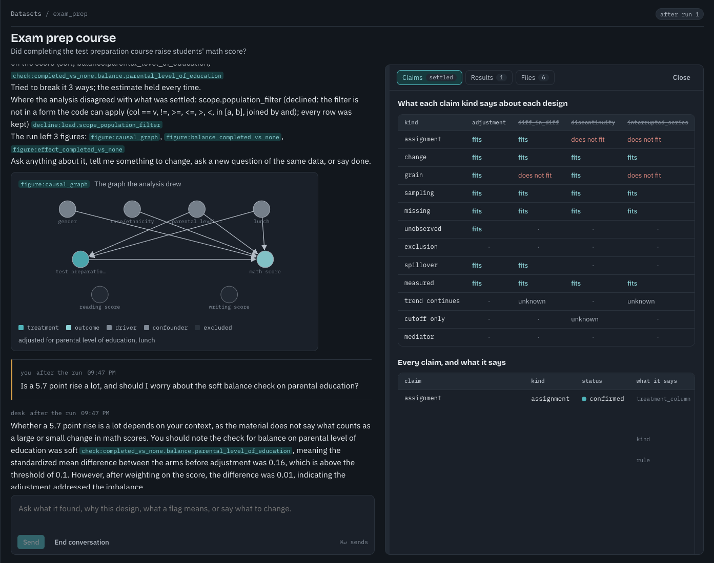

# One run, walked

The Kaggle [Students Performance](https://www.kaggle.com/datasets/spscientist/students-performance-in-exams) file: 1,000 students,
eight columns. The question: did completing the test preparation course raise students' math score? The answers are the school's
own account of how the course was offered: places went first to students on free or reduced lunch and to students whose parents
hold no degree, then to anyone who asked, and taking the place was the student's own choice.

Each step names the mechanism it shows and links its page.

**1. The desk asks the question first.** Nothing about the data is typed into a form. The question is read once and validated
against the file by code. [desk.md](desk.md)

**2. One question per turn.** Each answer becomes claims with a source; the chips say what stands. Every column has been placed
before, at, or after the change, and the desk asks who decided which students got the course, because the assignment decision
needs it. [memory-and-matrix.md](memory-and-matrix.md)

**3. Ready.** With every required claim settled the matrix rules five families out and leaves one in. The desk shows what the design
rests on and the evidence it checked, then waits for "run". At any point you can ask for a picture of anything in the file: the
drawing tool makes it in a sandbox and keeps the code and every number it shows. [drawing-tool.md](drawing-tool.md)

**4. The run.** The adjustment lane on DoWhy weights on a propensity score, reports the effect with its interval, names the soft
balance check, and tries three ways to break the estimate. Every sentence carries the address of the artifact behind it.
[lanes.md](lanes.md), [gates.md](gates.md)

**5. The figures** the run drew from its own artifacts: the graph, the balance before and after weighting, the effect against its
refutations. [drawing-tool.md](drawing-tool.md#run-figures-are-a-different-thing)

**6. The claims grid.** What each claim kind says about each design, and why the others fell away.
[memory-and-matrix.md](memory-and-matrix.md#the-matrix)

## The records it left

Two folders under `demo/` hold real records, so the pages and their pictures can be checked against them.

`demo/run/` is one complete lane run on this file, made with the real model on 2026-09-27:

| file | what |
|---|---|
| `handoff.json` | the pack the lane received, projected from the memory |
| `design.json`, `design.md` | the frozen design: contrasts, graph, estimand, checks, estimator, refuters |
| `report.md` | the lane's report, with the model's own thought summaries under a debug heading |
| `artifacts.json` | every artifact with the common keys: the case, the checks, the estimates, the refutations, the interpretations |
| `figures.json` | the three `FigureSpec`s the run drew |
| `result.json` | what the desk read back |
| `memory.json` | the memory snapshot the pack was projected from |

`demo/interview/` is the memory, the matrix and the journal of one scripted interview on the same file, the one the test suite
drives through `DeskFake`. The matrix is computed by the same code the desk runs, so it is a true record of the mechanism; the
sentences in it were scripted, not spoken. When the demo is re-recorded on the current build, both folders come from that one run.

The pictures on the pages are regenerated from these folders by `make docfigs`; see [diagrams/](diagrams/README.md).

## Re-recording

The screenshots above date from 2026-09-25. Since then the pre-run figures were replaced by the drawing tool
([ADR 0007](adr/0007-a-picture-is-drawn-on-request.md)), so step 3 and step 5 still show an overlap figure the desk no longer draws
at the ready moment. To re-record: `make dev-api` and `make dev-web`, upload the file, answer as above, and replace the six
images. Then copy the new `designs/<n>/` and its run folder into `demo/run/` and `demo/interview/` and run `make docfigs`.
