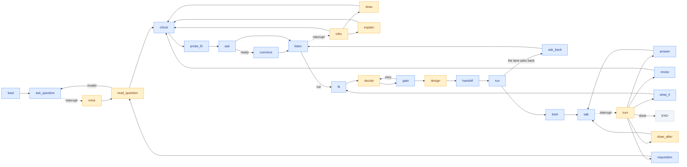

# The desk

One LangGraph, and the only graph: the question first, one question per turn until the matrix says ready, the run, then the
chat after. The desk is an operator. It receives, classifies, dispatches to a tool, gates what comes back, writes it, and asks
the next thing. No node reasons on its own; the amber nodes below are the ones that call a model, each through a gate.

The node list is `build()` in [desk/graph.py:63](../causal_agent/desk/graph.py). Static edges are a dozen; the rest of the
routing is a `Command(goto=...)` returned by the node, so the route is always a decision code made from a typed result.

## The three interrupts

| interrupt | when | the payload | the resume |
|---|---|---|---|
| `ask_question` | the first turn, and again after a question the file cannot answer | the prompt for a causal question | the question text |
| `listen` | every interview turn | the next ask, the status strip, what is open, a drawn picture if one was asked | the person's message, or `run` |
| `talk` | every turn after a run | the brief or the reply, a figure or a picture to show beside it | the person's message, or `done` |

The server resumes with `Command(resume=text)` and keeps the graph on a sqlite checkpointer, so a conversation survives a
restart. The page store keeps the transcript; the memory keeps what is known. The checkpoint holds only where the conversation is.

## The stages, in order

**The question first.** `read_question` is one judgement, a `QuestionFrame`, and `validate` is code: an effect of a change on an
outcome, the outcome a column that varies, the cause a column the file can tell apart. A question that fails is refused with the
test it failed ([desk/nodes/question.py:91](../causal_agent/desk/nodes/question.py)).

**Then the interview.** `check` runs the data checks and the consistency rules. `probe_fit` runs the probes and the matrix and
writes a `fit` step when a cell moves. `ask` composes the next thing by code ([desk/nodes/interview.py:288](../causal_agent/desk/nodes/interview.py)):

1. The map, once per question: which families the file could answer it with, what each still needs, which are struck and why.
2. The story, once: what the change was, who could get it and how that was decided, what each column records and when it was
   set, what one row is. The Reader drafts every claim it can from the answer. A mined note skips the story.
3. The readback ([desk/readback.py](../causal_agent/desk/readback.py)): the drafts grouped by the five claims every decision
   rests on, each line with the sentence it rests on. A yes confirms every draft shown.
4. The gaps, asked by decision: the first open field, the first family decision that rests on it, and every open field under that
   decision in one turn, prefixed "To settle <what the decision asks>, I need:". A belief is asked as what the design would bet on.

`listen` takes the answer. `infer` is the Reader over it. `draw` and `explain` serve a picture or an answer before the next
ask. "run" while drafts are open takes them on the person's word.

**The routing, by code.** `fit` computes the matrix; `decide` is code when exactly one family survives and a judgement only when
several do; `gate` checks the decision; `design` is the Designer writing the brief; `handoff` writes `designs/<n>/` with the
memory snapshot, the pack, the brief and the matrix.

**The run.** `run` starts the lane in its own process on `handoff.json` ([desk/pipeline.py](../causal_agent/desk/pipeline.py)),
absorbs the run's graph back into the memory as drafts, and writes the record. A lane that needs one more thing returns an ask;
`ask_back` puts it to the person like any other question and the run repeats on the memory as it then stands.

**The chat after.** `brief` renders the opening message from the material ([desk/material.py](../causal_agent/desk/material.py)):
the answer, the caveats, the checks that did not pass clean, the refutations, where the lane disagreed with the pack, the figures.
`turn` is the Explainer routing each message: answer, revise (back through the gate and the checks), what_if (on a copy of the
memory, a new design), requestion, draw, done.

## The journal

Every step writes itself into `analyses/<id>/journal.jsonl` through `record` ([desk/nodes/shared.py](../causal_agent/desk/nodes/shared.py)):
the kind (question, claim, fit, explain, design, run, brief, answer, what_if, revise, requestion, explore), who did it (code, model,
person), the memory version at that moment, what it read, what it left. A step's address is `step:<n>` and the Explainer may cite one.

## The same nodes without the interview

`route(question, dataset)` in [desk/route.py:36](../causal_agent/desk/route.py) calls the same node functions in order on a plain
dict: load, mine, prefilter, frame, fit, decide and gate up to three times, design, handoff. The evals and the command line use it.
There is no second graph and no second implementation of the routing.

Decided in [ADR 0006](adr/0006-the-desk-operates-tools-reason-the-memory-escalates.md). The judgements and their gates are
tabulated in [gates.md](gates.md).
