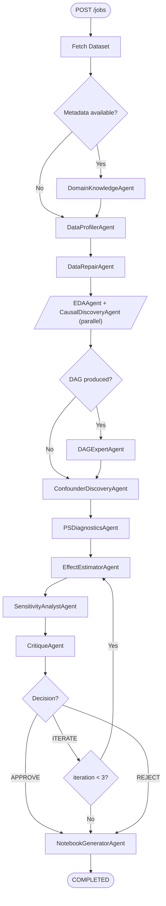
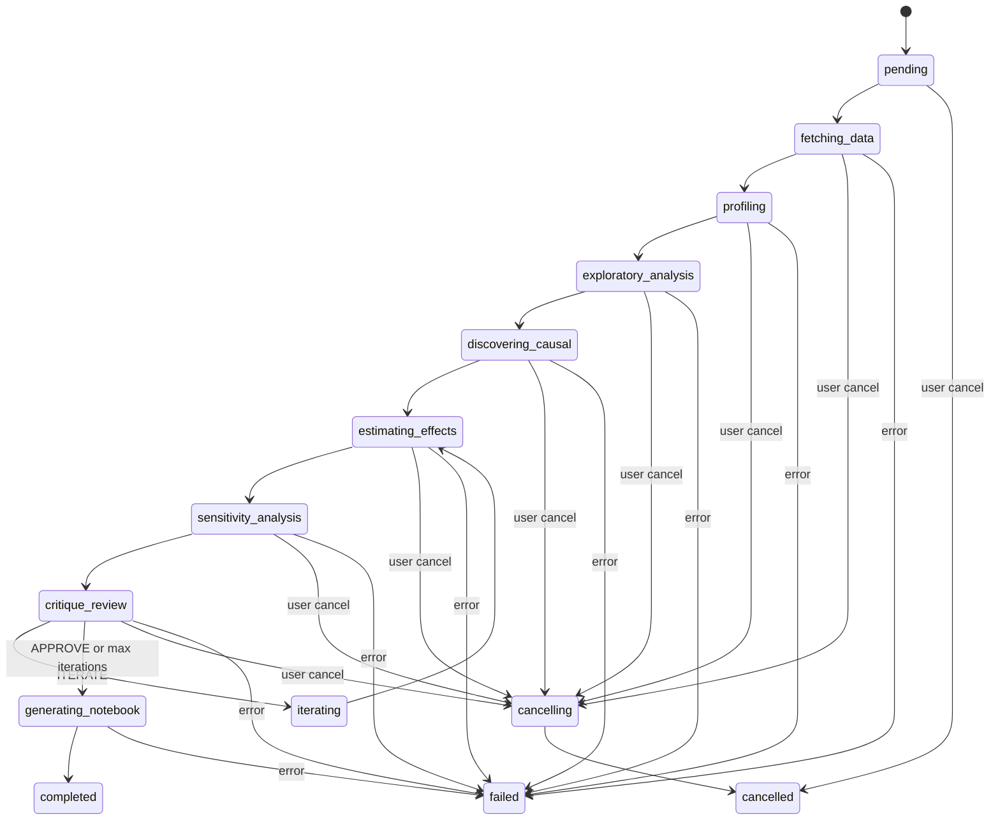

# Pipeline Flow

This document walks through the analysis pipeline step by step: which agents run, what state they consume, what they produce, and how iteration and error handling work.

For the full list of agents and their tools, see [agents.md](agents.md). For state field definitions, see [state-schema.md](state-schema.md).

---

## Pipeline Overview

Note: The orchestrator uses LLM reasoning to decide dispatch order. The diagram above reflects the default pipeline sequence described in its system prompt. The orchestrator can deviate from this order based on data characteristics.

---

## Step-by-Step Walkthrough

### 1. Job Creation and Data Fetching

**Trigger**: `POST /jobs` with dataset URL

**What happens**:
- `JobManager` creates an `AnalysisState` with status `PENDING`
- Saves initial state to storage
- Spawns background `asyncio.Task`
- Sets status to `FETCHING_DATA`
- Orchestrator begins execution

**State changes**: `job_id`, `dataset_info`, `status`, `treatment_variable` (optional), `outcome_variable` (optional)

### 2. Domain Knowledge Extraction (conditional)

**Agent**: `domain_knowledge` (DomainKnowledgeAgent)
**Condition**: Runs only if `dataset_info` has Kaggle metadata
**Status**: `PROFILING`

| Reads | Writes |
|-------|--------|
| `dataset_info` | `domain_knowledge` |

Extracts causal hints from dataset metadata: treatment/outcome hypotheses, temporal ordering, variable immutability, domain context. Downstream agents query this via `ContextTools.ask_domain_knowledge`.

### 3. Data Profiling

**Agent**: `data_profiler` (DataProfilerAgent)
**Status**: `PROFILING`

| Reads | Writes |
|-------|--------|
| `dataset_info` | `data_profile`, `dataframe_path` |

Downloads the dataset, saves as parquet, and produces a statistical profile: feature types, missing values, distributions, candidate treatment/outcome/confounder/instrument variables. This step is never skipped.

### 4. Data Repair (conditional)

**Agent**: `data_repair` (DataRepairAgent)
**Status**: `PROFILING`

| Reads | Writes |
|-------|--------|
| `data_profile`, `dataframe_path` | `data_repairs` |

Fixes data quality issues identified during profiling: missing value imputation, type corrections, outlier handling. Records all repairs for reproducibility.

### 5. EDA + Causal Discovery (parallel)

**Agents**: `eda_agent` and `causal_discovery`, dispatched concurrently
**Status**: `EXPLORATORY_ANALYSIS` / `DISCOVERING_CAUSAL`

| Agent | Reads | Writes |
|-------|-------|--------|
| EDAAgent | `data_profile`, `dataframe_path` | `eda_result` |
| CausalDiscoveryAgent | `data_profile`, `dataframe_path` | `proposed_dag` |

These agents run in parallel via `dispatch_parallel_agents`. The orchestrator creates shallow copies of state, runs both agents with `asyncio.gather`, then merges results by copying each agent's `WRITES_STATE_FIELDS` back to the main state.

**EDAAgent** computes correlations, distributions, outliers, VIF scores, covariate balance, and data quality scores.

**CausalDiscoveryAgent** runs graph structure learning algorithms (PC, FCI, GES, NOTEARS, LiNGAM) to produce a `CausalDAG`.

### 6. DAG Expert Review (conditional)

**Agent**: `dag_expert` (DAGExpertAgent)
**Condition**: Runs only if `proposed_dag` exists
**Status**: `DISCOVERING_CAUSAL`

| Reads | Writes |
|-------|--------|
| `data_profile`, `proposed_dag` | `proposed_dag` |

LLM-based review and refinement of the discovered causal graph. Can add domain-informed edges, remove implausible ones, and generate an interpretation.

### 7. Confounder Discovery

**Agent**: `confounder_discovery` (ConfounderDiscoveryAgent)
**Status**: `DISCOVERING_CAUSAL`

| Reads | Writes |
|-------|--------|
| `data_profile`, `dataframe_path` | `confounder_discovery` |

Identifies potential confounders through statistical tests and domain reasoning. Uses the DAG structure (if available) and profiler's candidate lists.

### 8. Propensity Score Diagnostics

**Agent**: `ps_diagnostics` (PSDiagnosticsAgent)
**Status**: `ESTIMATING_EFFECTS`

| Reads | Writes |
|-------|--------|
| `data_profile`, `dataframe_path` | `ps_diagnostics` |

Estimates propensity scores and checks covariate balance before/after weighting. Diagnostics include overlap plots, SMD tables, and effective sample size.

### 9. Treatment Effect Estimation

**Agent**: `effect_estimator` or `effect_estimator_react` (depending on orchestrator mode)
**Status**: `ESTIMATING_EFFECTS`

| Reads | Writes |
|-------|--------|
| `data_profile`, `dataframe_path` | `treatment_effects` |

Selects and runs applicable estimation methods based on data characteristics (sample size, treatment type, instrument availability, time dimension). Produces `TreatmentEffectResult` entries with estimates, standard errors, confidence intervals, p-values, and assumption checks.

### 10. Sensitivity Analysis

**Agent**: `sensitivity_analyst` (SensitivityAnalystAgent)
**Status**: `SENSITIVITY_ANALYSIS`

| Reads | Writes |
|-------|--------|
| `treatment_effects`, `dataframe_path` | `sensitivity_results` |

Runs robustness checks: E-value computation, Rosenbaum bounds, placebo tests, specification curves, subgroup analysis. Each check produces a `SensitivityResult` with a robustness value and interpretation.

### 11. Critique Review

**Agent**: `critique` (CritiqueAgent)
**Status**: `CRITIQUE_REVIEW`

| Reads | Writes |
|-------|--------|
| `treatment_effects` | `critique_history` |

Evaluates the analysis across multiple quality dimensions (methodology, statistical rigor, assumption checking, robustness, reproducibility). Produces a `CritiqueFeedback` with scores (1-5 per dimension), identified issues, suggested improvements, and a decision: `APPROVE`, `ITERATE`, or `REJECT`.

### 12. Iteration (conditional)

If the critique decision is `ITERATE` and `iteration_count < max_iterations` (default 3):
- `iteration_count` increments
- Status changes to `ITERATING`
- The orchestrator re-dispatches relevant agents (typically effect estimation and sensitivity) to address critique feedback
- The critique agent runs again after re-estimation

If max iterations are reached, the pipeline proceeds to notebook generation regardless of critique outcome.

### 13. Notebook Generation

**Agent**: `notebook_generator` (NotebookGeneratorAgent)
**Status**: `GENERATING_NOTEBOOK`

| Reads | Writes |
|-------|--------|
| `data_profile` (and most other state fields) | `notebook_path` |

Generates a Jupyter notebook with 14 sections, each corresponding to a pipeline agent's output. Includes executable verification cells (OLS regression, E-value computation, placebo test). Uses LLM to generate narrative for the introduction and conclusions sections.

### 14. Completion

`state.mark_completed()` sets `status = COMPLETED` and records `completed_at`. The notebook file is available for download via `GET /jobs/{job_id}/notebook`.

---

## Parallel Execution

The orchestrator supports running agents concurrently via `dispatch_parallel_agents`. The merge strategy:

1. Create `copy.copy(state)` for each agent
2. Run all agents via `asyncio.gather()`
3. For each completed agent, copy its declared `WRITES_STATE_FIELDS` values from the agent's state copy back to the main state

Currently, only EDA + Causal Discovery are dispatched in parallel by default. Other agents have sequential dependencies.

**Known issue**: `copy.copy()` creates shallow copies. Nested mutable objects (lists, dicts) are shared between copies. If two parallel agents both append to the same list field, results can be corrupted or lost.

---

## Job Status Transitions

---

## Progress Tracking

Progress percentages are derived from the current `JobStatus` value via a hardcoded map in `JobManager._calculate_progress()`:

| Status | Progress |
|--------|----------|
| `pending` | 0% |
| `fetching_data` | 8% |
| `profiling` | 20% |
| `exploratory_analysis` | 32% |
| `discovering_causal` | 44% |
| `estimating_effects` | 56% |
| `sensitivity_analysis` | 68% |
| `critique_review` | 78% |
| `iterating` | 84% |
| `generating_notebook` | 92% |
| `completed` | 100% |

Each agent also declares a `PROGRESS_WEIGHT` (0-100) but this value is not currently used for progress calculation. The `_calculate_progress()` method ignores it.

---

## Error and Cancellation Paths

### Agent failure

1. `ReActAgent.execute()` catches `TimeoutError` from its `asyncio.wait_for()` guard. On timeout, it adds a trace and returns state unchanged (does not mark as failed).
2. `BaseAgent.execute_with_tracing()` catches exceptions, adds an error trace, and calls `state.mark_failed(error, agent_name)`.
3. The orchestrator detects `status == FAILED` in its decision loop and returns immediately.
4. `JobManager._run_job()` catches any remaining exceptions and calls `state.mark_failed()`.

### Job timeout

`JobManager` enforces a total job timeout of `agent_timeout_seconds * 10` (default: 3000 seconds / 50 minutes). On timeout, the job is marked as failed with a timeout message.

### User cancellation

1. Client sends `POST /jobs/{job_id}/cancel`
2. `JobManager` marks status as `CANCELLING` in storage
3. Calls `task.cancel()` on the `asyncio.Task`
4. Waits up to 5 seconds for graceful shutdown
5. The task catches `asyncio.CancelledError`, marks state as `CANCELLED`, and saves partial traces

### Known pipeline issues

1. **Orchestrator does not validate REQUIRED_STATE_FIELDS before dispatch**: The orchestrator's LLM reasoning decides dispatch order. If it dispatches an agent before its required upstream agent has run, `_validate_required_state` raises `StateValidationError` at execution time, which surfaces as a pipeline failure.

2. **Treatment/outcome variable resolution inconsistency**: Some agents read `state.treatment_variable` directly. Others use `state.get_primary_pair()`. Others extract variables from `state.data_profile.treatment_candidates`. If these disagree, different agents may analyze different variable pairs.

3. **Critique auto-finalization**: The critique agent can enter a loop between `get_analysis_summary` and `check_covariate_balance` tools without converging. It auto-finalizes (calls `finish`) when it hits `MAX_STEPS`.

4. **Double finalization possible**: The orchestrator can call `finalize_analysis` even after the notebook has been generated if the LLM decision loop doesn't terminate cleanly. The second finalization overwrites `state.recommendations`.

5. **Status persistence silently fails**: The `_persist_status` callback wraps `update_job()` in a bare `try/except: pass`. If storage writes fail mid-pipeline, the job runs to completion but the database shows a stale status.
