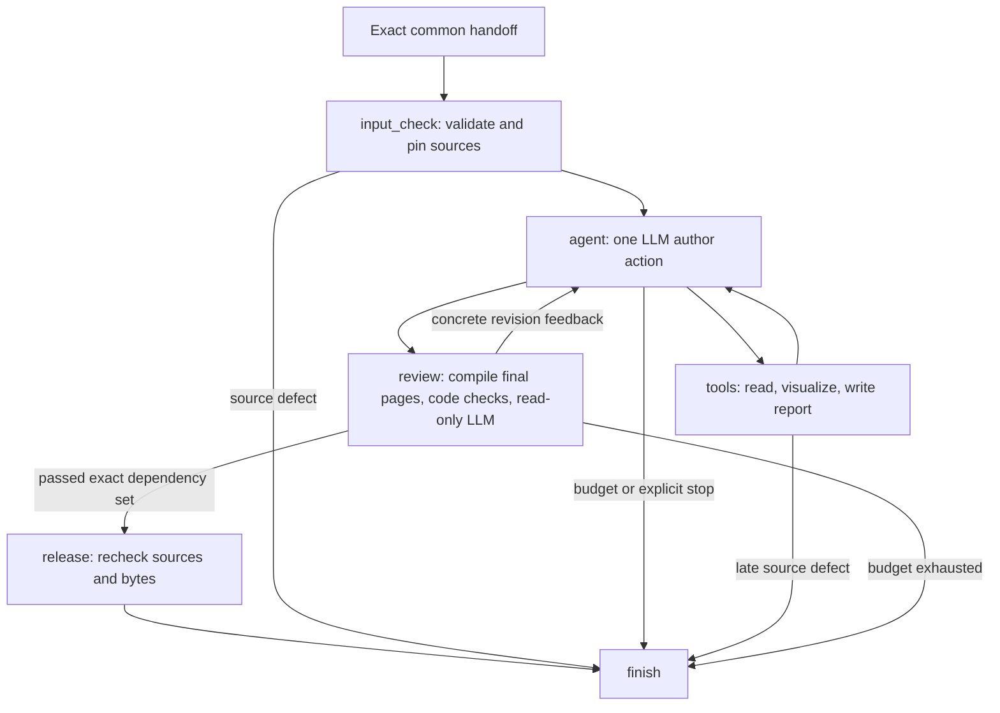

# Post-analysis LangGraph

The implementation is [graph.py](../../src/causal/post_analysis/graph.py).

| Node | Decision owner | Writes |
| --- | --- | --- |
| input_check | Code | Source-bound PostAnalysisContext or owner-aware issues |
| agent | LLM | One Action and concise decision_summary |
| tools | Code validates the LLM request | One visual/report revision or observation |
| review | Code + independent read-only LLM | Exact export, preview hashes, binding and review |
| release | Code | Bundle only for the exact passed review |
| finish | Graph/entry | Terminal run result and operational lifecycle |

Tools are `read_evidence`, `render_visual`, `render_dag`, `write_report`, `submit`,
`stop`. The compiled graph routes submit to review. No tool runs another agent,
fits a model, executes arbitrary code, edits roles or repairs upstream science.
The author decides the story and visual encodings. Deterministic rendering supports
point/line/bar/table and layout of the supplied causal DAG. New diagnostic names do
not require a plot template registration; adequate typed source fields do.

State stores artifact references, the latest action/observation and bounded controls.
It does not store a raw frame. The reader derives immutable evidence views from
exact references. Every visual includes its source selector; combined comparison
tables retain a source reference and selector per row.

The report has title, sections, cited statements, selected visual IDs and explicit
coverage for every expected result. All required evidence must be cited. Citation
existence is checked by code; whether prose is scientifically entailed is reviewed
by the LLM. Source tables/visuals preserve supplied numbers deterministically.

Review compiles SVG pages, PNG previews and self-contained HTML. It sees the actual
page images plus the report, source evidence and visual bindings. Missing image
support is a failure, never a text-only pass. Any draft/visual/export change invalidates
review. Release checks the context, draft, visual references and export against the
review binding, verifies file hashes, and reopens the exact upstream sources.

## Budgets and recovery

Default limits: 24 physical model calls, including up to three reviews, 12 visual
artifacts and 24 report pages. One physical attempt is allowed per graph model step;
malformed actions or invalid authoring receive feedback within the same total limit.
A database counter is reserved before each provider request. Crashes cannot refund
calls. LangGraph checkpoints persist completed steps; an interrupted running attempt
resumes its pending node. A completed checkpoint closes without reauthoring.

Explicit recovery of an incomplete attempt creates a new operational revision with
the original outcome reference and already-spent counters. It cannot change science
or grant a fresh budget. Historical failed presentation records require explicit
handoff migration. No hidden fallback to the removed coordinator exists.

## Observability

LangSmith receives complete application prompts, output schemas, model responses,
provider-exposed reasoning summaries, decision summaries, image inputs, node/tool
requests and results. Nested spans link graph, author/reviewer and model transport.
Only credentials are redacted; study data is not blanket-redacted or truncated.
Models' unavailable internal chain-of-thought is not an API logging surface.

Live execution requires tracing preflight. Artifact commits and final completion
require acknowledged flushes. A trace delivery failure prevents public bundle
release. Traditional operational events and Python logs record stage transitions,
retries, validation rejection and exceptions with run identities.
