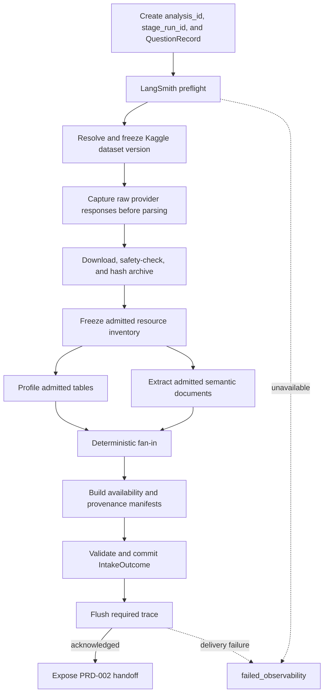
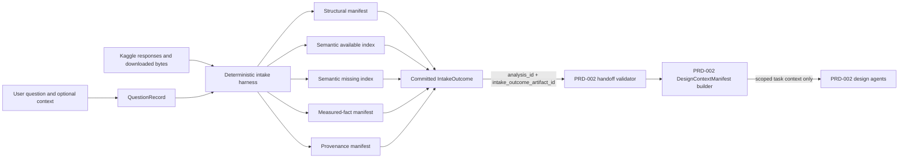
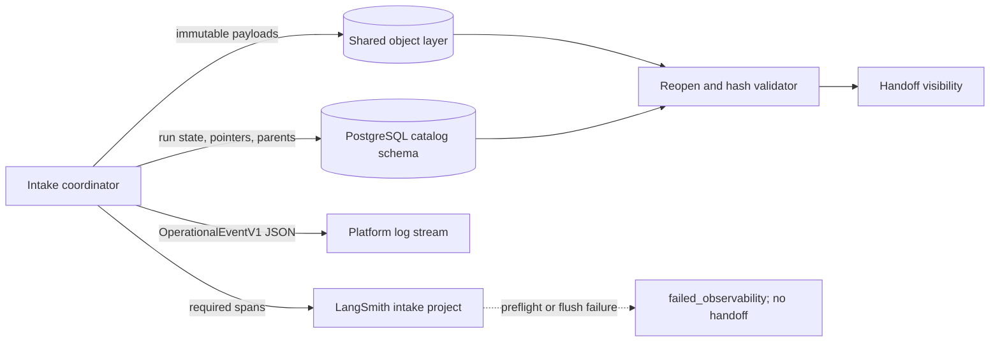

# PRD-001 — Kaggle intake, semantic availability, and storage

Status: final for implementation  
Product stage: source acquisition and intake  
Depends on: `SYSTEM-CONTRACT.md`  
Unlocks: an implementation-neutral downstream analysis handoff

Shared identities, artifact envelopes, handoffs, persistence, retries, required LangSmith
behavior, and operational events are governed by `SYSTEM-CONTRACT.md`. This PRD defines only
intake-specific behavior.

## 1. Outcome

Given a user's question, optional context, and a Kaggle dataset reference, intake produces a
durable, replayable account of:

- exactly which dataset version and files were received;
- everything Kaggle offered that may help explain the dataset or its columns;
- deterministic facts measured from the admitted tables;
- which semantic facts are available, weak, empty, unavailable, unreadable, or deliberately
  withheld; and
- one stable `analysis_id` and immutable artifact identifiers that downstream stages can retrieve
  without calling Kaggle again.

Intake is successful even when optional semantic information is empty. Absence is recorded as
data. Downstream agents receive an availability manifest and are not given a Kaggle-fetch tool,
so a known-missing field cannot trigger repeated fetch attempts.

## 2. Product decisions

1. Intake is deterministic. It makes no model call and assigns no causal role.
2. Large or immutable payloads live in content-addressed object storage.
3. PostgreSQL stores identities, pointers, lineage, parse outcomes, field classifications, and
   semantic availability flags.
4. Raw provider responses are stored before parsing so they can be reinterpreted later.
5. Every semantic slot is explicit. Missing never means omitted.
6. Kaggle notebooks and discussions are recorded as withheld sources before estimation because
   they may contain results that could steer the design.
7. No downstream consumer starts until intake produces a valid `IntakeOutcome`.
8. Raw capture, semantic evidence, measured facts, provenance, and operational metadata are
   separate retrieval channels. A model never receives the undifferentiated Kaggle response.
9. Visualization is not an intake responsibility. PRD-002 declares required visual evidence;
   PRD-005 creates the concrete `FigurePlan` and renders only frozen results after judgment.
10. Intake runs outside LangGraph but emits `OperationalEventV1` JSON and required LangSmith
    spans at every registered operation boundary.
11. A LangSmith preflight or flush failure returns `failed_observability`, preserves already
    committed intake artifacts, and prevents the PRD-002 handoff.
12. The shared `argparse` CLI accepts one typed `IntakeSubmissionV1`; CLI parsing never receives
    Kaggle credentials or calls the intake coordinator, Kaggle client, storage, or LangSmith
    directly.

## 3. User inputs

| Input | Required | Storage | Notes |
|---|---:|---|---|
| Question | yes | immutable `QuestionRecord` artifact | stored verbatim |
| Kaggle reference | yes | `Run` and `Dataset` records | owner/slug or supported URL |
| Kaggle credentials | yes for private data | never stored as an artifact | read only from the runtime secret source |
| User context | no | immutable `QuestionRecord` artifact | may contain study or column semantics |

Credentials must never enter object storage, PostgreSQL payload columns, downstream workflow
state, logs, or traces.

### 3.1 Intake submission boundary

`causal new` accepts only `IntakeSubmissionV1` containing question text, optional file-backed
context text, the Kaggle reference, command-schema version, and idempotency key. Credentials are
read only from the runtime secret source and are forbidden as command arguments. The typed
command validates and commits the submission, creates `analysis_id` and `stage_run_id`, and then
invokes the deterministic intake coordinator synchronously to the next committed terminal
boundary. Repeating the same key returns the existing analysis; a conflicting duplicate raises a
blocker.

## 4. Intake flow

```text
record question
      │
      ▼
parse reference ──▶ resolve current version ──▶ capture dataset metadata
                                                  │
                                                  ▼
                                     capture file and column metadata
                                                  │
                                                  ▼
                                     download versioned archive
                                                  │
                                                  ▼
                                 safety-check, extract, and hash files
                                      │                       │
                                      ▼                       ▼
                               profile tables          read semantic documents
                                      └──────────┬────────────┘
                                                 ▼
                                  build semantic availability map
                                                 │
                                                 ▼
                              usable / partial / refused IntakeOutcome
```

Profiling tables and reading admitted semantic documents are independent. Both consume only
captured, hashed bytes.



Resource profiling uses at most eight concurrent operations. Every discovered resource reaches a
terminal outcome before fan-in; there is no unbounded resource loop.

## 5. Kaggle information to capture

This inventory is based on the pinned `kaggle==2.2.4` client. Each API response is stored
verbatim even when individual fields are empty.

### 5.1 Dataset identity and version

| Field | Importance | Downstream use |
|---|---|---|
| dataset id and reference | required | stable identity |
| owner and slug | required | readable identity and retrieval |
| current version number | required | reproducibility and cache key |
| dataset status | required | refuse unavailable/incomplete sources |
| version creation date | useful | provenance |
| version creator | useful | provenance |
| version notes | semantic | changes in definitions or files |
| last updated | useful | provenance and freshness |

The resolved version is part of the dataset identity. Two versions are different datasets for
reproducibility purposes even when their owner and slug are unchanged.

### 5.2 Dataset-level metadata

| Field | Context class | Retrieval rule |
|---|---|---|
| title | semantic | available with evidence ID |
| subtitle | semantic | available with evidence ID |
| description | semantic | available with evidence ID; may explain assignment or population |
| user-specified sources | semantic and provenance | exposed separately in both roles |
| keywords/tags | semantic | available only as a labelled weak hint |
| licence | provenance | provenance/reporting surface only |
| expected update frequency | provenance | retrieved only when freshness matters |
| private/public status | operational | never sent to models |
| owner/creator names and references | provenance | retrieved only for citation/reporting |
| collaborators | provenance | captured, withheld from model context by default |
| URLs and thumbnail URL | operational | never semantic evidence |
| total bytes | operational | never sent to models |
| views, votes, downloads, usability rating | popularity | never used as semantic evidence |
| kernel count and topic count | popularity/withheld indicator | never used as semantic evidence |

Popularity does not make a column interpretation correct. These values may be captured as part
of the raw response but are excluded from semantic context.

### 5.3 File-level metadata

For every file returned by Kaggle, capture:

- file reference and dataset reference;
- name and logical path;
- description;
- file type;
- byte size;
- creation date;
- provider URL;
- version association; and
- all provider-returned column metadata.

File descriptions are semantic evidence. File sizes, URLs, and creation dates are operational or
provenance facts, not evidence about causal roles.

### 5.4 Column-level metadata

For every column returned in Kaggle file metadata, capture:

| Field | Context class | Meaning |
|---|---|---|
| name | structural | physical column identity |
| description | semantic | uploader's explanation and highest-value column evidence |
| reported type | structural | provider-normalized type |
| original type | structural | type before provider normalization |
| order | structural | position in the provider schema |

Descriptions may be empty. An empty description is stored as `empty`, not discarded and not
treated as a fetch failure.

### 5.5 Downloaded content

The entire versioned archive is captured. After safety admission, files are classified as:

| Class | Initial handling |
|---|---|
| CSV and TSV tables | profile and make available for analysis |
| Parquet tables | profile and make available for analysis |
| TXT and Markdown documents | extract cited semantic evidence |
| JSON metadata or codebooks | extract cited semantic evidence when readable |
| YAML metadata or codebooks | capture; parsing is deferred unless justified |
| XLS/XLSX | capture and mark `unreadable` in v0 |
| PDF | capture and mark `unreadable` in v0 |
| images and scanned documents | capture and mark `unreadable` in v0 |
| notebooks and scripts | capture as files but `withheld` from pre-estimation semantic context |
| executable, pickle, macro workbook, archive-within-archive, or unsafe path | refuse or quarantine under the safety policy |

Supporting a new format means adding one parser and its safety and failure tests. It must not
silently broaden the intake surface.

### 5.6 Sources deliberately not admitted into semantic context

| Source | Availability record | Reason |
|---|---|---|
| Kaggle kernels/notebooks | `withheld` | may contain estimates, significance, or preferred specifications |
| Dataset discussions/topics | `withheld` | mix definitions with findings and cannot be safely separated before reading |
| Popularity and usability metrics | `not_applicable` for semantics | authority is not meaning |

These sources may be revisited only through a separately approved post-design or
post-estimation product requirement.

### 5.7 Semantic and non-semantic separation

The raw provider response is retained intact for replay, but its fields are classified through a
static registry before any downstream context is built. Classification is deterministic and
versioned; no model decides whether a field is semantic.

| Context class | Examples | Downstream rule |
|---|---|---|
| `semantic` | title, subtitle, descriptions, user-specified sources, version notes, file and column descriptions, admitted README/codebook text | may support a meaning claim when cited |
| `structural` | table, file, and column names; provider and original types; column order | visible as identifiers and schema facts, but not sufficient evidence of meaning |
| `measured` | row counts, nulls, levels, cardinality, ranges, duplicates, candidate keys | exposed only through deterministic fact tools; never presented as provider semantics |
| `provenance` | owner, creator, version, dates, licence | available to provenance/reporting tools, not automatically placed in semantic prompts |
| `operational` | provider IDs, URLs, status, byte sizes, object hashes, parse outcomes | never placed in model context |
| `popularity` | views, votes, downloads, usability rating, topic/kernel counts | stored in raw capture; never treated as semantic or quality evidence |
| `withheld` | notebook and discussion contents | unavailable before estimation |

The downstream context builder returns four visibly separate sections:

```text
identifiers          structural names needed to talk about the data
semantic_available  semantic fields with values and evidence IDs
semantic_missing    semantic fields with their absence status
measured_facts       deterministic observations available through bounded tools
```

Provenance is retrieved separately when a citation or final report needs it. Operational,
popularity, and withheld fields are excluded from the default semantic retrieval surface.

## 6. What intake measures from table bytes

The profiler records observations, not interpretations:

- row and column counts;
- physical and inferred data types;
- null counts and rates;
- finite/non-finite counts for numeric values;
- cardinality;
- categorical levels and counts under a bounded level cap;
- numeric minimum, maximum, mean, standard deviation, and selected quantiles;
- date/time minimum and maximum when parsing is unambiguous;
- duplicate-row counts;
- column sets that are empirically unique under bounded search;
- constant and all-null columns;
- parse errors and excluded rows/files; and
- the hash of the exact input bytes and profiler version.

The profiler may emit labelled hypotheses such as “999 may be a missing-value sentinel” or
“this high-cardinality column may be an identifier.” It must not state that a column is the
treatment, outcome, unit, time variable, confounder, mediator, or instrument.

## 7. Semantic slots

### 7.1 Dataset and table slots

| Slot | Question answered |
|---|---|
| analysis table | which file or table should be analysed? |
| assignment mechanism | how was treatment or exposure assigned? |
| population | who or what is represented? |
| unit of observation | what does one row represent? |
| sampling or inclusion rule | how did a row enter the data? |
| time span | what period does the dataset cover? |
| table relationships | how do multiple tables join, if known? |

### 7.2 Column slots

Every admitted column receives the same slot set:

| Slot | Question answered |
|---|---|
| meaning | what concept is measured? |
| kind | measure, category, identifier, date/time, or unknown? |
| units | dollars, years, percentage points, index units, etc.? |
| levels | what do encoded categories mean? |
| missing sentinel | does a value such as 999 mean missing? |
| timing | before, during, or after the exposure/intervention? |
| measurement window | which dates or period produced the value? |
| provenance | which source or process produced it? |

Intake fills only what the provider or admitted documents state. Byte-derived guesses remain
hypotheses.

## 8. The availability flag

Each slot stores one `status`. This is the single source of truth.

| Status | Has retrievable content? | Meaning |
|---|---:|---|
| `evidenced` | yes | a provider field or admitted document states it |
| `hinted` | yes | evidence partly answers the slot |
| `hypothesis` | yes | deterministic profiling suggests it, but no source confirms it |
| `empty` | no | the provider returned the field with no meaningful content |
| `not_offered` | no | the provider/source has no such field |
| `fetch_failed` | no | retrieval was attempted and failed |
| `unreadable` | no | content exists but the current product cannot parse it |
| `withheld` | no | content was deliberately excluded |
| `not_applicable` | no | the slot does not apply to this object |

The retrieval layer derives a simple `available: true/false` value from this status. It does not
store a second boolean that could disagree with the status.

Available statuses are `evidenced`, `hinted`, and `hypothesis`. All others are unavailable.
Hypotheses are always visibly labelled and can never be presented as provider evidence.

Every slot is emitted. Absence of a slot is a schema error.

## 9. Storage design

### 9.1 Why two storage layers

| Layer | Stores | Optimized for |
|---|---|---|
| S3-compatible object storage | immutable response bodies, archives, files, profiles, semantic maps, and later derived tables/figures | large payloads, hashing, deduplication, replay |
| PostgreSQL table storage | identities, object pointers, status flags, classifications, lineage, and lookup indexes | transactions, concurrency, durable production queries, and downstream retrieval |

Object storage is the payload layer. PostgreSQL is the catalogue. Neither duplicates the other's
job.

### 9.2 Object storage

All environments use the same S3-compatible object API. Production uses a managed S3-compatible
bucket. Local and integration environments use a separately configured test endpoint or bucket;
the application does not implement a second filesystem storage path.

```text
<bucket>/sha256/<first-two-characters>/<64-character-sha256>
```

The object key is derived only from the payload hash. Writing the same bytes twice is a no-op.
Objects are immutable. Human-readable names, media types, provider paths, and relationships live
in PostgreSQL. Bucket versioning and server-side encryption are required production settings.

Object kinds include:

- `question_record`;
- `kaggle_status_capture`;
- `kaggle_dataset_capture`;
- `kaggle_metadata_capture`;
- `kaggle_files_capture`;
- `source_archive`;
- `source_file`;
- `table_profile`;
- `evidence_bundle`;
- `semantic_map`;
- `intake_outcome`; and, downstream,
- prepared snapshots, estimator outputs, diagnostics, figures, and final reports.

The database stores bucket and object key, never a short-lived signed URL. Signed URLs are created
only at the application boundary when an authorized user needs a download.

### 9.3 PostgreSQL schema and tables

Intake owns one production PostgreSQL schema:

| Schema | Owns | Rule |
|---|---|---|
| `catalog` | runs, datasets, artifacts, resources, source-field index and retrieval views | product source of truth |

The intake service writes `catalog`. Downstream consumers cannot rewrite catalog artifacts and
receive read-only access to approved catalogue views, not raw capture objects. Storage for any
future workflow engine is outside this PRD.

The initial table store is intentionally small.

#### `runs`

| Field | Purpose |
|---|---|
| `analysis_id` | stable identity inherited by PRD-002 through PRD-005 |
| `stage_run_id` | this intake execution or material intake revision |
| `question_artifact_id` | pointer to immutable question and user context |
| `dataset_id` | resolved dataset version |
| `intake_outcome_artifact_id` | null until intake finishes |
| `operational_status` | common state from `SYSTEM-CONTRACT.md` |
| `intake_status` | null until terminal, then `usable`, `partial`, `refused`, `failed_observability`, or `failed` |
| `created_at` | provenance |

#### `datasets`

| Field | Purpose |
|---|---|
| `dataset_id` | deterministic provider/owner/slug/version identity |
| `provider` | `kaggle` |
| `owner`, `slug`, `version` | readable pinned reference |
| `status` | provider status |
| `capture_artifact_id` | pointer to raw API capture bundle |
| `source_manifest_artifact_id` | pointer to admitted file manifest |

#### `artifacts`

| Field | Purpose |
|---|---|
| `artifact_id` | stable typed identity |
| `kind` | artifact vocabulary above |
| `analysis_id` / `stage_run_id` / `dataset_id` | scope |
| `sha256` | integrity and approval binding |
| `object_key` | content-addressed payload pointer |
| `parent_ids` | lineage |
| `created_at` | provenance |

Artifacts are append-only. A revision receives a new artifact ID and points to its parent.

#### `resources`

| Field | Purpose |
|---|---|
| `resource_id` | stable identity for an API response or downloaded file |
| `dataset_id` | dataset version |
| `kind` | API capture, archive, table, document, or other file |
| `logical_name` | provider path or response name |
| `artifact_id` | payload pointer |
| `media_type` and `byte_size` | operational facts |
| `parse_status` | parsed, excluded, unreadable, unsafe, or failed |
| `reason` | required when not parsed |

Every discovered file gets a resource row. No file silently disappears.

#### `source_field_index`

| Field | Purpose |
|---|---|
| `capture_artifact_id` | immutable raw source payload |
| `semantic_map_artifact_id` | nullable interpreted semantic payload |
| `dataset_id` | dataset version |
| `scope_kind` | dataset, table, or column |
| `table_name` / `column_name` | nullable scope identifiers |
| `field_or_slot_name` | provider field or semantic question |
| `context_class` | semantic, structural, measured, provenance, operational, popularity, or withheld |
| `status` | availability flag from section 8 |
| `evidence_count` | quick quality signal, not confidence |
| `json_pointer` | exact location inside the applicable immutable object |

`source_field_index` is a rebuildable read index over immutable captures and semantic-map objects.
The objects are the canonical payloads; the index makes field classification and availability
queries cheap.

The catalogue exposes narrow views rather than its base table:

| View | Contains |
|---|---|
| `semantic_available` | semantic fields with evidenced, hinted, or hypothesis status |
| `semantic_missing` | semantic fields with an unavailable status and no payload value |
| `structural_manifest` | names and declared schema facts |
| `measured_fact_manifest` | pointers to deterministic profile observations |
| `provenance_manifest` | source, licence, version, and date information |

There is deliberately no `all_context` view. Combining every class would recreate the leakage
this separation is intended to prevent.

### 9.4 Write semantics

Every artifact write has exactly three outcomes:

1. New ID and new hash: write the object and append the artifact row.
2. Existing ID and identical hash: return the existing artifact; replay is a no-op.
3. Existing ID and different hash: raise a conflict; nondeterminism must never be silent.

The PostgreSQL transaction writes the artifact pointer, parent edges, indexes, and run-state
change together. The object is then reopened and validated. The workflow advances only after the
corresponding LangSmith span flush is acknowledged, following the shared commit protocol.
Objects may be written before the transaction because unreferenced objects are invisible and are
eligible for collection after seven days.

## 10. Intake artifacts and lineage

```text
QuestionRecord
      │
      ▼
KaggleCapture ──▶ SourceManifest ──▶ TableProfile(s)
      │                                  │
      └──────────────▶ EvidenceBundle ◀──┘
                              │
                              ▼
                         SemanticMap(s)
                              │
                              ▼
                         IntakeOutcome
```

`IntakeOutcome` contains only identifiers and summary counts:

- `analysis_id`, producing `stage_run_id`, and dataset ID;
- handoff-contract and field-classification registry versions;
- question artifact ID;
- source-manifest ID;
- candidate table IDs;
- profile and semantic-map IDs;
- names and schema versions for the structural, semantic-available, semantic-missing,
  measured-fact, and provenance retrieval surfaces;
- counts of available and unavailable dataset and column slots;
- missing semantic slots and their statuses;
- excluded/unreadable resource counts; and
- final status: `usable`, `partial`, or `refused`.

## 11. Storage handoff to downstream analysis

### 11.1 The atomic handoff contract

Intake ends at one precise boundary: an immutable `IntakeOutcome` exists, every artifact it
references is committed, and the `runs` row points at its artifact ID.

The handoff is valid only when all of the following hold:

1. The question, dataset version, source manifest, table profiles, evidence bundles, semantic
   maps, and intake outcome are readable and match their recorded hashes.
2. Every discovered resource has a terminal parse/admission status.
3. Every defined semantic slot has an availability status.
4. Every indexed source field has exactly one context class.
5. The narrow retrieval views can answer availability queries without access to raw captures.
6. The `IntakeOutcome` contract version is supported by the downstream consumer.
7. The final `runs.intake_status` and `runs.intake_outcome_artifact_id` are committed in the same
   PostgreSQL transaction.

The application validates that boundary, then opens the intake handoff with exactly:

- `analysis_id`; and
- `intake_outcome_artifact_id`.

No DataFrame, archive, or raw API response is copied into downstream state. The consumer follows
the artifact pointers and approved retrieval views when it needs information.

The entry decision is mechanical:

| Intake status | Handoff readable? | Behavior |
|---|---:|---|
| `usable` | yes | expose the stored inventory and retrieval surfaces |
| `partial` | yes | expose the same inventory with missing and unreadable flags visible |
| `refused` | no | return the recorded refusal |
| invalid or unsupported handoff | no | return a handoff-integrity failure; never guess or partially load |

```text
IntakeOutcome committed
        │
        ├── refused/invalid ──▶ return recorded result
        │
        └── usable/partial
                 │
                 ▼
          open stored intake inventory
```

There is no hidden “load everything” stage. A downstream consumer reads only the retrieval
surfaces it is explicitly allowed to use.

The first consumer is the PRD-002 design harness. PRD-001 defines only what that consumer may
open; PRD-002 defines how the admitted context is selected and routed to design agents.

### 11.2 The inventory available at handoff

The handoff exposes five separate inventories:

| Inventory | Contains | Does not contain |
|---|---|---|
| structural | dataset, table, file, and column identities plus declared types | meanings or causal roles |
| semantic available | non-empty semantic values, quality status, and evidence IDs | missing fields or measured guesses presented as evidence |
| semantic missing | every unavailable semantic slot and its reason | synthetic values or automatic retries |
| measured facts | deterministic table/profile observations and available fact names | interpretations or repairs |
| provenance | dataset version, source, owner, dates, and licence | popularity as a quality signal |

Operational, popularity, raw-capture, and withheld data remain stored but are not part of the
default analysis handoff.

### 11.3 Downstream retrieval contract

The consumer can:

- read the question and user context artifact;
- list admitted datasets, tables, files, and columns;
- list available semantic slots without retrieving their full payloads;
- list missing semantic slots and their stored statuses;
- retrieve one available semantic value and its evidence by ID;
- list which deterministic profile facts exist for a table or column;
- retrieve one permitted measured fact; and
- read provenance required for citation or reporting.

The consumer cannot:

- contact Kaggle;
- read credentials;
- read an undifferentiated raw API response;
- infer an absent value from an omitted key;
- treat structural names or measured facts as provider semantic evidence;
- read popularity metrics as a quality signal; or
- read withheld notebooks or discussions.

### 11.4 Retrieval shape

For a requested table or column, the storage service returns a neutral inventory:

```json
{
  "identifiers": {
    "table": "nsw.csv",
    "column": "re74"
  },
  "semantic_available": {
    "meaning": {
      "status": "evidenced",
      "value": "real earnings in 1974",
      "evidence_ids": ["ev:kaggle/column/re74/description"]
    }
  },
  "semantic_missing": {
    "units": {"status": "empty"},
    "missing_sentinel": {"status": "not_offered"},
    "timing": {"status": "not_offered"}
  },
  "measured_facts_available": ["null_count", "cardinality", "numeric_range"]
}
```

The example is an API shape, not an instruction to use those specific values. A stored missing
status is returned immediately; retrieval does not attempt a provider call. How a later workflow
responds to missing information is outside this intake PRD.

### 11.5 Context routing into PRD-002

PRD-001 has no model agent. A deterministic intake harness creates and commits the source
artifacts, availability indexes, and `IntakeOutcome`. Context crosses the stage boundary only
after the atomic handoff passes.



Context-routing rules:

| Producer | Receiver | Context sent | Context deliberately not sent | Receiver output |
|---|---|---|---|---|
| User-input boundary | deterministic intake harness | immutable question and optional user context | credentials after authentication, prior agent memory | `QuestionRecord` |
| Kaggle capture layer | deterministic parsers and profiler | one frozen provider-response snapshot and admitted hashed files | downstream prompts, causal-role requests | source manifest, profiles, evidence, semantic maps |
| Intake commit | PRD-002 handoff validator | `analysis_id`, `intake_outcome_artifact_id`, hashes, versions, availability counts | dataframe, archive, raw provider capture, credentials | accepted handoff or typed integrity failure |
| PRD-002 manifest builder | PRD-002 design agents | only the structural, semantic, missing, measured, and provenance references allowlisted by PRD-002 | operational, popularity, withheld, or undifferentiated context | task-scoped design context |

The PRD-002 manifest builder may issue one batched retrieval for a frozen set of selected table,
column, and evidence IDs. It may not call Kaggle, and it may not issue one provider fetch per
column. A stored unavailable status is routed as context so no receiving agent retries it.

## 12. Intake outcomes and refusal policy

### `usable`

- the dataset version was resolved;
- the archive was safely admitted;
- at least one supported table was profiled; and
- all discovered files have an explicit outcome.

Optional semantic fields may be empty.

### `partial`

Technical intake succeeded, but semantic coverage is weak or some non-essential resources are
unreadable. A downstream consumer receives those flags and decides what to do under its own PRD.

### `refused`

- credentials or permissions prevent required retrieval;
- the dataset version cannot be resolved;
- the archive fails safety checks;
- hashes or replay-safe identities conflict;
- no supported table can be profiled; or
- required bytes are corrupt.

Empty descriptions, absent units, or unknown timing do not by themselves refuse intake.

## 13. Execution, persistence, and observability

PRD-001 uses the shared artifact envelope, commit sequence, retention, and operational-event
schema. It has no LangGraph thread or checkpoint. Its small coordinator can restart from the last
committed artifact boundary.



The logging map is fixed:

| Boundary | Required events | Safe intake dimensions |
|---|---|---|
| stage | `stage.started`, `stage.completed`, `stage.failed` | analysis/stage IDs, dataset identity hash, status |
| provider operation | `tool.started`, `tool.completed`, `tool.failed`, `retry.scheduled`, `retry.exhausted` | operation ID, provider status class, latency, attempt |
| resource processing | `task.started`, `task.completed`, `task.failed` | resource ID, media type, byte-size bucket, parse status |
| artifact commit | `artifact.committed`, `artifact.validation_failed` | artifact ID/hash/type, parent IDs, schema version |
| handoff | `handoff.accepted`, `handoff.rejected` | handoff ID, outcome, availability counts, error codes |
| blocker | `blocker.raised` | stable code, blocked operation, implicated IDs |
| observability | `observability.delivery_failed`, `blocker.raised` | safe exception fingerprint only |

Logs and traces never contain credentials, signed URLs, raw provider bodies, archive bytes, table
rows, or unrestricted documents. PRD-001 has no model text to trace.

## 14. Visualization boundary

Intake stores no figures and decides no figure type. A later visualization PRD may reuse the same
object and artifact infrastructure, but its graph placement and responsibilities are deliberately
outside this intake-and-storage PRD.

## 15. Pinned minimal technology stack

| Concern | Choice | Why it minimizes code |
|---|---|---|
| Language | Python 3.12.8 | stable runtime already available |
| Environment and lock | `uv==0.12.0`; future shared root `uv.lock` | the lock is an implementation-start gate and does not yet exist |
| Kaggle access | `kaggle==2.2.4` | official client and typed response models |
| Artifact contracts | `pydantic==2.13.4` | validation and JSON serialization from one model definition |
| Shared CLI boundary | Python standard-library `argparse` | one typed intake command; no UI framework or added dependency |
| Table reading/profiling | `polars==1.43.2` | CSV, TSV, and Parquet without pandas or a query engine |
| Production catalogue | PostgreSQL 18.6 | durable transactions, concurrency, JSONB, indexes, and managed backups |
| PostgreSQL client/pool | `psycopg[binary,pool]==3.3.4` | one maintained driver without an ORM |
| Object layer | S3-compatible API with `boto3==1.43.65` | production object storage and custom endpoints through one client |
| Required tracing | `langsmith==0.11.0` | machine-readable operation traces and failure gating |
| Archive handling | Python standard library | no extraction framework unless a required format proves it necessary |
| Tests | `pytest==9.1.1`, `hypothesis==6.165.5` | behavior tests plus safety/property coverage |
| Static checks | `ruff==0.16.3`, `mypy==2.3.0` | fast linting and boundary/type checks |

No ORM, Redis, message queue, vector database, pandas, Streamlit/web framework, CLI framework,
credential argument, or background intake job is required. PostgreSQL migrations are committed
SQL, not ORM-generated models.

The shared stack in `SYSTEM-CONTRACT.md` is authoritative if this stage-specific subset drifts.

PRD-001 inherits the evaluation contract in `SYSTEM-CONTRACT.md` Section 10.5. Its release
fixtures cover idempotent intake, one batch inventory retrieval, known-unavailable fields without
provider calls, safe and unsafe archives, every supported parser outcome, deterministic profile
hashes, forbidden per-column downstream retrieval, credential/row trace canaries, and trace
failure before work and before handoff. Because intake has no model call, all of its gates are
deterministic.

### 15.1 Evaluation surfaces

These registrations inherit the bounded policy in `SYSTEM-CONTRACT.md` Section 10.5.2. The listed
risks are covered with parameterized deterministic cases and shared fixtures, not separate suites
or a provider/format Cartesian product.

| Eval ID | Boundary and owner | Required fixture focus | Trigger | Hard pass condition |
|---|---|---|---|---|
| `EV-P1-001` | submission validation and identity creation — intake coordinator | valid, malformed, duplicate, conflicting-idempotency, and credential-in-argument submissions | command/contract change + release | exact identities or registered refusal; no secret enters an artifact or event |
| `EV-P1-002` | Kaggle version capture and inventory — Kaggle capture component | zero, one, and multiple tables; provider failure; frozen response replay; one batch inventory | provider/capture change + release | exact version snapshot and one inventory retrieval; no per-column provider fetch |
| `EV-P1-003` | archive admission and resource outcomes — archive component | safe, traversal, link, bomb-limit, corrupt, unsupported, and duplicate resources | archive/parser change + release | unsafe bytes never extract and every resource has one terminal outcome |
| `EV-P1-004` | parsing, profiling, evidence classification, and availability — profiler | every admitted format/outcome, empty/not-offered/failed distinctions, deterministic statistics and semantic evidence | parser/profile/semantic change + release | identical inputs produce identical profiles, hashes, classifications, and availability |
| `EV-P1-005` | artifact commit, retrieval views, observability, and PRD-002 handoff — intake coordinator | commit/reopen, stale parent, known-missing lookup, trace canaries/outages, exact handoff | persistence/retrieval/handoff change + release | only committed narrow views are readable and only an acknowledged exact handoff advances |

## 16. Future code ownership

This PRD will eventually own only these concerns; filenames are proposed and remain uncreated
until the system documentation graph is approved:

- Kaggle capture and version resolution;
- archive safety and admission;
- deterministic table profiling;
- semantic evidence extraction and availability mapping;
- content-addressed S3-compatible object writes;
- PostgreSQL intake catalogue, classification index, and narrow retrieval views; and
- the single intake service that produces `IntakeOutcome`.

Downstream orchestration, model agents, statistical methods, repairs, estimators, visualization,
and presentation belong to other system nodes.

## 17. Acceptance criteria

1. Repeating intake against the same dataset version produces the same artifact IDs and hashes.
2. Every raw Kaggle response is recoverable even when its parser fails.
3. Every discovered file has a resource row and explicit outcome.
4. Every defined semantic slot exists with exactly one valid status.
5. Empty strings are recorded as `empty`, not omitted and not `fetch_failed`.
6. Known-unavailable slots are returned without a provider call.
7. The downstream retrieval surface has no Kaggle-fetch operation.
8. Every available semantic claim cites evidence or is labelled `hypothesis`.
9. Unsafe archives are refused before parsing.
10. Credentials never appear in stored artifacts, logs, downstream state, or traces.
11. Popularity metrics, notebooks, and discussions never enter the default analysis handoff.
12. A downstream consumer can open the handoff from `analysis_id` plus
    `intake_outcome_artifact_id` alone.
13. Deleting or garbage-collecting run-scoped derived objects cannot delete dataset-scoped source
    objects or the PostgreSQL artifact record.
14. Adding a parser requires success, unreadable, malformed, and safety tests.
15. Every indexed Kaggle field has exactly one context class.
16. Semantic retrieval can operate without permission to read raw capture, operational,
    popularity, or withheld data.
17. A refused, invalid, or unsupported intake outcome never produces a consumable handoff.
18. A usable or partial handoff opens using only `analysis_id` and
    `intake_outcome_artifact_id`.
19. Every downstream context can be rebuilt from the handoff's artifact pointers and approved
    retrieval views without contacting Kaggle.
20. Every future consumer must declare an explicit allowlist of intake artifacts and retrieval
    surfaces in its own PRD.
21. PRD-002 context construction performs no Kaggle call and no per-column provider fetch; a
    frozen selected-column set is hydrated through batched catalogue retrieval and stored
    unavailable statuses are routed without retry.
22. Intake emits valid `OperationalEventV1` JSON and acknowledged LangSmith spans without raw
    provider payloads, credentials, or table values.
23. A LangSmith preflight or flush failure produces `failed_observability`, preserves committed
    artifacts, and prevents a readable PRD-002 handoff.
24. PRD-001 creates one `analysis_id`, uses a new `stage_run_id`, and creates no LangGraph state.
25. `causal new` accepts only `IntakeSubmissionV1`, validates schema and idempotency fields, and
    never accepts credentials as arguments or exposes provider/storage clients to CLI parsing.
26. A repeated identical submission key returns the existing analysis; a conflicting duplicate
    raises a blocker and never creates another analysis.
27. PRD-001 implementation remains within the non-transferable 1,200-line `intake` allocation in
    `SYSTEM-CONTRACT.md`; every coding task passes the shared forecast, measurement, and bounded
    rethink gate without moving intake behavior into another package.

## 18. Deliberately deferred

- multi-region database replication;
- changing the selected S3-compatible provider;
- PDFs, OCR, images, and macro-enabled workbooks;
- automatic ingestion of Kaggle notebooks or discussions;
- embeddings or vector search;
- semantic confidence percentages;
- causal role assignment;
- missing-data repair;
- estimator execution; and
- visualization rendering.

These are not hidden assumptions. Each requires a later PRD or an explicit revision of this one.
