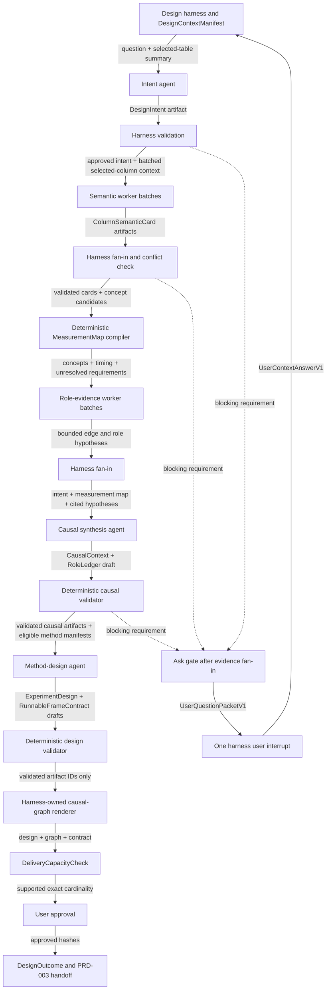
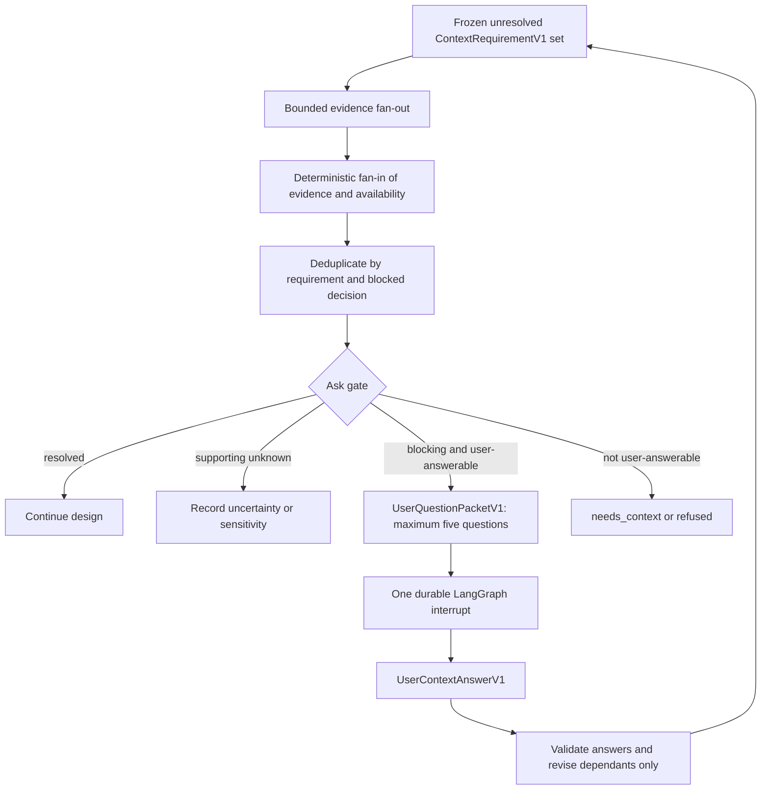

# PRD-002 — Causal design harness and runnable-frame contract

Status: final for implementation  
Product stage: post-intake causal design  
Depends on: `SYSTEM-CONTRACT.md`; PRD-001 — Kaggle intake, semantic availability, and storage  
Unlocks: PRD-003 — data preparation, repair, and recoverable lineage

Shared identities, envelopes, context isolation, persistence, retries, user-question bounds,
required LangSmith behavior, and operational events are governed by `SYSTEM-CONTRACT.md`.

## 1. Outcome

Given a valid PRD-001 handoff, the user's question and exactly one selected CSV, this stage
produces either:

- an approved, evidence-backed `ExperimentDesign`, visual `CausalGraphView`, and
  `RunnableFrameContract` for one supported analysis method, with a passing
  `DeliveryCapacityCheck`;
- a bounded set of questions that the user must answer before design can continue; or
- a typed `changes_requested`, `declined`, refusal, observability failure, or technical failure
  explaining why PRD-003 cannot open.

This stage decides what analysis means and what a future runnable table must satisfy. It renders
the causal design graph used for approval, but it does not repair, delete, impute, estimate,
render a statistical-result figure, or change any dataset.

## 2. Product decisions

1. V1 analyses exactly one CSV. Other captured files may supply semantic evidence but never
   analysis rows or joined columns.
2. There is one common causal-design workflow and four versioned method packs: randomized
   experiment, observational AIPW, difference-in-differences, and sharp RDD.
3. LangGraph starts here, after deterministic intake. The graph is a control harness, not a place
   to store dataframes, raw documents, or growing chat histories.
4. The harness is deterministic wherever a rule can be deterministic. Models interpret evidence
   and propose typed artifacts; validators decide whether the workflow may advance.
5. Independent evidence-gathering tasks may run in parallel. Causal reconciliation, method
   selection, contract compilation, and approval remain ordered decisions.
6. There is no standalone router agent. Method selection is a phase of design and is constrained
   by the four method manifests.
7. No single model call produces the complete design. The harness assembles it from separately
   validated, immutable artifacts.
8. Column meaning is established before causal-role assignment. Final roles are relational and
   are reconciled from a concept-level causal model, not assigned independently per column.
9. Missing context is explicit. A known-missing intake field is never repeatedly retrieved or
   silently invented.
10. Model-reported confidence never grants approval by itself. Critical claims require acceptable
    evidence, consistency, and the applicable deterministic guards.
11. Pre-repair diagnostics are read-only feasibility observations. They are not estimates and do
    not certify that the data is runnable.
12. Every artifact and diagnostic has recoverable provenance. Any future operation that changes
    cells, columns, rows, ordering, table shape, or row eligibility is forbidden here and must be
    handled by PRD-003 with complete data lineage.
13. LangSmith records sanitized traces and evaluations. It is not product storage, workflow
    persistence, evidence provenance, approval state, or data lineage.
14. An approved design is bound to exact artifact, schema, prompt, model-profile, tool-registry,
    graph, validator, and method-pack versions. Any material revision creates a new approval.
15. The concept-level causal graph is a first-class visual output. It is compiled from the typed
    causal model, shows uncertainty and material alternatives, and is approved with the design.
16. PRD-002 is the only stage allowed to interrupt the user. Workers return typed requirements;
    one deterministic ask gate performs evidence fan-in and creates at most one consolidated
    interrupt packet.
17. Before approval, a deterministic `DeliveryCapacityCheck` proves that the registered analysis
    cardinality and required visual evidence fit approved execution and presentation profiles.
18. LangSmith is required. A preflight or node-boundary flush failure produces
    `failed_observability`, preserves committed artifacts, and stops the graph before any later
    task or handoff.
19. Durable user interrupts are surfaced only through the shared CLI. CLI parsing submits typed
    decisions to the harness and cannot answer, approve, resume, or alter graph state by itself.

## 3. Scope

### 3.1 In scope

- opening and validating the PRD-001 handoff;
- selecting exactly one CSV for analysis;
- formalizing the causal question and estimand intent;
- bounded semantic enrichment of relevant columns;
- mapping columns to real-world concepts;
- gathering cited evidence for semantic and causal hypotheses;
- constructing and validating causal context, timing, relationships, and role claims;
- compiling the validated concept-level causal model into an accessible visual graph;
- selecting and completing one of four method packs;
- running read-only pre-repair feasibility diagnostics;
- defining table grain, key, eligibility, repair boundaries, deletion-impact dimensions,
  required diagnostics, and required visual evidence;
- producing the approved `ExperimentDesign` and `RunnableFrameContract`;
- durable user questions and resumable design revisions;
- LangGraph checkpointing; and
- LangSmith tracing, offline evaluation, and bounded online monitoring.

### 3.2 Out of scope

- joining, unioning, or reconciling multiple data tables;
- deleting or excluding rows from a stored table;
- changing cells, types, categories, names, or column order;
- deriving columns or aggregating observations;
- imputing any value;
- materializing an analysis-base or runnable table;
- selecting repair operations;
- estimating a treatment effect;
- switching methods because an estimate is inconvenient;
- rendering statistical evidence, diagnostic, sensitivity, or result visualizations;
- judging the final causal claim;
- writing the final answer;
- causal discovery from correlations;
- unrestricted web research or a vector database; and
- reading Kaggle notebooks, discussions, popularity metrics, or raw provider captures.

Detailed repair and data lineage belong to PRD-003. Estimator mathematics and post-estimation
diagnostics belong to method specifications under PRD-004. Statistical figure rendering and
final presentation belong to PRD-005. PRD-002 owns only the causal-design graph needed to inspect
and approve the design itself.

## 4. V1 data boundary

### 4.1 One analysis CSV

The selected analysis resource must be one safely admitted CSV from PRD-001.

| Situation | Behavior |
|---|---|
| exactly one candidate CSV and it satisfies the user's selection | record the immutable selection |
| multiple candidate CSVs | ask the user to choose one |
| selected source is TSV, Parquet, spreadsheet, or another format | refuse as `UNSUPPORTED_ANALYSIS_FORMAT_V1` |
| the question requires a join or union | refuse as `MULTI_TABLE_REQUIRED` |
| no admitted CSV exists | refuse as `NO_ANALYSIS_CSV` |

The selected CSV is recorded as a `TableSelection` artifact. Other CSVs remain stored but cannot
contribute values or columns. Admitted README, TXT, Markdown, and JSON documentation may continue
to supply evidence through PRD-001 retrieval surfaces.

DiD is supported when unit/time or group/time observations already exist in the single CSV. V1
does not construct a panel by joining files.

### 4.2 Read-only inspection

Design tools may parse the selected CSV in memory to calculate bounded facts. They may not write a
changed table. Each diagnostic must record:

- selected CSV artifact ID and content hash;
- parser and diagnostic versions;
- columns read;
- total physical rows;
- rows used for that calculation;
- rows not used and reason counts;
- the hash of the row-ID set used when row-level selection occurred inside the calculation; and
- `computed`, `partial`, or `not_computable` status.

Skipping an unusable value for one metric is not a row deletion. It is visible in that metric's
denominator and creates no prepared dataset.

## 5. Inputs and entry gate

The graph opens with exactly:

- `analysis_id`;
- `intake_outcome_artifact_id`; and
- the existing `graph_thread_id` only when resuming the same interrupted design run.

It then retrieves the question artifact and creates or retrieves `TableSelection`.

Entry requires:

1. PRD-001 status is `usable` or `partial`.
2. Every referenced intake artifact exists and matches its hash.
3. The intake handoff and retrieval-surface versions are supported.
4. Exactly one admitted CSV has been selected.
5. The question artifact is readable.
6. The design graph, schema registry, validator registry, tool registry, and four method-pack
   versions are pinned for the run.

No raw API response, archive, dataframe, or full evidence bundle is copied into graph state.

After the entry gate, the harness compiles one immutable `DesignContextManifest`. It records the
selected table, the complete structural inventory, semantic availability and missingness indexes,
the allowlisted measured-fact and provenance surfaces, the question artifact, and the exact
registry versions. The manifest contains IDs, hashes, statuses, and bounded facts; it contains no
raw CSV, raw provider response, growing chat history, or agent reasoning.

## 6. Outcomes and artifact graph

```text
IntakeOutcome + QuestionRecord
              │
              ▼
        TableSelection
              │
              ▼
    DesignContextManifest
              │
              ▼
         DesignIntent
              │
              ▼
   ColumnSemanticCard revision(s)
              │
              ▼
        MeasurementMap
              │
              ▼
         CausalContext
              │
              ▼
           RoleLedger
              │
              ▼
   PreRepairFeasibilityReport
              │
              ▼
       ExperimentDesign
              │
              ▼
     RunnableFrameContract
              │
              ▼
       CausalGraphView
              │
              ▼
    DeliveryCapacityCheck
              │
              ▼
         DesignOutcome
```

Every arrow is an immutable parent-artifact reference. A revision receives a new artifact ID and
does not overwrite its parent.

`DesignOutcome` is one of:

| Status | Meaning |
|---|---|
| `approved` | design, runnable-frame contract, causal-graph view, and delivery-capacity check passed all guards and received explicit user approval |
| `needs_context` | one or more user-answerable blocking requirements remain |
| `changes_requested` | user requested a new immutable design revision; the current revision cannot hand off |
| `declined` | user declined this design revision |
| `refused` | the requested causal design is unsupported or not identifiable under the available evidence |
| `failed_observability` | required LangSmith preflight or trace delivery failed; no handoff is readable |
| `failed` | a technical or contract-integrity error prevented completion |

## 7. Workflow

```text
open intake handoff
        │
        ▼
select one CSV ──▶ formalize question and estimand intent
        │
        ▼
deterministically triage relevant columns
        │
        ▼
parallel semantic workers ──▶ validate and collect column cards
        │                                  │
        │                                  └── missing blocking context ──▶ ask user ──┐
        ▼                                                                        │
map columns to concepts and measurement timing ◀─────────────────────────────────┘
        │
        ▼
parallel role-evidence workers
        │
        ▼
causal synthesis ──▶ deterministic causal validation
        │                       │
        │                       └── targeted correction / user question
        ▼
evaluate four method manifests ──▶ complete one method design
        │
        ▼
parallel read-only pre-repair diagnostics
        │
        ▼
compile and validate ExperimentDesign + RunnableFrameContract
        │
        ▼
compile and validate CausalGraphView
        │
        ▼
run DeliveryCapacityCheck against exact registered cardinalities
        │
        ├── unsupported capacity ──▶ typed refusal or design revision
        ▼
explicit user approval of design + graph + capacity binding
        │
        ├── changes requested ──▶ new immutable design revision
        ├── declined ───────────▶ declined DesignOutcome
        └── approved ───────────▶ approved DesignOutcome
```

## 8. Agentic structure

The parent LangGraph harness is not an agent. It controls state, fan-out, validation, persistence,
permissions, interrupts, and artifact writes. It never asks a model to decide whether a schema or
permission rule passed.

### 8.1 Intent agent

Invocation: single and bounded.

Responsibilities:

- distinguish causal, predictive, descriptive, and exploratory questions;
- propose treatment/exposure, outcome, population, comparator, unit, and timeframe;
- identify the intended decision and causal claim;
- identify candidate table grain and mandatory design concepts;
- create `DesignIntent`; and
- emit explicit context requirements when the question is ambiguous.

Forbidden:

- inspecting every column;
- assigning a final method;
- assigning final causal roles;
- proposing repair; or
- estimating an effect.

### 8.2 Semantic worker

Invocation: parallel, per frozen batch of one or more independent critical columns or one related
semantic family. The harness, not the worker, constructs the batch and hydrates its context.

Responsibilities:

- establish what a column measures;
- identify its real-world concept, entity, units, levels, encoding, timing, and measurement window;
- distinguish source evidence, measured observations, hypotheses, and user statements;
- record possible missing sentinels without recoding them;
- cite every evidenced statement; and
- emit a `ColumnSemanticCard` or `needs_context` result.

A worker has no shared mutable memory and cannot see unrelated columns by default.

### 8.3 Role-evidence worker

Invocation: parallel, per causally relevant concept after treatment and outcome are provisionally
fixed.

Responsibilities:

- assess whether the concept may cause treatment;
- assess whether it may cause outcome;
- assess whether treatment may cause it;
- assess whether it may influence selection into the dataset;
- propose bounded causal edges and role hypotheses;
- surface competing mechanisms; and
- cite evidence and timing for each hypothesis.

It cannot make a final confounder, mediator, collider, instrument, or selection-variable
assignment. Those roles require joint graph reasoning.

### 8.4 Causal synthesis agent

Invocation: single after semantic and role-evidence fan-in.

Responsibilities:

- build a concept-level causal model;
- connect concepts to one or more measurements through `MeasurementMap`;
- include important unmeasured concepts rather than pretending every concept is a column;
- reconcile contradictory role hypotheses;
- preserve materially plausible alternative graphs;
- propose the final `CausalContext` and `RoleLedger`; and
- request targeted context when different plausible structures imply different designs.

It does not approve its own graph. The deterministic causal validator does.

### 8.5 Method-design agent

Invocation: single after method-manifest eligibility checks.

Responsibilities:

- use assignment mechanism, causal context, table structure, and manifest results to select one
  eligible method;
- explain why other methods were rejected;
- complete only the selected method's required design fields;
- select the estimand supported by the question and method;
- request allowed pre-repair diagnostics;
- define eligibility and repair boundaries;
- define deletion-impact dimensions and invalidation conditions;
- define required post-repair diagnostics and visual evidence; and
- propose `ExperimentDesign` and `RunnableFrameContract`.

It cannot run all four estimators, inspect results, switch method after seeing an estimate, or
modify data.

## 9. Parallelism and delegation policy

### 9.1 What may run in parallel

- independent semantic evidence retrieval;
- selected CSV profiling requests for independent columns;
- semantic workers;
- role-evidence workers after shared treatment/outcome context is fixed;
- deterministic eligibility checks for the four method manifests; and
- independent pre-repair diagnostics allowed by the chosen method pack.

### 9.2 What remains sequential

- causal-question approval;
- semantic fan-in and conflict identification;
- causal synthesis;
- final causal-role reconciliation;
- method selection;
- contract compilation; and
- user approval.

### 9.3 Worker envelope

Every delegated model task receives:

- one objective;
- parent artifact IDs;
- an explicit context allowlist;
- a tool allowlist;
- forbidden actions;
- one required output schema;
- stopping conditions;
- prompt and model-profile versions; and
- a task budget.

Workers return artifacts, not chat transcripts. They cannot invoke another worker, write graph
state, persist an artifact directly, or modify a parent artifact.

### 9.4 Bounded fan-out

V1 defaults to at most eight concurrent model workers. The cap is configuration, is traced, and
cannot be changed by a model.

Column triage creates four tiers:

| Tier | Handling |
|---|---|
| critical design columns | one semantic card per column, distributed across the frozen worker batches |
| plausible adjustment or structural candidates | grouped into the same frozen batches or one coherent encoded-family task |
| supporting columns | inspect only when a validated requirement requests them |
| unused columns | retain inventory/profile only; no model call |

Deferred columns are recorded. A design cannot be approved if a deferred column could satisfy a
blocking role or requirement.

The system never performs an all-pairs comparison across columns. The causal synthesis agent
proposes a bounded neighbourhood, and the harness launches targeted relationship tasks only for
materially unresolved edges.

### 9.5 Context routing by agent

The harness is the only context router. Agents do not address one another, share memory, or pass
chat transcripts. Each invocation receives `AgentTaskEnvelopeV1` with exactly one of the typed
payloads below, compiled from the `DesignContextManifest` and validated parent artifacts:

- `IntentTaskContext`;
- `SemanticBatchTaskContext`;
- `RoleEvidenceTaskContext`;
- `CausalSynthesisTaskContext`; or
- `MethodDesignTaskContext`.

The returned `AgentTaskResultV1` goes back to the harness, which validates and commits it before
routing its artifact ID to the next receiver.



| Receiver | Receives | May retrieve | Returns to harness | Never receives or routes |
|---|---|---|---|---|
| Intent agent | `IntentTaskContext`: question, user context, table identity, bounded dataset/table semantics | requirement-specific intake evidence | `DesignIntent` or `ContextRequirementV1` records | every column, raw rows, method results |
| Semantic worker batch | `SemanticBatchTaskContext`: assigned column IDs, relevant table context, semantic availability, bounded profiles | only evidence named in its envelope | one semantic card per assigned column | unrelated columns, sibling drafts, causal roles as facts |
| Role-evidence worker batch | `RoleEvidenceTaskContext`: approved intent, assigned concepts/relationships, timing, cited cards | named relationship evidence only | bounded edge/role hypotheses or requirements | full table, unrestricted pairwise search, final role authority |
| Causal synthesis agent | `CausalSynthesisTaskContext`: validated intent, map, hypotheses, conflicts, material missing concepts | admitted evidence IDs for reconciliation | causal context, alternatives, role-ledger draft | dataframe, repair tools, estimator output, sibling memory |
| Method-design agent | `MethodDesignTaskContext`: validated causal artifacts, four eligibility results, method contracts, feasibility summaries | registered diagnostics, impact previews, capacity registry | design and frame-contract drafts plus capacity inputs | result estimates, mutation tools, arbitrary method execution |
| Causal-graph renderer | validated artifact IDs and renderer profile | typed nodes, edges, roles, and statuses only | deterministic graph view | model prompts, raw data, new causal interpretations |

Routing and batching are fixed as follows:

1. The harness lists the intake inventory once for the selected CSV.
2. Deterministic triage freezes the relevant-column ID set.
3. The harness retrieves semantic context for that frozen set in one batched request, or in
   deterministic storage-sized chunks; no worker performs its own per-column source fetch.
4. The harness partitions the frozen set into at most eight total initial worker tasks, with at
   most eight concurrent tasks. A worker may receive several independent columns.
5. Each selected column belongs to exactly one initial semantic-worker task. A later task may
   revisit it only because a stable validation code requested a targeted correction.
6. Semantic fan-in completes before role-evidence routing. The harness then freezes the material
   unresolved relationship set and partitions it into at most eight initial role-worker tasks;
   there is no all-pairs column or concept loop.
7. Role workers cannot start from unvalidated semantic drafts and cannot expand their assigned
   relationship set.
8. A model output never becomes another agent's context directly. Only a validated, committed
   artifact ID may cross to the next receiver.
9. User answers return to the harness and revise only dependent context packets and artifacts.

## 10. Generalized context requirements

Every requested fact is represented as `ContextRequirementV1`:

```json
{
  "requirement_id": "column.measurement_timing",
  "scope": {"kind": "column", "id": "column-id"},
  "fact_required": "When was this variable measured relative to treatment?",
  "why_required": "Prevents a post-treatment variable from being used as a confounder.",
  "criticality": "blocking",
  "acceptable_evidence_types": [
    "user_confirmation",
    "data_dictionary",
    "study_protocol",
    "timestamp_relationship"
  ],
  "required_support": "direct_or_corroborated",
  "missing_action": "ask_user"
}
```

Required fields are:

- stable requirement ID and registry version;
- dataset, table, column, concept, relationship, or design scope;
- exact fact requested and why it matters;
- blocking or supporting criticality;
- acceptable evidence types;
- minimum support class;
- methods for which it is required;
- attempted evidence IDs and stored availability statuses; and
- missing action: `ask_user`, `retain_as_sensitivity`, or `refuse`.

### 10.1 Common semantic requirements

All four methods share:

- causal question and intended decision;
- treatment/exposure meaning and timing;
- outcome meaning and measurement window;
- population and comparator;
- unit of observation and candidate identity;
- table grain and repeated-observation structure;
- sampling and dataset-inclusion mechanism;
- assignment mechanism;
- column meaning, entity, units, scale, levels, and encoding;
- missing-value meaning;
- timing relative to treatment;
- data source and measurement process;
- concept-to-column mapping;
- possible treatment descendants;
- possible selection variables; and
- unresolved or conflicting interpretations.

### 10.2 Evidence classes

| Class | Meaning | Can establish a blocking fact? |
|---|---|---:|
| direct user confirmation | user explicitly states study/data-generating fact | yes, with user-answer provenance |
| direct source statement | admitted documentation explicitly states the fact | yes |
| corroborated source inference | multiple sources jointly support the fact | sometimes, according to requirement |
| deterministic measured observation | calculation from CSV bytes | only a measured fact, never causal meaning by itself |
| model/domain hypothesis | plausible interpretation without sufficient source support | no |
| conflicting | credible evidence disagrees | no, until resolved or treated as sensitivity |
| unknown | no acceptable evidence | no |

V1 searches only PRD-001's admitted evidence and user-answer artifacts. External research sources
can be added later through a provenance-preserving evidence adapter; they are not required to
implement this PRD.

## 11. Missing context and user questions

An agent or deterministic component never calls the user directly. It returns a
`ContextRequirementV1` governed by `SYSTEM-CONTRACT.md`, including:

- requirement ID;
- evidence sources already checked;
- PRD-001 availability status;
- the exact decisions blocked;
- a concise proposed question;
- expected answer shape; and
- whether `unknown` would cause sensitivity analysis or refusal.

The harness freezes the unresolved requirement set, fans out every permitted evidence lookup,
waits for complete fan-in, deduplicates requirements by blocked decision, and then invokes one
deterministic ask gate. No worker may interrupt from a parallel branch.



A question is permitted only when the requirement is blocking, every allowed non-user source has
been checked, the user may reasonably know the fact, the answer has a declared schema, and the
answer can affect a legitimate design decision without depending on observed results. A known
`empty`, `not_offered`, `unreadable`, or `withheld` slot is not queried again from intake.

Each `UserQuestionPacketV1` contains at most five consolidated questions and always offers
`unknown`. V1 allows at most two clarification packets per immutable design revision. Table
selection and final approval are separate interrupts and do not count toward those two rounds.
After the second unresolved round, the revision terminates as `needs_context` or `refused`
according to the registered missing action.

The ask gate never asks the user to fix a technical failure, provide code, waive a validator,
select a favorable result, or choose a method after seeing results.

When the user answers:

1. the verbatim answer is stored as an immutable `UserContextAnswerV1`;
2. provenance records the user as the source;
3. the graph resumes on the same design thread;
4. only artifacts dependent on the answer are revised; and
5. previous artifacts remain recoverable.

A user answer is evidence of the user's study knowledge. It is not rewritten as if Kaggle or a
publication stated it.

### 11.1 CLI interrupt and resume contract

When the graph reaches table selection, clarification, or approval, it commits the interrupt
artifact and checkpoint, flushes the required trace, and exits the current `causal run` command
with `CliResultV1.status=needs_user_input`. The result contains only `analysis_id`,
`stage_run_id`, design revision, interrupt kind, question/decision artifact ID and hash, and the
exact permitted next command.

The user responds to the exact open interrupt ID and hash with exactly one of:

- `causal select-table` carrying `TableSelectionDecisionV1`;
- `causal answer-context` carrying `UserContextAnswerV1`; or
- `causal approve-design` carrying `DesignApprovalDecisionV1`.

Each command validates the analysis ID, interrupt kind, interrupt artifact ID/hash, expected
revision, schema version, and idempotency key, commits the typed answer, and returns. `causal run`
then resumes the same `graph_thread_id`. The CLI
never converts free text into a typed decision, reads a checkpoint payload, calls an agent, or
automatically chooses `unknown`, approval, or a table. Non-interactive automation must submit the
same typed JSON schemas; it gets no broader path.

## 12. Column semantics, concepts, and causal roles

### 12.1 Column semantic card

Each inspected column produces:

- stable table and column references;
- raw display name;
- proposed real-world meaning;
- concept ID or `unknown`;
- entity measured;
- kind, units, scale, levels, and encoding;
- timing relative to treatment;
- measurement window;
- missing-value interpretation;
- source and measurement process;
- evidence IDs for each supported claim;
- alternatives and conflicts; and
- per-slot epistemic status.

A single global confidence number is forbidden. Confidence/support belongs to individual claims.

### 12.2 Concept graph and measurement map

The causal graph contains real-world concepts, not column names alone. `MeasurementMap` supports:

- one concept measured by several columns;
- one column that imperfectly proxies a concept;
- derived measurements proposed for PRD-003 but not yet created; and
- unmeasured concepts needed to express identification risk.

Each causal edge records:

- source concept;
- relation and target concept;
- direction;
- applicable timeframe;
- mechanism summary;
- direct and contrary evidence IDs;
- `evidenced`, `hypothesis`, `disputed`, or `unknown` status; and
- graph alternatives in which the edge differs.

### 12.3 Causal graph visual

The validated concept graph is compiled into a `CausalGraphView`; it is not left as JSON that the
user must mentally reconstruct. The visual is a direct representation of the typed graph artifact,
not a second model interpretation.

The primary view shows:

- one labelled node per real-world concept;
- distinct, text-labelled treatment and outcome nodes;
- observed, proxy-measured, and unmeasured status on every node;
- directed causal edges with stable source and target concept IDs;
- edge status—`evidenced`, `hypothesis`, `disputed`, or `unknown`—using line style and a text legend,
  never color alone;
- timing or ordering groups when they are material to the design;
- concept-to-column mappings on selection or in an adjacent detail panel;
- role annotations such as confounder candidate, mediator, collider, selection variable, or
  instrument candidate; and
- the selected adjustment set and explicitly forbidden adjustment concepts when applicable.

Material alternative graphs are rendered as separate labelled views or small multiples. They are
never merged into one diagram that makes disputed edges appear settled. A missing or unmeasured
concept remains visible when it materially affects identification.

`CausalGraphView` contains:

- parent causal-context, measurement-map, role-ledger, experiment-design, and runnable-frame
  contract artifact IDs and hashes;
- canonical node and edge lists with stable display labels;
- selected graph-alternative ID;
- layout direction and renderer profile;
- visual legend and disclosure text;
- canonical graph-view specification and hash;
- SVG output;
- an accessible textual summary and node-edge table;
- renderer, theme, schema, and validator versions; and
- validation status.

Layout is deterministic for the same graph, renderer, and profile. Layout may move nodes to improve
legibility; it cannot add, remove, reverse, or restyle the epistemic status of an edge. Zoom, pan,
selection, and evidence-detail inspection may be interactive, but the complete graph and its
uncertainty must remain understandable in the static SVG and accessible alternative.

### 12.4 Role ledger

Roles are always relative to a specific treatment, outcome, population, and timeframe.

Supported role claims are:

- treatment;
- outcome;
- unit identifier;
- time;
- assignment variable;
- group;
- cluster;
- stratum;
- running variable;
- confounder candidate;
- mediator;
- collider;
- instrument candidate;
- effect modifier;
- selection variable;
- precision covariate;
- excluded from design; and
- unknown.

Each claim records evidence, timing, graph basis, confidence/support class, alternatives, status,
and methods for which the role is relevant.

Correlation, predictive importance, balance, missingness, or a column name cannot by itself assign
a causal role. No automatic causal-discovery algorithm is part of V1.

## 13. Method-pack contract

Every method pack has a versioned manifest containing:

- method ID and version;
- compatible assignment mechanisms;
- required and optional roles;
- required semantic and timing context;
- forbidden adjustment roles;
- supported estimands;
- structural/table requirements;
- allowed pre-repair diagnostic IDs and schemas;
- runnable-frame schema;
- eligibility-rule vocabulary;
- columns that are ordinarily forbidden or eligible for imputation;
- deletion-impact dimensions;
- invalidation and refusal rules;
- required post-repair diagnostics;
- required visual evidence;
- estimator and diagnostic identifiers reserved for later PRDs; and
- contract tests.

Adding a method means adding a conforming method pack and its later estimator specification. It
does not change intake, the common semantic workflow, the evidence ledger, the graph harness, user
interrupts, repair ownership, or artifact lineage.

### 13.1 Randomized experiment

Design requires:

- evidenced randomization mechanism;
- treatment arms and comparator;
- a finite ordered set of prespecified treatment-versus-comparator contrasts;
- a registered multiplicity policy whenever more than one contrast is confirmatory;
- randomization unit;
- strata, blocks, or clusters when used;
- ITT as the default estimand unless another is explicitly justified;
- outcome and follow-up window;
- baseline-covariate timing;
- compliance, crossover, and attrition definitions; and
- pre-randomization eligibility rule.

Pre-repair diagnostics may inspect arm counts, assignment-unit uniqueness, cluster sizes, baseline
availability, outcome missingness, compliance availability, and power/precision feasibility.

The future frame contract treats post-randomization exclusion as high risk. Missing outcomes are
attrition, not ordinary silent deletion. Post-treatment variables are forbidden as baseline
adjusters.

### 13.2 Observational AIPW

V1 AIPW requires:

- binary treatment and defined comparator;
- ATE or ATT;
- one row per analysis unit;
- observed treatment and outcome requirements;
- an evidence-backed pre-treatment adjustment set;
- explicit mediator, collider, instrument, and selection risks;
- positivity/overlap requirements; and
- a statement of remaining unmeasured-confounding risk.

Pre-repair diagnostics may inspect treatment prevalence, covariate availability, missingness,
rough overlap, level sparsity, effective-sample feasibility, and cross-fitting feasibility.

Propensity trimming changes the target population and must be specified by design. It is not a
repair operation. Treatment and primary outcome are ordinarily forbidden from imputation.

### 13.3 Difference-in-differences

V1 DiD requires:

- unit or repeated-cross-section definition;
- treated and comparison groups;
- treatment/adoption time;
- simultaneous or staggered-adoption classification;
- sufficient pre- and post-period definitions;
- treatment-anticipation assessment;
- composition and attrition risks;
- concurrent-event evidence;
- clustering unit; and
- parallel-trends justification as an assumption, not a fact inferred from one test.

Pre-repair diagnostics may inspect unit-period uniqueness, group-time counts, panel completeness,
adoption cohorts, missingness by group/time, pre-period availability, composition, and clustering
feasibility.

The future frame contract must preserve required group-time support. Removing an inconvenient
period, group, or adoption cohort is forbidden without design revision.

### 13.4 Sharp regression discontinuity

V1 sharp RDD requires:

- running variable and units;
- fixed cutoff;
- assignment direction;
- evidence that assignment is sharp at the cutoff;
- outcome and measurement window;
- running-variable timing;
- manipulation and sorting risks;
- other policies at the cutoff;
- mass-point risks; and
- support on both sides of the cutoff.

Pre-repair diagnostics may inspect cutoff-side counts, distance-to-cutoff support, missingness by
side and distance, mass points, duplicates, density/manipulation warnings, covariate availability,
and bandwidth feasibility.

Suspected manipulation or bunching is never repaired away. Outcome-based or asymmetric deletion
around the cutoff is forbidden. Bandwidth restrictions belong to the approved design and later
estimator, not ad hoc repair.

### 13.5 Delivery-capacity preflight

Before user approval, the harness creates a `DeliveryCapacityCheck` using the exact proposed
method profile and the immutable delivery-capacity registry. It checks:

- treatment-arm and prespecified-contrast cardinality;
- subgroup, cohort, period, event-time, cutoff-side, series, and evidence cardinality as
  applicable;
- every required visual-evidence ID;
- compatible registered templates and their panel, series, label, and annotation limits;
- accessible-table capacity;
- maximum-eight execution and rendering concurrency; and
- method, visualization-catalog, display-profile, and capacity-registry versions.

The check does not select a figure template or create a `FigurePlan`; those decisions belong only
to PRD-005 after results are frozen. It proves only that at least one approved delivery path can
represent the planned evidence without omission. A failure blocks approval or requires a new
registered capacity/template revision. It never authorizes a dynamic template or hidden result.

## 14. Pre-repair diagnostic contract

Every diagnostic declares:

- diagnostic ID and version;
- allowed input stages;
- required roles and columns;
- parameter schema;
- missingness and parse-failure behavior;
- minimum support needed to compute;
- deterministic implementation identifier;
- output schema; and
- method packs that may call it.

Every result returns:

- `computed`, `partial`, or `not_computable`;
- selected CSV artifact ID and hash;
- columns read;
- total, used, and unused row counts;
- unused reason counts;
- row-set hash when applicable;
- values and warnings; and
- diagnostic implementation version.

Pre-repair diagnostics answer whether a design is plausibly feasible. PRD-003 must run the
applicable diagnostics again after mandatory exclusions and after permitted repair. The estimator
will accept only a post-repair runnable frame.

## 15. Tool surface and permissions

**Amendment (D-100).** There is no model-facing toolbox. The eight tools this section listed for
design agents were built, tested, and never wired: `ToolRouter` had no production caller, the
handler factories had none, and `allowed_tool_ids` was never rendered into any prompt, so every
envelope advertised eight tools no task could call. They are deleted rather than wired, for two
reasons. Most of them re-served slices of the `DesignContextManifest` the context pack already
carries, so the round trip bought nothing. And the design scope had no room for both the wiring
and the ask-gate repair the stage actually needed; the tools had never once run, so they lost.

`registries/design-tools.v1.json` keeps all eleven rows with `registered: false` and no allowed
task kinds, which is what `ToolRegistrationV1.registered` is for: the identity of a capability is
recorded, its absence is stated, and `recipient_map()` therefore returns an empty tuple for every
task kind. Every design prompt now says the model has no tools and that everything it may read is
already in the prompt and the envelope. Restoring a tool means restoring its handler, flipping its
row, and funding both — not flipping the row alone.

The table below is retained as the specification a future tool must meet, not as a description of
what exists. The **Model access** column reads *harness only* for every row today.

The model-facing toolbox was deliberately medium-grained: large enough to avoid excessive calls,
but too narrow to hide arbitrary computation or mutation.

| Tool | Returns | Model access |
|---|---|---|
| `list_intake_inventory` | bounded structural, available, missing, measured-fact, and provenance inventories | all design agents |
| `get_semantic_evidence` | selected semantic slots and evidence IDs | all design agents |
| `get_measured_facts` | selected deterministic profile facts | semantic and method-design agents |
| `get_provenance` | origin, version, capture, locator, and evidence chain | semantic, role, causal-synthesis, and method-design agents |
| `get_method_contract` | one versioned method manifest | method-design agent |
| `validate_causal_model` | deterministic causal validation issues | causal-synthesis agent |
| `run_preflight_diagnostic` | one registered diagnostic result | method-design agent |
| `preview_eligibility_impact` | read-only counts and composition under proposed eligibility rules | method-design agent |
| `validate_experiment_design` | deterministic design and frame-contract issues | harness only |
| `render_causal_graph` | versioned graph-view specification, SVG, and accessible alternative | harness only |
| `request_user_context` | durable user interrupt and answer artifact | harness only |

Tools require run, table, column, artifact, requirement, diagnostic, or method identifiers. There
is no `get_all_context`, arbitrary query, arbitrary code, or arbitrary metric operation.

The following capabilities do not exist in PRD-002:

- Kaggle fetch;
- raw SQL;
- shell or Python execution;
- dataframe return;
- data write;
- row delete;
- impute/recode/derive/join;
- repair-plan write;
- estimator execution; and
- generic or statistical-result visualization rendering.

The causal-graph renderer is a harness-owned compiler, not a model-facing visualization tool. It
accepts only validated concept, edge, role, and design artifact IDs and cannot read data values.

The harness persists returned artifacts after validation. Agents never receive a generic artifact
write tool.

## 16. Structured-output harness

### 16.1 Common task envelope

Every model call receives the shared `AgentTaskEnvelopeV1`. Its task-specific payload is one of
the five contexts in Section 9.5. Every model task returns `AgentTaskResultV1`; the example below
shows its design-specific result body:

```json
{
  "artifact_type": "column_semantic_card",
  "schema_version": "1.0",
  "task_id": "task-id",
  "parent_artifact_ids": ["parent-id"],
  "status": "complete",
  "payload": {},
  "claims": [],
  "missing_requirements": [],
  "conflicts": [],
  "warnings": []
}
```

`status` is exactly one of `complete`, `needs_context`, `conflict`, or `refused`.

Schemas require all defined fields and reject undeclared fields. Unknown information must be
represented explicitly; omission is a schema failure.

### 16.2 Claim shape

Every claim contains:

- stable claim ID;
- subject kind and ID;
- controlled predicate;
- typed value;
- epistemic status;
- supporting and contrary evidence IDs;
- claim-level confidence/support class;
- alternatives; and
- applicable treatment, outcome, population, and timeframe when causal.

An agent-generated inference cannot cite itself as source evidence.

### 16.3 Validation walls

Artifacts pass in this order:

1. **Shape wall:** valid JSON, exact schema, required fields and enums.
2. **Reference wall:** all table, column, concept, evidence, parent, and requirement IDs resolve.
3. **Evidence wall:** critical semantic and causal claims have acceptable cited support.
4. **Temporal wall:** treatment, covariate, mediator, outcome, and method timing are consistent.
5. **Causal wall:** graph and role claims are mutually consistent and material alternatives are
   visible.
6. **Method wall:** selected method's required context, roles, structure, assumptions, and
   diagnostics are satisfied.
7. **Frame wall:** grain, key, required columns, eligibility, forbidden repair, deletion-impact,
   diagnostic, and visual requirements are complete.
8. **Graph-view wall:** the visual contains every validated node, edge, status, material alternative,
   and required accessible representation without introducing new causal content.
9. **Delivery-capacity wall:** the exact approved method cardinalities and required evidence have
   compatible registered execution and presentation capacity.
10. **Approval wall:** the user approves the exact design, frame-contract, causal-graph-view, and
   delivery-capacity
   artifact hashes and versions.

### 16.4 Targeted correction

A failed validator returns:

- stable error code;
- JSON path;
- failed rule and supporting artifact IDs;
- allowed correction actions; and
- whether missing user context can resolve it.

The harness sends only the failing artifact, relevant evidence, and validation issues back to the
responsible agent. The agent returns a revision; it does not regenerate the entire design.

V1 permits one initial response plus at most two targeted model corrections for the same artifact
and validation code.
After that:

- user-answerable uncertainty becomes `needs_context`;
- unsupported identification becomes `refused`; and
- repeated shape/tool failures become `failed`.

There is no infinite self-correction loop and no silent fallback to another method.

## 17. ExperimentDesign contract

An approved `ExperimentDesign` contains:

- causal question and intended decision;
- selected CSV and table contract;
- selected method and method-pack version;
- rejected methods and reasons;
- treatment, comparator, outcome, population, unit, and timeframe;
- estimand;
- measurement map;
- causal context and alternative material graphs;
- role ledger with evidence and timing;
- assumptions and identification risks;
- eligibility-rule vocabulary and proposed rules;
- mandatory and forbidden downstream repair boundaries;
- columns ordinarily eligible or forbidden for imputation;
- deletion-impact dimensions and invalidation conditions;
- required pre- and post-repair diagnostics;
- required visual evidence;
- finite ordered primary contrast definitions and multiplicity policy when applicable;
- delivery-capacity-check artifact ID and hash;
- visualization-catalog and capacity-registry versions used by that check;
- unresolved non-blocking assumptions and sensitivity requirements;
- all parent artifact IDs and hashes; and
- graph, schema, prompt, model-profile, tool, validator, and method versions.

The document may approve a design with explicit non-blocking uncertainty. It may not approve a
design whose identification depends on an unresolved blocking requirement.

## 18. RunnableFrameContract

This is an executable specification, not a dataframe. It contains:

- selected CSV artifact ID and hash;
- required output grain;
- primary or compound key requirements;
- required column-role references;
- allowed column-role references;
- forbidden column-role references;
- required type, encoding, ordering, and uniqueness constraints;
- target-population and timeframe eligibility rules;
- mandatory exclusion reason vocabulary;
- treatment/outcome missingness rules;
- method-specific structure: arms, clusters, group-time cells, or cutoff sides;
- permitted imputation targets and forbidden imputation targets;
- required missingness indicators or sensitivity branches;
- deletion-impact dimensions;
- conditions requiring user approval or design revision;
- minimum structural/statistical feasibility gates;
- required final diagnostics;
- expected estimator input schema identifier; and
- the exact `ExperimentDesign` hash it implements.

No universal deletion percentage is stored. PRD-003 evaluates proposed losses across the method's
declared dimensions, including overall loss, treatment/group/cutoff side, time, cluster, subgroup,
effective sample size, and target-population change.

## 19. LangGraph wiring

### 19.1 Graph state

Persistent state contains only:

- analysis, design stage-run, and graph-thread IDs;
- intake outcome, question, and selected CSV artifact IDs;
- `DesignContextManifest` artifact ID and hash;
- current stage;
- validated artifact IDs;
- causal-graph-view artifact ID and validation status;
- pending task IDs;
- open requirement and validation-issue IDs;
- correction-attempt counts;
- clarification-round count and current `UserQuestionPacketV1` ID;
- candidate and selected method IDs;
- delivery-capacity-check ID, hash, and status;
- user-answer artifact IDs; and
- approval status.

Payloads are loaded through scoped tools when needed and released after the node completes.

### 19.2 Checkpoints and resume

- one LangGraph thread corresponds to one design run;
- production checkpoints use PostgreSQL through the official Postgres checkpointer;
- checkpoint tables use the shared workflow checkpoint schema and a design-stage namespace;
- subagent subgraphs use per-invocation persistence and have no cross-task memory;
- a user question creates a durable interrupt;
- resume uses the same thread ID and answer artifact ID;
- nodes are replay-safe and artifact writes are idempotent; and
- checkpoint serialization accepts only the IDs, hashes, statuses, counters, and dependency edges
  allowlisted by `SYSTEM-CONTRACT.md`, with strict msgpack restrictions and no pickle fallback.

Graph checkpoints are operational state. They are not immutable product artifacts and cannot be
the only record of an approved design.

## 20. LangSmith wiring

### 20.1 Boundary

LangSmith is the required execution trace and evaluation surface. PostgreSQL and object storage
remain authoritative for artifacts, evidence, approvals, and lineage.

A LangSmith health/authorization preflight must pass before the graph starts. Every node and
registered operation emits `OperationalEventV1`, closes its LangSmith span, and receives a flush
acknowledgement before a later node becomes eligible. Preflight or flush failure produces
`failed_observability`; the graph preserves already committed artifacts and stops without a
handoff. A trace cannot approve, alter, or invalidate a product artifact.

### 20.2 Trace hierarchy

One LangSmith thread maps to one design run. Each invocation or resume is one trace. Child runs
represent:

- graph nodes;
- model calls;
- semantic and role worker tasks;
- retrieval tools;
- deterministic validators;
- pre-repair diagnostics;
- causal-graph-view compilation and validation;
- user interrupt creation and resume; and
- design compilation.

Every worker run records its task ID, scoped column/concept IDs, parent artifact IDs, output
artifact ID, status, latency, token usage, and tool calls.

### 20.3 Tags and metadata

Required safe metadata includes:

- environment;
- analysis, design stage-run, graph-thread, task, attempt, and parent-event IDs;
- graph and schema versions;
- agent type;
- prompt and model-profile versions;
- tool and validator registry versions;
- selected method and method-pack version when available;
- selected CSV artifact ID, never CSV contents;
- validation status and error codes;
- causal-graph-view artifact ID, renderer version, and validation status;
- correction attempt count; and
- final outcome.

### 20.4 Trace privacy

LangSmith records the complete model-facing prompt, the returned response, and the returned
reasoning for the intent, semantic, role-evidence, causal-synthesis, and method-design calls,
together with the payload of every artifact each node commits. Tracing must not emit credentials,
secrets, connection values, or signed URLs; the redaction pass strips those and nothing else
(SC §10.3, D-097).

Auto-instrumented model and tool inputs and outputs are enabled. LangGraph's own node
instrumentation is the source of the per-node spans SC §10.2 requires; the harness adds spans
only where that instrumentation does not reach.

Every span records the task-envelope ID/hash, prompt/model/schema versions, redaction-policy
version, stable validation paths, artifacts, attempts, timings, tokens, and costs. Credential
canary tests gate production promotion.

### 20.5 Projects

Use separate LangSmith projects for development, staging, and production. Synthetic/offline
experiments are not mixed with production traces. Environment is also present as metadata so an
incorrect project configuration remains detectable. Trace retention is 30 days.

### 20.6 Offline evaluation

This stage inherits every hard gate and release rule in `SYSTEM-CONTRACT.md` Section 10.5.
Before changing a model profile, prompt, graph, schema, tool contract, validator, or method pack,
run an offline experiment against curated cases containing:

- clear and ambiguous column meanings;
- missing and conflicting context;
- user-question requirements;
- confounder, mediator, collider, instrument, and selection distinctions;
- post-treatment adjustment traps;
- unmeasured concepts and alternative DAGs;
- causal graphs with evidenced, hypothetical, disputed, and unknown edges;
- one valid and invalid case for each supported method;
- multi-CSV and unsupported-method refusals;
- partial pre-repair diagnostics; and
- attempted forbidden tool use.

Deterministic evaluators gate:

- JSON/schema validity;
- required-field completeness;
- evidence-reference resolution;
- epistemic-label correctness;
- temporal and causal consistency;
- graph-view fidelity, alternative visibility, and accessible-output completeness;
- method-pack completeness;
- correct user-question/refusal behavior;
- tool-permission compliance;
- absence of data mutation; and
- runnable-frame contract completeness.

Human review evaluates causal plausibility and high-impact ambiguity. An LLM judge may assist with
semantic faithfulness, question clarity, and explanation quality; it can never be the sole gate for
causal validity or statistical correctness.

### 20.7 Online monitoring

Sanitized production traces measure:

- structured-output failure rate;
- evidence coverage;
- known-missing retrieval attempts;
- correction frequency and repeated error codes;
- user-question rate and unresolved-requirement rate;
- role conflicts and alternative-graph frequency;
- tool-selection and permission errors;
- method selection and refusal distribution;
- columns/tasks per run;
- tokens, latency, and cost by agent type; and
- designs later returned by PRD-003 as `DesignConflict`.

Production failures or user corrections enter an offline evaluation dataset only after redaction,
human review, and a stable reference expectation. Trace retention is not artifact retention.

### 20.8 Operational event map

| Design boundary | Required event names | Required safe references |
|---|---|---|
| stage and handoff validation | `stage.started`, `task.started`, `task.completed`, `task.failed` | analysis/stage/thread IDs, intake IDs/hashes, stable codes |
| model invocation | `agent.started`, `agent.schema_failed`, `agent.correction_requested`, `task.completed`, `task.failed` | envelope/task/attempt IDs, task kind, schema paths |
| evidence/tool retrieval | `tool.started`, `tool.completed`, `tool.denied`, `tool.failed` | allowlisted tool/evidence/scope IDs |
| user interrupt | `user_interrupt.created`, `user_interrupt.resumed` | question-packet, requirement, answer, revision IDs |
| artifact and approval commit | `artifact.committed`, `artifact.validation_failed` | artifact IDs/hashes, approval/capacity versions |
| retry/correction exhaustion | `retry.scheduled`, `retry.exhausted`, `blocker.raised` | same task identity, attempt, stable error code |
| PRD-003 handoff | `handoff.accepted`, `handoff.rejected` | exact four entry IDs, outcome, compatibility codes |
| trace failure | `observability.delivery_failed`, `blocker.raised`, `stage.failed` | safe fingerprint and `failed_observability` |

Each event is valid `OperationalEventV1` JSON and is mirrored into the required LangSmith span.

### 20.9 Evaluation surfaces

These registrations inherit the bounded policy in `SYSTEM-CONTRACT.md` Section 10.5.2. Validator,
permission, malformed-output, and correction-loop branches use deterministic fixtures; live
Vertex calls are reserved for the four representative semantic cases per model task type.

| Eval ID | Boundary and owner | Required fixture focus | Trigger | Hard pass condition |
|---|---|---|---|---|
| `EV-P2-001` | entry gate and table selection — design harness | invalid handoff, zero/one/multiple candidates, stale interrupt, and exact resume | entry/interrupt change + release | deterministic route; table choice never consumes clarification budget |
| `EV-P2-002` | intent task — intent worker and validator | clear, ambiguous, conflicting, and unsupported questions with allowed evidence only | intent prompt/context/schema change + release | schema-valid intent with resolved evidence IDs or explicit unresolved requirements |
| `EV-P2-003` | semantic batches — semantic workers and fan-in validator | column partitions, missing meanings, contradictory evidence, duplicate coverage, and scope expansion attempts | semantic prompt/batching/tool change + release | each frozen column appears once, evidence labels are valid, and scope never expands |
| `EV-P2-004` | causal-role evidence — role workers and validator | confounder, mediator, collider, instrument, selection, post-treatment, unknown, and forbidden all-pairs cases | role prompt/grouping/schema change + release | temporal/causal constraints and evidence references pass with no all-pairs search |
| `EV-P2-005` | synthesis, alternatives, and causal graph — synthesis worker and graph validator | evidenced, hypothetical, disputed, unknown, cyclic, inaccessible, and mismatched graph views | synthesis/graph/renderer change + release | typed graph is acyclic where required and every visual element matches its artifact |
| `EV-P2-006` | requirement fan-in and ask gate — deterministic ask owner | blocking/non-blocking, answerable/technical, resolvable/unresolved, deduplication, `unknown`, and two-round exhaustion | ask-policy/context change + release | every and only legitimate requirement reaches the consolidated PRD-002 interrupt |
| `EV-P2-007` | method design and delivery capacity — method designer and deterministic validators | valid/invalid cases for RCT, AIPW, both DiD profiles, RDD, multiplicity, capacity overflow, and unsupported method | method/registry/capacity change + release | exactly one complete registered method profile and a passing exact capacity check |
| `EV-P2-008` | approval, revision, checkpoint resume, conflict return, and PRD-003 handoff — design coordinator | approve/change/decline, stale approval, restarted interrupt node, later-stage conflict, and manifest mismatch | graph/approval/handoff change + release | immutable revision semantics and one exact compatible handoff; no duplicated pre-interrupt work |

## 21. Storage and provenance

PRD-002 owns a PostgreSQL `design` schema containing:

- `design_runs`: analysis/stage-run/thread identity, operational state, selected table, method,
  outcome, observability failure, and timestamps;
- `design_artifact_refs`: immutable artifact IDs, kinds, hashes, parents, schema versions, and
  approval binding;
- `design_context_manifests`: immutable manifest pointers, hashes, intake parents, and registry
  versions;
- `causal_graph_views`: graph-view, SVG, accessible-alternative, renderer, and validation artifact
  pointers;
- `design_tasks`: delegated task identity, scope, permissions, versions, status, and output ID;
- `context_requirements`: requirement state, criticality, attempted evidence, and resolution; and
- `delivery_capacity_checks`: exact cardinalities, compatible catalog/template IDs, status, and
  bound registry versions; and
- `design_approvals`: typed decision, approver, approved artifact hashes, versions, and timestamp.

Immutable JSON payloads use the PRD-001 content-addressed object layer. PostgreSQL stores indexes,
pointers, relationships, and transactional status. The LangGraph checkpoint schema and LangSmith
are separate.

Every generated claim can be followed to:

```text
approved design
    → role or semantic claim
    → evidence reference or user answer
    → exact source locator
    → captured source artifact
    → pinned Kaggle dataset version or user-context artifact
```

Provenance shows where a claim came from; it does not prove that the claim is true.

No table-shaped derivative is produced by this PRD. Diagnostic results remain recoverable from
the selected CSV hash, diagnostic version, parameters, and recorded denominators. PRD-003 must
extend this invariant from evidence lineage to row/cell/column transformation lineage.

## 22. Approval and revision

The approval view must summarize, without exposing internal chain-of-thought:

- causal question and estimand;
- selected CSV and proposed grain;
- selected and rejected methods;
- treatment, outcome, population, unit, and time;
- important causal roles and evidence status;
- the visual causal graph, its legend, unmeasured concepts, disputed or hypothetical edges, and
  each material alternative graph;
- major assumptions and alternatives;
- unresolved non-blocking uncertainty;
- eligibility and repair boundaries;
- deletion-impact dimensions;
- required diagnostics and visual evidence; and
- conditions that would force redesign.

Approval binds the exact design, frame-contract, causal-graph-view, delivery-capacity-check,
method-registry, visualization-catalog, and capacity-registry artifact hashes and versions.
Changing treatment, outcome, population, estimand, method, table, timing, causal roles, causal
nodes or edges, eligibility, primary contrasts, multiplicity, required evidence, delivery
cardinality, or a blocking assumption invalidates approval and produces a new design revision.

The approval response uses `DesignApprovalDecisionV1`:

| Decision | Result |
|---|---|
| `approved` | bind exact hashes and allow PRD-003 handoff |
| `changes_requested` | close this revision and create a new immutable revision containing only the requested design changes as new inputs |
| `declined` | close this revision without a downstream handoff |

PRD-003 may return a `DesignConflict`. It cannot edit the design. Resolution returns here, creates
a new revision, and requires a new approval.

## 23. Handoff to PRD-003

A successful downstream handoff opens with exactly:

- `selected_csv_artifact_id`;
- `experiment_design_artifact_id`;
- `runnable_frame_contract_artifact_id`; and
- `design_approval_capacity_check_artifact_id` for the exact passing design-approval check.

The handoff is readable only when:

1. `DesignOutcome.status` is `approved` and its bound causal-graph view still matches the approved
   hash and renderer manifest.
2. All four artifacts and every required parent match their hashes.
3. The runnable-frame contract references the approved experiment-design hash.
4. All blocking context requirements are resolved.
5. All required role claims and evidence references validate.
6. The selected method-pack version is supported by PRD-003.
7. Required pre-repair diagnostics are present or explicitly `partial`/`not_computable` with
   method-approved handling.
8. No artifact indicates a data mutation occurred during design.
9. The approved `DeliveryCapacityCheck` still matches the exact design, required evidence,
   visualization catalog, capacity registry, and method profile.
10. Required LangSmith spans through approval and handoff validation were acknowledged.

The four entry artifacts are listed in `HandoffManifestV1`, which also carries the inherited
`analysis_id`, producing stage-run ID, exact hashes, approval decision, and compatibility result.

PRD-003 may read the selected CSV and approved artifacts. It may not reinterpret column meanings,
causal roles, method, estimand, population, or timeframe. It proposes a repair plan or returns a
design conflict.

PRD-003 creates a new preparation stage run and `graph_thread_id`. It does not resume this PRD's
LangGraph thread or
inherit design-agent messages, checkpoints, scratch context, or model memory. It compiles a bounded
`PreparationContextManifest` from the four handoff artifacts and their approved structured
parents. The rendered `CausalGraphView` remains part of the approval record; PRD-003 uses the typed
causal context and role references rather than treating the SVG as machine context.

## 24. Minimal pinned technology stack

| Concern | Choice | Boundary |
|---|---|---|
| Language | Python 3.12.8 | same runtime as PRD-001 |
| Environment and lock | `uv==0.12.0`; future shared root `uv.lock` | the lock is an implementation-start gate and does not yet exist |
| Contracts | `pydantic==2.13.4` | JSON schemas and validation from one model definition |
| Shared CLI boundary | Python standard-library `argparse` | durable typed table-selection, clarification, approval, status, and resume commands |
| Orchestration | `langgraph==1.2.11` | graph, fan-out, interrupts, and durable control |
| Production checkpointer | `langgraph-checkpoint-postgres==3.1.1` | resumable graph state in PostgreSQL |
| Required observability/evaluation | `langsmith==0.11.0` | sanitized full model text, operation traces, evaluation, and fail-closed progression |
| Model API | `google-genai==2.19.0`, Vertex AI stable `v1`, `gemini-2.5-flash` | the one frozen shared profile; structured JSON output and harness-owned tool calls |
| Table inspection | `polars==1.43.2` | read-only deterministic diagnostics |
| Causal-graph rendering | Graphviz 15.1.1 with `graphviz==0.21` | deterministic DOT-to-SVG layout from validated graph artifacts only |
| Production database | PostgreSQL 18.6 | design catalogue and separate checkpoint schema |
| PostgreSQL client/pool | `psycopg[binary,pool]==3.3.4` | shared maintained driver |
| Object layer | S3-compatible API with `boto3==1.43.65` | immutable artifact payloads |
| Tests | `pytest==9.1.1`, `hypothesis==6.165.5` | graph, contract, permission, and property tests |
| Static checks | `ruff==0.16.3`, `mypy==2.3.0` | boundary and type checks |

V1 uses one model provider and does not build a provider abstraction marketplace. The exact
provider, authentication mode, location, model ID, generation settings, output limits, and tool
behavior are inherited from `VertexModelProfileV1` and recorded on every task. A model profile
cannot change during an approved run.

No ORM, Redis, message queue, vector database, pandas, general agent framework, unrestricted RAG
framework, or custom workflow engine is added.

The consolidated stack in `SYSTEM-CONTRACT.md` is authoritative.

Reference basis for the chosen framework behavior:

- LangGraph Graph API and dynamic worker dispatch:
  <https://docs.langchain.com/oss/python/langgraph/graph-api>
- LangGraph subgraphs and per-invocation persistence:
  <https://docs.langchain.com/oss/python/langgraph/use-subgraphs>
- LangGraph persistence and checkpoints:
  <https://docs.langchain.com/oss/python/langgraph/persistence>
- LangGraph interrupts:
  <https://docs.langchain.com/oss/python/langgraph/interrupts>
- LangSmith observability concepts:
  <https://docs.langchain.com/langsmith/observability-concepts>
- LangSmith evaluation:
  <https://docs.langchain.com/langsmith/evaluation>
- Google Gen AI SDK with Vertex AI:
  <https://cloud.google.com/vertex-ai/generative-ai/docs/sdks/overview>
- Vertex AI structured output:
  <https://docs.cloud.google.com/vertex-ai/generative-ai/docs/samples/generativeaionvertexai-gemini-controlled-generation-response-schema-2>
- Graphviz graph layout and SVG rendering:
  <https://graphviz.org/documentation/>

## 25. Future code ownership

This PRD will eventually own only:

- design graph and state contract;
- design-run persistence and artifact assembly;
- task envelopes, agent prompts, and structured output schemas;
- semantic triage and bounded semantic/role worker orchestration;
- concept, measurement, causal-context, and role artifacts;
- causal-graph-view specification, deterministic rendering, accessibility, and approval binding;
- method-manifest registry and design-time validation;
- pre-repair diagnostic registry and read-only execution;
- user-context interrupts and resume;
- experiment-design and runnable-frame contract compilation;
- LangSmith trace redaction and metadata; and
- design-stage offline/online evaluators.

It will not own intake, repair, dataframe mutation, estimators, statistical-result figures, or
final presentation.

## 26. Acceptance criteria

1. A valid PRD-001 handoff opens from `analysis_id` and `intake_outcome_artifact_id` without contacting
   Kaggle.
2. Exactly one CSV is bound to each V1 design; multi-table requirements are explicitly refused.
3. Graph state contains artifact IDs and statuses, never a dataframe, raw CSV, full evidence
   bundle, or unrestricted chat history.
4. Every model task has a typed input envelope, tool allowlist, required output schema, parent IDs,
   stopping conditions, and budget.
5. Semantic and role-evidence workers can fan out and resume without shared mutable state.
6. No model task can launch another worker or persist an artifact directly.
7. Every inspected critical column has a complete semantic card or explicit blocking requirement.
8. Every supported semantic or causal claim resolves to acceptable evidence or is visibly labelled
   as a hypothesis, conflict, or unknown.
9. Final causal roles are reconciled jointly and are never copied directly from independent
   per-column classifications.
10. The causal graph can represent unmeasured concepts and multiple columns per concept, and every
    approvable design produces a faithful SVG visual plus an accessible node-edge alternative that
    visibly distinguishes evidenced, hypothetical, disputed, and unknown relationships.
11. Correlation, predictive importance, or column names never establish a causal role by
    themselves.
12. Known-missing intake fields are not repeatedly retrieved.
13. A blocking missing requirement is asked only after evidence fan-in through one centralized
    ask gate; packets contain at most five questions, there are at most two clarification rounds,
    and resume uses the same graph thread.
14. Repeated validation failures terminate under the bounded correction policy.
15. All four method manifests run eligibility checks, but only one method design is completed and
    approved.
16. Every pre-repair diagnostic reports input hash, columns, denominators, omissions, status, and
    implementation version.
17. No pre-repair diagnostic writes or changes a dataset.
18. The selected method's required semantic, structural, timing, and preflight gates pass before
    approval.
19. `ExperimentDesign` and `RunnableFrameContract` bind exact parent hashes and registry versions.
20. The user sees and approves the exact design, runnable-frame contract, causal-graph-view, and
    passing delivery-capacity revisions before PRD-003 can open the handoff.
21. Changing a material design field invalidates the prior approval.
22. The downstream handoff requires only the selected CSV, approved experiment design,
    runnable-frame contract, and exact passing design-approval capacity-check artifact IDs;
    PRD-003 creates a new thread and inherits approved structured artifacts rather than PRD-002
    agent memory.
23. No design agent can call a repair, mutation, estimator, or visualization-rendering tool; only
    the harness may compile the validated causal graph through the bounded graph renderer.
24. Every generated artifact and claim has recoverable parent/evidence provenance.
25. LangGraph uses PostgreSQL checkpointing with strict non-pickle serialization.
26. A LangSmith preflight or flush failure produces `failed_observability`, preserves committed
    artifacts, and prevents later graph work or the PRD-003 handoff.
27. Production traces contain sanitized complete model-facing prompts and responses but no
    credentials, raw rows, dataframes, unrestricted raw captures, or prepared datasets.
28. Every prompt, model-profile, schema, graph, tool, validator, and method change is evaluated on
    the offline regression dataset before promotion.
29. Deterministic evaluators, not an LLM judge, gate schemas, permissions, timing, graph validity,
    and method completeness.
30. PRD-003 can reject a design through `DesignConflict` but cannot rewrite it.
31. Every model invocation receives a task-scoped context compiled from the frozen
    `DesignContextManifest`; model outputs return to the harness and cannot flow directly to
    another agent.
32. Selected-column semantic context is hydrated in batches before worker dispatch, and each
    selected column belongs to exactly one initial semantic-worker task.
33. Every model invocation uses `AgentTaskEnvelopeV1`, and every result is validated and committed
    before another receiver gets its artifact ID.
34. Table selection and final approval are separate interrupts; approval is exactly `approved`,
    `changes_requested`, or `declined`.
35. Every approved design binds a passing `DeliveryCapacityCheck` covering exact registered
    analysis and presentation cardinalities.
36. Every graph node and registered operation emits valid `OperationalEventV1` JSON and an
    acknowledged LangSmith span.
37. Table selection, grouped questions, and approval exit as committed durable interrupts and are
    resumed only by the exact typed CLI commands in Section 11.1 carrying the current interrupt
    artifact ID, hash, kind, and expected revision.
38. CLI parsing cannot call an agent, inspect graph state, infer an answer, or approve a design;
    stale revisions and conflicting idempotency keys raise blockers.
39. PRD-002 implementation remains within the non-transferable 3,400-line `design` allocation in
    `SYSTEM-CONTRACT.md`; every coding task passes the shared forecast, measurement, and bounded
    rethink gate without creating another orchestration or agent framework.

## 27. Deliberately deferred

- multi-CSV analysis and join semantics;
- TSV, Parquet, spreadsheet, PDF, image, or notebook analysis inputs;
- external literature/web evidence retrieval;
- embeddings and vector search;
- automatic causal discovery;
- support for analyses beyond RCT, AIPW, DiD, and sharp RDD;
- data repair and transformation execution;
- physical row exclusion and imputation;
- detailed estimator mathematics;
- effect estimation;
- post-estimation claim judgment;
- statistical-evidence visualization planning beyond required-evidence declarations;
- diagnostic, sensitivity, and result-figure rendering;
- final narrative generation;
- Streamlit, browser forms, web/API routes, and remote or multi-user interaction.

These are explicit downstream or extension nodes, not hidden behavior inside the design agents.
