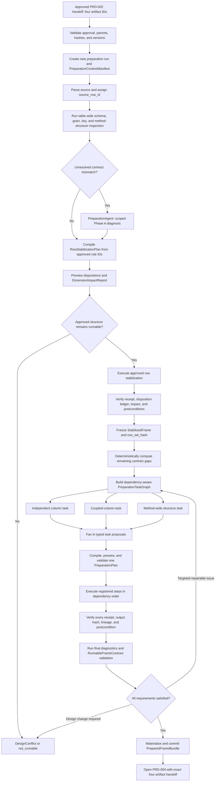
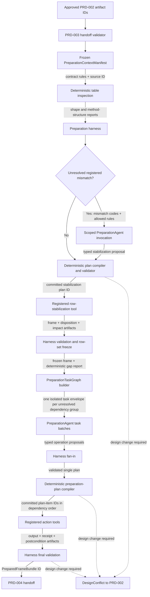

# PRD-003 — Runnable-frame preparation, row-set stabilization, and recoverable lineage

Status: final for implementation  
Product stage: post-design data preparation  
Depends on: `SYSTEM-CONTRACT.md`; PRD-001 — Kaggle intake, semantic availability, and storage; PRD-002 — causal
design harness and runnable-frame contract  
Unlocks: PRD-004 — estimation, post-estimation diagnostics, and claim judgment

Shared identities, envelopes, context isolation, persistence, retries, required LangSmith
behavior, operational events, and ask-user ownership are governed by `SYSTEM-CONTRACT.md`.

## 1. Outcome

Given the exact handoff approved in PRD-002, this stage produces either:

- a dimension-stable, lineage-complete `PreparedFrameBundle` that satisfies the approved
  `RunnableFrameContract`;
- a `DesignConflict` explaining why the approved design cannot be implemented without changing
  its population, method, estimand, roles, eligibility, or structural requirements; or
- a specific observability or technical failure that leaves every source and prior artifact
  unchanged.

Preparation has two ordered gates:

1. **Row-set stabilization:** admit only rows belonging to the approved population, remove only
   rows that are unusable under an approved deterministic rule, validate the resulting method
   structure, and freeze the exact row set.
2. **Cell and column preparation:** after the row set is frozen, apply only registered type,
   encoding, derivation, and imputation operations allowed by the contract.

No operation in the second gate may add, delete, duplicate, or aggregate the logical row set.
Imputation is considered only after the row dimension has passed its own validation wall.

## 2. Product decisions

1. The selected source CSV is immutable. Preparation always writes new content-addressed
   artifacts.
2. Every physical source row receives a stable `source_row_id` before any exclusion or repair.
3. Rows outside the approved target population or timeframe are `not_eligible`; they are not
   described as data-quality failures.
4. An eligible row is `unusable` only when a registered rule proves that it cannot satisfy a
   required, non-imputable part of the approved runnable-frame contract.
5. Statistical inconvenience is never an unusable-row reason. Outliers, poor overlap, imbalance,
   failed pre-trend checks, mass points, manipulation warnings, rare arms, or an undesirable
   estimate cannot justify deletion.
6. The row-stabilization engine is deterministic. No model chooses individual rows for removal.
7. Every removed row has exactly one primary disposition reason and may have additional warning
   codes. Free-text deletion reasons are forbidden.
8. The final row set is frozen by its ordered `source_row_id` list, row count, and hash. Every
   later artifact must reference that `row_set_hash`.
9. After the row-set freeze, a newly discovered row-level problem creates a new stabilization
   revision or a `DesignConflict`; it is never silently removed during imputation.
10. Original source columns remain recoverable. Prepared values and derived columns have
    cell-, column-, and operation-level lineage.
11. Imputation is allowed only for targets named by the approved contract. Treatment, primary
    outcome, assignment, identifiers, time, group, adoption time, running variable, cutoff,
    cluster, and stratum roles are never generically imputed.
12. V1 uses a small versioned imputation registry. It does not ask an agent to invent an
    imputation algorithm.
13. An imputation strategy may preserve missing values. Imputation is not mandatory merely
    because a value is missing.
14. Imputation may not use a post-treatment variable or the primary outcome to fill a baseline
    causal covariate.
15. Required diagnostics run before stabilization, after stabilization, and after permitted
    repair. Passing a later diagnostic cannot erase an earlier warning.
16. PRD-003 may implement an approved design or reject it through `DesignConflict`. It cannot
    reinterpret or edit the design.
17. PRD-003 performs no treatment-effect estimation, method switching, causal judgment, or
    visualization.
18. LangSmith is required for sanitized preparation traces, model text, evaluation, and
    operational debugging. It is not product storage, workflow persistence, row/cell lineage, or
    handoff state.
19. A LangSmith preflight or operation-boundary flush failure produces `failed_observability`,
    preserves committed artifacts and receipts, and prevents any later task or PRD-004 handoff.
20. One bounded `PreparationAgent` role is invoked through isolated, task-scoped calls to
    investigate contract mismatches, propose a typed `PreparationPlan`, preview permitted
    operations, and invoke registered execution tools. It has no persistent private memory.
21. The agent never edits a dataframe directly. Every mutation tool accepts only a committed plan
    item ID, expected input hash, and registered operation parameters.
22. Tool execution is proven by an immutable `ExecutionReceipt`, a new output artifact, and an
    independent passing postcondition report. The graph cannot advance without all three.
23. Agent-selected actions remain inside the approved contract and method pack. A mismatch that
    requires a new eligibility rule, target population, grain, protected-role repair, or method
    returns to PRD-002 as a `DesignConflict`.
24. PRD-003 creates a new `graph_thread_id`. It links to PRD-002 artifacts but never reuses the
    PRD-002 graph thread, checkpoint, agent messages, scratch context, or design conversation.
25. A frozen `PreparationContextManifest` compiles the exact approved design facts needed for
    preparation. Model calls receive scoped references from this manifest, not the entire PRD-002
    artifact tree.
26. PRD-003 does not launch one agent task for every column. It fans out only unresolved,
    independently repairable column or dependency-group mismatches after deterministic triage.
27. Eligibility, disposition, key/grain validation, method structure, row freezing, plan
    reconciliation, final validation, and commit are table-wide ordered stages.
28. Parallel task calls share no mutable state. Their typed outputs fan into one validated plan;
    mutations then execute in dependency order against exact immutable input hashes.
29. PRD-003 never interrupts the user. A semantic or design issue becomes a typed
    `DesignConflict` routed to PRD-002's centralized ask gate or design-revision path.

## 3. Scope

### 3.1 In scope

- opening and verifying the PRD-002 handoff;
- parsing the selected CSV with the approved parser and schema contract;
- assigning stable physical row identities;
- evaluating approved population and timeframe eligibility rules;
- detecting corrupt, structurally invalid, and non-runnable rows;
- producing a complete row-disposition ledger;
- measuring deletion impact across method-specific dimensions;
- validating the method's minimum row and structural support;
- freezing and materializing the stabilized row set;
- agent-guided diagnosis of shape and encoding mismatches through bounded tools;
- proposing and validating a typed preparation, repair, and imputation plan;
- previewing each row or value-changing operation before execution;
- normalizing approved missing sentinels and encodings;
- applying approved type casts and derived-column operations;
- materializing permitted deterministic imputations or estimator-scoped imputation recipes;
- rerunning post-stabilization and post-repair diagnostics;
- recording row, cell, column, and artifact lineage;
- producing the `PreparedFrameBundle`; and
- returning design conflicts without mutating PRD-002 artifacts.

### 3.2 Out of scope

- selecting another source table;
- joining, unioning, or reconciling multiple tables;
- changing the causal question, method, estimand, treatment, outcome, population, or timeframe;
- inventing new eligibility or deletion rules;
- deleting outliers because of their values;
- propensity-score trimming not already specified by the approved design;
- selecting an RDD bandwidth;
- removing DiD periods, groups, or cohorts to improve a result;
- repairing evidence of non-random assignment, manipulation, or sorting;
- imputing a treatment, running variable, cutoff, group, time, assignment, or identifier role;
- unrestricted machine-learned imputation;
- effect estimation or post-estimation diagnostics;
- claim judgment, visualization, or final narrative generation; and
- modifying any PRD-001 or PRD-002 artifact.

## 4. Inputs and entry gate

The preparation workflow opens with exactly:

- `selected_csv_artifact_id`;
- `experiment_design_artifact_id`;
- `runnable_frame_contract_artifact_id`; and
- `design_approval_capacity_check_artifact_id` for the exact passing design-approval check.

Entry requires:

1. The PRD-002 `DesignOutcome.status` is `approved`.
2. All four artifacts and their parents exist and match their hashes.
3. The runnable-frame contract references the exact approved experiment-design hash, and the
   PRD-002 approval still binds the corresponding causal-graph view.
4. The selected CSV hash matches the PRD-001 artifact.
5. The selected method-pack, preparation-graph, task-envelope, prompt, model-profile, tool,
   schema, validator, repair-operation, diagnostic, and imputation registry versions are
   supported.
6. Every eligibility, mandatory exclusion, permitted imputation, and invalidation rule uses a
   registered identifier and valid parameters.
7. Required pre-repair diagnostics are present with an approved handling for `partial` or
   `not_computable` results.
8. No upstream artifact indicates that the source table was mutated.
9. The explicit delivery-capacity artifact has status `pass` and binds the exact approved design,
   method, visualization catalog, capacity registry, and versions in this handoff.

An invalid or unsupported handoff fails closed. PRD-003 never guesses a missing rule.

## 5. Outputs

### 5.1 Successful output

`PreparedFrameBundle` contains identifiers and hashes for:

- the selected immutable source CSV;
- the approved experiment design and runnable-frame contract;
- the exact passing design-approval `DeliveryCapacityCheck`;
- `PreparationContextManifest`, `PreparationTaskGraph`, and all `AgentTaskEnvelopeV1`
  preparation-task artifacts;
- `SourceRowIndex`;
- `EligibilityEvaluation`;
- `RowStabilizationPlan`;
- `RowDispositionLedger`;
- `DimensionImpactReport`;
- `RowSetFreeze`;
- `StabilizedFrame`;
- `PreparationPlan`;
- `RepairPlan`;
- `ImputationPlan`;
- `ExecutionReceiptBundle`;
- zero or more estimator-scoped preprocessing recipes;
- `CellTransformationLedger`;
- `PreparedFrame`;
- all required post-stabilization and post-repair diagnostics;
- `LineageManifest`; and
- the exact method-pack, parser, operation, imputation, prompt, model-profile, tool-registry,
  schema, and validator versions.

The bundle has one `row_set_hash`. The stabilized and prepared frames must share it.

### 5.2 Preparation outcome

`PreparationOutcome.status` is exactly one of:

| Status | Meaning |
|---|---|
| `prepared` | the prepared bundle satisfies the approved contract |
| `design_conflict` | preparation would require a material design revision |
| `not_runnable` | the approved rules leave insufficient structural support for the selected method |
| `failed_observability` | required LangSmith preflight or trace delivery failed; no PRD-004 handoff is readable |
| `failed` | a parser, storage, registry, or contract-integrity error prevented completion |

`design_conflict` returns to PRD-002. `not_runnable` does not authorize another method or a weaker
estimand; a new design requires a new PRD-002 revision and approval.

## 6. Definitions

### 6.1 Table dimensions

For this PRD:

- the **row dimension** is the membership of physical source observations represented by
  `source_row_id`, hashed in canonical physical-record order;
- the **column dimension** is the approved output schema, including raw-role references,
  prepared values, missingness flags, and permitted derived columns; and
- the **method structure** is the grouping imposed by the selected method, such as treatment arms,
  unit-time cells, or cutoff sides.

Row stabilization freezes membership, not presentation order. The stored prepared frame preserves
canonical source order. A downstream reader may create an explicitly sorted view without changing
`row_set_hash`.

### 6.2 Row disposition

Every source row receives exactly one terminal primary disposition:

| Disposition | Included in stabilized frame? | Meaning |
|---|---:|---|
| `retained` | yes | eligible and structurally usable |
| `retained_with_missingness` | yes | eligible; missing values have an allowed later strategy |
| `not_eligible_population` | no | outside the approved population rule |
| `not_eligible_timeframe` | no | outside the approved timeframe rule |
| `unusable_corrupt_record` | no | physical CSV record cannot be safely represented |
| `unusable_required_identity` | no | required row, unit, or compound key is absent or invalid |
| `unusable_required_role` | no | a method-required non-imputable role is absent or invalid |
| `unusable_grain_violation` | no | row cannot be reconciled to the approved grain using an allowed deterministic rule |
| `unresolved_conflict` | no | disposition cannot be decided without changing or clarifying the design |

The workflow cannot finish while any row has `unresolved_conflict`.

### 6.3 What is not an unusable row

The following observations are retained or cause a design-level conflict; they are never silently
classified as unusable:

- an extreme but parseable treatment, covariate, running-variable, or outcome value;
- a row that harms covariate balance or overlap;
- a row in a small treatment arm, cluster, group-time cell, cohort, or cutoff-side band;
- a row that weakens parallel-trends or continuity evidence;
- an RDD observation at a mass point or in a manipulation warning region;
- a post-treatment outcome that is missing in an RCT;
- a conflicting duplicate whose correct record cannot be deterministically established; or
- a row whose removal would be based on a realized outcome value.

## 7. End-to-end workflow



The row-set freeze is a hard gate. Post-freeze repair and imputation planning does not begin until
it exists. A targeted loop may revisit only the failed task and its dependants, and the two-attempt
limit from Section 17 still applies.

### 7.1 Connection to PRD-002

PRD-003 starts a new preparation run from exactly the four PRD-002 handoff identifiers:

```text
selected_csv_artifact_id
experiment_design_artifact_id
runnable_frame_contract_artifact_id
design_approval_capacity_check_artifact_id
```

The new preparation `graph_thread_id` records those IDs and their hashes as immutable parents. It
does not continue PRD-002's `graph_thread_id`. This creates a clear permission and context
boundary:

- PRD-002 owns semantic interpretation, causal roles, graph construction, method selection, and
  approval;
- PRD-003 may use those approved facts to prepare the table;
- PRD-003 cannot reinterpret them from raw context or edit them; and
- a required semantic or design change produces `DesignConflict` and a new PRD-002 revision.

PRD-003 inherits artifacts, not conversation memory. It does not inherit PRD-002 prompts,
agent messages, chain-of-thought, scratchpads, checkpoints, or the rendered causal-graph SVG. It
uses the approved structured causal-context, measurement-map, role-ledger, and graph references
reachable from `ExperimentDesign` when a preparation restriction depends on them.

### 7.2 Preparation context manifest

After validating the handoff, the harness compiles and freezes a `PreparationContextManifest`
containing only preparation-relevant approved context:

- selected CSV artifact ID, hash, parser profile, and approved source-table identity;
- causal question, population, timeframe, treatment, outcome, comparator, and estimand IDs;
- selected method and method-pack version;
- measurement-map and role-ledger artifact IDs and hashes;
- column-to-concept and column-to-role mappings needed for preparation;
- treatment, outcome, key, unit, time, group, cluster, stratum, assignment, adoption-time,
  running-variable, and cutoff column IDs when applicable;
- pre-treatment, post-treatment, protected, permitted-repair, and permitted-imputation column sets;
- approved table grain, primary or compound key, ordering, schema, and missingness requirements;
- approved population/timeframe eligibility and unusable-row rule IDs;
- method-specific structural requirements and invalidation rules;
- permitted repair, derivation, imputation, diagnostic, and fit-scope registry IDs;
- deletion-impact dimensions and required post-repair diagnostics;
- upstream approval, graph, schema, registry, and validator versions; and
- the manifest hash.

The manifest contains references and bounded contract facts, not a dataframe, raw rows, full
source documents, PRD-002 model conversations, or rendered visuals. It is authoritative for what
PRD-003 may place into a model task.

### 7.3 Context layers inside LangGraph

Context is managed in four layers:

| Layer | Contents | Lifetime |
|---|---|---|
| Run context | upstream IDs, `PreparationContextManifest` ID, selected method, phase, and registry snapshot | full preparation run |
| Stage context | current frame ID/hash, `row_set_hash`, gap report, plan ID, and validation status | one graph phase |
| Task context | one shared `AgentTaskEnvelopeV1` containing a typed `PreparationTaskContext` with relevant columns, dependencies, constraints, tools, and errors | one isolated agent invocation |
| Tool context | exact artifact IDs and bounded payload required by one registered tool call | one tool execution |

Only IDs, hashes, statuses, dependency edges, and attempt counts remain in LangGraph checkpoint
state. Payloads are loaded just in time through scoped tools and released when the node finishes.

The `PreparationTaskContext` payload contains:

- task ID, phase, task kind, parent manifest ID, and current frame ID/hash;
- one column ID, a related column group, or `table_wide` scope;
- exact contract-gap and validation codes to resolve;
- relevant roles, concepts, timing, protected status, and approved semantic evidence references;
- permitted operation and tool IDs;
- dependency task and plan-item IDs;
- expected structured output schema and postconditions;
- token, tool-call, retry, and correction budgets; and
- explicit stopping states: `proposed`, `needs_dependency`, `design_conflict`, or `failed`.

An invocation cannot retrieve sibling task context unless the dependency graph explicitly names
the sibling artifact as a parent.

### 7.4 Column fan-out policy

PRD-003 is not uniformly per-column.

The harness first evaluates the whole table and deterministically identifies contract gaps. It
then builds the smallest safe task graph:

| Scope | Examples | Execution policy |
|---|---|---|
| Single column | missing sentinel, type conversion, one-to-one category mapping | may plan in parallel when no dependency exists |
| Coupled columns | compound key, start/end dates, treatment plus assignment, unit plus time, derived post-period flag | one grouped task; never isolated per column |
| Recipe group | several covariates sharing an imputation fit scope or missingness indicators | one recipe task with all relevant targets |
| Table-wide | eligibility, row disposition, grain, duplicates, method support, row freeze, final contract validation | ordered parent-graph stage; never delegated per column |

Columns already satisfying the contract receive no agent task. Two column tasks may plan in
parallel only when they do not share an output, fit scope, key, derivation dependency, or
method-structure constraint.

The task graph may dispatch at most eight concurrent tasks. Additional independent gaps remain in
a deterministic queue under the same frozen task graph; raising concurrency never changes task
membership, inputs, or fan-in order.

Parallelism applies primarily to diagnosis and plan proposal. V1 executes accepted mutations in a
deterministic topological order, with an immutable input and output hash for every step. This avoids
concurrent writes and makes lineage and replay unambiguous.

### 7.5 Fan-in and reconciliation

Task outputs are proposals, not independent mini-plans that can mutate the table. The parent graph
fans them into one `PreparationPlan` and checks:

- conflicting operations on the same source or output column;
- duplicate or inconsistent category and sentinel mappings;
- derivation order and input availability;
- protected-role and post-treatment restrictions;
- fit-scope and leakage constraints;
- row-freeze invariance;
- method-pack structural requirements; and
- complete coverage of every runnable-frame gap.

Only the reconciled, committed plan unlocks mutation tools. A task failure revisits that task and
its dependants; it does not resend the entire dataset or all preceding context to the agent.

### 7.6 Context routing by preparation task

The preparation harness is the only router. `PreparationAgent` is one role invoked through
isolated task envelopes; the invocations are not persistent agents and do not communicate with
one another. Deterministic stages receive typed artifacts directly and do not require model
context.



| Receiver | Receives | May retrieve | Returns | Next destination |
|---|---|---|---|---|
| Handoff validator | four PRD-002 IDs, hashes, approval and registry versions | referenced approved parents | accepted handoff or integrity failure | manifest compiler |
| Deterministic table inspector | selected CSV ID, parser profile, runnable-frame requirements | source bytes through the storage boundary | structural reports and stable gap codes | preparation harness |
| Phase A preparation invocation | only table-wide mismatch codes, approved rule IDs, aggregate impact facts, and permitted tools | named inspection and preview artifacts | typed stabilization proposal or `DesignConflict` proposal | deterministic compiler |
| Post-freeze preparation task | `AgentTaskEnvelopeV1` with one `PreparationTaskContext` for a column, coupled group, recipe group, or table-wide gap | only envelope-allowlisted profiles, contract fragments, and registry entries | `AgentTaskResultV1` containing typed plan items, dependency request, conflict, or failure | harness fan-in |
| Registered action tool | committed plan-item ID and exact input artifact/hash | frozen operation parameters from the committed plan | output artifact, execution receipt, postcondition inputs | harness validator |
| Final validator | prepared frame, row-set hash, receipts, lineage, diagnostics, contract | immutable parents by exact ID | prepared bundle or typed terminal failure | PRD-004 handoff |

No preparation context is passed from one agent invocation directly to another. A dependency is
routed only as a validated artifact ID named in the downstream task envelope. The harness does
not resend the full manifest when correcting one task; it rebuilds the smallest packet containing
the failed plan item, stable validation codes, named parents, and permitted correction choices.

## 8. Source row identity and parsing

`source_row_id` is derived from:

- selected CSV artifact hash;
- one-based physical data-record number after the header; and
- a hash of the exact physical record bytes.

The record-byte hash detects parser drift or source corruption. The physical record number keeps
identical duplicate rows distinguishable.

`SourceRowIndex` records:

- source row ID;
- physical record number;
- record-byte hash;
- parser status;
- parsed field count;
- parse-warning codes; and
- parent CSV artifact ID and hash.

A malformed optional cell does not make an entire row corrupt. `unusable_corrupt_record` is
reserved for records whose quoting, delimiter structure, encoding, or field boundaries cannot be
safely represented by the pinned parser.

## 9. Phase A — row-set stabilization

### 9.1 Ordered evaluation

Rows are evaluated in this order:

1. physical parseability;
2. approved population eligibility;
3. approved timeframe eligibility;
4. required identity and grain fields;
5. method-required non-imputable roles;
6. exact duplicate and key-collision rules;
7. method-specific structural support; and
8. deletion-impact and invalidation rules.

The first applicable terminal rule becomes the primary disposition. All later observed conditions
are stored as warnings so counts remain reproducible without giving one row multiple primary
reasons.

### 9.2 Eligibility is not repair

Population and timeframe filters are copied verbatim from the approved runnable-frame contract.
PRD-003 may evaluate them but cannot broaden, narrow, or reinterpret them.

Rows failing these rules are reported separately from unusable rows. This separation prevents a
data-quality deletion from silently changing the target population.

### 9.3 Missing required values

A missing value causes row exclusion during stabilization only when all are true:

1. the column satisfies a required role in the approved contract;
2. the method's runnable-frame schema requires an observed value for that role;
3. the role is explicitly forbidden from imputation; and
4. the contract specifies a registered exclusion or non-contribution rule.

Otherwise the row is retained with visible missingness or preparation stops with
`DesignConflict`.

### 9.4 Duplicates and grain

- Byte-identical duplicate records remain distinct unless the approved contract explicitly
  authorizes exact-record deduplication.
- Duplicate keys are not enough to choose a record for deletion.
- A deterministic aggregation is forbidden in V1.
- Conflicting rows sharing a required unique key produce `DesignConflict` unless an approved
  registry rule can identify the invalid record without outcome-dependent judgment.
- For repeated-observation methods, expected repetition is validated against the compound key and
  is not treated as duplication.

### 9.5 Dimension impact report

Before any new frame is written, the workflow reports retained and excluded counts across every
dimension named by the contract. Common dimensions are:

- overall rows and unique analysis units;
- eligibility versus unusable reason;
- treatment arm or exposure group;
- outcome-observed status;
- important prespecified subgroups;
- cluster and stratum;
- time period and pre/post status;
- adoption cohort;
- cutoff side and registered distance-to-cutoff bands; and
- any target-population dimension whose composition could change.

There is no universal acceptable deletion percentage. The selected method pack and approved
contract define minimum support, invalidation, and user-review conditions.

### 9.6 Row-set freeze

`RowSetFreeze` contains:

- ordered retained `source_row_id` artifact ID;
- retained row count and unique-unit count;
- `row_set_hash`;
- disposition-ledger artifact ID and hash;
- dimension-impact artifact ID and hash;
- method-structure validation result;
- selected method-pack and contract versions; and
- freeze timestamp and implementation version.

After the freeze:

- no operation may change row membership;
- no operation may change a source row ID;
- a repair may add prepared or indicator columns but not source observations; and
- every frame and diagnostic must assert the same `row_set_hash`.

## 10. Phase B — repair and imputation

### 10.1 Preparation and repair-plan compilation

The bounded `PreparationAgent` receives:

- the approved runnable-frame contract and selected method-pack preparation manifest;
- the stabilized-frame schema and typed structural profiles;
- stable validator and diagnostic codes;
- the repair and imputation registries; and
- bounded tool outputs needed to diagnose a mismatch.

It proposes the post-freeze revision of a typed `PreparationPlan` containing ordered repair,
derivation, imputation, diagnostic, and final-validation steps. Phase A's
`RowStabilizationPlan` is compiled directly from the approved PRD-002 rule IDs before any row
action. A deterministic compiler validates the post-freeze plan against:

- the approved runnable-frame schema;
- column semantic cards and missing-sentinel claims from PRD-002;
- permitted and forbidden repair boundaries;
- the selected method-pack manifest;
- the stabilized frame profile; and
- the versioned repair and imputation registries.

Each proposed operation records its target, reason, parameters, allowed source roles, output
column, fit scope, expected missingness change, expected shape, and required postcondition. A plan
containing an unregistered or forbidden operation is invalid. The agent can select among permitted
registered operations; it cannot invent an operation implementation or causal rule.

### 10.2 Permitted V1 operations

V1 may use only registered forms of:

- approved missing-sentinel normalization to null;
- lossless or explicitly approved type conversion;
- approved category-label normalization;
- deterministic boolean or indicator derivation;
- approved date/time component derivation;
- method-required structural flags such as `outcome_observed`, `post_period`, or `cutoff_side`;
- numeric median imputation with a missingness indicator;
- categorical explicit-missing-level encoding; and
- an estimator-scoped imputation recipe when fitting on the full frame would create leakage.

Every transformation writes recoverable lineage. The original CSV is never overwritten.

### 10.3 Forbidden V1 operations

- arbitrary code or user-supplied functions;
- outcome-dependent row or value selection;
- winsorization, trimming, clipping, or outlier deletion unless already an approved measurement
  definition rather than a repair;
- treatment-effect-guided transformations;
- using post-treatment information to fill a baseline covariate;
- filling treatment, assignment, identifier, group, time, adoption-time, running-variable,
  cutoff, cluster, or stratum roles;
- interpolating missing DiD outcomes or synthesizing unit-period rows;
- smoothing an RDD running variable or repairing manipulation evidence;
- silently combining rare categories;
- forward/back filling across units or from future periods; and
- any operation that changes the frozen row set.

## 11. V1 imputation strategy

### 11.1 Common rules

V1 deliberately uses a small, auditable strategy:

1. Impute only columns that the approved contract explicitly permits.
2. Prefer preserving missingness when the estimator can accept it or the column is optional.
3. For a required numeric pre-treatment covariate, use a registered median calculation and add a
   missingness indicator.
4. For a required categorical pre-treatment covariate, use a reserved explicit missing category.
5. Do not use treatment, primary outcome, or post-treatment variables as imputation predictors.
6. Record the fit population, input columns, grouping, learned values, and implementation version.
7. Re-run missingness, distribution, and method diagnostics after imputation.

Multiple imputation, chained equations, and generative imputation are deferred from V1. A method
pack may require an estimator-scoped recipe instead of a globally completed column.

### 11.2 Fit scopes

`ImputationPlan.fit_scope` is one of:

| Scope | Meaning |
|---|---|
| `none` | missing values are preserved |
| `frozen_frame_blinded` | fit once on the frozen frame without treatment or outcome inputs |
| `pre_treatment_only` | fit only from approved pre-treatment observations and variables |
| `cross_fit_training_fold` | PRD-004 fits the recipe separately inside each training fold |

The plan is compiled in PRD-003. A `cross_fit_training_fold` recipe is executed by PRD-004 so no
validation fold contributes learned preprocessing values to its own nuisance model.

### 11.3 Cell lineage

For every changed or imputed cell, `CellTransformationLedger` records:

- frozen source row ID;
- source and output column IDs;
- operation ID and version;
- plan item ID;
- source-value hash and output-value hash;
- missingness before and after;
- fitted-parameter artifact ID when applicable; and
- parent stabilized-frame and row-set hashes.

Large ledgers are immutable object artifacts. PostgreSQL stores their identities, pointers,
counts, relationships, and statuses rather than duplicating cell values.

## 12. Workflow for the four supported analyses

All four methods use the common workflow. Their method packs change only the required structure,
unusable-row rules, protected columns, imputation scope, and validation dimensions.

| Method | Row-set priority | Never repaired away | V1 imputation position |
|---|---|---|---|
| randomized experiment | preserve the randomized population | attrition, noncompliance, crossover | optional baseline covariates only |
| observational AIPW | preserve the approved target population and one-row-per-unit grain | poor overlap or extreme propensity | confounders inside cross-fitting |
| difference-in-differences | preserve required group-time support | inconvenient periods, groups, or cohorts | approved pre-treatment covariates only |
| sharp RDD | preserve both cutoff sides and the running-variable distribution | mass points, sorting, or manipulation warnings | optional predetermined covariates only |

### 12.1 Randomized experiment

#### Row stabilization

- Apply only pre-randomization population and eligibility rules approved in PRD-002.
- Validate the randomization unit, treatment assignment, arms, clusters, blocks, and strata.
- Do not remove a randomized unit because of noncompliance, crossover, post-randomization
  ineligibility, treatment received, or realized outcome.
- An unresolved randomized assignment or cluster mapping is a design/integrity conflict, not a
  convenient deletion.
- Retain missing primary outcomes as attrition with `outcome_observed=false`; do not silently
  remove them from the stabilized population.
- Measure losses and missingness by arm, cluster, stratum, and approved subgroup.

#### Imputation

- Preserve randomized treatment exactly.
- Baseline precision covariates may use blinded pooled median-plus-indicator or explicit missing
  category strategies when the contract permits.
- Primary-outcome imputation is not a generic PRD-003 repair. If required, it must be a separately
  approved outcome-missingness strategy and sensitivity contract executed in PRD-004.
- Compliance and post-treatment variables are not imputed as baseline adjusters.

#### Required preparation result

The prepared bundle preserves the randomized population, identifies outcome attrition, and makes
arm/cluster/stratum composition visible without changing the ITT population.

### 12.2 Observational AIPW

#### Row stabilization

- Enforce one row per approved analysis unit.
- Apply the approved target-population and timeframe eligibility rules.
- V1 primary AIPW requires observed binary treatment and primary outcome. Rows failing an
  approved observed-role requirement receive the registered disposition; their loss is reported
  by treatment and target-population dimensions.
- Retain rows with missing permitted pre-treatment confounders for the imputation stage.
- Do not delete rows because their estimated propensity may be extreme.
- Propensity trimming is not repair. It is allowed only when already encoded as an approved
  target-population rule in PRD-002.

#### Imputation

- Treatment and primary outcome are never imputed.
- Required pre-treatment confounders use a `cross_fit_training_fold` recipe by default.
- Numeric covariates use training-fold median plus a missingness indicator.
- Categorical covariates use an explicit missing level established inside the training fold's
  preprocessing pipeline.
- Mediators, colliders, instruments excluded by design, and post-treatment variables cannot enter
  the imputation predictor set.

#### Required preparation result

The prepared bundle has a fixed target-population row set, an evidence-backed adjustment schema,
and a leakage-safe preprocessing recipe that PRD-004 must fit inside cross-fitting.

### 12.3 Difference-in-differences

#### Row stabilization

- Validate the approved grain as unit-period or repeated cross-section.
- Validate unit/time or repeated-cross-section keys, treated/comparison group, adoption time,
  pre/post periods, and clustering unit.
- Never remove an entire period, group, adoption cohort, or inconvenient group-time cell without
  design revision.
- Never synthesize a missing unit-period observation to make a panel appear balanced.
- Missing outcomes remain visible in the disposition and support reports. Whether an incomplete
  row can remain in the estimator input is controlled by the approved panel/repeated-cross-section
  schema.
- After mandatory exclusions, revalidate required group-time cells, pre-period count, post-period
  count, cohort support, composition, and cluster support.

#### Imputation

- Unit, time, group, adoption time, treatment status, and outcome are never generically imputed.
- Approved baseline or pre-treatment covariates may be imputed from pre-treatment information
  only.
- Forward fill, backward fill, future-value leakage, and outcome interpolation are forbidden.
- A changing panel composition warning remains visible even if allowed covariates become complete.

#### Required preparation result

The prepared bundle preserves the observed group-time structure, identifies every missing cell or
unsupported cell, and proves that no period, cohort, or group was removed to improve the design.

### 12.4 Sharp regression discontinuity

#### Row stabilization

- Validate the running variable, cutoff, assignment direction, outcome, and required row identity.
- Running-variable and primary-outcome values required by the estimator are never imputed.
- Do not delete observations because they are far from or close to the cutoff; bandwidth belongs
  to the approved design and PRD-004 estimator.
- Do not remove mass points, heaping, sorting, manipulation warnings, or treatment-assignment
  contradictions. A contradiction to sharp assignment creates `DesignConflict`.
- Outcome-dependent and asymmetric discretionary deletion around the cutoff are forbidden.
- Report all losses by cutoff side and approved distance-to-cutoff bands before freezing.

#### Imputation

- Running variable, cutoff, assigned treatment, observed treatment, and outcome are protected.
- Optional predetermined covariates preserve missingness by default.
- If the contract requires complete adjustment covariates, V1 may use blinded pooled
  median-plus-indicator or explicit-missing-category strategies; the plan must not create or hide
  a discontinuity at the cutoff.

#### Required preparation result

The prepared bundle preserves the running-variable distribution and cutoff evidence, with no
repair that can manufacture continuity, sharpness, or support.

## 13. Shared method-pack preparation contract

Each method-pack manifest must add:

- permitted row-disposition rule IDs;
- protected role and column IDs;
- required observed-role rules;
- row and unique-unit minimums;
- required structure and cell-support gates;
- dimension-impact report dimensions;
- invalidation and design-conflict rules;
- permitted repair-operation IDs;
- permitted imputation targets and fit scopes;
- required missingness indicators;
- required post-stabilization and post-repair diagnostics;
- prepared-frame schema ID; and
- PRD-004 estimator input contract ID.

Adding another analysis method means adding a conforming method pack. It does not change the
common row-freeze or lineage workflow.

## 14. Validation walls

Artifacts pass in this order:

1. **Handoff wall:** approved design, selected CSV, hashes, and versions match.
2. **Parse wall:** every physical record has a stable identity and terminal parse status.
3. **Eligibility wall:** only approved population and timeframe rules were evaluated.
4. **Disposition wall:** every row has exactly one registered terminal disposition.
5. **Impact wall:** losses and composition are reported across every required dimension.
6. **Method-structure wall:** the retained data preserve the selected method's minimum support.
7. **Row-freeze wall:** the exact retained row set and hash are immutable.
8. **Repair-plan wall:** every operation and target is registered and contract-permitted.
9. **Execution wall:** every action resolves to a committed plan item, immutable receipt, output
   artifact, and passing postcondition report.
10. **Lineage wall:** every changed cell and derived column resolves to source and operation
   artifacts.
11. **Row-invariance wall:** stabilized and prepared frames have the same `row_set_hash`.
12. **Diagnostic wall:** all required post-stabilization and post-repair diagnostics completed
    with approved handling.
13. **Runnable-frame wall:** the final schema, roles, keys, missingness behavior, and method
    structure match the approved contract.

An earlier wall cannot be waived because a later diagnostic looks favorable.

## 15. Diagnostics

Every diagnostic result records:

- diagnostic ID and version;
- input frame stage: `source`, `stabilized`, or `prepared`;
- source CSV, frame, and row-set artifact IDs and hashes;
- columns read;
- total, used, and unused counts;
- unused reason counts;
- method-specific denominators;
- values, warnings, and terminal status; and
- deterministic implementation version.

Required common diagnostics include:

- row-disposition counts and reconciliation;
- key uniqueness and grain validation;
- schema/type validation;
- missingness before and after repair;
- row-set invariance;
- changed-cell counts by operation and column; and
- contract-completeness validation.

Method-specific diagnostics are inherited from the approved method pack. PRD-003 does not add a
diagnostic because it would be favorable to the selected analysis.

## 16. Design conflicts

`DesignConflict` contains:

- stable conflict code;
- exact failed contract rule;
- affected row, unit, and method-dimension counts;
- relevant artifact IDs and hashes;
- why no permitted PRD-003 operation can resolve it;
- the material design fields that would need revision; and
- whether PRD-002 should ask the user, revise the design, or refuse the analysis.

Examples include:

- required unique grain cannot be established;
- mandatory exclusions destroy a required treatment arm or group-time cell;
- a sharp-RDD assignment contradiction is observed;
- approved AIPW adjustment columns cannot be prepared under their allowed missingness rules;
- RCT records imply an unapproved post-randomization exclusion;
- a DiD period or cohort would need to be removed;
- a protected role would need imputation; or
- a permitted repair would change the target population or row set.

PRD-003 never resolves a conflict by selecting another method or editing the approved contract.

## 17. Preparation agent, tool surface, and execution control

PRD-003 uses LangGraph as a replay-safe control harness around one bounded `PreparationAgent` role,
registered preparation tools, independent validators, durable checkpoints, and immutable artifact
commits. The role may be invoked concurrently for independent task envelopes; each invocation is
isolated and has no persistent memory or shared mutable context.

The agent's job is to make the approved contract operational. It diagnoses why the current frame
does not yet match the required shape, chooses among contract-permitted registered operations,
previews their impact, executes committed plan steps, and reacts to typed validation failures. It
does not receive a dataframe editor, arbitrary query surface, or code runner.

### 17.1 Inspection and diagnosis tools

| Agent-facing tool | Returns | Important boundary |
|---|---|---|
| `get_preparation_contract` | required grain, key, roles, schema, eligibility, protected fields, permitted operations, diagnostics, and method structure | exact approved versions only |
| `inspect_frame_structure` | row/column counts, schema, types, ordering, candidate keys, repeated structure, and stable artifact hash | no dataframe payload |
| `inspect_column_profile` | type compatibility, missingness, bounded cardinality/frequency summary, parse patterns, and registered semantic references | identifiers and sensitive/small values suppressed |
| `diagnose_key_collisions` | collision classes, duplicate-pattern counts, affected dimensions, and resolvability codes | no arbitrary first/last resolution |
| `get_method_structure_report` | arm, group-time, cohort-period, unit-time, cluster, or cutoff-side support required by the selected method | aggregate structural evidence only |
| `get_shape_validation_report` | exact runnable-frame mismatches with stable rule codes and implicated roles/columns | validator output, not model judgment |
| `get_operation_registry` | permitted operation IDs, schemas, phase, targets, preconditions, and postconditions | filtered by the approved contract and method pack |
| `get_preparation_artifact` | one typed plan, preview, receipt, diagnostic, lineage-summary, or validation artifact | exact artifact ID; no generic context dump |

`inspect_column_profile` may return bounded, policy-approved category or parse-pattern examples when
they are required to select a registered mapping. It never returns unrestricted rows, identifiers,
or treatment/outcome record samples.

### 17.2 Preview and plan-validation tools

| Agent-facing tool | Returns | Important boundary |
|---|---|---|
| `preview_row_stabilization` | proposed disposition counts, rule IDs, retained row-set candidate hash, and dimension impact | evaluates only eligibility and unusable-row rules already approved in PRD-002 |
| `preview_repair_step` | expected type/schema/missingness changes, affected-cell count, warnings, and postconditions for one registered plan item | no write occurs |
| `preview_imputation_step` | permitted target, fit scope, missingness change, indicator behavior, and leakage guards | no fitted values enter model context |
| `preview_preparation_plan` | ordered step dependencies, expected intermediate shapes, registry coverage, and conflicts | every step must have a stable plan-item ID |
| `validate_preparation_plan` | schema, permission, ordering, role, row-freeze, leakage, and method-pack errors | deterministic validator; cannot rewrite the plan |
| `get_dimension_impact_report` | overall and method-specific population/composition impact for a preview | suppressed aggregates; never row identities |

No mutation tool becomes callable for a plan item until its preview exists, its preconditions pass,
and the plan revision is committed.

### 17.3 Row-set action tools

| Agent-facing tool | Action | Required arguments and guard |
|---|---|---|
| `execute_approved_row_stabilization` | applies all approved eligibility and unusable-row rules and writes the candidate stabilized frame plus `RowDispositionLedger` | committed `RowStabilizationPlan` ID, preview ID, exact source hash; no row IDs or free-text predicates accepted |
| `run_stabilized_structure_validation` | validates dimensions and method support on the candidate stabilized frame | candidate frame ID and expected preview hash |

The following high-impact transition is harness-only:

| Harness-only tool | Action | Guard |
|---|---|---|
| `freeze_row_set` | commits `StabilizedFrame`, ordered retained `source_row_id` set, and `row_set_hash` | passing disposition, impact, and method-structure reports |

The agent can invoke approved row stabilization, but it cannot name individual rows, write a
predicate, or invent a deletion reason. The tool derives membership exclusively from versioned
rules in the committed plan and contract.

### 17.4 Cell and column action tools

Every action below accepts only `plan_item_id`, `expected_input_artifact_id`, and
`expected_input_hash`. The complete operation parameters are already frozen in the validated plan;
the call cannot override them.

| Agent-facing tool | Action | Registered V1 boundary |
|---|---|---|
| `execute_missing_sentinel_normalization` | converts an approved sentinel encoding to null | exact target column and sentinel mapping from PRD-002 evidence |
| `execute_type_conversion` | creates an approved typed prepared column | lossless or explicitly approved conversion profile |
| `execute_category_normalization` | creates an approved normalized category column | explicit one-to-one mapping; no silent rare-category combination |
| `execute_registered_derivation` | creates an approved indicator, date/time component, or method-required structural flag | registered derivation ID; no free-form expression |
| `execute_numeric_imputation` | applies the registered median-plus-missing-indicator recipe | permitted pre-treatment numeric target and approved fit scope only |
| `execute_categorical_missing_encoding` | writes the registered explicit-missing category | permitted pre-treatment categorical target only |
| `register_estimator_scoped_preprocessing` | writes a recipe for later fold-scoped execution in PRD-004 | records recipe only; does not fit on the full frame |

Each action writes a new immutable intermediate-frame artifact. It never overwrites the stabilized
frame or a preceding intermediate frame.

### 17.5 Diagnostic and completion tools

| Agent-facing tool | Returns or action | Important boundary |
|---|---|---|
| `run_preparation_diagnostic` | one registered diagnostic artifact for a declared frame stage | selected diagnostic ID only; no arbitrary metric |
| `validate_intermediate_frame` | step postconditions, undeclared-change detection, lineage completeness, and row-set invariance | required after every mutation |
| `validate_runnable_frame` | complete schema, grain, key, role, missingness, method-structure, and row-set report | exact approved contract only |
| `request_design_conflict` | typed proposed conflict with failed rules and evidence artifact IDs | harness validates before commit or PRD-002 return |

Final materialization and commit remain harness-only:

| Harness-only tool | Action | Guard |
|---|---|---|
| `materialize_prepared_frame` | freezes the final typed prepared frame | all plan steps terminal and full runnable-frame validation passed |
| `commit_prepared_frame_bundle` | atomically commits the bundle and PRD-004 handoff | all artifact, lineage, receipt, version, and hash checks passed |

### 17.6 Execution receipts and postconditions

Every action tool returns an immutable `ExecutionReceipt` containing:

- preparation `stage_run_id`, plan, plan-item, tool, and operation IDs;
- exact input artifact ID and hash;
- exact output artifact ID and hash;
- implementation, registry, and runtime versions;
- declared parameters hash;
- before/after shape and row-set hash;
- examined, changed, derived, imputed, retained, or disposition counts as applicable;
- row-, cell-, and column-lineage artifact IDs;
- warning and error codes;
- start/end timestamps, attempt ID, and idempotency key; and
- terminal status.

The graph advances past a mutation only when all three independently exist and agree:

```text
immutable ExecutionReceipt
        + immutable output artifact
        + passing postcondition/lineage report
```

The harness reopens the output artifact for validation. A receipt stating success cannot substitute
for a missing output, a hash mismatch, an undeclared change, or a failed postcondition.

### 17.7 Graph state and permissions

Persistent graph state contains only:

- analysis ID, preparation stage-run ID, new graph-thread ID, and parent design-stage reference;
- upstream artifact IDs;
- `PreparationContextManifest` and `PreparationTaskGraph` artifact IDs;
- active task-envelope, dependency, and terminal task-output IDs;
- committed plan and plan-item IDs;
- current phase and validation-wall status;
- current preview, frame, receipt, lineage-summary, and diagnostic artifact IDs;
- row-set hash after stabilization;
- correction count and conflict IDs; and
- final preparation status.

Dataframes, raw values, row dispositions, cell ledgers, fitted imputation values, and model context
are artifact payloads, not graph state.

The preparation agent may use only the tools listed as agent-facing above. It may not:

- retrieve from Kaggle;
- edit source, design, approval, plan, registry, receipt, or validation artifacts directly;
- pass row IDs, free-form predicates, expressions, executable code, or replacement values to an
  action tool;
- execute arbitrary Python, SQL, shell, notebook, or model-generated code;
- call an estimator or visualization renderer;
- expose or receive a generic dataframe-mutation tool; or
- advance, freeze, materialize, approve, or commit the workflow without the harness guards.

One targeted correction may revise only invalid plan items and their dependants. V1 allows one
initial response plus at most two agent corrections for the same plan item and validation code.
Repeated failure returns a typed `DesignConflict`, `not_runnable`, or `failed` outcome; it never
broadens tool permissions.

## 18. LangSmith wiring

### 18.1 Boundary

LangSmith is the required debugging, tracing, evaluation, and monitoring surface for the
preparation workflow. PostgreSQL and object storage remain authoritative for artifacts, row and
cell lineage, validation status, conflicts, and the PRD-004 handoff.

A LangSmith health/authorization preflight must pass before the graph starts. Every node, agent
call, registered tool, validator, artifact commit, and handoff operation emits
`OperationalEventV1`, closes its span, and receives a flush acknowledgement before later work can
start. Failure produces `failed_observability`, preserves committed outputs and receipts, and
stops the graph. A trace cannot approve an exclusion, alter a repair plan, change a row-set hash,
resolve a design conflict, or make a handoff readable.

If the required preparation-agent model service is unavailable, the current physical attempt is
recorded immediately. Only the shared same-identity transient-attempt bound applies. Exhaustion
emits `blocker.raised`, terminates the stage attempt, and preserves completed deterministic
artifacts and receipts. A later explicit attempt may start after service recovery; the harness
never substitutes another model, provider, prompt, or planning mode.

PRD-003 combines bounded agent planning with deterministic tools and validators. LangSmith evaluates
both the agent's plan/tool behavior and the execution invariants. It does not approve a plan, act
as the mutation ledger, or decide whether an individual row is unusable.

### 18.2 Trace hierarchy

One LangSmith thread maps to one preparation run. Each invocation or resume is one trace. Child
runs represent:

- PRD-002 handoff validation;
- preparation-context-manifest compilation;
- contract-gap triage and preparation-task-graph construction;
- source parsing and `SourceRowIndex` creation;
- each bounded preparation-agent invocation and targeted correction;
- scoped task fan-out, task completion, and deterministic fan-in;
- inspection, diagnosis, preview, and plan-validation tool calls;
- population and timeframe eligibility evaluation;
- required-role, identity, grain, and usability classification;
- `RowDispositionLedger` compilation;
- dimension-impact calculation;
- method-structure validation;
- `RowSetFreeze` creation;
- repair-plan and imputation-plan compilation;
- each registered transformation or imputation operation;
- execution-receipt and postcondition validation;
- estimator-scoped preprocessing-recipe compilation;
- post-stabilization and post-repair diagnostics;
- validation-wall execution;
- immutable artifact commits; and
- PRD-004 handoff validation and commit.

A retry uses the same preparation run and operation IDs so traces can reveal replay behavior
without creating a second product artifact.

### 18.3 Tags and safe metadata

Required trace metadata includes only:

- environment;
- analysis, preparation stage-run, graph-thread, task, attempt, and parent-event IDs;
- selected method and method-pack version;
- upstream artifact IDs and hashes;
- preparation-context-manifest and task-graph IDs and hashes;
- task-envelope ID, scope kind, dependency count, and parent task IDs;
- parser, schema, repair-operation, imputation, diagnostic, and validator registry versions;
- preparation-agent prompt, model-profile, output-schema, and tool-registry versions;
- graph stage and validation-wall identifier;
- rule, plan-item, operation, diagnostic, and conflict IDs;
- source, retained, excluded, changed-cell, and derived-column counts;
- row-set hash after stabilization;
- operation status, warning/error codes, latency, and retry count; and
- final preparation and handoff status.

Counts must be aggregated enough that trace metadata cannot reconstruct sensitive rows or small
cells. Environment-specific minimum-reporting rules may suppress or coarsen small counts without
changing the authoritative product artifacts.

### 18.4 Trace privacy

Production tracing uses the shared explicit allowlist. LangSmith records the complete
model-facing `PreparationTaskContext`, prompt, and returned response only after task-envelope
allowlisting and a second trace-redaction pass. It must never emit:

- credentials, secrets, signed object URLs, or database connection values;
- CSV record bytes, raw rows, cell values, or source-value samples;
- stabilized or prepared dataframes;
- row-level disposition ledgers or cell-level transformation ledgers;
- imputation fill values, fitted medians, category values, or predictor matrices;
- unrestricted user-provided documents or user context;
- full repair, diagnostic, lineage, or conflict payloads; or
- unrestricted preparation-context manifests or non-model task-envelope payloads;
- hidden chain-of-thought or private scratch reasoning; or
- object-storage payloads.

Auto-instrumented function inputs and outputs are disabled unless they pass the same sanitizer.
Traces also contain task-envelope IDs/hashes, redaction-policy version, bounded aggregate counts,
artifact identifiers, statuses, validation paths, errors, timings, tokens, and costs.

Separate LangSmith projects are used for development, staging, and production. Synthetic and
offline evaluation runs are not mixed with production traces. Trace retention is observability
retention, not artifact or lineage retention, and is fixed at 30 days.

### 18.5 Evaluation and monitoring

This stage inherits every hard gate and release rule in `SYSTEM-CONTRACT.md` Section 10.5.
Offline evaluation covers fixtures for all four method packs and checks that:

- only approved eligibility and unusable-row rules execute;
- PRD-003 starts a new thread and inherits approved artifact references rather than PRD-002 model
  messages, checkpoints, or scratch context;
- deterministic triage creates no unnecessary column task and groups coupled columns correctly;
- parallel task envelopes cannot access undeclared sibling context or share mutable state;
- task fan-in rejects conflicting operations and incomplete runnable-frame-gap coverage;
- the agent uses only its stage-specific allowlist and cannot pass row IDs, predicates, code, or
  replacement values to action tools;
- every plan item is registered, previewed, validated, and ordered before execution;
- every action has a matching receipt, output hash, lineage artifact, and passing postcondition;
- identical inputs produce identical disposition, row-set, plan, and frame hashes;
- statistical inconvenience never becomes a deletion reason;
- the row set does not change after `RowSetFreeze`;
- protected roles are never imputed;
- every transformation has complete lineage;
- method-specific preparation guards remain intact; and
- invalid handoffs, conflicts, and registry mismatches fail closed.

Sanitized production traces monitor agent schema failures, correction counts, forbidden-tool
attempts, failure rates, conflict codes, diagnostic completion, validation-wall failures, missing
or inconsistent receipts, retries, operation latency, artifact-commit latency, and handoff status.
Monitoring can alert operators but cannot mutate, approve, or invalidate a preparation artifact.

### 18.6 Operational event map

| Preparation boundary | Required event pair or terminal event | Required safe references |
|---|---|---|
| handoff and manifest validation | `task.started`, `task.completed`, `task.failed` | upstream IDs/hashes, manifest ID, validation codes |
| table inspection and task-graph build | `task.started`, `task.completed`, `task.failed` | frame ID/hash, gap codes, dependency counts |
| preparation-agent invocation | `agent.started`, `agent.schema_failed`, `agent.correction_requested`, `task.completed`, `task.failed` | task-envelope ID, scope IDs, attempt, schema paths |
| registered action | `tool.started`, `tool.completed`, `tool.denied`, `tool.failed` | plan-item ID, input/output IDs and hashes, receipt ID |
| validation wall | `artifact.committed`, `artifact.validation_failed` | wall ID, report ID, stable errors |
| row-set freeze | `artifact.committed` | row-set hash and aggregate counts only |
| retry or blocker | `retry.scheduled`, `retry.exhausted`, `blocker.raised` | task/idempotency identity, attempt, stable error code |
| PRD-004 handoff | `handoff.accepted`, `handoff.rejected` | exact bundle/design/contract/capacity-check IDs and compatibility codes |
| trace failure | `observability.delivery_failed`, `blocker.raised`, `stage.failed` | safe fingerprint and `failed_observability` |

Each row is emitted as `OperationalEventV1` JSON and mirrored into the required LangSmith span.

### 18.7 Evaluation surfaces

These registrations inherit the bounded policy in `SYSTEM-CONTRACT.md` Section 10.5.2. Mutation,
receipt, lineage, and method-wall behavior is tested deterministically; live Vertex evaluation is
limited to the four representative preparation-planning cases.

| Eval ID | Boundary and owner | Required fixture focus | Trigger | Hard pass condition |
|---|---|---|---|---|
| `EV-P3-001` | entry gate, context manifest, and gap triage — preparation harness | exact/stale handoffs, no gap, independent gaps, coupled gaps, forbidden prior-stage memory | entry/context/triage change + release | exact context only; a satisfied contract creates no agent task |
| `EV-P3-002` | row identity, eligibility, stabilization, and freeze — stabilization component | duplicate keys, ineligible rows, unusable rows, missing protected roles, and replay | stabilization/rule change + release | every source row has one disposition and the frozen row-set hash is reproducible |
| `EV-P3-003` | preparation task fan-out and context isolation — preparation harness | independent/coupled dependencies, sibling access, row/value leakage, and scope expansion | planning graph/context/tool change + release | correct grouping, maximum bound, and no undeclared context or action authority |
| `EV-P3-004` | proposal fan-in and plan validation — plan compiler | conflicts, incomplete gap coverage, invalid order, unregistered operations, and forbidden replacement values/code | prompt/schema/plan/registry change + release | one complete conflict-free topological plan or typed `DesignConflict` |
| `EV-P3-005` | sequential mutation, receipts, and postconditions — execution component | every registered operation, failed preview, hash mismatch, partial mutation, replay, and attempted parallel mutation | operation/execution change + release | sequential execution only; every mutation has one receipt, lineage, and passing postcondition |
| `EV-P3-006` | method-specific preparation walls — method validators | RCT, AIPW, simultaneous/staggered DiD, and RDD protected roles and imputation scopes | preparation-method rule change + release | no protected role imputation, leakage, synthetic panel row, or cutoff corruption |
| `EV-P3-007` | diagnostics, conflict routing, checkpoint restart, and PRD-004 handoff — preparation coordinator | failed walls, semantic uncertainty, conflict return, restart at commits, trace outage, and manifest mismatch | graph/diagnostic/handoff change + release | uncertainty returns only to PRD-002 and only the exact prepared-frame handoff opens PRD-004 |

## 19. Storage and lineage

PRD-003 reuses PRD-001's content-addressed S3-compatible object layer for immutable payloads.
PostgreSQL receives a separate `preparation` schema for:

- analysis/stage-run/graph-thread identities, operational status, terminal preparation outcome,
  and observability failure;
- preparation-context-manifest, task-graph, task-envelope, dependency, and task-output pointers;
- artifact pointers and parent relationships;
- row-set-freeze identity and hash;
- row-disposition and transformation-ledger indexes;
- preparation, repair, and imputation plan status;
- execution-receipt, postcondition, attempt, and idempotency indexes;
- conflict indexes;
- diagnostic relationships; and
- prepared-frame handoff status.

The shared workflow checkpoint schema stores only the graph-state fields allowlisted in Section
17.7. It uses the preparation namespace, strict msgpack allowlisting, and no pickle fallback.
Active interrupted runs remain until resolved or cancelled; terminal checkpoints are retained for
30 days. Object and PostgreSQL commits follow the shared reopen-validation and required-trace-flush
sequence.

The authoritative lineage chain is:

```text
PreparedFrame cell
      → CellTransformationLedger operation
      → StabilizedFrame source_row_id and source column
      → RowSetFreeze and RowDispositionLedger
      → selected CSV artifact and exact physical record
      → pinned Kaggle dataset version
```

For a row absent from the prepared frame:

```text
source_row_id
      → terminal disposition and registered rule
      → approved RunnableFrameContract rule
      → DimensionImpactReport
      → selected CSV artifact
```

## 20. Handoff to PRD-004

PRD-004 opens with exactly:

- `prepared_frame_bundle_artifact_id`;
- `experiment_design_artifact_id`;
- `runnable_frame_contract_artifact_id`; and
- `design_approval_capacity_check_artifact_id` for the unchanged design-approval check.

The handoff is readable only when:

1. `PreparationOutcome.status` is `prepared`.
2. All artifacts and parents exist and match their hashes.
3. The prepared bundle references the exact approved design and runnable-frame contract hashes.
4. The stabilized and prepared frames share the same row-set hash.
5. Every source row has a terminal disposition.
6. Every changed cell and derived column has recoverable lineage.
7. Every executed plan item has a matching immutable receipt, output hash, and passing postcondition
   report.
8. Required post-repair diagnostics passed or have method-approved handling.
9. The prepared-frame schema matches the selected method pack.
10. Any estimator-scoped imputation recipe is versioned and permitted by the method pack.
11. No preparation artifact contains an estimate or post-estimation judgment.
12. The explicit delivery-capacity check remains `pass` and its design, method, catalog,
    capacity-registry, and version hashes match the handoff.
13. All required preparation and handoff LangSmith spans were acknowledged.

`HandoffManifestV1` carries the inherited `analysis_id`, producing preparation stage-run ID,
the four entry artifact IDs and hashes, row-set hash, outcome, versions, and receiver
compatibility result.

PRD-004 may apply a declared `cross_fit_training_fold` preprocessing recipe inside estimator
folds. It may not revise row disposition, global eligibility, or the frozen row set.

## 21. Minimal pinned technology stack

| Concern | Choice | Boundary |
|---|---|---|
| Language | Python 3.12.8 | same runtime as PRD-001 and PRD-002 |
| Environment and lock | `uv==0.12.0`; future shared root `uv.lock` | the lock is an implementation-start gate and does not yet exist |
| Contracts | `pydantic==2.13.4` | schemas and validation |
| Orchestration | `langgraph==1.2.11` | bounded agent control, deterministic gates, checkpoints, and replay |
| Production checkpointer | `langgraph-checkpoint-postgres==3.1.1` | shared durable checkpoint schema with preparation namespace |
| Required observability/evaluation | `langsmith==0.11.0` | sanitized full model text, operation traces, and fail-closed progression |
| Model API | `google-genai==2.19.0`, Vertex AI stable `v1`, `gemini-2.5-flash` | the frozen shared profile for one bounded preparation task; harness-owned tool calls |
| Table preparation | `polars==1.43.2` | parsing, filtering, typed transformations, and diagnostics |
| Production database | PostgreSQL 18.6 | preparation catalogue and lineage indexes |
| PostgreSQL client/pool | `psycopg[binary,pool]==3.3.4` | maintained database access |
| Object layer | S3-compatible API with `boto3==1.43.65` | immutable source and derived artifacts |
| Tests | `pytest==9.1.1`, `hypothesis==6.165.5` | contract, lineage, and property tests |
| Static checks | `ruff==0.16.3`, `mypy==2.3.0` | boundary and type checks |

No pandas, ORM, Redis, message queue, notebook execution, arbitrary-code runner, or imputation
framework is required for V1.

The consolidated stack in `SYSTEM-CONTRACT.md` is authoritative.

## 22. Acceptance criteria

1. PRD-003 opens only from the four artifact IDs approved by PRD-002, creates a new preparation
   thread, and inherits no PRD-002 messages, checkpoints, scratchpads, or model memory.
2. The source CSV is never modified or overwritten.
3. Every physical source row receives a stable, reproducible source row ID.
4. Every source row receives exactly one terminal registered disposition.
5. Population/timeframe ineligibility is reported separately from unusable-row removal.
6. No model, row ID, predicate, or free-text rule can choose a row for deletion; the agent can
   invoke only committed PRD-002 eligibility and unusable-row rules through the registered
   stabilization tool.
7. No row is removed because of an outlier value, balance, overlap, pre-trend, mass point,
   manipulation warning, or expected effect.
8. Every removed row resolves to an approved contract rule and dimension-impact record.
9. Losses are evaluated across all method-required dimensions without a universal deletion
   threshold.
10. Conflicting duplicates are never resolved through arbitrary first/last-row selection.
11. Method support is revalidated after mandatory exclusions and before row-set freeze.
12. The stabilized row set is bound to an immutable row-set hash.
13. No operation after row-set freeze can add, delete, duplicate, aggregate, or change logical row
   membership.
14. Agent-guided imputation planning begins only after row-set freeze and can select only a
    contract-permitted registry recipe and fit scope.
15. Only contract-permitted columns can be imputed.
16. Treatment, primary outcome, identity, assignment, group, time, adoption-time,
   running-variable, cutoff, cluster, and stratum roles are never generically imputed.
17. Baseline-covariate imputation never uses primary outcome or post-treatment predictors.
18. AIPW preprocessing that learns values is fit inside cross-fitting when required by the method
   pack.
19. RCT missing outcomes remain visible as attrition and are not silently removed or generically
   imputed.
20. DiD preparation never synthesizes panel rows or removes a period, group, or cohort to improve
   the design.
21. Sharp-RDD preparation never repairs away manipulation, mass points, assignment
   contradictions, or observations near the cutoff.
22. Every changed cell and derived column has complete recoverable lineage, and every mutation has
    a committed plan item, immutable execution receipt, output hash, and passing postcondition.
23. Stabilized and prepared frames have the same row-set hash.
24. All required diagnostics record frame stage, hashes, denominators, omissions, and versions.
25. A design conflict returns to PRD-002 and cannot rewrite the approved design.
26. Every action tool accepts only a committed plan-item ID and expected input hash; storage,
    agent, or orchestration retries are idempotent and cannot produce a second conflicting frame.
27. The preparation agent has only the inspection, preview, registered action, diagnostic, and
    validation tools declared in Section 17; fan-out occurs only for independent contract gaps,
    coupled columns remain grouped, table-wide decisions remain ordered, and graph state never
    contains a dataframe or cell-level payload.
28. Production traces contain sanitized complete model-facing task context, prompts, and responses
    but no raw CSV rows, prepared frames, cell values, fitted fill values, or unrestricted ledgers.
29. A LangSmith preflight or flush failure produces `failed_observability`, preserves committed
    artifacts and receipts, and prevents later work or the PRD-004 handoff.
30. LangSmith receives the shared allowlisted metadata, bounded model text, validation paths,
    aggregate counts, statuses, timings, warnings, tokens, costs, and error codes.
31. The PRD-004 handoff is rejected if any artifact, lineage edge, execution receipt,
    postcondition, contract version, or row-set hash is missing or inconsistent.
32. PRD-003 performs no estimator execution, effect judgment, visualization, or final reporting.
33. No preparation component or agent interrupts the user; a semantic or design issue becomes a
    typed `DesignConflict` routed to PRD-002.
34. Fan-out contains at most eight unresolved independent dependency groups at once, and all
    mutations remain sequential in validated topological order.
35. Every model call uses `AgentTaskEnvelopeV1`; one initial response plus at most two targeted
    corrections is the complete schema-correction loop.
36. Every node and registered operation emits valid `OperationalEventV1` JSON and an acknowledged
    LangSmith span.
37. The shared `causal run` command passes only typed identities into PRD-003, runs synchronously
    to a terminal preparation boundary, and never prompts the user or exposes graph state.
38. PRD-003 implementation remains within the non-transferable 3,000-line `preparation`
    allocation in `SYSTEM-CONTRACT.md` (2,000 at initial freeze; revised by explicit user
    approval (D-058) on 2026-08-25); every coding task passes the shared forecast,
    measurement, and bounded rethink gate without implementing estimator or presentation logic.

## 23. Deliberately deferred

- multiple source tables, joins, unions, and aggregation;
- arbitrary user-authored repair functions;
- probabilistic record linkage or duplicate resolution;
- multiple imputation and Rubin-rule pooling;
- chained-equation, random-forest, nearest-neighbour, or generative imputation;
- outcome-missingness models and sensitivity analysis;
- propensity trimming not already defined as target-population eligibility;
- balancing, weighting, matching, bandwidth selection, and estimation;
- synthetic unit-period creation or outcome interpolation;
- automated repair of design-integrity warnings;
- visualization rendering; and
- final narrative generation.

These require PRD-004, a later extension, or a new approved PRD-002 design revision. They are not
hidden fallback behavior inside preparation.

## 24. Amendment 1 — V1-lite (approved by the user, 2026-08-25)

The user approved this amendment with the PRD-003 build plan on 2026-08-25 (ledger D-057). It
narrows V1 implementation ceremony without weakening any causal-integrity guarantee. Where this
section conflicts with earlier sections, this section governs V1. The unchanged core: immutable
source CSV; rows removed only by approved deterministic rules with exactly one terminal
disposition each; the row set frozen by `row_set_hash`; dimension-impact and method-structure
validation before freeze; registered operations only, executed sequentially, each proven by an
immutable `ExecutionReceipt` plus passing postcondition; protected roles never imputed; conflicts
return to PRD-002 as typed `DesignConflict`; no user interrupt; a new graph thread; the Section
18 observability contract.

### 24.1 Agent I/O: hydrated single-shot tasks

The `PreparationAgent` runs the same pattern the design stage runs under ledger D-053: the
harness deterministically computes every inspection, profile, gap, impact, and registry fact (it
must, for the validation walls), compiles the task-relevant subset into the
`AgentTaskEnvelopeV1`, and one model call returns `PreparationTaskDraftV1` or
`DesignConflictDraftV1` (one initial response plus at most two targeted corrections). There is no
model-driven tool loop in V1. The Section 17 tool tables are re-scoped: the "agent-facing"
inspection and preview tools name harness capabilities whose outputs are hydrated into
envelopes; the action, freeze, materialization, and commit tools remain exactly as specified —
harness-executed against committed plan items, with every Section 17 guard intact. The model
never names rows, predicates, code, or replacement values. A bounded read-only pull loop may be
added later only through a new user-approved amendment backed by pilot or eval evidence
(extending the D-053 revisit clause).

### 24.2 Artifact consolidation (Section 5.1's list → nine registered types)

1. `PreparationContextManifest` — unchanged (Section 7.2).
2. `StabilizationRecord` — folds `SourceRowIndex` (summary + object pointer),
   `EligibilityEvaluation`, `RowDispositionLedger` (summary + object pointer),
   `DimensionImpactReport`, `RowSetFreeze` (including `row_set_hash`), and the
   pre/post-stabilization diagnostic results. Row-level payloads remain content-addressed
   objects referenced by ID and hash.
3. `StabilizedFrame` — unchanged.
4. `PreparationPlan` — folds `RowStabilizationPlan`, `RepairPlan`, `ImputationPlan`,
   estimator-scoped recipes, and the task-graph/grouping metadata of Section 7.4. Plan items
   keep their per-item IDs, registered operation references, and fit scopes.
5. `ExecutionReceiptBundle` — all per-item receipts plus operation-level lineage (per-column
   change counts, missingness before/after, imputed-cell mask object pointer). Replaces the
   per-cell `CellTransformationLedger`: because the source and stabilized frames are immutable
   and every operation is registered and deterministic, any cell is recoverable by replaying the
   receipted operation chain; this replay-recoverability replaces per-cell hash rows in V1.
6. `PreparedFrame` — unchanged.
7. `PreparedFrameBundle` — its Section 5.1 content list is satisfied through the consolidated
   parents above; one `row_set_hash` shared by stabilized and prepared frames, unchanged.
8. `PreparationOutcome` — unchanged (Section 5.2 statuses).
9. `DesignConflict` — unchanged (Section 16).

Task envelopes, task outputs, previews, and attempt state are operational rows in the
`preparation` schema and trace payloads, not registered artifact types.

### 24.3 Validation walls (Section 14's thirteen → six, same checks grouped)

1. entry/handoff (walls 1); 2. rows: parse + eligibility + disposition (walls 2–4);
3. impact + method structure + row freeze (walls 5–7); 4. plan (wall 8);
5. execution: receipt + output hash + postcondition + row invariance + lineage (walls 9–11);
6. final: diagnostics + runnable-frame contract (walls 12–13). Ordering and the
no-later-wall-waiver rule are unchanged.

### 24.4 Row identity

`source_row_id` derives from the selected CSV artifact hash, the one-based parsed row number,
and a canonical content hash of the parsed row values under the pinned parser profile —
replacing the physical record-byte hash and raw-byte scanner of Section 8. Identical duplicate
rows stay distinguishable via the row number. Records the pinned parser cannot represent
resolve to `unusable_corrupt_record` through the parser's own typed errors; parser-drift
byte-forensics is deferred with the scanner.

### 24.5 Budget

Acceptance criterion 38 now binds at the revised 3,000-line `preparation` allocation (D-058).
Criteria 3, 22, 26–28, and 35 are read through this amendment's consolidations; every other
criterion binds verbatim.

## 25. Amendment 2 — V1-mech (approved by the user, 2026-08-26)

The user approved this amendment on 2026-08-26 (ledger D-076). It removes two mechanisms that
V1 does not need; it changes no causal-integrity guarantee. The unchanged core is the same list
Amendment 1 states, and all six Section 24.3 walls, all nine Section 24.2 artifact types,
receipts, postconditions, the row-set freeze, protected roles, diagnostics, and the Section 18
observability contract bind verbatim. Where this section conflicts with earlier sections, this
section governs V1.

### 25.1 Deterministic preparation — no model calls in this stage

V1 removes the `PreparationAgent`. Product decisions 20–23 and Section 24.1 are deferred: a
bounded agent may return only through a future user-approved amendment backed by pilot or eval
evidence (the same clause structure as Amendment 1's deferred tool loop).

The ground: every V1 contract gap already carries its full resolution from the approved
runnable-frame contract, so the plan compiler maps gaps to plan items directly:

| Gap | Resolution | Registered operation |
|---|---|---|
| required derivation absent | the contract names the derivation and source | `registered_derivation` |
| permitted imputation target has missing values | the method pack names the strategy and fit scope | `numeric_median_with_indicator` → `numeric_median_imputation`; `categorical_explicit_missing_level` → `categorical_missing_encoding`; a `cross_fit_training_fold` scope compiles to the estimator-scoped recipe registration |
| confirmed sentinel evidence on a column | PRD-002's evidenced mapping | `missing_sentinel_normalization` |
| anything else | no unique contract-pinned resolution exists | typed `DesignConflict` to PRD-002 (Section 2.29 routing) |

An absent required column with no named derivation, an unconfirmed sentinel hypothesis, rows
with `unresolved_conflict` dispositions, and every table-wide mismatch all produce
`DesignConflict`. PRD-002's ask gate — the system's only user surface — resolves the ambiguity
and returns a completed contract; preparation then runs deterministically. Choosing between two
defensible operations is a semantic judgment, and Section 2.16 places semantic judgment outside
this stage.

Consequences: the Section 7.3 task-context layer, Section 7.4's model fan-out, and Section
7.5's model fan-in describe the deterministic compiler's grouping and reconciliation, which
remain and are wall-checked; no task envelope, prompt, model profile, or correction loop exists
in this stage. Sections 18.1–18.4's agent-trace requirements are vacuous (there are no agent
spans); the rest of Section 18 binds. `EV-P3-003` and `EV-P3-004` re-scope to the deterministic
compiler: grouping, coupling, coverage, and fan-in rejection are evaluated as fixtures with no
live model leg. Acceptance criteria 14, 27, and 35 are read through this amendment; criterion
34's fan-out bound applies to compiler group waves.

### 25.2 Plain coordinator — no LangGraph in this stage

V1 preparation has no interrupt (Section 2.29), so a durable graph checkpoint protects nothing
the artifact ledger does not already protect. The stage runs as a plain sequential coordinator
(the PRD-001 pattern): entry → stabilize and freeze → compile plan → execute → outcome. Restart
is artifact replay per ledger D-035 — a rerun uses a new `stage_run_id`, deterministic artifact
identities make recommits no-ops, and the coordinator reaches the same terminal state. A run
row abandoned by a crash is re-entered by rerunning; no checkpoint is consulted.

`graph_thread_id` remains as a recorded identity for Section 18.2 trace threading. Section
17.7's state allowlist becomes the coordinator's in-memory state contract (unchanged in
content); Section 19's checkpoint-schema paragraph is vacated for this stage; Section 21's
`langgraph` and checkpointer pins remain for the stages that use them. `EV-P3-007`'s
"checkpoint restart" leg becomes rerun-replay: restart at committed boundaries must produce no
duplicate artifacts and the same terminal outcome.
