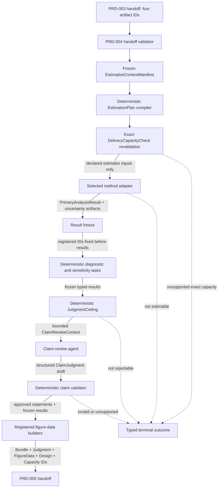

# PRD-004 — Estimation, diagnostics, sensitivity, and claim judgment

Status: final for implementation  
Product stage: post-preparation statistical execution  
Depends on: `SYSTEM-CONTRACT.md`; PRD-002 — causal design harness and runnable-frame contract; PRD-003 — runnable-frame
preparation, row-set stabilization, and recoverable lineage  
Unlocks: PRD-005 — visualization rendering and presentation

Shared identities, envelopes, context isolation, persistence, retries, required LangSmith
behavior, operational events, and delivery-capacity rules are governed by `SYSTEM-CONTRACT.md`.

## 1. Outcome

Given a valid PRD-003 handoff, this stage executes exactly the method and estimand approved in
PRD-002 against the immutable prepared-frame bundle produced by PRD-003. It produces either:

- a frozen, reproducible `EstimationBundle` containing one `PrimaryAnalysisResult` with one or
  more ordered `PrimaryContrastResult` items, required uncertainty, diagnostics, prespecified
  sensitivity results, a structured `ClaimJudgment`, and figure-ready aggregate data for PRD-005;
- `not_estimable`, with the exact structural, numerical, or diagnostic reason that prevented the
  approved estimator from producing its required result;
- `invalidated`, when a prespecified post-estimation rule shows that the approved claim is not
  reportable without returning to design; or
- `failed_observability`, when required trace delivery prevents progression; or
- `failed`, when a technical or contract-integrity error prevents completion.

PRD-004 never changes the prepared table, global eligibility, frozen row set, causal design,
selected method, or estimand. A result may change what can responsibly be claimed; it cannot
rewrite what was approved.

## 2. Product decisions

1. Exactly one approved method pack and one primary estimand family execute per estimation run.
   A multi-arm randomized design may contain several prespecified contrast items inside one
   primary analysis result.
2. The complete `EstimationPlan` is validated and committed before the primary outcome values are
   supplied to an estimator.
3. The primary estimator, uncertainty method, nuisance profile, confidence level, clustering,
   diagnostic set, sensitivity branches, and figure-data builders are versioned plan fields.
4. No result-dependent method switching, covariate selection, subgroup discovery, bandwidth
   choice, trimming, exclusion, or model-family search is allowed.
5. The prepared frame and its `row_set_hash` are immutable. Calculation-specific contribution
   masks are allowed only when declared by the method pack and are never written back as row
   deletion.
6. Every estimate and diagnostic records its contributing row, unit, and cluster counts and the
   hash of its exact contribution mask.
7. Primary contrast, secondary, diagnostic, and sensitivity results are visibly distinct. A
   sensitivity result cannot silently replace the primary analysis result or any primary item.
8. Random seeds, fold assignment, numerical tolerances, thread settings, and estimator-package
   versions are fixed and recoverable.
9. Numerical failure raises a typed blocker immediately. No alternative solver, covariance
   implementation, estimator, model, method, or degraded result path may replace the registered
   execution.
10. A p-value or confidence interval alone never establishes a causal assumption or determines
    claim judgment.
11. Diagnostics test observable implications and implementation integrity. They do not prove
    randomization, no unmeasured confounding, parallel trends, or continuity.
12. Sensitivity branches are approved before the primary analysis result is observed. New branches
    require a new design or method-pack revision.
13. The RCT pack reports intention-to-treat as V1's primary estimand. It never silently becomes an
    as-treated or per-protocol analysis.
14. AIPW nuisance preprocessing and fitting are executed inside cross-fitting when required by
    PRD-003. Validation-fold outcomes never train their own nuisance predictions.
15. Staggered-adoption DiD never uses an unqualified two-way fixed-effects treatment coefficient
    as the primary causal estimate.
16. Sharp RDD uses the exact approved cutoff. Manipulation evidence, mass points, and observations
    near the cutoff are diagnosed rather than repaired or removed.
17. The V1 claim-review model receives typed frozen results and approved assumptions, never raw
    rows, dataframes, fold predictions, residual arrays, or unrestricted tools.
18. Deterministic judgment guards set the maximum claim status. A model cannot override a failed
    estimator, invalidating diagnostic, or required qualification.
19. `reportable` means the estimate may be presented under the approved assumptions. It does not
    mean the assumptions or causal claim were proven true.
20. PRD-004 creates frozen aggregate figure data but renders no chart and chooses no axis or visual
    style.
21. PostgreSQL and object storage remain authoritative. LangGraph checkpoints and LangSmith traces
    are operational systems, not result or judgment storage.
22. LangSmith is required. A preflight or operation-boundary flush failure produces
    `failed_observability`, preserves committed statistical artifacts, and stops the graph before
    later work or handoff. If the claim-review model is unavailable, frozen statistical artifacts
    remain intact but the run cannot complete.
23. The approved `DeliveryCapacityCheck` is recomputed from the frozen plan and prepared structure
    before primary-outcome values enter an estimator.

## 3. Scope

### 3.1 In scope

- opening and validating the PRD-003 handoff;
- compiling and freezing an exact `EstimationPlan`;
- creating calculation-specific contribution masks without changing the prepared frame;
- executing estimator-scoped preprocessing recipes inside training folds;
- fitting the one approved primary estimator;
- calculating standard errors, confidence intervals, and other approved uncertainty quantities;
- running required post-estimation diagnostics;
- executing all prespecified sensitivity branches;
- producing bounded figure-ready aggregate datasets;
- applying deterministic result and judgment guards;
- producing a structured, evidence-linked `ClaimJudgment`;
- durable estimation-run checkpoints and replay-safe artifact commits;
- sanitized LangSmith tracing, offline evaluation, and production monitoring; and
- producing the PRD-005 handoff.

### 3.2 Out of scope

- contacting Kaggle or another source provider;
- changing or repairing any value in the prepared frame;
- changing row disposition, global eligibility, or the frozen row set;
- joining, aggregating, or reconciling additional source tables;
- changing the approved question, treatment, outcome, population, timeframe, method, or estimand;
- discovering a causal graph from the prepared data;
- choosing a method after comparing estimates;
- discovering subgroups, transformations, cutoffs, periods, bandwidths, or covariates from a
  favorable result;
- unapproved propensity trimming, outcome imputation, panel completion, or RDD donut exclusion;
- executing all four estimators as competing answers;
- rendering figures, choosing axes, or composing a presentation;
- writing the final user narrative; and
- using LangSmith, a model, or a p-value as an approval authority.

## 4. Inputs and entry gate

The estimation workflow opens with exactly:

- `prepared_frame_bundle_artifact_id`;
- `experiment_design_artifact_id`;
- `runnable_frame_contract_artifact_id`; and
- `design_approval_capacity_check_artifact_id` for the exact passing design-approval check.

Entry requires:

1. PRD-003 `PreparationOutcome.status` is `prepared`.
2. The prepared bundle, approved design, runnable-frame contract, design-time delivery-capacity
   check, and all required parents exist and match their hashes.
3. The prepared bundle references the exact approved design and runnable-frame contract hashes.
4. The stabilized and prepared frames share the same `row_set_hash`.
5. Every source row has a terminal PRD-003 disposition and every changed cell or derived column
   has valid lineage.
6. The prepared-frame schema matches the selected method pack's estimator input schema.
7. Required post-repair diagnostics passed or have method-approved handling.
8. Any estimator-scoped preprocessing recipe is registered, versioned, and permitted.
9. Exactly one selected method, primary outcome, primary estimand, comparator, confidence level,
   and primary estimator profile resolve from the approved artifacts.
10. The method-pack, estimator, uncertainty, nuisance, diagnostic, sensitivity, figure-data,
    judgment, schema, and validator registry versions are supported.
11. No upstream artifact contains an estimate or indicates that results influenced design or
    preparation.
12. The explicit design-time delivery-capacity artifact has status `pass` and its bound design,
    method, catalog, capacity-registry, and version hashes match the handoff.

An invalid or incomplete handoff fails closed. PRD-004 cannot infer a missing estimator choice or
substitute a default that is absent from the registered method pack.

## 5. Outputs

### 5.1 Successful estimation bundle

`EstimationBundle` contains identifiers and hashes for:

- the approved `ExperimentDesign` and `RunnableFrameContract`;
- the PRD-003 `PreparedFrameBundle` and exact `row_set_hash`;
- the exact passing `DeliveryCapacityCheck[pre_estimation]`;
- `EstimationContextManifest`;
- `EstimationPlan`;
- all `AnalysisContributionMask` artifacts;
- cross-fit fold assignments and estimator-scoped preprocessing results when applicable;
- one `PrimaryAnalysisResult` containing the ordered `PrimaryContrastResult` collection;
- a registered `MultiplicityResult` when more than one RCT contrast is confirmatory;
- zero or more approved secondary estimate artifacts;
- `UncertaintyBundle` with one required uncertainty result per primary item;
- `DiagnosticBundle`;
- `SensitivityBundle`;
- `FigureDataBundle`;
- `JudgmentCeiling`;
- `ClaimJudgment`;
- `NumericalEnvironmentManifest`;
- complete estimate, diagnostic, sensitivity, and figure-data lineage; and
- exact method, estimator, package, registry, graph, schema, prompt, model-profile, and validator
  versions.

The bundle contains exactly one primary-analysis-result ID. Its `primary_items` collection is
non-empty. Secondary or sensitivity results cannot occupy that field or appear in the collection.

### 5.2 Estimation outcome

`EstimationOutcome.status` is exactly one of:

| Status | Meaning |
|---|---|
| `complete` | primary estimation, required diagnostics, sensitivities, judgment, and handoff artifacts completed |
| `not_estimable` | the approved estimator cannot produce every required primary result item from the prepared input |
| `invalidated` | an invalidation rule prevents the approved claim from being reported |
| `design_conflict` | resolving the issue requires a PRD-002 design revision |
| `failed_observability` | required LangSmith preflight or trace delivery failed; no PRD-005 handoff is readable |
| `failed` | a technical, registry, storage, or contract-integrity error prevented completion |

`not_estimable`, `invalidated`, and `design_conflict` do not authorize a different method or a
weaker estimand. They return a typed reason with the failed rule and supporting artifact IDs.

## 6. Core contracts and invariants

### 6.1 Estimation plan

`EstimationPlan` is an executable specification containing:

- selected method and method-pack version;
- primary estimator ID and implementation version;
- selected estimand, contrast, population, timeframe, unit, and outcome scale;
- finite ordered primary-contrast definitions and registered multiplicity policy when applicable;
- treatment, outcome, adjustment, unit, cluster, stratum, group, time, adoption, running-variable,
  and cutoff role references as applicable;
- prepared-frame schema and row-set hash;
- primary contribution-mask rule;
- confidence level and uncertainty method;
- approved fixed effects, interactions, polynomial order, kernel, bandwidth selector, or nuisance
  profile as applicable;
- fold count, fold-assignment rule, seed derivation, and preprocessing recipe for cross-fitting;
- required diagnostic IDs and severity policies;
- required sensitivity branch IDs and parameters;
- required figure-data builder IDs;
- numerical tolerance and terminal numerical-failure rules; no alternative solver path;
- result and judgment schema versions;
- approved PRD-002 delivery-capacity-check ID/hash plus exact capacity-registry and
  visualization-catalog versions; and
- all upstream artifact IDs and hashes.

The plan is compiled deterministically from approved artifacts and the method registry. It is
committed before estimation begins. Any material plan revision produces a new run and plan hash.

### 6.2 Contribution masks

The prepared table's row membership never changes. A calculation may declare which frozen rows
contribute through an `AnalysisContributionMask` containing:

- parent row-set hash;
- calculation, outcome, and estimator IDs;
- one bit or frozen row ID per prepared-frame row;
- included and non-contributing row, unit, and cluster counts;
- registered non-contribution reason counts; and
- mask hash and builder version.

Examples include an RCT outcome-observed mask, an RDD approved-bandwidth mask, or a DiD event-time
cell mask. These masks are calculation inputs, not new eligibility decisions or row deletions.

An unregistered complete-case mask, result-dependent mask, or arbitrary query is forbidden.

### 6.3 Primary analysis result

`PrimaryAnalysisResult` is the single primary result artifact for one method and estimand family.
It contains:

- result ID, method, estimator, outcome, estimand-family, and plan references;
- a non-empty ordered `primary_items` collection;
- the prespecified contrast order and primary-item count;
- multiplicity-policy and `MultiplicityResult` references when applicable;
- atomic completeness status; and
- complete parent, environment, implementation, and registry hashes.

Each `PrimaryContrastResult` contains:

- estimand ID and human-readable estimand label;
- estimate value and units;
- comparator and effect direction convention;
- standard error, confidence level, interval bounds, and approved p-value when applicable;
- contributing row, unit, treatment/group, cluster, and period counts;
- contribution-mask artifact ID and hash;
- estimator ID, version, parameters, and library adapter version;
- uncertainty method and finite-sample correction;
- convergence and numerical status;
- method-specific quantities such as fold count, effective sample size, cohort aggregation,
  bandwidths, polynomial order, or kernel; and
- complete parent artifact and plan hashes.

Randomized experiments may contain one item per prespecified treatment-versus-comparator contrast.
AIPW, DiD, and sharp RDD contain exactly one primary item. A multi-item primary result is atomic:
all required items and the registered multiplicity result must reach a terminal valid state for
`EstimationOutcome.status=complete`. Successfully computed items remain recoverable if another
required item fails, but no partial PRD-005 handoff opens.

Primary result items contain no causal interpretation. Interpretation belongs to
`ClaimJudgment`.

### 6.4 Numerical environment manifest

Every run records:

- Python and exact package versions;
- operating-system and processor architecture;
- BLAS/LAPACK implementation where relevant;
- configured random seeds;
- estimator thread and process counts;
- floating-point type and serialization policy;
- numerical tolerances;
- implementation commit or build identifier; and
- container or runtime image digest in production.

Retries in the same approved runtime must be artifact-idempotent. Cross-platform results are
compared under estimator-specific numerical tolerances rather than assumed to be bit-identical.

### 6.5 Exact delivery-capacity recheck

After plan compilation but before primary-outcome values enter an estimator, the harness reruns
`DeliveryCapacityCheck` using the frozen prepared structure and exact planned result cardinality.
It verifies arms, contrasts, cohorts, periods, event-time points, required evidence families,
registered templates, accessible tables, and execution/render budgets against the versions bound
by PRD-002 approval. Failure returns `design_conflict` before estimation; PRD-004 does not weaken
the result set or ask the user directly.

## 7. End-to-end workflow

```text
open valid PRD-003 handoff
              │
              ▼
compile, validate, and commit EstimationPlan
              │
              ▼
re-run exact DeliveryCapacityCheck before outcome access
       │                         │
       │                         └── unsupported capacity ──▶ design conflict
       ▼
build registered contribution masks and fold assignments
              │
              ▼
execute exactly one primary estimator
       │                         │
       │                         └── not estimable / numerical failure ──▶ stop
       ▼
freeze PrimaryAnalysisResult and approved uncertainty for every primary item
              │
              ▼
run required post-estimation diagnostics
              │
              ▼
run all prespecified sensitivity branches and freeze statistical results
              │
              ▼
apply deterministic JudgmentCeiling
              │
              ▼
produce and validate structured ClaimJudgment
       │                         │
       │                         └── invalidated / design conflict ──────▶ stop handoff
       ▼
build and freeze bounded figure-ready data
              │
              ▼
commit EstimationBundle and PRD-005 handoff
```

Independent diagnostics and sensitivity branches may run in parallel after the primary result is
frozen, with at most eight concurrent tasks and deterministic fan-in. Plan compilation, capacity
recheck, primary estimation, result freeze, judgment ceiling, claim judgment, and final commit
remain sequential.

## 8. Estimator and method-pack registry

Every V1 method-pack manifest adds:

- primary estimator ID and version;
- primary-result and primary-item schemas;
- supported finite contrast collections and registered multiplicity policies;
- supported outcome types and estimands;
- required prepared-frame schema;
- role-to-estimator-input mapping;
- allowed contribution-mask rules;
- estimator parameter schema and fixed defaults;
- uncertainty method and finite-sample corrections;
- cluster and stratum behavior;
- nuisance and preprocessing profiles when applicable;
- numerical validity and convergence rules;
- invalidation and not-estimable conditions;
- required diagnostic IDs and severities;
- allowed sensitivity branch IDs;
- required figure-data builder IDs; and
- reference fixtures, parity tolerances, and contract tests.

An estimator adapter receives only the columns and rows declared by its typed plan. It cannot
query arbitrary columns, create a new estimand, call another estimator, write artifacts directly,
or alter the prepared frame.

Adding a method means adding a conforming method pack and estimator adapter. It does not change
the common plan, lineage, judgment, or handoff workflow.

The registry may contain any finite number of validated method, contrast, or AIPW nuisance
profiles. A run executes only the method, finite contrast set, primary nuisance profile, and
prespecified sensitivity profiles bound by its approved plan. Registry breadth never creates an
open-ended runtime search or arbitrary adapter loading.

## 9. Randomized experiment method pack

### 9.1 V1 estimand and estimator

V1 reports intention-to-treat for each approved treatment-versus-comparator contrast.

- Continuous outcomes use an approved difference-in-means or ANCOVA specification.
- Binary outcomes use an approved risk-difference specification on the probability scale.
- Approved randomization strata enter as fixed effects or stratified aggregation according to the
  plan.
- Cluster-randomized designs use the approved cluster-level covariance and finite-cluster policy.
- Baseline covariate adjustment uses only PRD-002-approved pre-randomization precision covariates.
- The primary specification is chosen before estimation; unadjusted and adjusted estimates do not
  compete after results are observed.

Multi-arm experiments produce one `PrimaryContrastResult` item per approved contrast inside the
single `PrimaryAnalysisResult`. A registered multiplicity policy and complete
`MultiplicityResult` are mandatory when more than one contrast is confirmatory.

### 9.2 Contribution and missing outcomes

The stabilized randomized population remains the denominator for assignment and attrition
reporting. Rows with missing primary outcomes may be non-contributing to a particular observed-case
estimate only through the approved outcome-observed mask.

Missing outcomes:

- remain visible as attrition by arm, cluster, stratum, and approved subgroup;
- are never silently deleted from the population denominator;
- are never generically imputed in the primary estimator; and
- may enter only a separately approved missing-outcome sensitivity branch.

Noncompliance, crossover, and treatment received do not replace randomized assignment in the V1
primary estimator.

### 9.3 Required diagnostics

- randomization-unit and analysis-unit reconciliation;
- arm, cluster, and stratum contribution counts;
- baseline balance as a descriptive diagnostic, not a rerandomization test;
- outcome attrition overall and by assignment arm;
- covariance and cluster-count adequacy;
- influential-cluster or leverage warnings when applicable;
- model convergence and residual/numerical integrity for adjusted estimators; and
- prespecified multiplicity handling when applicable.

An imbalance cannot justify adding or removing a covariate after results are observed.

### 9.4 Prespecified sensitivities

Allowed V1 branches include, only when approved:

- unadjusted versus approved baseline-adjusted ITT;
- a separately prespecified sensitivity covariance profile;
- leave-one-cluster-out influence summary;
- bounded missing-outcome or attrition sensitivity; and
- approved subgroup contrasts already declared in the experiment design.

As-treated, per-protocol, complier-average, and newly discovered subgroup analyses are outside the
V1 primary RCT pack.

## 10. Observational AIPW method pack

### 10.1 V1 estimand and structure

V1 supports binary treatment with the approved ATE or ATT, one row per analysis unit, one primary
outcome, and the exact pre-treatment adjustment set approved in PRD-002.

The primary estimator is an augmented inverse-probability-weighted score using:

- a propensity nuisance model for treatment conditional on approved covariates;
- outcome nuisance models for the potential outcome under each treatment state;
- out-of-fold nuisance predictions for every contributing unit; and
- influence-function-based aggregation and uncertainty.

The estimator implementation is versioned and tested against the registered ATE and ATT score
definitions. It never changes the adjustment set based on nuisance importance or result size.

### 10.2 Cross-fitting

`CrossFitAssignment` is created deterministically from the plan seed and frozen source-row or unit
IDs. It records:

- fold count and assignment algorithm;
- treatment and cluster stratification rules;
- row/unit-to-fold mapping artifact ID and hash;
- train and validation counts by fold and treatment;
- preprocessing recipe version; and
- nuisance profile ID.

For each fold:

1. fit the PRD-003 `cross_fit_training_fold` preprocessing recipe on training rows only;
2. transform training and validation rows using only training-fitted parameters;
3. fit the registered propensity and outcome nuisance models on training rows;
4. predict the held-out validation rows; and
5. commit bounded fold diagnostics and the private prediction artifact.

No validation-row outcome trains its own nuisance prediction. Nuisance predictions and fold
assignments are stored as restricted artifacts and never exported to LangSmith.

### 10.3 Nuisance profiles

V1 nuisance profiles are registered combinations of maintained scikit-learn estimators,
hyperparameters, preprocessing, fit limits, seeds, predictive metrics, and resource budgets. The
one primary profile is selected and bound in the approved `EstimationPlan` before primary-outcome
values enter any fit. Any alternative profile is a separately prespecified sensitivity branch.

Profiles may contain a fixed regularized generalized-linear learner, a fixed histogram-gradient
boosting learner, or a prespecified ensemble. Hyperparameter search is allowed only when its grid,
metric, nesting, stopping rule, and resource budget are part of the profile and remain inside the
training fold. A registry may contain any finite number of validated profiles, but a run cannot
enumerate the registry after seeing results or add an unregistered candidate.

No learner, hyperparameter, or ensemble weight is chosen because it produces a preferred treatment
effect. Nested selection uses only the profile's fixed predictive metric inside training data.
Nuisance predictive performance is diagnostic evidence, not a causal-role selector.

### 10.4 Positivity and numerical probabilities

- Estimated propensities are preserved for diagnostics.
- Target-population trimming is allowed only when already approved in PRD-002 and applied by
  PRD-003 eligibility; PRD-004 cannot introduce it.
- A bounded-probability rule used solely to prevent division by exact numerical zero must be a
  versioned estimator parameter and is reported separately from substantive trimming.
- Material mass near zero or one produces overlap, weight, and effective-sample warnings or an
  invalidation according to the approved method pack.

### 10.5 Required diagnostics

- fold assignment, treatment support, and convergence by fold;
- nuisance prediction calibration and registered performance measures;
- propensity distribution and common-support summaries;
- inverse-weight distribution, tail summaries, and effective sample size;
- covariate balance before and under the estimator's implied weighting;
- influence-score distribution and influential-unit warnings;
- cross-fit score and standard-error integrity;
- missingness-indicator and preprocessing usage; and
- remaining unmeasured-confounding qualification from the approved design.

Good predictive performance does not establish no unmeasured confounding. Poor overlap cannot be
repaired by silently trimming units after estimation.

### 10.6 Prespecified sensitivities

Allowed V1 branches include, only when approved:

- alternative registered nuisance profile;
- alternative cross-fit seed or fold count;
- approved numerical propensity-bound sensitivity;
- ATE versus ATT only when both estimands were separately approved; and
- registered unmeasured-confounding or influence sensitivity summaries.

Every branch retains its own estimator, contribution-mask, nuisance-profile, and result identity.
It cannot replace the primary analysis result.

## 11. Difference-in-differences method pack

### 11.1 Classification and primary estimators

The plan records whether adoption is simultaneous or staggered before outcome estimation.

- Simultaneous adoption uses the registered common-adoption DiD estimator with approved group,
  post-period, fixed-effect, weighting, and cluster specification.
- Staggered adoption uses the registered cohort-relative Sun–Abraham event-study and aggregation
  profile rather than an unqualified two-way fixed-effects treatment coefficient.
- The comparison cohort—never treated, not yet treated, or another approved reference—is fixed in
  the plan.
- Repeated-cross-section versus panel behavior is explicit. A staggered profile that requires a
  panel refuses a repeated-cross-section input rather than pretending units persist.

The primary estimand, cohort weighting, event-time window, reference period, and overall
aggregation are fixed before estimation.

### 11.2 Contribution masks and support

Method masks may identify the registered rows contributing to a group-time or event-time
calculation, but they cannot remove an entire inconvenient period, cohort, or group from the
prepared frame.

Each result reports:

- groups, cohorts, periods, units, and clusters contributing;
- treated and comparison observations by group-time cell;
- unsupported or non-contributing cells and registered reasons;
- composition changes across time; and
- the exact cell and row mask hashes.

If an approved comparison or required pre/post cell lacks support, the estimator returns
`not_estimable` or `design_conflict`; it does not select a different comparison group.

### 11.3 Required diagnostics

- unit-period or repeated-cross-section schema reconciliation;
- group-time and cohort support;
- number and placement of pre- and post-treatment periods;
- treatment-timing and anticipation-window consistency;
- event-study lead estimates and joint prespecified pre-period test;
- panel attrition or repeated-cross-section composition change;
- cluster-count and covariance adequacy;
- sensitivity of aggregate weights to cohorts and event times;
- concurrent-event and alternative-graph qualifications from PRD-002; and
- numerical convergence and reference-period integrity.

A non-significant pre-period test does not prove parallel trends. A significant lead cannot be
removed by shortening the event window after results are observed.

### 11.4 Prespecified sensitivities

Allowed V1 branches include, only when approved:

- alternative registered anticipation window;
- never-treated versus not-yet-treated comparison when both were approved;
- alternative approved cohort or event-time aggregation;
- balanced-panel contribution as a sensitivity mask without changing the frozen prepared frame;
- leave-one-cohort-out influence summaries; and
- approved functional-trend or placebo-period checks.

Removing a period, group, or cohort to improve parallel-trend appearance is forbidden.

## 12. Sharp regression discontinuity method pack

### 12.1 V1 estimand and primary estimator

V1 supports one sharp cutoff and the approved local treatment effect at that cutoff.

The primary estimator uses the versioned `rdrobust` adapter with:

- the exact approved running variable and cutoff;
- local linear point estimation unless another polynomial order is explicitly approved;
- the approved kernel, with triangular as the V1 default profile;
- a registered data-driven or fixed bandwidth rule;
- robust bias-corrected confidence intervals;
- approved covariate adjustment and cluster handling; and
- explicit mass-point and numerical settings.

The selected bandwidth is an estimator result produced by the approved selector, not an ad hoc
row deletion or a post-result choice. Conventional and bias-corrected quantities remain labelled;
the method pack identifies which is primary.

### 12.2 Assignment and contribution

- The cutoff and assignment direction must exactly match PRD-002.
- A contradiction to the approved sharp-assignment rule invalidates the sharp method; it is not
  removed from the estimator input.
- The primary bandwidth contribution mask is generated only by the approved bandwidth rule and
  references the unchanged prepared-frame row set.
- A donut mask or asymmetric bandwidth is allowed only as a prespecified sensitivity branch.
- Running-variable, treatment, and outcome values are never imputed here.

### 12.3 Required diagnostics

- counts, unique running-variable values, and support on both cutoff sides;
- selected left and right bandwidths and effective observations;
- mass points and heaping;
- density/manipulation testing through the registered `rddensity` adapter;
- covariate continuity for approved predetermined covariates;
- sensitivity to registered bandwidth multiples and polynomial order;
- influence, leverage, and nearest-to-cutoff support;
- other-policy-at-cutoff and sorting qualifications from PRD-002; and
- robust-bias-correction and numerical integrity.

A density test does not prove absence of manipulation, and manipulation evidence is never repaired
away.

### 12.4 Prespecified sensitivities

Allowed V1 branches include, only when approved:

- registered bandwidth multiples;
- local constant or quadratic polynomial comparison;
- alternative registered kernel;
- approved symmetric donut exclusion;
- covariate-adjusted versus unadjusted estimation; and
- placebo cutoffs fixed before the primary result is observed.

Changing the actual cutoff, dropping inconvenient mass points, or choosing the most favorable
bandwidth is forbidden.

## 13. Uncertainty and reproducibility

Every method pack specifies:

- uncertainty target and confidence level;
- analytic, influence-function, robust, cluster-robust, randomization, or bootstrap procedure;
- unit of independence and clustering;
- finite-sample or degrees-of-freedom correction;
- seed and replicate count for stochastic procedures;
- convergence and minimum-cluster rules;
- interval and p-value calculation; and
- failure behavior.

Bootstrap and randomization replicates use plan-derived seeds and fixed parallelism. Their full
replicate arrays are restricted artifacts; traces and final handoffs contain bounded summaries and
hashes.

The product does not present more numeric precision than the measurement and estimator support.
Canonical stored values retain sufficient precision for reproducibility; display rounding belongs
to PRD-005.

## 14. Diagnostic contract

### 14.1 Result shape

Every post-estimation diagnostic declares:

- diagnostic ID and version;
- allowed method packs and result stages;
- required roles, artifacts, and result quantities;
- parameter and output schemas;
- contribution-mask behavior;
- deterministic or seeded implementation identifier;
- status and severity vocabulary;
- invalidation or qualification rules; and
- figure-data builder IDs when visual evidence is required.

Every diagnostic result records:

- `computed`, `partial`, `not_computable`, or `failed` execution status;
- `acceptable`, `warning`, `invalidating`, or `descriptive` policy result;
- input artifact IDs and hashes;
- exact denominators and contribution-mask hashes;
- values, interval or threshold context, and warnings;
- the approved rule that interprets the result; and
- implementation and numerical-environment versions.

### 14.2 Severity policy

Severity is defined before execution:

| Severity | Consequence |
|---|---|
| `required_blocking` | missing or failed result prevents completion |
| `invalidation_guard` | triggered condition caps judgment at `not_reportable` or returns design conflict |
| `qualification_guard` | triggered condition caps judgment at `reportable_with_qualifications` |
| `descriptive` | must be disclosed but does not independently cap judgment |

A diagnostic agent cannot promote, demote, or reinterpret severity after seeing its value.

## 15. Sensitivity contract

Each `SensitivityBranch` contains:

- branch ID, purpose, and method-pack version;
- exact parameter difference from the primary plan;
- why the branch was required before estimation;
- allowed estimator and contribution-mask changes;
- its own result, uncertainty, and diagnostic schemas;
- comparison rule against the primary result; and
- qualification or invalidation behavior.

All required branches execute even when the primary analysis result is favorable. A failed branch is
reported as failed; it is not omitted. The sensitivity bundle reports direction, magnitude, and
interval stability without selecting the most favorable branch.

An exploratory branch requested after results requires a new, visibly post hoc analysis revision.
It cannot be added to the approved primary bundle as if prespecified.

## 16. Claim judgment

### 16.1 Judgment ceiling

The deterministic `JudgmentCeiling` is calculated before any model-authored interpretation. It
contains one ceiling per `PrimaryContrastResult` and one overall ceiling equal to the most
restrictive required item:

| Condition | Maximum status |
|---|---|
| primary estimator or required uncertainty unavailable | `not_estimable` |
| invalidation guard triggered | `not_reportable` |
| required diagnostic missing without approved handling | `not_reportable` |
| one or more material qualification guards triggered | `reportable_with_qualifications` |
| all required guards satisfied | `reportable` |

The ceiling stores the exact rule IDs and artifact evidence. It cannot be raised by a model or
user-facing wording.

### 16.2 Claim-review agent

Invocation: one initial bounded call after results, diagnostics, sensitivities, and the judgment
ceiling are frozen. A schema or citation failure may receive at most two targeted corrections for
the same stable validation code.

The agent receives `AgentTaskEnvelopeV1` containing one typed `ClaimReviewContext` with only:

- approved causal question, estimand, method, population, and timeframe;
- approved assumptions, material alternative graphs, and unresolved non-blocking uncertainty;
- typed primary and sensitivity result summaries;
- diagnostic statuses and bounded values required for interpretation;
- missingness, contribution, and target-population summaries;
- judgment ceiling and required qualifications; and
- artifact IDs for every statement.

It may:

- express the estimate and interval in the approved outcome units;
- distinguish association, estimate, and causal interpretation;
- state the assumptions under which the estimate is reportable;
- summarize required diagnostic and sensitivity qualifications;
- state what population and timeframe the claim applies to; and
- return one structured claim item per primary contrast and an overall `ClaimJudgment` at or below
  the deterministic ceilings.

It may not:

- inspect raw rows, dataframes, predictions, residuals, weights, or full figure data;
- call an estimator, arbitrary calculator, repair tool, or visualization tool;
- invent another estimand, method, subgroup, sensitivity branch, or diagnostic;
- claim an assumption was proven by a test;
- hide an unfavorable or failed result; or
- expose internal chain-of-thought.

### 16.3 Claim judgment contract

`ClaimJudgment.status` is exactly one of:

| Status | Meaning |
|---|---|
| `reportable` | estimate may be presented under the approved assumptions |
| `reportable_with_qualifications` | estimate may be presented only with the recorded material qualifications |
| `not_reportable` | a computed estimate cannot support the approved causal claim |
| `not_estimable` | no complete valid primary analysis result is available |
| `failed` | judgment could not be completed or validated |

The artifact contains:

- approved causal question and estimand;
- one ordered `ClaimItem` per `PrimaryContrastResult`, each with a bounded effect statement;
- per-item estimate, interval, units, population, comparator, timeframe, and result references;
- required assumption statements;
- diagnostic findings and explicit non-findings;
- sensitivity stability or instability summary;
- missingness, contribution, overlap, support, or attrition qualifications as applicable;
- material alternative explanations and unresolved design uncertainty;
- statement of what cannot be concluded;
- per-item ceilings/statuses plus an overall ceiling and final status;
- every supporting artifact ID and hash; and
- prompt, model-profile, schema, validator, and policy versions.

Model-reported confidence is not stored. Every substantive sentence resolves to an approved
design claim or frozen result artifact.

The overall status is the most restrictive required claim-item status. V1 does not open a partial
PRD-005 handoff when one required primary contrast is `not_reportable`, `not_estimable`, or
`failed`; all computed items remain recoverable for audit.

The judgment and estimation outcomes map mechanically:

| Claim judgment | Estimation outcome | PRD-005 handoff |
|---|---|---:|
| `reportable` | `complete` | readable |
| `reportable_with_qualifications` | `complete` | readable with mandatory qualifications |
| `not_reportable` | `invalidated` | blocked |
| `not_estimable` | `not_estimable` | blocked |
| `failed` | `failed` | blocked |

When no primary analysis result exists, the harness may create the terminal `not_estimable` judgment
deterministically without calling the claim-review model.

## 17. Frozen figure-data boundary

PRD-004 produces data needed by PRD-005 but no figure specification or rendered output.

Each `FigureDataArtifact` contains:

- required visual-evidence ID from the approved method pack;
- figure-data builder ID and version;
- parent estimate, diagnostic, or sensitivity artifact IDs and hashes;
- typed series, category, interval, or aggregate-point schema;
- quantities, units, labels, denominators, and uncertainty fields;
- aggregation, binning, and suppression rules;
- contributing row/unit/cluster counts and mask hash;
- claim-judgment disclosure status; and
- payload hash.

Figure-data builders may aggregate frozen prepared-frame quantities only when the aggregation was
declared by a required visual-evidence contract. They may not estimate a new effect, choose a
favorable binning after inspecting results, or expose unrestricted raw observations.

V1 expected figure-data families are:

| Method | Figure-ready data produced |
|---|---|
| randomized experiment | assignment/attrition counts, arm summaries, balance measures, every ordered primary contrast, multiplicity disclosures, and intervals |
| observational AIPW | overlap bins, weight summaries, balance measures, influence summaries, primary result item and interval |
| difference-in-differences | group-time means, event-time estimates and intervals, support/composition counts, primary aggregate |
| sharp RDD | fixed binned outcome summaries, fitted-curve points, cutoff/bandwidth metadata, density and continuity summaries, primary result item |

PRD-005 may choose axes and render approved data. It cannot reopen the prepared frame or calculate
new estimates, diagnostics, bins, confidence intervals, or claims.

## 18. Validation walls

Artifacts pass in this order:

1. **Handoff wall:** PRD-003 bundle, design, contract, lineage, and row-set hashes match.
2. **Plan wall:** one exact method, estimand family, finite primary contrast set, estimator,
   multiplicity policy when applicable, uncertainty, diagnostics, sensitivities, and figure-data
   set are committed.
3. **Delivery-capacity wall:** exact frozen cardinalities remain compatible with the approved
   capacity and visualization registries before primary-outcome access.
4. **Input wall:** prepared schema, roles, types, keys, and method structure satisfy the estimator.
5. **Contribution wall:** every calculation uses a registered mask tied to the frozen row set.
6. **Preprocessing wall:** fold-scoped recipes use training data only and preserve row identity.
7. **Estimator wall:** the primary estimator returns one complete `PrimaryAnalysisResult` and all
   required items.
8. **Uncertainty wall:** required standard error, interval, and multiplicity calculations complete.
9. **Diagnostic wall:** every required diagnostic has a terminal result and approved handling.
10. **Sensitivity wall:** every prespecified branch has a terminal visible result.
11. **Result-lineage wall:** every number resolves to plan, input, mask, implementation, and
    numerical-environment artifacts.
12. **Judgment-ceiling wall:** deterministic per-item and overall invalidations and qualifications
    are complete.
13. **Claim wall:** every claim item does not exceed its ceiling and cites every statement.
14. **Figure-data wall:** every visual dataset resolves to frozen approved results, the validated
    claim judgment, and registered builders.
15. **Handoff wall:** the complete immutable bundle and required traces are committed before
    PRD-005 can read it.

No later wall can waive an earlier failure.

## 19. Orchestration and permissions

PRD-004 uses LangGraph as a typed control graph for deterministic computation, bounded parallel
diagnostics/sensitivities, one initial claim-review call plus at most two targeted corrections,
validation, checkpointing, and artifact commits.

### 19.1 Context routing and fresh-task boundary

PRD-004 creates a new `graph_thread_id`. It inherits approved artifact references, not the
PRD-003 graph thread, preparation-agent messages, checkpoints, scratch context, tool results, or
model memory. After validating the three input IDs, the harness compiles one immutable
`EstimationContextManifest` containing:

- the exact prepared-bundle, experiment-design, runnable-frame-contract, and row-set hashes;
- selected method, estimand, population, timeframe, comparator, outcome, and role mappings;
- prepared-frame schema and registered estimator-input view;
- contribution-mask, fold, preprocessing, uncertainty, diagnostic, sensitivity, judgment, and
  figure-data rule IDs;
- approved delivery-capacity-check ID/hash, exact result cardinalities, and bound capacity/catalog
  versions;
- numerical environment, seed, tolerance, package, registry, and validator versions; and
- explicit context allowlists for deterministic adapters and the claim-review call.

The manifest contains references and typed plan facts. It contains no inherited conversation,
rendered causal-graph image, unrestricted prepared rows, or model-generated preparation context.



| Receiver | Receives | May retrieve | Returns | Context destination |
|---|---|---|---|---|
| Estimation-plan compiler | manifest facts and registered method pack | exact approved parents | immutable `EstimationPlan` | selected method adapter |
| Delivery-capacity validator | approved capacity artifact plus exact plan/structure cardinalities | registered capacity and catalog manifests | passing recheck or `DesignConflict` | selected adapter or PRD-002 |
| Selected method adapter | declared estimator-input columns/views, contribution-mask rules, preprocessing recipe, seed and parameters | prepared-frame payload through a non-model data boundary | one typed `PrimaryAnalysisResult` and uncertainty artifacts | result freeze |
| Diagnostic/sensitivity task | frozen primary result plus one prespecified task contract | only its registered inputs and contribution mask | one typed terminal result | deterministic fan-in |
| Claim-review agent | `AgentTaskEnvelopeV1` containing `ClaimReviewContext`: approved question/assumptions, every primary-item summary, diagnostic/sensitivity statuses, ceilings, qualifications, and evidence IDs | no additional tools or context | one structured judgment draft | claim validator only |
| Figure-data builder | approved visual-evidence ID and frozen statistical parents | declared prepared aggregates only when its registered contract permits them | typed figure-data artifact | PRD-005 handoff |

Only the claim-review receiver is a model agent. Method adapters, diagnostics, sensitivities,
judgment ceiling, claim validation, and figure-data builders are deterministic components. No
statistical array, row, weight, prediction, residual, or unrestricted figure-data value is routed
to the claim-review agent.

Diagnostic and sensitivity fan-out contains only tasks frozen in `EstimationPlan`, runs at most
eight tasks concurrently, and waits for a deterministic fan-in in registered task order. Every
branch returns a visible terminal result; a failed branch is never omitted. PRD-004 never
interrupts the user. A required semantic, contrast, or capacity change becomes `DesignConflict`
and returns to PRD-002.

Persistent graph state contains only:

- analysis, estimation stage-run, and graph-thread IDs;
- upstream artifact IDs;
- `EstimationContextManifest` artifact ID and hash;
- committed plan ID;
- current phase and validation-wall status;
- delivery-capacity recheck ID/status and current primary-analysis-result, diagnostic,
  sensitivity, figure-data, and judgment artifact IDs;
- pending task IDs;
- seed and fold-assignment artifact IDs;
- conflict and failure codes; and
- final estimation and handoff status.

Prepared data, predictions, weights, residuals, influence scores, bootstrap replicates, and figure
data are object payloads, not graph state.

The estimation service may:

- read the exact approved design, contract, and prepared bundle;
- execute registered estimators, uncertainty procedures, diagnostics, sensitivities, and
  figure-data builders;
- execute the approved fold-scoped preprocessing recipe;
- call the one initial bounded claim-review model task and at most two targeted schema/citation
  corrections; and
- write new immutable estimation artifacts and indexes.

It may not:

- edit any upstream artifact;
- change the frozen row set or global eligibility;
- run arbitrary Python, SQL, notebook, shell, or model-generated code;
- expose a generic estimator or dataframe tool to a model;
- call another method pack after seeing results;
- contact Kaggle or external research sources; or
- render a visualization.

## 20. LangSmith wiring

### 20.1 Boundary

LangSmith is the required debugging, tracing, evaluation, and monitoring surface. PostgreSQL and
object storage remain authoritative for plans, results, diagnostics, judgments, figure data,
lineage, and handoff status.

A LangSmith health/authorization preflight must pass before the graph starts. Every node,
registered computation, validator, artifact commit, and handoff operation emits
`OperationalEventV1`, closes its span, and receives a flush acknowledgement before later work can
start. Failure produces `failed_observability`, preserves committed statistical artifacts, and
stops the graph. If the required claim-review model service is unavailable, only the shared
same-identity transient-attempt bound applies. Exhaustion emits `blocker.raised`, terminates the
stage attempt, and preserves frozen statistical artifacts. No other model, provider, prompt, or
judgment path is substituted.

A LangSmith trace cannot change an estimator parameter, approve a fallback, raise a judgment
ceiling, or make the PRD-005 handoff readable.

### 20.2 Trace hierarchy

One LangSmith thread maps to one estimation run. Each invocation or resume is one trace. Child
runs represent:

- PRD-003 handoff validation;
- estimation-plan compilation and validation;
- contribution-mask and fold-assignment creation;
- each fold-scoped preprocessing and nuisance fit;
- primary estimator and uncertainty execution;
- each diagnostic and sensitivity branch;
- deterministic judgment-ceiling evaluation;
- claim-review model invocation;
- structured judgment validation;
- each figure-data builder;
- validation-wall execution; and
- immutable bundle and PRD-005 handoff commits.

### 20.3 Safe metadata and privacy

Allowlisted production metadata includes:

- environment, analysis, estimation stage-run, graph-thread, task, attempt, and parent-event IDs;
- upstream, plan, result, diagnostic, sensitivity, judgment, and handoff artifact IDs and hashes;
- selected method, estimator, nuisance, and registry versions;
- graph stage, validation wall, diagnostic, branch, and error codes;
- aggregate row, unit, cluster, fold, cohort, period, and cutoff-side counts subject to suppression;
- convergence, execution, diagnostic-policy, judgment-ceiling, and final statuses;
- seed identifiers, retry counts, latency, token usage, and cost; and
- numerical-environment and implementation identifiers.

After task-envelope allowlisting and a second trace-redaction pass, LangSmith records the complete
model-facing `ClaimReviewContext`, prompt, and returned `ClaimJudgment` draft. This includes only
the bounded estimates, intervals, diagnostic statuses, sensitivity summaries, assumptions, and
qualifications the claim-review model is explicitly permitted to see. Production traces must
never emit:

- raw or prepared rows, cell values, dataframes, or source documents;
- treatment, outcome, covariate, running-variable, or identifier value samples;
- fold assignments, nuisance predictions, weights, residuals, influence scores, or fitted model
  parameters;
- bootstrap or randomization replicate arrays;
- unrestricted statistical result collections, full diagnostic payloads, or figure-data payloads;
- prompts or responses outside the validated claim-review task, hidden chain-of-thought, or
  unrestricted user context; or
- credentials, database values, object payloads, or signed URLs.

Auto-instrumented inputs and outputs are disabled unless they pass the same sanitizer. Every span
records the task-envelope ID/hash and redaction-policy version. Separate LangSmith projects are
used for development, staging, production, and synthetic/offline evaluation. Trace retention is
30 days and is not artifact retention.

### 20.4 Evaluation and monitoring

This stage inherits every hard gate and release rule in `SYSTEM-CONTRACT.md` Section 10.5.
Offline evaluation uses synthetic and fixed reference fixtures for all four method packs. It
checks:

- estimator parity within registered tolerances;
- confidence-interval and contribution-count correctness;
- cross-fit leakage prevention and fold reproducibility;
- no result-dependent plan, method, mask, bandwidth, or branch change;
- diagnostic severity and judgment-ceiling enforcement;
- claim citations, qualification completeness, and unsupported-claim rejection;
- figure-data lineage and frozen-result consistency;
- idempotent replay and artifact hashing; and
- trace redaction.

Sanitized production monitoring covers failure rates, numerical convergence, missing required
diagnostics, invalidation codes, judgment-validation failures, latency, retries, and handoff
status. Monitoring may alert operators but cannot mutate a result.

### 20.5 Operational event map

| Estimation boundary | Required event pair or terminal event | Required safe references |
|---|---|---|
| handoff, plan, and capacity validation | `task.started`, `task.completed`, `task.failed` | upstream/plan/capacity IDs and stable codes |
| contribution masks, folds, preprocessing | `task.started`, `task.completed`, `task.failed`, `tool.started`, `tool.completed`, `tool.failed` | calculation IDs, mask/fold hashes, attempts, versions |
| primary estimator and uncertainty | `tool.started`, `tool.completed`, `tool.failed`, `artifact.committed`, `artifact.validation_failed` | method/estimator IDs, result artifact IDs, numerical status |
| diagnostic/sensitivity branch | `task.started`, `task.completed`, `task.failed` | branch ID, terminal status, result artifact ID |
| claim review | `agent.started`, `agent.schema_failed`, `agent.correction_requested`, `task.completed`, `task.failed` | task-envelope ID, claim-item IDs, schema paths, ceilings |
| figure-data build | `tool.started`, `tool.completed`, `tool.failed`, `artifact.committed`, `artifact.validation_failed` | visual-evidence ID, builder ID, frozen-parent IDs |
| retry or blocker | `retry.scheduled`, `retry.exhausted`, `blocker.raised` | task/idempotency identity, attempt, stable error code |
| PRD-005 handoff | `handoff.accepted`, `handoff.rejected` | five handoff IDs, outcome, compatibility codes |
| trace failure | `observability.delivery_failed`, `blocker.raised`, `stage.failed` | safe fingerprint and `failed_observability` |

Each row is emitted as `OperationalEventV1` JSON and mirrored into the required LangSmith span.

### 20.6 Evaluation surfaces

These registrations inherit the bounded policy in `SYSTEM-CONTRACT.md` Section 10.5.2. Estimators,
diagnostics, sensitivities, ceilings, and figure-data builders use deterministic reference tests;
only claim-review semantics consume the four representative live Vertex cases.

| Eval ID | Boundary and owner | Required fixture focus | Trigger | Hard pass condition |
|---|---|---|---|---|
| `EV-P4-001` | entry, frozen plan, capacity recheck, and result-exposure wall — estimation harness | stale/mismatched handoff, plan drift, capacity overflow, and premature outcome access | entry/plan/capacity change + release | estimator sees the outcome only after every frozen precondition passes |
| `EV-P4-002` | randomized-experiment adapter — RCT component | two/multi-arm contrasts, comparator, clustering, attrition, noncompliance, multiplicity, and reference parity | RCT adapter/profile change + release | all approved contrasts and mandatory multiplicity match registered tolerances |
| `EV-P4-003` | AIPW adapter — AIPW component | ATE/ATT, folds, nuisance profiles, overlap, clipping rules, leakage traps, and reference parity | AIPW adapter/profile change + release | one approved profile, reproducible folds, no leakage, and estimate/uncertainty parity |
| `EV-P4-004` | simultaneous-DiD adapter — DiD component | common adoption, clustering, support, trends, event time, and reference parity | simultaneous-DiD change + release | registered aggregate primary and supporting event-time results pass |
| `EV-P4-005` | staggered-DiD adapter — DiD component | cohorts, never/not-yet-treated comparisons, support/composition, and reference parity | staggered-DiD change + release | staggered profile remains distinct and registered aggregate/diagnostics pass |
| `EV-P4-006` | sharp-RDD adapter — RDD component | one cutoff, direction, bandwidth, mass points, density, continuity, and reference parity | RDD adapter/profile change + release | no cutoff/model substitution and estimate/robust inference pass tolerance |
| `EV-P4-007` | uncertainty, diagnostics, and sensitivities — deterministic task fan-out/fan-in | contribution counts, convergence, every registered severity, prespecified branches, missing/non-computable rules | diagnostic/sensitivity change + release | all required tasks terminate visibly and frozen results never change their plan |
| `EV-P4-008` | claim review and judgment ceiling — claim worker and deterministic validator | supported/unsupported claims, qualifications, contradictory evidence, ceiling levels, malformed output, and corrections | claim prompt/context/schema/ceiling change + release | one evidence-linked item per primary contrast and no claim exceeds its ceiling |
| `EV-P4-009` | figure-data builders and result freeze — deterministic builders | every visual-evidence family, lineage mismatch, hidden transform, changed parent, and replay | builder/schema change + release | figure data contains only frozen registered values with exact parent hashes |
| `EV-P4-010` | graph restart, design-conflict return, observability, and PRD-005 handoff — estimation coordinator | committed-boundary restarts, trace outages, semantic conflicts, result cardinality, and manifest mismatch | graph/handoff/observability change + release | no duplicate estimate, only PRD-002 receives conflicts, and only exact frozen evidence advances |

## 21. Storage and lineage

PRD-004 reuses the content-addressed S3-compatible object layer. PostgreSQL receives a separate
`estimation` schema for:

- analysis/stage-run/graph-thread identities, operational state, terminal estimation outcome, and
  observability failure;
- estimation-context-manifest pointers and hashes;
- plan, delivery-capacity, primary-analysis-result, multiplicity, diagnostic, sensitivity,
  figure-data, and judgment artifact pointers;
- parent relationships and contribution-mask indexes;
- estimator, registry, numerical-environment, and model-profile versions;
- conflict, invalidation, and failure indexes; and
- PRD-005 handoff status.

Large or sensitive arrays—including folds, predictions, weights, residuals, influence scores,
replicates, and figure data—remain immutable restricted objects. PostgreSQL stores identities,
hashes, summary counts, and relationships.

The shared workflow checkpoint schema stores only the graph-state fields allowlisted in Section
19.1, using the estimation namespace, strict msgpack allowlisting, and no pickle fallback. Active
runs remain until resolved or cancelled; terminal checkpoints are retained for 30 days.

Generic pickle or executable model serialization is forbidden. Reproducibility comes from exact
inputs, plan, fold and seed artifacts, safe typed numerical outputs, implementation version, the
future shared lockfile when implementation begins, and the runtime manifest.

The authoritative result lineage is:

```text
ClaimJudgment statement
      → PrimaryAnalysisResult item / DiagnosticResult / SensitivityResult
      → EstimationPlan + AnalysisContributionMask
      → PreparedFrameBundle + row_set_hash
      → PRD-003 transformation and row-disposition lineage
      → selected source CSV and approved ExperimentDesign
```

Figure-data lineage is:

```text
FigureDataArtifact
      → registered builder and frozen estimate/diagnostic/sensitivity result
      → exact contribution mask and EstimationPlan
      → PreparedFrameBundle + row_set_hash
```

## 22. Handoff to PRD-005

PRD-005 opens with exactly:

- `estimation_bundle_artifact_id`;
- `claim_judgment_artifact_id`;
- `figure_data_bundle_artifact_id`;
- `experiment_design_artifact_id`; and
- `pre_estimation_capacity_check_artifact_id` for the exact passing pre-estimation recheck.

The handoff is readable only when:

1. `EstimationOutcome.status` is `complete`.
2. All five artifacts and every required parent exist and match their hashes.
3. The estimation bundle references the exact PRD-003 prepared bundle, approved design,
   runnable-frame contract, and row-set hash.
4. One `PrimaryAnalysisResult`, every ordered primary item, applicable multiplicity result, and
   required uncertainty are frozen.
5. Every required diagnostic and sensitivity branch has a terminal visible result.
6. The deterministic judgment ceiling and structured claim judgment agree.
7. Every claim statement resolves to an approved design claim or frozen result artifact.
8. Every figure-data artifact resolves to a required visual-evidence ID and frozen parent result.
9. Figure data contain no unrestricted raw observations or unapproved statistics.
10. Method, estimator, package, numerical-environment, schema, prompt, model-profile, registry,
    graph, and validator versions are supported by PRD-005.
11. The exact delivery-capacity recheck passed against the bound catalog/capacity versions.
12. All required estimation, judgment, figure-data, and handoff LangSmith spans were acknowledged.

`HandoffManifestV1` carries the inherited `analysis_id`, producing estimation stage-run ID, the
five entry artifact IDs and hashes, result cardinality, outcome, capacity versions, and receiver
compatibility result.

PRD-005 may render and present only the frozen handoff. It cannot read the prepared frame, rerun an
estimator, create a new diagnostic, change binning, raise the claim status, or calculate a new
statistic.

## 23. Minimal pinned technology stack

| Concern | Choice | Boundary |
|---|---|---|
| Language | Python 3.12.8 | same runtime as prior PRDs |
| Environment and lock | `uv==0.12.0`; future shared root `uv.lock` | the lock is an implementation-start gate and does not yet exist |
| Contracts | `pydantic==2.13.4` | schemas and validation |
| Orchestration | `langgraph==1.2.11` | typed control, checkpoints, and bounded parallelism |
| Production checkpointer | `langgraph-checkpoint-postgres==3.1.1` | shared durable checkpoint schema with estimation namespace |
| Required observability/evaluation | `langsmith==0.11.0` | sanitized full claim-review text, operation traces, and fail-closed progression |
| Model API | `google-genai==2.19.0`, Vertex AI stable `v1`, `gemini-2.5-flash` | the frozen shared profile for one claim-review task plus targeted corrections |
| Table access | `polars==1.43.2` | authoritative prepared-frame reads and aggregations |
| Compatibility dataframe | `pandas==3.0.5` | bounded adapters for estimator libraries only |
| Array computation | `numpy==2.5.2` | deterministic numerical arrays |
| Scientific routines | `scipy==1.18.0` | distributions, solvers, and numerical support |
| AIPW nuisance models | `scikit-learn==1.9.0` | registered fold-scoped learner profiles |
| RCT and DiD regression | `pyfixest==0.60.0` | robust/clustered regression and registered DiD profiles |
| Sharp RDD estimation | `rdrobust==2.0.0` | local-polynomial estimation and robust bias-corrected inference |
| RDD density diagnostic | `rddensity==3.0` | registered cutoff-density diagnostic |
| Production database | PostgreSQL 18.6 | estimation catalogue and handoff status |
| PostgreSQL client/pool | `psycopg[binary,pool]==3.3.4` | maintained database access |
| Object layer | S3-compatible API with `boto3==1.43.65` | immutable result and restricted numerical payloads |
| Tests | `pytest==9.1.1`, `hypothesis==6.165.5` | contract, numerical, lineage, and property tests |
| Static checks | `ruff==0.16.3`, `mypy==2.3.0` | boundary and type checks |

Estimator libraries are isolated behind typed adapters. Their plotting APIs are not used.
Production promotion requires lock resolution on Python 3.12, dependency-license review,
reference-fixture parity, and all four method-pack integration suites.

No notebook execution, R runtime, generic causal-inference framework, unrestricted model search,
generic agent framework, ORM, Redis, message queue, or arbitrary-code runner is added.

The consolidated stack in `SYSTEM-CONTRACT.md` is authoritative.

Reference basis for selected maintained capabilities:

- scikit-learn model selection and estimator documentation:
  <https://scikit-learn.org/stable/>;
- PyFixest regression, robust inference, and DiD documentation:
  <https://pyfixest.org/>;
- rdrobust local-polynomial estimation and robust bias-corrected inference:
  <https://rdpackages.github.io/rdrobust/>;
- rddensity manipulation testing:
  <https://rdpackages.github.io/>;
- LangGraph persistence and interrupts:
  <https://docs.langchain.com/oss/python/langgraph/persistence>;
- LangSmith observability and evaluation:
  <https://docs.langchain.com/langsmith/observability-concepts> and
  <https://docs.langchain.com/langsmith/evaluation>.

## 24. Acceptance criteria

1. PRD-004 opens only from the four artifact IDs defined by PRD-003.
2. Every upstream artifact, hash, registry version, lineage edge, and row-set hash is validated
   before plan compilation.
3. Exactly one primary method, estimator, estimand family, and outcome execute per run; the single
   `PrimaryAnalysisResult` contains the finite ordered primary contrast set approved in design.
4. The complete estimation plan and exact `DeliveryCapacityCheck` revalidation pass before the
   primary outcome enters an estimator.
5. No result-dependent method, covariate, subgroup, mask, bandwidth, trimming, period, cohort, or
   sensitivity choice is possible.
6. The prepared frame and global row set are never mutated.
7. Every calculation uses a registered contribution mask tied to the frozen row-set hash.
8. Every result reports exact row, unit, cluster, group, period, cohort, arm, or cutoff-side
   denominators required by its method pack.
9. Every random seed, fold assignment, numerical tolerance, thread setting, runtime image, and
   package version is recoverable.
10. An estimator or numerical failure raises a typed blocker and cannot trigger any alternative
    solver, covariance implementation, estimator, method, model, or degraded result path.
11. RCT estimation preserves randomized assignment and reports V1 intention-to-treat.
12. RCT missing outcomes remain visible as attrition and cannot be silently removed or generically
    imputed.
13. AIPW uses the exact approved pre-treatment adjustment set and binary treatment definition.
14. AIPW fold-scoped preprocessing and nuisance fitting never learn from their own validation-fold
    outcomes.
15. AIPW diagnostics expose overlap, weights, effective sample size, balance, nuisance behavior,
    and influence warnings without introducing post-result trimming.
16. Simultaneous and staggered DiD use their registered, visibly distinct estimator profiles.
17. Staggered DiD never reports an unqualified TWFE treatment coefficient as the primary result.
18. DiD never removes a period, group, cohort, or lead because its result is inconvenient.
19. Sharp RDD uses the exact approved cutoff and a registered bandwidth rule.
20. RDD mass points, manipulation warnings, and assignment contradictions cannot be repaired or
    dropped by the estimator.
21. Every required primary contrast item and applicable multiplicity result has approved
    uncertainty or the atomic primary analysis terminates as `not_estimable`.
22. Every required diagnostic has a terminal execution and policy status.
23. A diagnostic never claims to prove a causal assumption.
24. Every prespecified sensitivity branch executes or returns a visible typed failure.
25. A sensitivity result cannot replace the primary result.
26. Deterministic per-item and overall judgment ceilings are complete before the claim-review call.
27. The claim-review model cannot exceed any judgment ceiling or call estimation, repair,
    arbitrary-computation, or visualization tools.
28. Every primary contrast has one ordered claim item, and every claim statement resolves to
    approved design evidence or a frozen result artifact.
29. `reportable` is defined as reportable under assumptions, never as proof of causal truth.
30. Every figure-data artifact resolves to a required visual-evidence ID, frozen parent result,
    registered builder, contribution mask, and exact hash.
31. PRD-005 receives no unrestricted raw observation and cannot reopen the prepared frame.
32. Graph state contains no dataframes, predictions, weights, residuals, replicate arrays, or
    figure-data payloads.
33. Production LangSmith traces contain the complete sanitized claim-review prompt and response,
    including only its bounded result summaries, but no raw/prepared rows, unrestricted result
    collections, predictions, weights, residuals, influence arrays, or figure-data payloads.
34. A LangSmith preflight or flush failure produces `failed_observability`, preserves committed
    statistical artifacts, and prevents later graph work or the PRD-005 handoff.
35. An unavailable required claim-review service leaves the statistical artifacts intact but
    cannot produce a completed handoff.
36. PostgreSQL and object storage, not checkpoints or traces, remain authoritative.
37. Generic pickle and executable estimator serialization are forbidden.
38. Retries in the same approved runtime are idempotent; cross-platform parity uses registered
    numerical tolerances.
39. Every estimator and adapter is tested against synthetic truth, fixed reference fixtures,
    failure cases, and version-pinned parity expectations.
40. The PRD-005 handoff is rejected if any result, judgment, figure-data, lineage, plan, version,
    or hash requirement is incomplete.
41. PRD-004 performs no upstream repair, method switching, figure rendering, axis selection, or
    final narrative generation.
42. PRD-004 inherits the stable analysis ID, creates a new estimation stage run and graph thread,
    and inherits approved artifact references rather than
    PRD-003 messages or checkpoints, and freezes one `EstimationContextManifest` before plan
    compilation.
43. The claim-review agent receives `AgentTaskEnvelopeV1` containing only the bounded
    `ClaimReviewContext`; no other PRD-004
    computation is a model agent and no statistical array or unrestricted row is routed to it.
44. The claim-review loop is one initial response plus at most two targeted schema/citation
    corrections for the same stable validation code.
45. Diagnostic and sensitivity fan-out uses only prespecified tasks, has maximum concurrency
    eight, and deterministically fans in every terminal result.
46. PRD-004 never asks the user; a required semantic, contrast, or capacity change returns as a
    typed `DesignConflict` to PRD-002.
47. Every node and registered operation emits valid `OperationalEventV1` JSON and an acknowledged
    LangSmith span.
48. Any finite registry breadth remains static and versioned; a run cannot perform arbitrary
    estimator loading or effect-directed model/profile search.
49. The shared `causal run` command passes only typed identities into PRD-004, runs synchronously
    to a terminal estimation boundary, and never prompts the user or exposes graph or result
    payloads through CLI parsing.
50. PRD-004 implementation—including all four method adapters, uncertainty, diagnostics,
    sensitivities, figure-data builders, and judgment—remains within the non-transferable
    4,000-line `estimation` allocation in `SYSTEM-CONTRACT.md`; every coding task passes the
    shared forecast, measurement, and bounded rethink gate and never reimplements a pinned
    estimator library.

## 25. Deliberately deferred

- estimators beyond randomized ITT, binary-treatment AIPW, approved DiD profiles, and sharp RDD;
- instrumental-variable, complier-average, per-protocol, and as-treated RCT estimands;
- continuous or multi-valued observational treatments;
- treatment-effect heterogeneity or subgroup discovery not approved in PRD-002;
- causal forests, policy learning, and adaptive model selection;
- multiple imputation and Rubin-rule pooling;
- unrestricted outcome-missingness models;
- synthetic controls and matrix-completion DiD;
- fuzzy, kink, geographic, multi-cutoff, or multi-score RDD;
- post hoc cutoffs, bandwidths, donut exclusions, periods, cohorts, or placebo searches;
- automatic method switching after invalidation;
- raw-observation visualization;
- figure rendering and axis/layout decisions; and
- final narrative generation.

These require a new method pack, a new approved design revision, PRD-005, or a later extension.
They are not hidden fallback behavior inside estimation.

## 26. Amendment 1 — V1-mech estimation (user-approved 2026-08-26, D-083)

This amendment removes two mechanisms from V1 and consolidates the output artifact
set. No statistical guarantee, wall, lineage rule, or acceptance criterion above
changes except as restated here. Where earlier sections conflict with this amendment,
this amendment governs V1.

### 26.1 Deterministic coordinator; no LangGraph in this stage

V1 estimation has no user interrupt (Section 19 already forbids one) and exactly one
model call (claim review, Section 16.2). Checkpoint-based resumption therefore
protects nothing that artifact replay does not already protect:

- The stage runs as a plain sequential coordinator in the shape proven by PRD-003
  Amendment 2: entry → plan/capacity → estimate → evidence (diagnostics,
  sensitivities) → judgment → close, each phase a function over a typed in-memory
  state that honors the Section 19 state-content allowlist.
- Restart is artifact replay per the shared D-035 rule: a rerun uses a new
  `stage_run_id`; deterministic artifact identities make recommits no-ops; there is
  no checkpointer, `StateGraph`, or interrupt in the estimation scope.
- `graph_thread_id` remains a recorded identity for trace threading only.
- Diagnostic and sensitivity tasks execute sequentially in registered order. The
  Section 7/19 "at most eight concurrent tasks" clause is an upper bound; V1 runs
  them at concurrency one with the same deterministic ordering and the same
  requirement that every branch reaches a visible terminal result.
- Section 19's receiver map, context isolation, allowlists, and event obligations
  are unchanged; the LangGraph-specific readings of Sections 19–21 (graph state,
  checkpoint namespace, `EV-P4-010`'s restart leg) re-scope to the coordinator:
  `EV-P4-010`'s restart fixture becomes rerun replay — run twice, no duplicate
  artifacts, same terminal outcome.
- `langgraph` and `langgraph-checkpoint-postgres` remain pinned for PRD-002 only;
  this stage imports neither.

### 26.2 Artifact consolidation (mirrors PRD-003 Amendment 1's 25→9 rule)

- `DiagnosticBundle`, `SensitivityBundle`, `FigureDataBundle`, and
  `UncertaintyBundle` consolidate into one generic `EvidenceBundleV1`: a bundle kind
  from the closed set {`diagnostic`, `sensitivity`, `figure_data`}, the ordered
  result artifact references, terminal-status counts, and full parent hashes. Every
  identity, ordering, completeness, and lineage requirement Sections 5.1, 14, 15,
  and 17 place on the four named bundles binds on the corresponding
  `EvidenceBundleV1` unchanged.
- Required per-item uncertainty (standard error, confidence level, interval bounds,
  approved p-value, uncertainty method, finite-sample correction) is carried inline
  on each `PrimaryContrastResult`, as Section 6.3 already lists; no separate
  uncertainty artifact exists. Wall 8 checks these fields on every primary item.
- All other Section 5.1 artifacts (`EstimationContextManifest`, `EstimationPlan`,
  `AnalysisContributionMask`, `CrossFitAssignment`, `PrimaryAnalysisResult`,
  `MultiplicityResult`, `JudgmentCeiling`, `ClaimJudgment`,
  `NumericalEnvironmentManifest`, `EstimationBundle`) are unchanged.
- The shared validation report's wall bound widens from 10 to 15 (one shared-scope
  line) so the Section 18 walls number natively.

### 26.3 What does not change

The fifteen walls and their order; the twelve entry conditions; plan-before-outcome;
the exact capacity recheck; contribution masks; fold-scoped preprocessing and
leakage rules; every method-pack requirement in Sections 9–12; the judgment ceiling;
the single bounded claim-review call with at most two targeted corrections;
figure-data lineage; the Section 20 observability contract (every boundary still
emits and flushes); and the PRD-005 handoff conditions.
