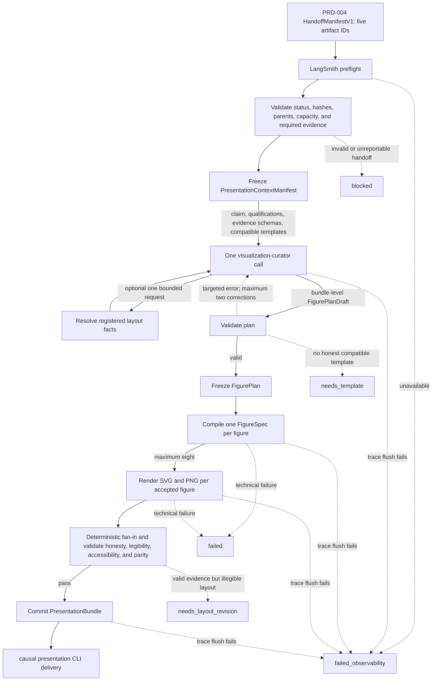
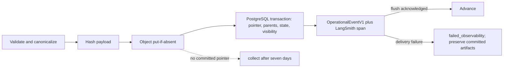

# PRD-005 — Evidence visualization and final presentation

Status: final for implementation  
Product stage: post-judgment evidence communication  
Depends on: `SYSTEM-CONTRACT.md`; PRD-002 — causal design harness; PRD-004 — estimation,
diagnostics, sensitivity, and claim judgment  
Unlocks: final V1 user delivery

`SYSTEM-CONTRACT.md` is authoritative for identities, artifact envelopes, handoffs, context
isolation, bounded loops, persistence, observability, and retention. This PRD defines only the
presentation-stage specialization.

## 1. Outcome

Given a valid PRD-004 handoff, this stage turns frozen causal evidence into a small, honest,
accessible presentation. It produces one immutable `PresentationBundle` containing:

- the approved causal question, estimand, claim status, and mandatory qualifications;
- the approved PRD-002 causal-graph view and accessible node-edge alternative, reused unchanged;
- the required method-appropriate figures;
- one SVG and one PNG for each figure;
- one accessible description and frozen-value table for each figure;
- a concise evidence-linked summary; and
- the IDs, hashes, and versions needed to reproduce the presentation.

PRD-005 may decide how to present approved evidence. It may not change or extend the analysis.

`PresentationOutcome.status` is exactly one of:

| Status | Meaning |
|---|---|
| `complete` | a `reportable` claim was rendered and all gates passed |
| `complete_with_qualifications` | every mandatory qualification was rendered beside the result it qualifies |
| `blocked` | the PRD-004 claim is not presentable or the handoff is invalid |
| `needs_template` | no approved template can honestly present required evidence |
| `needs_layout_revision` | the plan is statistically valid but cannot be rendered legibly in the V1 display profile |
| `failed` | a technical storage, compilation, rendering, or contract-integrity failure occurred |
| `failed_observability` | required LangSmith preflight or trace delivery failed; no final bundle is deliverable |

`needs_template` and `needs_layout_revision` never authorize an improvised chart or hidden
omission. They preserve the frozen evidence and return a typed status to the presentation-catalog
maintainer. They do not reopen estimation and they never cause PRD-005 to ask the user.

## 2. Minimal V1 decisions

1. One `VisualizationCuratorAgent` plans the entire presentation bundle with one initial call and
   at most two targeted schema corrections.
2. There is no agent per figure, panel, caption, format, or accessibility alternative.
3. The curator receives only approved claims, qualifications, evidence schemas, compatible
   templates, and bounded layout facts. It receives no prepared frame or raw row.
4. PRD-004 owns every statistical value, aggregation, bin, fitted point, interval, denominator,
   and diagnostic result used in a figure.
5. PRD-005 performs no statistical calculation, transformation, filtering, binning, smoothing,
   interpolation, estimation, or sensitivity analysis.
6. One immutable, validated `VisualizationCatalog` JSON artifact contains the four method
   profiles, template definitions, capacity limits, display profile, theme, and shared
   visual-honesty rules. V1 has no plugin loader or runtime registration framework.
7. The curator returns one typed `FigurePlanDraft`; it returns no chart code.
8. One deterministic validator checks the draft and returns stable errors.
9. One deterministic compiler turns an accepted plan into declarative Vega-Lite specifications.
10. One local renderer produces SVG and PNG from the same frozen specification and figure data.
11. V1 supports one standard desktop display profile. Mobile layouts, interactive charts, dark
    themes, custom themes, and additional export products are deferred.
12. Every figure remains understandable without hover, animation, or interaction.
13. The final `PresentationBundle` is the only V1 delivery artifact. Loading it cannot rerun an
    agent, compiler, renderer, or analysis.
14. PRD-005 owns the concrete `FigurePlan`. PRD-002 declares required visual evidence but does not
    select templates, panels, encodings, or layouts.
15. Accepted figures may compile and render independently with maximum concurrency eight; the
    curator, plan validation, final fan-in, and bundle commit remain single operations.
16. LangSmith is required in every environment. Failed preflight or trace acknowledgement stops
    the stage as `failed_observability` without invalidating already committed artifacts.
17. V1 delivery is CLI-only. `causal presentation` reads the completed bundle, prints the frozen
    summary, and may copy exact committed assets to a new empty local directory; it does not host
    a viewer or build a frontend.

## 3. Separation of concerns

| Component | Owns | Does not own |
|---|---|---|
| PRD-002 causal-graph renderer | approved concept graph, uncertainty styling, SVG, and node-edge alternative | statistical-result figures or final evidence order |
| PRD-004 figure-data builder | statistical values, aggregations, bins, intervals, denominators, labels, and provenance | chart type, axes, layout, caption wording |
| Presentation context builder | exact bounded context sent to the curator | visual judgment or statistical computation |
| Visualization curator | template choice, evidence order, panel grouping, label placement, and evidence-linked wording | data changes, statistics, free-form code, approval |
| Deterministic validator | integrity, evidence coverage, units, axes, uncertainty, qualifications, and accessibility requirements | choosing the substantive story |
| Deterministic compiler | mapping an accepted plan and frozen fields into a declarative specification | template selection or new values |
| Local renderer | converting one frozen specification into SVG and PNG | data access beyond the referenced figure artifact |
| Presentation-catalog maintainer | approving new templates, capacity, layout bounds, fonts, and theme revisions outside a run | changing frozen evidence, estimates, or claims |
| CLI delivery command | printing one committed bundle summary and copying exact committed assets | replanning, recompiling, rerendering, overwriting an export, or reopening data |

These are responsibilities inside one presentation stage. They are not separate services.

## 4. Scope

### 4.1 In scope

- validating the exact PRD-004 handoff;
- compiling one frozen `PresentationContextManifest`;
- planning the whole presentation with one initial curator call and at most two targeted schema
  corrections;
- optionally resolving one bounded set of layout facts;
- validating one typed figure plan;
- compiling declarative figure specifications;
- rendering static SVG and PNG figures;
- producing accessible descriptions and frozen-value tables;
- attaching qualifications and provenance;
- storing one immutable presentation bundle; and
- delivering the final V1 presentation.

### 4.2 Out of scope

- reading the source CSV, prepared frame, individual records, predictions, residuals, weights,
  influence values, or bootstrap replicates;
- calculating a statistic, estimate, interval, diagnostic, sensitivity, bin, trend, smoother, or
  fitted curve;
- changing a value, unit, denominator, label meaning, filter, or reference point;
- selecting a different method, estimand, treatment, outcome, population, comparator, or
  timeframe;
- hiding or weakening a qualification, failed diagnostic, support limitation, or inconvenient
  result;
- arbitrary Python, SQL, JavaScript, notebook, shell, or model-generated code execution;
- interactive charts, live dashboards, animations, streaming updates, or runtime queries;
- compact/mobile and wide display profiles;
- dark mode, custom themes, additional or runtime-provided fonts, or user-authored templates;
- slide decks, PDF reports, publication figures, or long-form research reports; and
- external publication, public sharing, or scheduled delivery.

## 5. Inputs and entry gate

PRD-005 opens with exactly:

- `estimation_bundle_artifact_id`;
- `claim_judgment_artifact_id`;
- `figure_data_bundle_artifact_id`;
- `experiment_design_artifact_id`; and
- `pre_estimation_capacity_check_artifact_id` for the exact passing pre-estimation recheck.

The opening `HandoffManifestV1` supplies the inherited `analysis_id`, producing PRD-004
`stage_run_id`, exact IDs and hashes, schema and implementation versions, originating outcome,
and PRD-005 compatibility result. PRD-005 creates a new `stage_run_id`; it never reuses an
upstream run identity.

Entry requires:

1. `EstimationOutcome.status` is `complete`.
2. `ClaimJudgment.status` is `reportable` or `reportable_with_qualifications`.
3. All five artifacts and required parents exist and match their hashes.
4. Exactly one approved method and estimand resolve. One atomic `PrimaryAnalysisResult` resolves
   with its complete ordered `PrimaryContrastResult` collection, required uncertainty,
   diagnostics, sensitivities, and claim items.
5. The claim judgment does not exceed its deterministic ceiling.
6. Every claim statement and qualification resolves to frozen evidence.
7. Every required visual-evidence ID resolves to a typed `FigureDataArtifact`.
8. Figure data contain quantities, units, labels, denominators, uncertainty, suppression status,
   and provenance.
9. Figure data contain no unrestricted raw observations or unapproved computed statistics.
10. The approved `CausalGraphView` referenced by the experiment design exists and matches its
    approved hash. PRD-005 may place it but may not revise or rerender it.
11. One supported visualization-catalog version and one standard display profile resolve.
12. The explicit pre-estimation `DeliveryCapacityCheck` has status `pass`, matches its handoff ID
    and hash, is valid for the exact frozen result cardinalities, and maps to the selected catalog
    version.
13. The PRD-004 handoff trace acknowledgement is present and the PRD-005 LangSmith health and
    authorization preflight succeeds before any stage work.

An invalid or incomplete handoff returns `blocked`. PRD-005 does not cosmetically rehabilitate a
`not_reportable`, `not_estimable`, `invalidated`, `design_conflict`, or `failed` result.

## 6. End-to-end workflow



The curator is never called after an accepted plan is frozen. Render failures do not reopen visual
judgment. A user-requested presentation change creates a new presentation run against the same
PRD-004 handoff.

## 7. Context routing

PRD-005 creates a new `stage_run_id`. It inherits artifact references, not the PRD-004 graph
thread, model messages, prompts, checkpoints, scratch context, or memory. PRD-005 has no
`graph_thread_id` because it does not use LangGraph.

### 7.1 Presentation context manifest

`PresentationContextManifest` contains:

- `analysis_id`, PRD-005 `stage_run_id`, and the incoming handoff-manifest ID and hash;
- the exact five input artifact IDs and hashes;
- the approved `CausalGraphView` artifact ID and hash;
- approved question, estimand, method, claim status, statement IDs, and qualification IDs;
- required visual-evidence IDs and figure-data schemas;
- compatible template IDs from the selected method profile;
- quantities, units, field descriptions, cardinalities, label bounds, and suppression states;
- the standard display profile;
- curator, compiler, renderer, validator, and delivery allowlists; and
- catalog, prompt, model-profile, schema, compiler, renderer, and validator versions.

The model receives `AgentTaskEnvelopeV1<PresentationCuratorContext>`. Its shared header binds the
manifest ID and hash, task scope, exact parent artifacts, evidence and tool allowlists, required
`FigurePlanDraft` schema, token/tool/retry/correction budgets, and stable stopping states. The
presentation-specific payload contains only the approved claims, qualification references,
figure-data schemas and safe bounded facts, compatible catalog entries, and display constraints.

It contains no raw row, prepared frame, unrestricted numerical array, prior agent conversation,
or executable specification.

### 7.2 Receiver and destination map

| Receiver | Receives | May retrieve | Returns | Next destination |
|---|---|---|---|---|
| Curator | `AgentTaskEnvelopeV1<PresentationCuratorContext>` | at most one bounded layout-fact response for named evidence IDs | `AgentTaskResultV1<FigurePlanDraft>` or typed inability | plan validator |
| Layout resolver tool `resolve_registered_layout_facts` | enumerated evidence IDs and registered fact names | bounded frozen figure-data summaries | cardinality, label, density, domain, and collision facts | same curator task only |
| Plan validator | draft plan, manifest, catalog, and exact parent hashes | no open-ended context | accepted plan or stable validation errors | compiler or targeted correction |
| Compiler | accepted plan, templates, and figure-data references | exact frozen fields referenced by the plan | declarative `FigureSpec` artifacts | renderer |
| Renderer | one frozen spec, local theme assets, and referenced figure data | no other context | SVG and PNG artifacts | final validator |
| Final validator | specs, renders, descriptions, tables, qualifications, and parents | validation rules only | one validation report | bundle commit |
| CLI delivery command | one `presentation_bundle_artifact_id` and optional empty output directory | committed bundle only | frozen summary and hash-verified copied assets | terminal |

Model output never flows directly to the compiler or another agent. It must pass deterministic
plan validation first. A correction receives only the failed plan fragment, stable error codes,
implicated evidence/template IDs, and enumerated correction choices.

### 7.3 Context-flow graph

```mermaid
flowchart LR
    H["Harness"] -->|"builds immutable pack"| M["PresentationContextManifest"]
    M -->|"ID and hash"| E["AgentTaskEnvelopeV1"]
    E --> C["VisualizationCuratorAgent"]
    C -->|"typed result"| V["Deterministic plan validator"]
    V -->|"committed FigurePlan artifact ID"| P["Compiler fan-out"]
    P -->|"committed FigureSpec IDs"| R["Renderer fan-out"]
    R -->|"committed render IDs"| F["Deterministic final fan-in"]
    F -->|"committed bundle ID"| D["CLI delivery command"]
    C -. "no direct message" .- P
    C -. "no memory or checkpoint" .- R
```



## 8. Visualization catalog

V1 uses one immutable, canonically serialized, schema-validated JSON `VisualizationCatalog`.
It is an input artifact, not a plugin system. Its top-level contract contains:

- `catalog_id`, `schema_version`, `content_hash`, `implementation_version`, and creation time;
- exact method-profile IDs and versions;
- exact template definitions and versions;
- the one display-profile ID and version;
- the one theme ID and version;
- the vendored font ID and SHA-256 hash;
- catalog-wide capacity limits; and
- synthetic fixture IDs and hashes.

Each method profile contains:

- its registered causal-method profile ID;
- required and conditional visual-evidence IDs;
- compatible template IDs for each evidence question;
- evidence-order constraints;
- permitted panel combinations;
- mandatory reference lines and uncertainty fields;
- qualification-placement rules; and
- exact method-level capacity limits for evidence families, primary-result items, diagnostic
  groups, and sensitivity groups.

Each template declares all of the following; absent or unbounded capacity is invalid:

- `template_id`, version, allowed method/evidence profiles, and static field mappings;
- exact minimum and maximum panel count;
- exact minimum and maximum series per panel and per figure;
- exact maximum label count and maximum UTF-8 characters per label;
- exact maximum annotation count per panel and per figure;
- allowed mark, axis, scale-sharing, legend, qualification, and reference-line choices;
- allowed figure-data schema IDs;
- minimum and maximum logical height for the pinned 736-pixel display profile; and
- required synthetic fixtures and expected semantic validation results.

The catalog-wide V1 bounds are at most six figures in one bundle, at most three panels in one
figure, and at most eight simultaneous compile or render tasks. A template may declare smaller
bounds. Exact bounds live in the versioned catalog and are checked by `DeliveryCapacityCheck`, the
plan validator, the compiler, and the final validator.

The application loads exactly one catalog version per run. The curator cannot add to or edit it.
Adding another causal method later means adding one catalog profile and its tests; it does not
require a runtime registry, plugin loader, new orchestration framework, or new agent role.

## 9. Visualization curator

### 9.1 Permitted decisions

The curator may:

- select one compatible template for each required evidence item;
- order primary, diagnostic, sensitivity, and support evidence within catalog constraints;
- place directly comparable evidence in one panel or aligned small multiples;
- choose label and legend positions from enumerated options;
- request registered optional annotations;
- draft one concise evidence-linked caption per figure;
- draft one accessible description per figure; and
- draft a concise presentation summary using approved statements and qualifications.

### 9.2 Forbidden decisions

The curator may not:

- omit or downgrade required evidence;
- introduce an unregistered template, mark, field, transform, or interaction;
- change any value, unit, label meaning, bin, filter, interval, denominator, or reference point;
- calculate or request a new statistic;
- combine incompatible quantities on one scale;
- use a secondary y-axis;
- remove uncertainty, attrition, support limits, diagnostics, sensitivities, or qualifications;
- turn a sensitivity result into the primary result;
- introduce a stronger claim than `ClaimJudgment`;
- ask another model or agent for help; or
- emit Vega-Lite, HTML, JavaScript, SQL, Python, or unrestricted prose.

### 9.3 Output and correction

The curator returns one schema-valid `FigurePlanDraft` from one initial invocation. If it cannot
find an honest compatible template or arrangement, it returns the implicated evidence IDs and a
typed reason.

A failed validator may request at most two targeted corrections for the same stable error code
and task identity. Each correction contains only the invalid fragment, error code, implicated
IDs, and enumerated legal choices. The optional bounded layout-fact lookup is one allowlisted tool
operation within that same task; it is not a second agent or a new planning call. Repeated failure
becomes `needs_template`, `needs_layout_revision`, or `failed`; permissions never widen.

## 10. Figure plan contract

The accepted `FigurePlan` contains:

- artifact ID, plan ID, and exact parent IDs and hashes;
- visualization-catalog and display-profile versions;
- ordered figure entries;
- required-evidence coverage map;
- selected template ID for each figure;
- selected figure-data artifact IDs and hashes;
- panel grouping and scale-sharing choices;
- enumerated label, legend, and annotation choices;
- caption and accessible-description drafts with evidence references;
- qualification placement; and
- prompt, model-profile, schema, and validator versions.

The plan contains no numerical value absent from a referenced figure-data artifact. It is frozen
before compilation.

## 11. Visual honesty rules

### 11.1 One panel, one question

One panel answers one evidence question. Multiple series may share a panel only when they have the
same quantity meaning, unit, denominator, and transformation. Different quantities use aligned
panels or separate figures.

### 11.2 Axes

Every quantitative axis declares:

- quantity and unit;
- scale type;
- mechanically computed domain rule;
- number and tick formatting;
- required zero, null, cutoff, or intervention reference; and
- whether its scale is shared with another panel.

The domain includes every visible mark, the full uncertainty interval, and every mandatory
reference. Bar charts encoding magnitude start at zero. Point-and-interval charts may use a
non-zero domain only when the complete interval and required null reference remain visible.

V1 forbids dual y-axes, reversed axes, three-dimensional marks, decorative gauges, and pie charts
for effect estimates.

### 11.3 Transformations and missingness

A transformed axis is allowed only when PRD-004 quantity metadata explicitly permits it. The
transformation is named in the axis and accessible description.

PRD-005 never rebins, smooths, interpolates, connects an unobserved gap, or fits a curve. Missing,
suppressed, and not-applicable values remain distinct.

### 11.4 Uncertainty and qualifications

Every effect display includes its approved uncertainty and required reference. Primary,
diagnostic, and sensitivity evidence remain visibly distinct.

A mandatory qualification appears beside the primary result and in its caption. A footnote or
separate provenance section alone is insufficient.

## 12. Required V1 evidence

| Method | Required visual questions |
|---|---|
| Randomized experiment | assignment and attrition; primary ITT estimate and uncertainty; baseline balance when available; prespecified sensitivities when required |
| Observational AIPW | overlap; balance; weight/support diagnostics; primary estimate and uncertainty; prespecified sensitivities when required |
| Difference-in-differences | outcome trends; event-time evidence when available; support/composition; primary estimate and uncertainty; prespecified sensitivities when required |
| Sharp RDD | binned outcome and fitted points around the cutoff; density/manipulation evidence; continuity diagnostics when required; primary estimate and uncertainty; prespecified sensitivities when required |

These are evidence questions, not forced chart layouts. The catalog determines which templates
can answer each question honestly.

## 13. Compilation and rendering

The compiler receives one accepted plan, the referenced frozen figure data, and the immutable
catalog. It produces one declarative `FigureSpec` per figure. A specification contains only:

- referenced frozen fields;
- approved marks and encodings;
- axes and mechanically computed domains;
- panel and scale relationships;
- labels, legends, annotations, and reference lines;
- uncertainty encodings;
- caption and qualification references; and
- spec, template, catalog, compiler, and parent hashes.

The compiler cannot select a template, create a value, or perform a statistical transform.

After the complete plan is accepted, compilation may fan out once per accepted figure with
maximum concurrency eight. Rendering may then fan out once per committed `FigureSpec`, also with
maximum concurrency eight. Neither loop can create new figure entries. Both fan in
deterministically in `FigurePlan` order before final validation.

The renderer creates:

- one SVG committed for local viewing/export; and
- one PNG derived from the same specification for local viewing/export.

V1 pins `display_profile_id=desktop-736-v1` with:

- 736 logical CSS pixels of outer width;
- 24 logical pixels of outer padding on every side;
- a 1472-pixel PNG width, exactly 2x the logical width;
- template-specific minimum and maximum logical heights from the catalog;
- one catalog-pinned neutral accessible theme ID and hash;
- font ID `noto-sans-v2.015-variable-normal`, file SHA-256
  `bfb7bb691513f12e734dc346c03a03f784912432d7e3fa8e56efcf906fe86b3d`, width axis 100, and only
  weights 400, 600, or 700; a missing or mismatched font raises an immediate blocker and
  system-font or synthetic-style substitution is forbidden; and
- one renderer fingerprint containing Python, Altair, Vega-Lite schema, `vl-convert`, embedded
  JavaScript runtime, operating-system image, architecture, theme, font, display profile,
  compiler, and renderer versions/hashes.

The authoritative source commit, font-license hash, and vendoring rule are pinned in
`SYSTEM-CONTRACT.md`; this documentation delivery does not claim the binary asset already exists.
A figure that cannot remain legible within its template height bounds returns
`needs_layout_revision`; it does not silently shrink text, clip labels, substitute fonts, or
remove evidence.

No figure loads remote data, code, fonts, or assets. Interactive Vega-Embed output is not part of
V1.

### 13.1 Hash and replay rules

The canonical `FigureSpec` hash is exact in every environment and is the authoritative identity
of the visual specification. SVG and PNG hashes are required to match exactly only when the
renderer fingerprint is identical.

Across different renderer fingerprints, comparison is semantic and tolerance-based rather than
byte-based. The validator requires identical spec hash, data-parent hashes, template and theme
choices, panel/series/label/annotation structure, axis quantities and domains, reference lines,
text content, and accessibility table. It also checks configured visual tolerances for canvas
dimensions, bounding boxes, clipping, text overflow, and raster pixel difference against the
catalog fixture. Tolerances are versioned in the catalog and may not hide a semantic difference.

## 14. Accessibility

Every figure includes:

- a meaningful title phrased as the visual question;
- an accessible description naming the quantities, comparison, uncertainty, and qualification;
- explicit axis titles and units;
- non-color distinctions for groups and statuses;
- sufficient text and mark contrast;
- no essential information available only through color;
- a frozen-value table with the same evidence and disclosures; and
- SVG and PNG alternatives generated from the same specification.

New template definitions require human accessibility review before catalog promotion. V1 does not
build interactive keyboard behavior because V1 figures are static.

## 15. Presentation summary

The presentation order is:

1. causal question, population, estimand, and claim status;
2. the approved causal graph and its uncertainty legend;
3. primary estimate and uncertainty;
4. identification-relevant support and diagnostics;
5. prespecified sensitivities;
6. mandatory qualifications and assumption reminder; and
7. provenance and version details.

Every substantive summary or caption sentence cites an approved claim statement, qualification,
or frozen result artifact. Generic connective text contains no numerical or causal assertion.

## 16. Five validation gates

Artifacts pass in this order:

1. **Input integrity:** the PRD-004 handoff, hashes, claim status, evidence IDs, and catalog
   version match; the exact delivery-capacity check and LangSmith preflight pass.
2. **Plan honesty:** every required evidence item and qualification is present; templates,
   quantities, units, denominators, axes, scales, and references are compatible.
3. **Compilation integrity:** every visual field resolves to frozen figure data and the spec adds
   no value, transform, remote asset, or executable construct.
4. **Render and accessibility quality:** SVG and PNG are legible, unclipped, equivalent, and
   accompanied by accurate descriptions and frozen-value tables.
5. **Bundle integrity:** every visible value and substantive statement resolves to frozen parents,
   and the complete immutable bundle is committed before delivery.

A later gate cannot waive an earlier failure. Validators return stable codes and never rewrite a
plan or specification silently.

## 17. Minimal test matrix

PRD-005 inherits every hard gate and release rule in `SYSTEM-CONTRACT.md` Section 10.5. The
curator fixtures use frozen figure data and a frozen catalog; no evaluator may repair an invalid
proposal or authorize a new template.

| Test family | Required coverage |
|---|---|
| Contract | valid and invalid fixtures for manifest, plan, catalog, figure-data, spec, and bundle schemas |
| Statistical honesty | uncertainty, null/cutoff references, compatible units, full domains, required qualifications, and forbidden transforms |
| Method profile | every required and conditional evidence path for the four V1 methods |
| Rendering | representative short, long, sparse, and dense labels in the one supported profile |
| Accessibility | descriptions, table parity, contrast, non-color distinctions, titles, and units |
| Capacity | every template boundary for figure, panel, series, label, annotation, and height cardinality; rejection occurs before compilation |
| Provenance and replay | every visible value and sentence resolves to frozen parents; exact spec hashes everywhere; exact render hashes only for the same renderer fingerprint; semantic and tolerance comparison across fingerprints |
| Curator evaluation | the shared Section 10.5 schema, context-isolation, evidence-fidelity, catalog-capacity, visualization-honesty, and replay gates; every accepted figure is supported by frozen evidence and every unsupported proposal is rejected |
| Observability | outage before work, after curator, during compile/render, and before handoff; no final delivery opens |

Snapshot changes alone never approve a semantic change.

### 17.1 Typed status destinations

| Status | Destination | May do | Must not do |
|---|---|---|---|
| `needs_template` | presentation-catalog maintainer | propose and test a new immutable catalog revision outside this run | reopen estimation, improvise a chart, or ask the analysis user |
| `needs_layout_revision` | presentation-catalog maintainer | revise declared layout bounds or a template in a new catalog version | omit evidence, shrink below policy, or ask PRD-004 to change results |
| `blocked` | stage coordinator | preserve the typed upstream or handoff failure | cosmetically rehabilitate the evidence |
| `failed` | stage coordinator | begin a new explicit technical attempt from a committed boundary | reuse an `attempt_id` or widen permissions |
| `failed_observability` | stage coordinator | begin a new explicit attempt after LangSmith health returns | retry tracing internally, continue work, commit handoff visibility, or deliver |

### 17.2 Evaluation surfaces

These registrations inherit the bounded policy in `SYSTEM-CONTRACT.md` Section 10.5.2. Catalog,
compiler, renderer, accessibility, and bundle checks are deterministic; only the four
representative curator cases call Vertex, and rendering never expands into a method/template/platform
Cartesian product.

| Eval ID | Boundary and owner | Required fixture focus | Trigger | Hard pass condition |
|---|---|---|---|---|
| `EV-P5-001` | entry, presentation context, catalog identity, and capacity — presentation coordinator | exact/stale handoff, missing evidence, catalog/version mismatch, boundary/overflow cardinalities, and trace preflight | entry/catalog/capacity change + release | curator starts only with exact frozen evidence and a passing catalog capacity check |
| `EV-P5-002` | one-bundle curator — curator and deterministic validator | all method profiles, required/conditional evidence, unsupported annotations, hidden evidence, malformed schema, and correction exhaustion | curator prompt/context/schema change + release | one schema-valid complete plan using only registered evidence and templates |
| `EV-P5-003` | figure-plan and catalog validation — plan validator | panel/series/label/annotation limits, missing required figures, duplicated evidence, inaccessible plans, and template/layout statuses | plan/catalog/validator change + release | every required evidence item has an honest accepted destination or typed catalog-owner status |
| `EV-P5-004` | deterministic compilation and `FigureSpec` hashing — compiler | every template family, forbidden transforms/remote assets/code, units/domains/references, parent drift, and replay | compiler/template change + release | semantically exact spec with identical hash for identical frozen inputs |
| `EV-P5-005` | pinned SVG/PNG rendering and accessibility — renderer | short/long/sparse/dense cases, clipping, font/theme fingerprints, contrast, descriptions, table parity, and same/cross-environment comparisons | renderer/theme/font/accessibility change + release | exact hashes in the pinned environment and registered semantic/tolerance parity elsewhere |
| `EV-P5-006` | summary, bundle provenance, observability, export, and delivery — presentation coordinator | statement/value lineage, incomplete bundle, trace outage at every boundary, wrong export hash, existing destination, and replay | summary/bundle/delivery change + release | every visible claim/value resolves to frozen parents and only one complete verified bundle is deliverable |

## 18. Run state, storage, and lineage

The presentation service stores a small `PresentationRun` record containing only:

- `analysis_id`, PRD-005 `stage_run_id`, and status;
- the five upstream artifact IDs;
- incoming and outgoing `HandoffManifestV1` IDs and hashes;
- `PresentationContextManifest` ID and hash;
- catalog, display-profile, theme, font, compiler, and renderer IDs, hashes, and versions;
- current plan, validation, spec, render, and bundle artifact IDs;
- task, attempt, event, correction, trace-acknowledgement, and stable-failure counters/IDs; and
- created and completed timestamps.

There is no LangGraph state, checkpoint database, agent message history, or workflow-specific
thread. The immutable artifacts are sufficient to restart a failed run from the last committed
boundary.

PostgreSQL stores run status, artifact pointers, hashes, versions, and parent relationships.
The shared content-addressed object layer stores manifests, plans, specifications, SVG, PNG,
descriptions, tables, summaries, validation reports, and bundles.

Each artifact follows the shared commit sequence: validate and canonically serialize; calculate
the content hash; write the immutable object with put-if-absent semantics; transactionally commit
its pointer, parent edges, run state, and any handoff visibility; emit the local JSON event and
required LangSmith span; flush and acknowledge the trace; then advance. A trace failure after the
database transaction preserves the committed artifact but fails the stage and exposes no later
handoff. An object written without a committed pointer is an unreferenced object eligible for the
shared seven-day collection rule.



Presentation lineage is:

```text
Rendered figure or summary statement
      → FigureSpec + accepted FigurePlan
      → VisualizationCatalog + PresentationContextManifest
      → FigureDataArtifact + ClaimJudgment
      → frozen estimate / diagnostic / sensitivity result
      → EstimationPlan + PreparedFrameBundle + approved ExperimentDesign
```

The curator draft is never the source of a number or causal claim.

## 19. Machine-readable observability

PRD-005 emits newline-delimited `OperationalEventV1` JSON and mirrors every event into its
corresponding required LangSmith span. LangSmith is health checked before any stage work and
flushed at the boundary of context construction, curator invocation, validation, each compile and
render task, final fan-in, artifact commit, and handoff. It is debugging evidence only;
PostgreSQL and immutable artifacts remain product authority.

After deterministic task-envelope allowlisting and a second trace-redaction pass, LangSmith
receives the complete prompt and response text actually seen and returned by the curator,
including the bounded approved statements, qualifications, safe figure-data facts, and catalog
choices required for replay. Credentials, connection values, signed URLs, raw provider captures,
unrestricted rows, dataframes, predictions, weights, residuals, replicate arrays, unrestricted
statistical payloads, binary renders, and object contents are forbidden. Platform JSON logs
contain only allowlisted scalar metadata and never contain prompt or response text, figure-data
values, claims, captions, descriptions, specifications, SVG, or PNG.

On a LangSmith health, authorization, emission, flush, or acknowledgement failure, PRD-005:

1. writes one best-effort local `observability.delivery_failed` JSON event;
2. transitions the run to `failed_observability`;
3. preserves all already committed artifacts;
4. performs no internal trace retry and starts no later task; and
5. exposes no final handoff or delivery until a new explicit stage attempt succeeds.

PRD-005 has no fallback tracer, deferred-upload queue, secondary provider, or local-log-only
execution mode. The failure event diagnoses the stop; it does not satisfy the trace gate.

### 19.1 Required event map

| Boundary | Required event names | Required result |
|---|---|---|
| Stage | `stage.started`, `stage.completed`, `stage.failed` | one terminal stage status |
| Curator | `agent.started`, `agent.schema_failed`, `agent.correction_requested`, `task.completed`, `task.failed` | task and attempt identities stay stable across targeted correction |
| Layout lookup | `tool.started`, `tool.completed`, `tool.denied`, `tool.failed` | only registered fact names and evidence IDs |
| Validation and artifact commit | `artifact.validation_failed`, `artifact.committed` | schema/validator versions and artifact lineage |
| Compile/render fan-out | `task.started`, `task.completed`, `task.failed`, `retry.scheduled`, `retry.exhausted` | maximum eight concurrent tasks and three total transient attempts |
| Handoff | `handoff.accepted`, `handoff.rejected` | exact bundle and manifest identities |
| Trace failure | `observability.delivery_failed`, `blocker.raised` | immediate `failed_observability` and no further work |

All fields—including analysis, stage-run, task, attempt, parent-event, artifact, component,
version, status, stable error code, retryability, duration, token, cost, exception fingerprint,
and allowlisted dimensions—use the shared `OperationalEventV1` schema. Logs remain for 14 days;
LangSmith traces remain for 30 days.

## 20. Final delivery boundary

The CLI opens a completed presentation using only the exact `presentation_bundle_artifact_id`
and expected content hash named by the command.

The bundle contains identifiers and hashes for:

- the exact five PRD-004 handoff artifacts;
- the exact approved PRD-002 `CausalGraphView` and accessible node-edge alternative;
- `PresentationContextManifest`;
- the accepted `FigurePlan`;
- every `FigureSpec`, SVG, PNG, accessible description, and frozen-value table;
- the presentation summary and qualification placements;
- one final validation report;
- the exact renderer fingerprint and exact `FigureSpec` hashes; environment-scoped SVG and PNG
  hashes;
- the catalog, display profile, prompt, model profile, compiler, renderer, schema, and validator
  versions; and
- the immutable bundle manifest.

Delivery cannot replan, recompile, rerender, reopen the prepared frame, or rerun analysis. A
presentation-only revision starts a new PRD-005 run against the same PRD-004 handoff. A requested
statistical or claim change returns to the applicable upstream PRD.

`causal presentation ANALYSIS_ID --bundle-id ID --expected-bundle-hash HASH` prints the frozen
summary and asset manifest for that exact completed bundle. It never selects an implicit latest
revision. With `--output-dir`, the target must be absent or empty; the command copies only already committed
summary, SVG, PNG, description, and frozen-value-table bytes, verifies every hash after the copy,
and never overwrites a file. Copy or verification failure raises a blocker and leaves the
authoritative bundle unchanged.

The completed `PresentationBundle` is the only delivery entry point. The outgoing
`HandoffManifestV1` binds its artifact ID/hash/version, exact parent IDs/hashes/versions,
`analysis_id`, PRD-005 `stage_run_id`, terminal outcome, compatibility result, and acknowledged
handoff trace.

## 21. Minimal pinned technology stack

| Concern | Choice | Boundary |
|---|---|---|
| Language | Python 3.12.8 | same runtime as prior PRDs |
| Environment and lock | `uv==0.12.0`; one future repository-root `uv.lock` | implementation must create and commit the lock; this documentation delivery does not claim it exists |
| Contracts | `pydantic==2.13.4` | manifest, catalog, plan, spec, result, and bundle validation |
| Shared CLI boundary | Python standard-library `argparse` | status and hash-verified presentation export without a UI dependency |
| Model API | `google-genai==2.19.0`, Vertex AI stable `v1`, `gemini-2.5-flash` | the frozen shared profile for one bounded curator task with structured JSON output |
| Declarative chart construction | `altair==6.2.2` | deterministic Vega-Lite specification construction |
| Static rendering | `vl-convert-python==1.9.0.post1` | local SVG and PNG conversion |
| Shared database | PostgreSQL 18.6 with `psycopg[binary,pool]==3.3.4` | presentation stage-run status and artifact pointers only |
| Shared object layer | S3-compatible API with `boto3==1.43.65` | immutable presentation payloads |
| Required tracing | `langsmith==0.11.0` | sanitized spans, trace acknowledgement, evaluation, and debugging |
| Tests | `pytest==9.1.1` | contract, honesty, rendering, accessibility, and replay tests |
| Static checks | `ruff==0.16.3`, `mypy==2.3.0` | lint and type-boundary checks |

The complete dependency authority is `SYSTEM-CONTRACT.md`; these direct pins resolve together on
Python 3.12 at documentation review time. PRD-005 adds no LangGraph, Streamlit, web/API framework,
Vega-Embed, browser automation service, notebook renderer, dashboard framework, ORM, Redis, queue,
plugin framework, remote chart service, arbitrary-code runner, or additional agent framework.

## 22. Future code ownership

This PRD will eventually own only:

- the presentation stage-run coordinator;
- the context-manifest builder;
- the one immutable visualization catalog;
- the bounded curator prompt and schema;
- deterministic plan validation;
- deterministic Altair/Vega-Lite compilation;
- local SVG/PNG rendering;
- accessibility and final validation;
- presentation artifact storage; and
- final bundle delivery.

It will not own statistical computation, causal design, repair, estimation, arbitrary chart code,
interactive dashboards, or publishing.

## 23. Acceptance criteria

1. PRD-005 opens only from the five exact PRD-004 artifact IDs.
2. It rejects an invalid, incomplete, unreportable, capacity-incompatible, trace-unacknowledged,
   or hash-inconsistent handoff.
3. A new presentation run inherits approved artifacts rather than PRD-004 messages, prompts,
   checkpoints, scratch context, or memory.
4. A new PRD-005 `stage_run_id` is created and no `graph_thread_id` is created.
5. Exactly one `PresentationContextManifest` is frozen before the curator call.
6. The curator receives exactly one `AgentTaskEnvelopeV1<PresentationCuratorContext>` with a
   tool allowlist, required schema, budgets, stopping states, and exact parent IDs and hashes.
7. Exactly one curator plans the complete bundle; no agent is created per figure, panel, caption,
   format, or accessibility alternative.
8. The curator receives no raw row, prepared frame, unrestricted analytical tool, or executable
   code capability.
9. The curator has one initial call, may make one bounded layout-fact request, and receives at
   most two targeted schema corrections for the same task and stable validation code.
10. Every model output passes deterministic plan validation and artifact commit before the
    compiler can receive its ID.
11. Every required visual-evidence ID and mandatory qualification is presented.
12. The approved PRD-002 causal graph is reused at its approved hash and is never replanned,
    reinterpreted, or rerendered by PRD-005.
13. PRD-005 owns the concrete `FigurePlan`; PRD-002 owns only the required visual-evidence
    declaration.
14. No figure introduces a new statistic, transform, filter, bin, smoother, interpolation,
    estimate, interval, diagnostic, sensitivity, denominator, or claim.
15. Shared axes contain only compatible quantities, units, denominators, and transformations.
16. V1 produces no dual-axis, three-dimensional, interactive, animated, or runtime-querying
    figure.
17. Every effect display shows its approved uncertainty and required reference.
18. Every mandatory qualification appears beside the result it qualifies.
19. `VisualizationCatalog` is immutable validated JSON with exact identity, version, hash,
    method profiles, templates, capacities, display profile, theme, font hash, and fixture hashes.
20. Every template has finite panel, series, label, annotation, and height limits; capacity
    failure occurs before compilation.
21. Compilation and rendering fan out only after plan acceptance, never exceed eight concurrent
    tasks, and fan in deterministically in plan order.
22. SVG and PNG are generated from the same frozen plan, specification, figure data, catalog,
    display profile, theme, and font.
23. Every figure has an accurate accessible description and frozen-value table.
24. A missing honest template returns `needs_template` to the presentation-catalog maintainer;
    it never triggers arbitrary chart code, reopens estimation, or asks the user.
25. A statistically valid but illegible plan returns `needs_layout_revision` to that maintainer;
    it never clips, hides evidence, reopens estimation, or asks the user.
26. Every visible value, caption, summary statement, and qualification resolves to frozen parent
    artifacts.
27. The final presentation opens from one `presentation_bundle_artifact_id` without reopening
    data, calling a model, recompiling, rerendering, or rerunning analysis.
28. Canonically identical frozen inputs produce identical `FigureSpec` hashes in every
    environment.
29. SVG and PNG hashes reproduce exactly under the same renderer fingerprint; different
    fingerprints use the catalog's semantic and visual-tolerance comparison.
30. The pinned profile is 736 logical pixels wide with 24-pixel outer padding and a 1472-pixel
    PNG, template-specific height bounds, one theme, one verified vendored font, and a complete
    renderer fingerprint.
31. Required LangSmith preflight and every operation-boundary flush are acknowledged before
    progression.
32. LangSmith contains the complete deterministically sanitized curator prompt and response and
    none of the forbidden payload classes.
33. A LangSmith outage before work, after the curator, during compile/render, or before handoff
    produces `failed_observability`, preserves committed artifacts, and exposes no delivery.
34. Every registered operation emits valid `OperationalEventV1` JSON mirrored into its LangSmith
    span; platform logs contain only allowlisted scalar metadata.
35. The shared commit order, idempotency identities, retry bounds, retention rules, and
    `HandoffManifestV1` apply at every boundary.
36. PRD-005 uses a deterministic coordinator and requires no LangGraph, checkpoint service,
    interactive viewer, queue, plugin loader, or additional agent framework.
37. `causal presentation` requires the exact completed bundle ID and hash, prints its frozen
    summary, and may copy exact committed assets only to an absent or empty directory with
    post-copy hash verification; it never selects an implicit latest revision.
38. V1 includes no Streamlit or browser UI, web/API server, frontend build, or public delivery
    service.
39. PRD-005 implementation remains within the non-transferable 1,500-line `presentation`
    allocation in `SYSTEM-CONTRACT.md`; every coding task passes the shared forecast,
    measurement, and bounded rethink gate without adding a UI, chart framework, or alternate
    renderer.

## 24. Deliberately deferred

- interactive charts and Vega-Embed;
- mobile/compact and wide display profiles;
- dark mode, custom themes, and additional or runtime-provided fonts;
- runtime template registration and plugin loading;
- dashboards and direct prepared-frame queries;
- user-authored arbitrary chart builders;
- maps, networks, three-dimensional charts, and animation;
- exploratory subgroup, outcome, cutoff, period, or bandwidth visualization;
- live or continuously updating estimates;
- slide decks, PDFs, long-form reports, and publication figures;
- public sharing, external publishing, scheduled delivery, and audience analytics;
- Streamlit, browser/web delivery, a public API, and remote or multi-user interaction;
- localization beyond the V1 product language; and
- visualization profiles for causal methods outside the four approved V1 method packs.

Each deferred capability requires an explicit PRD revision. None is a hidden fallback inside the
V1 presentation stage.
