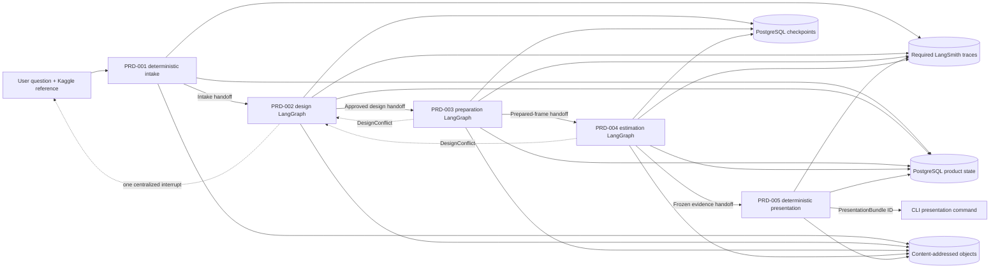
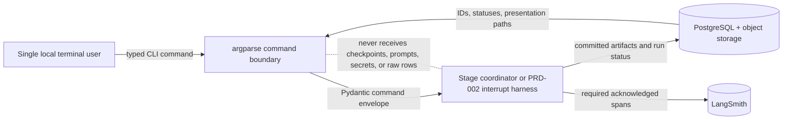
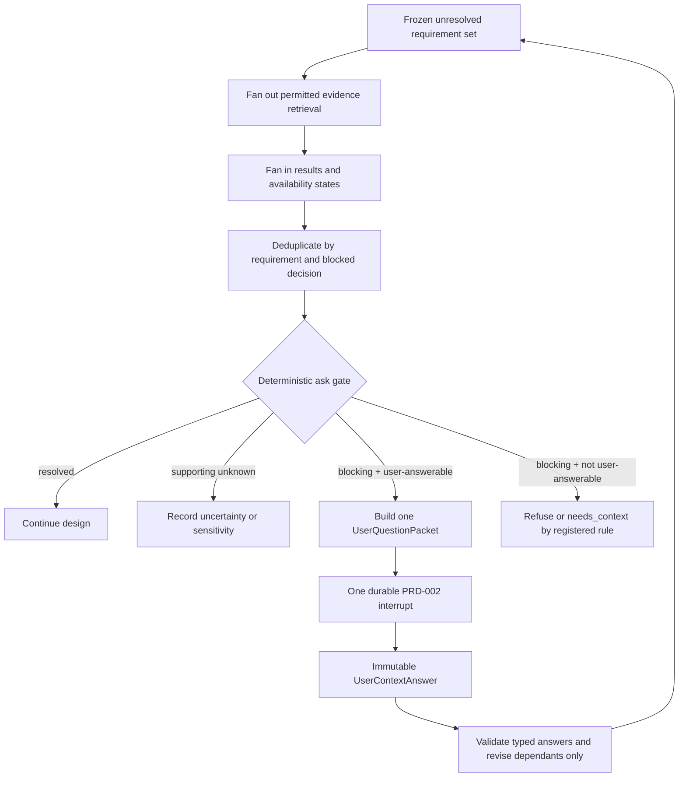
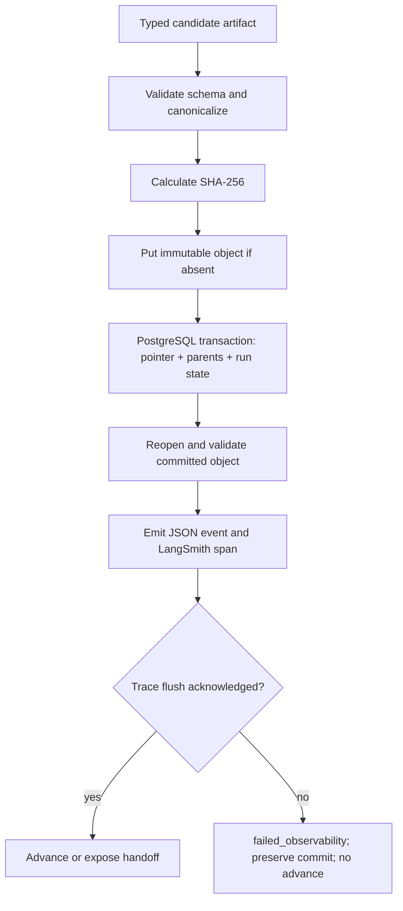

# System contract — causal-analysis V1

Status: final for implementation  
Applies to: PRD-001 through PRD-005  
Purpose: the single authority for application boundaries, cross-stage execution, context,
persistence, observability, retry, and handoff behavior

## 1. Authority and system shape

This document owns rules that apply to more than one PRD. A stage PRD owns only its scientific
or product-specific behavior. If duplicated wording differs, this contract wins and the duplicate
must be corrected; an implementation must not choose the more permissive interpretation.

V1 is one modular Python application with five stage modules:

1. deterministic intake;
2. causal design;
3. runnable-frame preparation;
4. estimation and judgment; and
5. presentation and delivery.

The modules share PostgreSQL, one content-addressed S3-compatible object layer, contract models,
an event emitter, and a single dependency lock. They are not five network services. LangGraph is
used only inside PRD-002, PRD-003, and PRD-004. PRD-001 and PRD-005 use small deterministic
coordinators.



### 1.1 User-facing CLI boundary

V1 is a single-user local/private workspace. The operating-system login identifies the one user;
the application has no accounts, registration, teams, tenants, roles, OAuth, OIDC, password
database, external authentication provider, Streamlit application, or browser UI. Multi-user or
remote interaction requires a later contract revision.

One standard-library `argparse` CLI is the only human interface. It runs in the same Python
application and calls typed coordinators; it never calls a model, tool, LangGraph node, database,
object store, or LangSmith directly. Commands run synchronously until the next committed user
interrupt or terminal stage boundary. There is no daemon, hidden background job, queue, polling
service, or alternate execution mode.



The fixed commands are deliberately small. `causal` below is the future console-script name; no
CLI code is created by this documentation delivery.

| Command | Purpose | Mutation rule |
|---|---|---|
| `causal new --question TEXT --kaggle REF --idempotency-key KEY [--context-file PATH]` | validate `IntakeSubmissionV1`, create PRD-001 identities, and run to the next boundary | never accepts credentials as arguments |
| `causal status ANALYSIS_ID` | show committed stage status and the exact next permitted command | read committed indexes only |
| `causal select-table ANALYSIS_ID --table-id ID --interrupt-id ID --expected-interrupt-hash HASH --expected-revision ID --idempotency-key KEY` | submit `TableSelectionDecisionV1` | exact current PRD-002 table-selection interrupt only |
| `causal answer-context ANALYSIS_ID --answers-file PATH --interrupt-id ID --expected-interrupt-hash HASH --expected-revision ID --idempotency-key KEY` | submit `UserContextAnswerV1` | exact current PRD-002 clarification interrupt only |
| `causal approve-design ANALYSIS_ID --decision VALUE --interrupt-id ID --expected-interrupt-hash HASH --expected-revision ID --idempotency-key KEY` | submit `DesignApprovalDecisionV1` | exact current PRD-002 approval interrupt only |
| `causal run ANALYSIS_ID --expected-stage-run ID --idempotency-key KEY` | resume from the current committed boundary and stop at the next interrupt or terminal state | no implicit answer, approval, method change, or fallback |
| `causal presentation ANALYSIS_ID --bundle-id ID --expected-bundle-hash HASH [--output-dir PATH]` | read one exact completed `PresentationBundle`; print its summary and optionally copy exact committed presentation assets into an empty local directory | no implicit latest-bundle selection, model, compile, render, statistical-data access, or overwrite |

The creation command contains a client request identity, command-schema version, and idempotency
key; the coordinator creates its `analysis_id`. Every later mutation contains the existing
`analysis_id`, the command-specific expected revision or stage-run identity, command-schema
version, and client idempotency key. The command boundary rejects stale identities,
duplicate-conflicting keys, undeclared fields, unavailable actions, and non-terminal prerequisite
states. `--format human` is the beginner-friendly default; `--format json` emits exactly one
schema-valid `CliResultV1` on stdout. Operational NDJSON goes to the configured log sink, never
mixed into stdout. Secrets are read only from the runtime secret source.

`CliCommandEnvelopeV1` is the sole coordinator input constructed by the CLI:

| Field | Rule |
|---|---|
| `schema_version` | exact supported CLI-command schema; parser supplies it and the coordinator verifies it |
| `cli_invocation_id` | new for every physical command; observability identity only, never an idempotency identity |
| `command_name` | one of the seven names above |
| `analysis_id` | absent only for `new`; exact existing identity otherwise |
| `expected_identity` | current interrupt revision for an answer command, stage-run ID for `run`, exact bundle ID/hash for `presentation`, or absent where not applicable |
| `idempotency_key` | required for `new`, `select-table`, `answer-context`, `approve-design`, and `run`; absent for read-only `status` and non-authoritative local export |
| `payload_type` and `payload_hash` | exact registered typed payload and canonical hash, or absent when the command has no payload |
| `output_format` | `human` or `json`; changes rendering only, never behavior |

An answer command must match the open interrupt's analysis ID, kind, artifact ID, artifact hash,
and expected revision. `presentation` must match the exact completed bundle ID and hash; it never
chooses a latest revision implicitly. A mutating coordinator acquires one PostgreSQL session
advisory lock for the `analysis_id` (or the creation idempotency key before an analysis exists).
Lock contention emits `blocker.raised` with `analysis_busy` and exits immediately; there is no
queue or polling loop.

`CliResultV1` contains only `schema_version`, `cli_invocation_id`, `command_name`, optional
`analysis_id` and `stage_run_id`, `status`, safe committed artifact ID/hash pairs, optional exact
interrupt identity, optional `next_command_name`, stable `error_code`, optional blocker event ID,
and an allowlisted human-summary message key plus scalar arguments. `status` is exactly
`accepted`, `completed`, `needs_user_input`, `blocked`, `failed`, or `failed_observability`.
Prompt text, response text, credentials, connection values, raw rows, checkpoints, and
unrestricted artifact payloads are forbidden. Human output is rendered from this same result;
there is no second result path.

### 1.2 Deployment and runtime boundary

V1 runs as one foreground CLI process plus private PostgreSQL and S3-compatible dependencies. It
may be packaged as one OCI application image but exposes no network listener. It is
cloud-vendor-neutral and requires no Kubernetes, service mesh, ingress controller, CDN, load
balancer, reverse proxy, autoscaler, application server, or authentication service.

The build base is the official
`python:3.12.8-slim-bookworm@sha256:2199a62885a12290dc9c5be3ca0681d367576ab7bf037da120e564723292a2f0`
multi-platform index. The canonical release/reference platform is `linux/amd64`, child digest
`sha256:8859bd6ca943079262c27e38b7119cdacede77c463139a15651dd340087a6cc9`.
The verified `linux/arm64/v8` development child is
`sha256:608e6ed31df49009fa6c242fb61b5386a1c002e40c2b9cb1958e0f1041aaf06`;
its numerical and renderer fingerprint is distinct and cannot claim canonical byte equality.

The final application-image digest is created and recorded when implementation builds the image;
this documentation does not claim it exists. CLI startup verifies the expected Python, Graphviz,
font, dependency-lock, schema, and implementation fingerprints. A mismatch emits
`blocker.raised` and stops startup; host binaries or system fonts are never substituted.

## 2. Common identities

| Identity | Scope | Creation and reuse rule |
|---|---|---|
| `analysis_id` | complete PRD-001 → PRD-005 journey | created once by PRD-001; inherited unchanged by every revision and stage |
| `stage_run_id` | one stage attempt or material stage revision | new for each stage and material revision; never reused by another stage |
| `graph_thread_id` | one PRD-002, PRD-003, or PRD-004 LangGraph run | new UUID for each graph run; reused only to resume that run |
| `task_id` | one bounded deterministic or model task | stable across transient retries of that task |
| `attempt_id` | one physical attempt | new for every attempt, including retries and resumes |
| `event_id` | one operational event | unique and immutable |
| `artifact_id` | one immutable logical artifact | stable only when the canonical payload and identity are unchanged |

Internal identifiers are authoritative. A future A2A transport may create its own `taskId` or
`contextId`, but those values remain opaque adapter metadata. They never replace or get copied
into `analysis_id`, `stage_run_id`, `graph_thread_id`, `task_id`, or `artifact_id`.

## 3. Immutable artifact contract

Every stored artifact uses `ArtifactEnvelopeV1`.

| Field | Required rule |
|---|---|
| `artifact_id` | immutable logical identity |
| `artifact_type` | registered closed vocabulary |
| `schema_version` | exact contract version |
| `content_hash` | SHA-256 of canonical serialized payload bytes |
| `analysis_id` | inherited root analysis identity |
| `stage_run_id` | producing stage run |
| `producer_component` | registered component ID |
| `producer_version` | implementation build or commit ID |
| `parent_artifacts` | ordered artifact ID and hash pairs |
| `sensitivity_class` | `public`, `internal`, `restricted`, or `secret_reference` |
| `created_at_utc` | UTC timestamp |
| `payload_locator` | object-store pointer; never a signed URL |

Canonical serialization fixes key ordering, number encoding, Unicode normalization, timestamp
format, and null handling. An artifact ID observed with a different hash is a terminal integrity
conflict; it is never overwritten or silently versioned in place.

Each cross-stage transfer is represented by `HandoffManifestV1`:

- handoff ID and schema version;
- analysis ID and producing/receiving stage-run IDs;
- exact ordered entry artifact IDs and hashes;
- originating stage outcome and approval IDs where applicable;
- registry and compatibility versions;
- receiver validation result and stable error codes; and
- created and accepted timestamps.

A receiver opens from the small entry-ID set named by its PRD, resolves the handoff manifest and
parents, and fails closed on a missing object, hash mismatch, unsupported version, wrong outcome,
or incomplete lineage.

### 3.1 Artifact-type registry and routing ledger

Every artifact type must have exactly one immutable `ArtifactTypeRegistrationV1` before any
instance can be committed. The registration fixes one producer component, allowed reader
components, exact required and optional parent types, schema and validator versions, sensitivity
class, terminal artifact statuses, and downstream destinations. A missing or ambiguous
registration is `unsupported_schema`, not permission to infer a route.

The cross-stage entry artifacts are locked as follows; stage PRDs register their internal
artifacts under the same rule.

| Entry artifact | Sole producer | Allowed cross-stage reader | Required parent types | Terminal statuses | Destination |
|---|---|---|---|---|---|
| `IntakeOutcome` | PRD-001 intake coordinator | PRD-002 entry gate | `QuestionRecord`, `SourceManifest`, admitted `TableProfile`, `EvidenceBundle`, and `SemanticMap` artifacts | `usable`, `partial`, `refused` | PRD-002 by `analysis_id` plus intake-outcome ID |
| `ExperimentDesign` | PRD-002 design harness | PRD-003, PRD-004, PRD-005 validators | selected table, approved intent, measurement map, causal context, role ledger, feasibility report, method manifest | `approved`, `superseded`, `declined` | bound design handoffs only |
| `RunnableFrameContract` | PRD-002 design harness | PRD-003 and PRD-004 | exact approved `ExperimentDesign` | `approved`, `superseded` | PRD-003 then PRD-004 |
| `DeliveryCapacityCheck[design_approval]` | PRD-002 design harness | PRD-003 and PRD-004 entry gates plus PRD-004 recheck gate | exact design, method/capacity registries, visualization catalog | `pass`, `fail` | explicit PRD-002→003 and PRD-003→004 handoff entry; then PRD-004 recheck input |
| `DeliveryCapacityCheck[pre_estimation]` | PRD-004 capacity validator | PRD-004 estimator gate and PRD-005 entry gate | design-time check, exact estimation plan, prepared structure, method/capacity registries, visualization catalog | `pass`, `fail` | estimator access and presentation entry |
| `PreparedFrameBundle` | PRD-003 preparation harness | PRD-004 entry gate | source CSV, design, frame contract, approved design-time capacity check, row-set freeze, prepared frame, receipts, diagnostics, lineage | `prepared` | PRD-004 only with a `prepared` stage outcome |
| `EstimationBundle` | PRD-004 estimation harness | PRD-005 entry gate | design, prepared bundle, pre-estimation capacity check, estimation plan, primary result, uncertainty, diagnostic, sensitivity, figure-data, and judgment artifacts | `complete` | PRD-005 only with a `complete` stage outcome |
| `ClaimJudgment` | PRD-004 claim validator | PRD-005 entry gate and delivery validator | one claim-review draft or deterministic non-estimable disposition, judgment ceiling, primary result, diagnostics, sensitivities | `reportable`, `reportable_with_qualifications`, `not_reportable`, `not_estimable`, `failed` | PRD-005 only for reportable statuses |
| `FigureDataBundle` | PRD-004 deterministic figure-data fan-in | PRD-005 coordinator/compiler | exact required visual-evidence declarations and frozen statistical parents | `complete`, `failed` | PRD-005 only when complete |
| `PresentationBundle` | PRD-005 presentation coordinator | CLI delivery command | presentation manifest, accepted plan, exact specs/renders/tables/descriptions, validation report, catalog and renderer manifest | `complete`, `complete_with_qualifications` | final delivery only |
| `DesignConflict` | PRD-003 or PRD-004 harness | PRD-002 design harness | failed registered rule and committed evidence artifacts | `open`, `resolved`, `refused` | new PRD-002 revision; never direct user contact |

`failed_observability` is a stage-run status, not an artifact rewrite. Artifacts committed before
that failure retain their artifact-level status but are not visible through a new handoff.

## 4. Run-state contract

Every stage uses the common operational states below, followed by its PRD-specific outcome.

```text
created → tracing_preflight → running
                           ├→ waiting_for_user     PRD-002 only
                           ├→ committing
                           ├→ completed
                           ├→ failed_observability
                           └→ failed
```

Only declared transitions are legal. `failed_observability` means required trace delivery failed;
already committed artifacts remain valid but no later task or handoff may begin. Resuming after
the service returns creates a new `attempt_id` against the same idempotent task identity. It does
not delete or rewrite the prior attempt.

## 5. Context contracts

### 5.1 Stage manifests

The four immutable context packs are:

| Manifest | Built by | Used for |
|---|---|---|
| `DesignContextManifest` | PRD-002 harness | design tasks and user-question synthesis |
| `PreparationContextManifest` | PRD-003 harness | row stabilization and preparation tasks |
| `EstimationContextManifest` | PRD-004 harness | deterministic analysis and claim review |
| `PresentationContextManifest` | PRD-005 coordinator | curator, compiler, renderer, and delivery validation |

Each manifest contains exact parent IDs and hashes, allowlisted facts and registries, an explicit
recipient map, and a content hash. It contains no inherited transcript, scratchpad, chain of
thought, unrestricted source object, dataframe, or prior-stage checkpoint.

### 5.2 Model-task envelope

Every model invocation uses the common `AgentTaskEnvelopeV1` header plus a task-specific typed
payload.

Required header fields are:

- envelope ID, schema version, analysis ID, stage-run ID, task ID, and attempt ID;
- parent context-manifest ID and hash;
- task kind, scope kind, and exact scope IDs;
- ordered parent artifact IDs and hashes;
- allowlisted evidence, context-retrieval, and tool IDs;
- required output schema and validator versions;
- prompt and model-profile versions;
- token, tool-call, transient-attempt, and correction budgets;
- allowed stopping states and stable error vocabulary; and
- forbidden payload classes.

An `AgentTaskResultV1` returns the envelope ID, task status, one typed draft or inability result,
evidence references, tool receipts, output hash, and validation target. Free-form output cannot
advance the workflow.

### 5.3 Routing invariants

1. The stage harness or coordinator is the only context router.
2. Agents never address one another, share private memory, or inherit messages.
3. Sibling tasks receive no sibling context unless a validated sibling artifact is an explicit
   dependency.
4. A model result returns to its deterministic validator, never directly to another agent or an
   action component.
5. Only a validated, committed artifact ID can enter a later task packet.
6. Payloads are loaded just in time through scoped tools and released after the task.
7. Checkpoints retain identities and state, not context payloads.

### 5.4 Complete model-task audit ledger

These are the only model task types in V1. Each named tool set is a closed, versioned allowlist;
the envelope may remove tools but cannot add one. Every row permits one initial response plus at
most two targeted schema corrections and returns to the named deterministic validator.

| PRD / task payload | Exact tool allowlist | Required draft schema | Validator and committed destination |
|---|---|---|---|
| PRD-002 `IntentTaskContext` | `list_intake_inventory`, `get_semantic_evidence` | `DesignIntentDraftV1` or `ContextRequirementV1[]` | intent validator → committed intent/requirements → semantic harness |
| PRD-002 `SemanticBatchTaskContext` | `list_intake_inventory`, `get_semantic_evidence`, `get_measured_facts`, `get_provenance` | one `ColumnSemanticCardDraftV1` per assigned column | semantic-card validator → committed batch artifacts → harness fan-in |
| PRD-002 `RoleEvidenceTaskContext` | `list_intake_inventory`, `get_semantic_evidence`, `get_provenance` | `RoleEvidenceDraftV1[]` or requirements | evidence validator → committed evidence artifacts → causal synthesis packet builder |
| PRD-002 `CausalSynthesisTaskContext` | `list_intake_inventory`, `get_semantic_evidence`, `get_provenance`, `validate_causal_model` | `CausalSynthesisDraftV1` | causal validator → committed causal context/role-ledger artifacts → method packet builder |
| PRD-002 `MethodDesignTaskContext` | `list_intake_inventory`, `get_semantic_evidence`, `get_measured_facts`, `get_provenance`, `get_method_contract`, `run_preflight_diagnostic`, `preview_eligibility_impact` | `MethodDesignDraftV1` | design validator → committed experiment-design/frame-contract drafts → approval harness |
| PRD-003 `PreparationTaskContext` | exact `preparation.agent-tools.v1`: inspection, bounded profile, registered preview/action/diagnostic tools listed in PRD-003 Section 17; no generic read/write/code tool | `PreparationTaskDraftV1` or `DesignConflictDraftV1` | preparation-plan validator → committed proposals → preparation fan-in; every action then returns to postcondition validator |
| PRD-004 `ClaimReviewContext` | none | `ClaimJudgmentDraftV1` with one claim item per primary result item | claim validator → committed `ClaimJudgment` → figure-data/bundle validation |
| PRD-005 `PresentationCuratorContext` | `resolve_registered_layout_facts` only, maximum one call | `FigurePlanDraftV1` or typed inability | plan validator → committed `FigurePlan` → deterministic compiler |

No model invocation may address another row, receive its uncommitted draft, or choose its own
destination. Tool denial, context mismatch, or unsupported output schema raises a blocker; the
harness does not substitute another agent or prompt.

## 6. Central ask-user policy

PRD-002 owns the only user interrupt. Other stages may detect a problem and produce a typed
`DesignConflict`, but they never ask the user directly.

### 6.1 Requirement contract

`ContextRequirementV1` contains:

- stable requirement and registry IDs;
- exact dataset, table, column, concept, relationship, or design scope;
- fact required and why it matters;
- decisions blocked;
- `blocking` or `supporting` criticality;
- acceptable evidence types and minimum support class;
- evidence IDs and availability states already checked;
- whether a user can reasonably know the answer;
- typed expected-answer schema; and
- missing action: `ask_user`, `retain_as_sensitivity`, or `refuse`.

### 6.2 Ask gate



The ask gate permits a question only when all of the following are true:

1. the requirement is blocking;
2. all permitted non-user evidence has been checked;
3. a user may reasonably know the study or data-generating fact;
4. the answer can be validated against a declared answer schema; and
5. it can change a legitimate design decision without depending on observed results.

The system never asks the user to fix a technical failure, waive a validator, provide code,
choose a favorable estimate, select a method after results, or reinterpret an inconvenient
diagnostic.

`UserQuestionPacketV1` contains at most five deduplicated questions. Each question names its
requirement IDs, evidence checked, why it matters, blocked decisions, expected answer shape, and
an explicit `unknown` choice. V1 allows at most two clarification packets per design revision.
Table selection and final design approval are separate interrupts and do not consume those two
rounds.

After two rounds, a remaining blocking requirement produces `needs_context` or `refused` according
to its registered missing action. A later new answer starts a new design revision. An answer is
stored verbatim in `UserContextAnswerV1`, attributed to the user, and never rewritten as source
documentation.

`DesignApprovalDecisionV1` is exactly `approved`, `changes_requested`, or `declined`.
`changes_requested` creates a new immutable design revision. `declined` terminates the revision
without opening PRD-003.

## 7. Fan-out, fan-in, and loop bounds

| Loop | Fan-out rule | Fan-in owner | Idempotency identity | Bound and terminal exit |
|---|---|---|---|---|
| intake profiling | independent admitted resources | intake coordinator | stage run + source-resource ID + parser profile hash | maximum eight concurrent operations; every resource gets a terminal status |
| design semantics | deterministic batches of the frozen relevant-column set | design harness | design revision + batch membership hash + task kind | maximum eight initial tasks; each column in exactly one initial task |
| causal role evidence | frozen material relationship groups, never all pairs | design harness | design revision + relationship-group hash + task kind | maximum eight initial tasks; workers cannot expand scope |
| preparation planning | unresolved independent dependency groups only | preparation harness | frame hash + dependency-group hash + gap-code set | maximum eight concurrent tasks; satisfied columns create no task |
| preparation mutation | none | preparation harness | committed plan-item ID + exact input hash | sequential topological execution only; one immutable receipt and terminal postcondition per item |
| estimation diagnostics/sensitivities | prespecified registered tasks after primary-result freeze | estimation harness | estimation-plan hash + registered task ID + primary-result hash | maximum eight concurrent tasks; every task returns a terminal visible result |
| presentation compilation/render | accepted figures only after one plan is frozen | presentation coordinator | figure-plan hash + figure entry ID + compiler/renderer fingerprint | maximum eight concurrent figures; bundle commit waits for every required figure |

Transient provider or model calls allow three total physical attempts using the same task and
idempotency identity. A schema-validity loop permits one initial model response plus at most two
targeted corrections for the same stable validation code. A correction sees only the invalid
fragment, named parents, error paths, and enumerated permitted changes.

Hash conflicts, permission failures, unsupported schemas, deterministic validation failures, and
LangSmith delivery failures are not blindly retried. Required LangSmith delivery has no internal
retry: it immediately produces `failed_observability`; a later explicit resume creates a new
attempt.

### 7.1 No-fallback and blocker rule

No stage may substitute a different method, estimator, model, prompt, tool, provider, database,
object store, tracer, template, renderer, registry version, numerical solver, or workflow path.
There is no degraded mode. A blocker is emitted synchronously as `blocker.raised` with the stable
error code, blocked operation, implicated IDs, and required owner; the current path then enters its
declared terminal status and no downstream work begins.

The only repeat operations are the already declared same-identity transient attempts and targeted
schema corrections. They use the same component, configuration, inputs, permissions, and
idempotency identity; they cannot switch strategy and are not fallbacks. Every failed physical
attempt is emitted immediately. An error marked non-retryable, or an exhausted declared bound,
raises the blocker without another attempt.

Statuses such as `partial`, `not_computable`, or `unknown` are permitted only when a versioned
pre-result rule declares that item non-blocking and fixes its downstream handling. They can never
waive a required input, validator, trace, capacity check, diagnostic, or handoff field; a required
missing item raises a blocker immediately.

## 8. Persistence and commit protocol

### 8.1 Storage responsibilities

| Layer | Authority | Never used for |
|---|---|---|
| content-addressed object storage | immutable source, context, plan, data, result, figure, and bundle payloads | mutable workflow state or secrets |
| PostgreSQL product schemas | identities, pointers, lineage edges, state transitions, approvals, indexes, and handoff visibility | large payload duplication |
| PostgreSQL LangGraph checkpoint schema | resumable PRD-002–004 operational state | product artifacts, cross-stage memory, or scientific authority |
| LangSmith | required execution traces, model text after sanitization, evaluation, and debugging | approval, lineage, artifact storage, or result authority |
| JSON application logs | local machine-readable operational events and trace-delivery failure evidence | source data or authoritative product state |

### 8.2 Artifact commit



Object upload precedes the PostgreSQL visibility transaction. A failed transaction may leave an
unreferenced object, which is safe because it is immutable and invisible to consumers. A replay
with the same ID and hash is a no-op. The same ID with another hash is a terminal integrity error.

### 8.3 Retention and recovery

- authoritative referenced artifacts remain until explicit analysis deletion;
- unreferenced objects are eligible for collection after seven days;
- active interrupted checkpoints remain until resolved or explicitly cancelled;
- terminal LangGraph checkpoints and LangSmith traces remain for 30 days;
- platform JSON application logs remain for 14 days;
- deleting a stage-derived artifact cannot delete a still-referenced source or parent;
- production PostgreSQL must provide point-in-time recovery; and
- object versioning or equivalent recoverable-delete protection is required before production.

## 9. LangGraph contract

PRD-002, PRD-003, and PRD-004 each compile a separate graph and use a new `graph_thread_id`.
Resuming a user interrupt or recoverable node failure reuses only that stage's thread. A later
stage never resumes an earlier graph.

Production uses the PostgreSQL checkpointer with strict msgpack allowlisting and no pickle
fallback. One shared checkpoint schema is namespaced by stage and thread. Graph state may contain
only:

- common identities and current stage/phase;
- context-manifest, task, artifact, receipt, and validation IDs and hashes;
- pending dependency IDs;
- attempt, correction, and clarification counters;
- user interrupt/answer IDs in PRD-002;
- row-set hash in PRD-003 and PRD-004; and
- terminal status and stable error codes.

No graph uses a LangGraph Store for cross-thread memory. Immutable application artifacts are the
only cross-thread context. Node work before an interrupt is idempotent because LangGraph resumes
by restarting the interrupted node. The official PostgreSQL checkpointer requires strict
serialization controls; the selected package documents `LANGGRAPH_STRICT_MSGPACK=true` or an
explicit allowed-module list.

This follows [LangGraph's thread-scoped persistence model](https://docs.langchain.com/oss/python/langgraph/persistence)
and documented [interrupt/resume behavior](https://docs.langchain.com/oss/python/langgraph/interrupts).

## 10. Machine-readable observability

### 10.1 Event schema

Every component emits `OperationalEventV1` as one newline-delimited JSON object.

| Field | Requirement |
|---|---|
| `schema_version` | exactly `operational-event.v1` |
| `occurred_at_utc` | RFC 3339 UTC timestamp |
| `severity` | `debug`, `info`, `warning`, or `error` |
| `event_name` | registered dotted event name |
| `event_id` | unique event identity |
| `parent_event_id` | causal parent when present |
| `analysis_id`, `stage`, `stage_run_id` | always present |
| `graph_thread_id` | present for PRD-002–004 graph events |
| `task_id`, `attempt_id`, `attempt_number` | present for bounded work |
| `component_id`, `component_version` | producing implementation |
| version fields | applicable model, prompt, tool, registry, schema, validator, compiler, or renderer versions |
| `status`, `error_code`, `retryable` | typed outcome; nullable only when not applicable |
| `duration_ms`, `token_usage`, `cost` | present when measurable |
| `artifact_refs` | IDs and hashes only |
| `required_eval_ids` | stable evaluation registrations covering this component or boundary; required on registered task, agent, tool, handoff, and render events |
| evaluation fields | `evaluation_run_id`, `evaluation_case_id`, fixture hash, evaluator version, and gate status when the event belongs to an evaluation run |
| `exception_class`, `exception_fingerprint` | safe machine-readable failure identity |
| `safe_dimensions` | allowlisted scalar metadata only |

Required event names are:

- `stage.started`, `stage.completed`, `stage.failed`;
- `task.started`, `task.completed`, `task.failed`;
- `artifact.committed`, `artifact.validation_failed`;
- `agent.started`, `agent.schema_failed`, `agent.correction_requested`;
- `tool.started`, `tool.completed`, `tool.denied`, `tool.failed`;
- `retry.scheduled`, `retry.exhausted`;
- `user_interrupt.created`, `user_interrupt.resumed`;
- `handoff.accepted`, `handoff.rejected`; and
- `observability.delivery_failed`; and
- `blocker.raised`;
- `evaluation.run_started`, `evaluation.case_started`, `evaluation.case_completed`;
- `evaluation.run_completed`; and
- `evaluation.release_blocked`.

PRD-specific event names may be added only through the versioned event registry. Free-form event
names and unstructured exception dumps are forbidden in production.

### 10.2 Required LangSmith behavior

LangSmith is configured in development, staging, and production using separate projects. A health
and authorization preflight must pass before stage work. Each graph node or registered operation
is a child span. The application synchronously flushes the required span at the operation boundary
before the next node, action, or handoff becomes eligible.

If delivery fails:

1. emit a local `observability.delivery_failed` JSON event;
2. record `failed_observability` and the safe error fingerprint in PostgreSQL;
3. preserve immutable artifacts already committed;
4. perform no later workflow operation; and
5. require an explicit new attempt after LangSmith becomes available.

There is no fallback tracer, secondary tracing provider, deferred upload queue, trace spool, or
"continue with local logs" mode. The local JSON failure event exists only to explain why the
stage stopped; it is not a substitute trace and can never acknowledge a node, operation, artifact,
or handoff.

### 10.3 Model text and privacy

LangSmith may receive the complete prompt and response text that the model actually saw or
returned, but only after the final task envelope has passed deterministic context allowlisting
and a second trace-redaction pass. "Complete" never means an unrestricted upstream artifact.

The trace must never contain:

- credentials, secrets, database connection values, or signed URLs;
- raw Kaggle provider captures or undifferentiated documents;
- unrestricted CSV rows, cell values, dataframes, or prepared frames;
- row-level dispositions or cell-level lineage ledgers;
- unrestricted fold assignments, predictions, propensities, weights, residuals, influence scores,
  model parameters, or replicate arrays;
- unrestricted figure-data, SVG, PNG, object payloads, or executable code; or
- hidden chain-of-thought or private scratch context.

Every trace records the task-envelope ID/hash and redaction-policy version. Tests compare the
outgoing trace body against forbidden-field and canary fixtures before production promotion.

### 10.4 Vertex AI model contract

V1 uses Google Cloud Vertex AI as its only model provider. The shared model gateway is configured
once and every model-using stage receives that same gateway; stages cannot construct clients or
change generation settings independently.

`VertexModelProfileV1` is frozen as follows:

| Field | V1 value |
|---|---|
| SDK | `google-genai==2.19.0` |
| API surface | Vertex AI stable `v1` |
| model ID | `gemini-2.5-flash` |
| location | `us-central1` |
| authentication | Application Default Credentials; API-key and express modes are forbidden |
| project | resolved from the authenticated Google Cloud configuration at startup; required but never logged |
| sampling | temperature `0.0`, one candidate, no independently supplied top-p or top-k |
| seed | unsigned 32-bit value derived from the canonical `task_id` hash and reused for the same task |
| thinking budget | `8192` tokens |
| maximum output | `16384` tokens |
| output contract | `application/json` with the registered response JSON schema |
| automatic function calling | disabled; the deterministic harness owns each allowlisted tool call |
| SDK retries | disabled; only the shared same-identity transient-attempt rule in Section 7 applies |

The model response returns first to the registered deterministic schema, evidence-reference,
permission, and domain validator. Provider safety rejection, unavailable model, invalid
authentication, permission or quota denial, unsupported structured-output behavior, or an
exhausted transient bound raises `blocker.raised` immediately. The harness never changes model,
provider, region, prompt, tool mode, output format, or safety configuration to obtain a response.

The profile follows the official [Google Gen AI SDK Vertex AI configuration](https://cloud.google.com/vertex-ai/generative-ai/docs/sdks/overview),
[stable API selection](https://googleapis.github.io/python-genai/),
[structured-output contract](https://docs.cloud.google.com/vertex-ai/generative-ai/docs/samples/generativeaionvertexai-gemini-controlled-generation-response-schema-2),
and [Gemini 2.5 thinking controls](https://docs.cloud.google.com/vertex-ai/generative-ai/docs/thinking).

### 10.5 Evaluation strategy

Evaluation is a release gate for changes to a model profile, prompt, task context, graph, tool,
schema, validator, method registry, or visualization catalog. It is not an autonomous optimization
loop and cannot approve scientific results.

One immutable `EvaluationReportV1` records the evaluation-suite version and hash; code, model,
prompt, context-builder, schema, tool, validator, method, and catalog versions; exact case IDs;
per-case outcomes and stable failure codes; aggregate measurements; human-review identity where
required; and terminal `pass` or `fail`. LangSmith contains sanitized evaluation traces, while the
committed report remains the release authority.

Every place that requires evaluation is registered once as `EvaluationRegistrationV1` with:

- stable `eval_id`, owning PRD or shared-system owner, and exact component or workflow boundary;
- evaluator kind: `contract`, `policy`, `numerical`, `render`, or `end_to_end`;
- fixture-set ID/hash, required input artifact types, and expected-output/status schema;
- forbidden behaviors, numerical or visual tolerance when applicable, and stable failure codes;
- triggers: affected change, complete release, or both;
- required event/span boundaries and destination `EvaluationReportV1`; and
- terminal `pass` or `fail`; there is no warning-only route for a hard gate.

The future implementation keeps these registrations in one declarative
`evals/catalog.v1.yaml`; it contains no prompts, executable evaluators, or alternate product
logic. Each PRD's evaluation-surface table is the human-readable authority for its rows, and the
catalog must match those rows exactly. A production operation does not execute offline fixtures,
but its events carry `required_eval_ids` so coverage remains queryable. An evaluation run emits
the registered `evaluation.*` events and links every case to its sanitized LangSmith trace and
authoritative `EvaluationReportV1` entry.

The fixture catalog is small and registry-driven. It contains:

- at least one valid and one blocking case for every registered method profile, agent task type,
  user-interrupt route, terminal outcome, and visualization template family;
- malformed-schema, fabricated-reference, forbidden-tool, unavailable-evidence, context-leak,
  and trace-canary cases for every model-using stage;
- one deterministic end-to-end reference case for randomized experiments, AIPW, simultaneous
  DiD, staggered DiD, and sharp RDD; and
- fixed numerical reference fixtures and registered tolerances for every estimator, diagnostic,
  sensitivity, figure-data builder, compiler, and renderer.

The following are hard gates across the applicable cases:

| Gate | Required result |
|---|---|
| final response schema | 100% valid within the declared correction bound; exhaustion fails |
| context isolation | zero undeclared artifacts, sibling context, rows, transcripts, or checkpoint payloads |
| tool control | zero unallowlisted calls and exact denial of every forbidden-tool fixture |
| evidence fidelity | every required reference resolves to an allowed parent; zero fabricated IDs or unsupported factual claims |
| ask-user policy | every blocking, user-answerable case asks; every resolvable or technical case does not ask |
| method and preparation integrity | exact registered method/profile route, no result-dependent choice, no unnecessary preparation task, and no prohibited mutation |
| statistical parity | every deterministic result and diagnostic is inside its registered numerical tolerance |
| claim safety | every claim is evidence-linked and never exceeds its deterministic judgment ceiling |
| visualization honesty | every figure uses frozen figure data, passes catalog capacity, and adds no unsupported value or annotation |
| privacy and observability | zero forbidden trace canaries and acknowledged LangSmith spans at every required boundary |
| replay | repeated deterministic work has identical hashes; model work remains schema- and policy-valid with the same task identity |

Deterministic evaluators decide every hard gate. Human review is required only when creating or
changing the expected semantic or causal interpretation of a fixture. A model judge may be used
for non-gating wording diagnostics, but it cannot pass a case, revise an expectation, approve a
claim, or override a deterministic failure.

Every pull request runs deterministic tests and the affected model-task fixtures. Any change to
the frozen model ID, generation profile, shared context contract, or validator runs the complete
model fixture catalog and all seven end-to-end journeys. Release promotion requires one complete
passing `EvaluationReportV1`. Production monitoring records schema corrections, policy failures,
tool denials, user-question rates, design conflicts, tokens, latency, and cost; it never learns
online or changes a prompt, threshold, route, or artifact.

#### 10.5.1 Shared and end-to-end evaluation registry

| Eval ID | Boundary | Evaluator and fixture focus | Trigger | Hard pass condition |
|---|---|---|---|---|
| `EV-SYS-001` | artifact validation, canonicalization, hashing, and lineage | contract fixtures with malformed payloads, parent mismatches, replay, and hash conflict | affected change + release | exact schema/parent enforcement and identical replay hashes |
| `EV-SYS-002` | context packs, task envelopes, sanitization, and isolation | policy fixtures with forbidden fields, sibling context, rows, transcripts, and oversized scopes | affected change + release | only declared evidence and tools enter the task or trace |
| `EV-SYS-003` | shared Vertex gateway | structured-output, seed, budget, SDK-tool-loop, retry, authentication, permission, quota, and safety fixtures | model/profile/gateway change + release | exact `VertexModelProfileV1`; valid JSON or the registered blocker; no substitution |
| `EV-SYS-004` | product persistence, checkpoints, commit boundaries, and restart | contract and replay fixtures at every committed boundary | persistence/graph change + release | no payload memory, duplicate mutation, lost committed state, or conflicting replay |
| `EV-SYS-005` | operational events, LangSmith delivery, and trace privacy | event-schema, outage-position, forbidden-canary, and flush-acknowledgement fixtures | observability change + release | valid events, zero canary leakage, and fail-closed progression |
| `EV-SYS-006` | adjacent-stage handoffs | compatibility fixtures for missing, stale, wrong-version, wrong-parent, and exact manifests | artifact/handoff change + release | only exact compatible manifests open the receiver |
| `EV-SYS-007` | CLI commands, idempotency, interrupts, and stale-write protection | command-schema, duplicate-key, stale-revision, wrong-interrupt, and result-rendering fixtures | CLI/coordinator change + release | one typed destination and no unauthorized mutation |
| `EV-E2E-001` | randomized-experiment journey | one frozen intake-to-bundle reference analysis, including multi-contrast multiplicity | release | every stage and evidence, claim, and figure route passes |
| `EV-E2E-002` | observational-AIPW journey | one frozen ATE/ATT reference analysis with cross-fit preprocessing and overlap evidence | release | registered estimate/tolerance, diagnostics, judgment, and delivery pass |
| `EV-E2E-003` | simultaneous-DiD journey | one frozen common-adoption reference analysis | release | aggregate primary result and supporting event-time route pass |
| `EV-E2E-004` | staggered-DiD journey | one frozen staggered-adoption reference analysis | release | registered staggered profile remains distinct and passes end to end |
| `EV-E2E-005` | sharp-RDD journey | one frozen one-cutoff sharp-assignment reference analysis | release | cutoff, bandwidth, density, claim, and delivery routes pass |
| `EV-E2E-006` | ask-user and revision journey | table choice, grouped questions, `unknown`, two-round exhaustion, change request, and decline | ask-policy/graph change + release | only PRD-002 interrupts and every branch reaches its declared terminal state |
| `EV-E2E-007` | blocker, trace-outage, and restart journey | every stage, node, commit, and handoff boundary | runtime/persistence/observability change + release | immediate typed blocker, no fallback or downstream opening, and exact explicit restart |

#### 10.5.2 Bounded test and evaluation policy

The registry is a coverage map, not a request for an independent framework or an exhaustive test
matrix. Tests and evaluations use the smallest layer that can prove the named risk:

1. unit and contract tests prove deterministic branches, schemas, permissions, hashes, and error
   codes;
2. one component evaluation proves the assembled boundary represented by an `eval_id` without
   repeating all of its unit assertions;
3. adjacent-stage integration tests prove only the four handoff seams; and
4. the seven end-to-end registrations each contain exactly one frozen journey.

The following limits are hard:

| Limit | Rule |
|---|---|
| registrations | exactly the current 50; a bug adds a case under an existing ID, and a new ID requires new contracted product behavior |
| non-end-to-end fixture sets | at most eight logical cases per `eval_id`, including valid, blocking, boundary, and replay cases |
| end-to-end fixtures | exactly one frozen case for each `EV-E2E-001` through `EV-E2E-007` |
| live model cases | eight registered model task types with at most four live Vertex cases each; complete release maximum is 32 logical live-model cases |
| live model repetitions | one run per case using the frozen task identity and seed; no seed sweeps, majority vote, best-of-N, or repeated run until pass |
| schema/failure injection | malformed responses, transport errors, safety blocks, and correction-loop branches use deterministic gateway fixtures instead of paid calls whenever model semantics are not under test |
| numerical testing | one frozen reference case per registered method profile plus focused boundary cases; no Cartesian product of learners, seeds, masks, diagnostics, or sensitivities |
| rendering testing | one representative fixture per declared template boundary; do not multiply every method by every template, label shape, and platform |
| snapshots | permitted only for canonical structured artifacts and pinned renderer outputs; prose/model-text snapshots never gate release |
| property testing | used only for invariants with meaningful generated input spaces; it cannot duplicate example, integration, or end-to-end cases |

There is no line-coverage target, mutation-testing requirement, fuzzing campaign, multi-provider
comparison, multi-model tournament, browser matrix, or platform matrix in V1. A test must name one
existing `eval_id` or one deterministic contract invariant and state the distinct failure it
catches. If another test already proves that failure at a lower layer, the duplicate is rejected.

Pull-request selection is impact-based. Deterministic changes run affected unit/contract tests and
the registrations that name the changed component. Live Vertex cases run only when their prompt,
model profile, context builder, tool contract, output schema, semantic validator, or graph route
changes. A release runs all 50 registrations and the seven frozen journeys. The report lists both
selected and skipped IDs with the change-impact reason, logical case counts, physical Vertex
requests including corrections, tokens, cost, duration, and failures.

| Change class | Required selection before merge | Deliberately excluded |
|---|---|---|
| documentation with no contract change | terminology, link, Mermaid, and cross-reference checks | unit suites, live Vertex cases, numerical references, and end-to-end journeys |
| deterministic implementation | affected unit/contract tests and the `eval_id` rows naming that component | unrelated model tasks, methods, templates, and end-to-end journeys |
| one model task | its deterministic harness/validator tests, its four live cases, and affected `EV-SYS-002`, `EV-SYS-003`, and `EV-SYS-005` cases | live cases for the other seven model task types |
| one estimator or method profile | its numerical reference/boundary tests, affected PRD-003/004/005 registrations, and its one matching method journey | other estimator profiles and unrelated visual templates |
| shared artifact, persistence, checkpoint, or handoff | affected shared registrations, affected stage registrations, and the exact adjacent integration seam | unrelated method journeys unless the changed contract is shared by them |
| release candidate | all 50 registrations and all seven single-case end-to-end journeys | no additional repetitions, model tournaments, or unregistered exploratory suites |

Exceeding a case, live-call, test-line, module, or function limit triggers the existing single
`ComplexityRethinkV1`. The rethink must consolidate fixtures, remove duplicated assertions, or
move a check to the smallest correct layer. It cannot raise the limit or delete a required risk.
An unresolved excess becomes `blocked_complexity_budget` before more tests or evals are written.

## 11. Delivery-capacity contract

`DeliveryCapacityCheck` prevents a registered analysis from reaching estimation when the frozen
delivery stack cannot honestly present it. It contains:

- method and method-profile IDs;
- exact arm, contrast, subgroup, cohort, period, event-time, series, and evidence cardinalities;
- required visual-evidence IDs;
- compatible visualization-catalog and template IDs;
- per-template panel, series, label, annotation, and dimension limits;
- required accessible-table capacity;
- execution-task and render budgets;
- check status, stable failure codes, and registry versions.

PRD-002 runs the first check before user approval and binds it to the approved design. PRD-004
recomputes it from the frozen plan and prepared structure before exposing the primary outcome to
an estimator. PRD-005 validates the same contract before curator invocation. A failed capacity
check is not permission to create a dynamic template, hide evidence, or proceed and hope layout
works later.

## 12. Four-method end-to-end traceability

| Method | PRD-002 design | PRD-003 preparation | PRD-004 primary result | PRD-005 required delivery |
|---|---|---|---|---|
| randomized experiment | assignment, arms, comparator, ITT, unit, outcome window, approved contrasts, multiplicity | preserve randomized population; expose attrition/noncompliance; baseline-only permitted repair | one `PrimaryAnalysisResult` with one or more prespecified contrast items | assignment/attrition, every primary contrast with uncertainty, balance and required sensitivities |
| observational AIPW | binary treatment, ATE/ATT, pre-treatment adjustment set, overlap and confounding assumptions | one-row-per-unit; observed treatment/outcome; fold-scoped preprocessing recipes | one ATE or ATT primary item using one preregistered nuisance profile | overlap, weights/support, balance, primary item, qualifications, required sensitivities |
| difference-in-differences | simultaneous/staggered profile, groups, adoption, comparison, event time, clustering, parallel-trends assumption | preserve group-time/cohort support; no synthetic panel rows or outcome interpolation | one primary aggregate; event-time estimates remain supporting diagnostics | trends, event-time evidence, support/composition, primary aggregate, qualifications |
| sharp RDD | one running variable, one cutoff, sharp direction, continuity and manipulation assumptions | preserve both sides, mass points, and running-variable distribution | one local cutoff primary item | binned outcome/fitted points, cutoff/bandwidth, density/continuity, primary item |

## 13. A2A migration seam

A future A2A adapter may translate `AgentTaskEnvelopeV1` into an A2A task and translate the result
back into `AgentTaskResultV1`. It must:

- keep internal identities in typed metadata;
- treat external task and context IDs as opaque;
- create a new external task/context for each isolated invocation unless the protocol requires a
  continuation of the same bounded task;
- preserve artifact references rather than conversation history;
- enforce the same tool, context, and output allowlists; and
- return every result to the existing deterministic harness validator.

No stage may introduce direct agent-to-agent routing in anticipation of A2A.

## 14. Consolidated pinned stack

These are direct V1 pins. One future root `uv.lock` must resolve their complete transitive graph on
Python 3.12 before code begins. This documentation does not claim that a lockfile already exists.

| Concern | Pin |
|---|---|
| Python | 3.12.8 |
| environment resolver | `uv==0.12.0` |
| contracts | `pydantic==2.13.4` |
| CLI | Python standard-library `argparse` |
| Kaggle | `kaggle==2.2.4` |
| tables | `polars==1.43.2` |
| PostgreSQL | 18.6 |
| PostgreSQL client | `psycopg[binary,pool]==3.3.4` |
| objects | `boto3==1.43.65` |
| orchestration | `langgraph==1.2.11` |
| checkpointing | `langgraph-checkpoint-postgres==3.1.1` |
| required tracing | `langsmith==0.11.0` |
| model client | `google-genai==2.19.0`, Vertex AI stable `v1`, `gemini-2.5-flash` |
| causal-graph rendering | Graphviz 15.1.1 and `graphviz==0.21` |
| arrays/science | `numpy==2.5.2`, `scipy==1.18.0` |
| estimator dataframe boundary | `pandas==3.0.5` |
| nuisance models | `scikit-learn==1.9.0` |
| RCT/DiD adapters | `pyfixest==0.60.0` |
| sharp RDD | `rdrobust==2.0.0`, `rddensity==3.0` |
| chart specifications | `altair==6.2.2` |
| static rendering | `vl-convert-python==1.9.0.post1` |
| tests | `pytest==9.1.1`, `hypothesis==6.165.5` |
| static checks | `ruff==0.16.3`, `mypy==2.3.0` |

The direct Python pins have been checked as one resolvable Python 3.12 dependency set. Promotion
still requires the future lockfile, license review, platform wheels, numerical reference tests,
and renderer/font asset verification.

Pinned non-Python build inputs are:

| Input | Exact identity |
|---|---|
| OCI base | official Python multi-platform digest and platform child digests in Section 1.2 |
| Graphviz source | version 15.1.1, Git tag commit `5386ee001a7ac279ec3f64ae6750d995fa8963b9`, source-archive SHA-256 `7c78c26f366158ccacb625238d4a0939e49d2e9607332f171d0f62050eed73f8` |
| Figure font | `noto-sans-v2.015-variable-normal`, Google Fonts commit `ec626514f79f831f1ab848a82114a0ce7e2d6372`, file `ofl/notosans/NotoSans[wdth,wght].ttf`, SHA-256 `bfb7bb691513f12e734dc346c03a03f784912432d7e3fa8e56efcf906fe86b3d` |
| Font license | SIL Open Font License 1.1 at the same commit, `ofl/notosans/OFL.txt`, SHA-256 `cee9892f9f0cc8fe882c9e9537ee6a89621d86ee7ceaf70b02e2b2b1c25c061a` |

Implementation vendors those exact font and license bytes into the application image. The font's
normal variable axes are fixed to width 100 and weights 400, 600, or 700 by the theme. Synthetic
bold/italic and remote or system-font fallback are forbidden. This documentation change records
the source and hashes but does not add the binary asset.

No ORM, Redis, queue, vector database, notebook runner, arbitrary-code executor, custom workflow
engine, runtime plugin loader, Streamlit, web/API framework, SPA framework, Node.js toolchain,
authentication service, or microservice framework is part of V1.

### 14.1 Implementation complexity budget

The implementation harness enforces a hard code budget. This is a simplicity control, not a
target to consume. An implementation agent may not increase, transfer, exclude, or reinterpret a
budget. Only an explicit user-approved revision to this system contract can change one.

Production Python lives only under `src/causal/` and has these non-transferable allocations:

| Package owner | Path | Maximum logical lines | Permitted responsibility |
|---|---|---:|---|
| shared system | `src/causal/shared/` | 2,500 | contracts, artifact/handoff commit, PostgreSQL/object access, events, trace sanitization, and common validation |
| CLI | `src/causal/cli/` | 500 | the seven commands and human/JSON result rendering only |
| runtime composition | `src/causal/runtime/` | 800 | concrete startup, stage dispatch, dependency construction, and shutdown only; no domain logic |
| PRD-001 | `src/causal/intake/` | 1,200 | intake responsibilities in PRD-001 |
| PRD-002 | `src/causal/design/` | 2,500 | design responsibilities in PRD-002 |
| PRD-003 | `src/causal/preparation/` | 2,000 | preparation responsibilities in PRD-003 |
| PRD-004 | `src/causal/estimation/` | 4,000 | all four method adapters, uncertainty, diagnostics, sensitivities, figure-data builders, and judgment |
| PRD-005 | `src/causal/presentation/` | 1,500 | presentation responsibilities in PRD-005 |
| **Production total** | `src/causal/` | **15,000** | hard ceiling across every package |

Unused lines in one package cannot be consumed by another. Production is also limited to 50
hand-authored Python modules, 350 logical lines in one production module, and 75 logical lines in
one function or method. A module or function limit has the same blocking force as a package or
total limit; splitting code solely to satisfy a line limit fails review.

The remaining repository ceilings are:

| Scope | Maximum logical lines | Rule |
|---|---:|---|
| tests | 8,000 | parameterized tests and shared fixtures are preferred; helpers cannot contain production behavior or alternate implementations |
| migrations, static registries, and prompt templates | 3,000 | declarative values only; no executable application logic |
| total human-authored implementation | 26,000 | production + tests + migrations/registries/prompts; documentation is reported separately |

`uv.lock`, vendored third-party assets, raw test datasets, and generated render fixtures are
reported by file count and bytes but excluded from logical-line totals. They cannot contain
hand-authored application behavior. Generated source, minification, multiple statements placed on
one line, moving logic into SQL/JSON/YAML/templates, or relabelling production code as tests are
budget evasion and immediately produce `blocked_complexity_budget`.

#### 14.1.1 One counting rule

The future repository contains one standard-library Python budget checker owned by the shared
system; no line-count dependency is added. Counting version `python-token-lines.v1` works as
follows:

1. For `.py` and `.pyi`, count each distinct physical line touched by at least one Python token
   other than encoding, blank-line, newline, indentation, dedentation, comment, or end-marker
   tokens. Every physical line spanned by a string or docstring counts.
2. For SQL, JSON, YAML, TOML, and prompt templates, count non-empty, non-comment physical lines.
3. Count only repository-tracked files at the exact base and proposed revision recorded in the
   report.
4. Assign every counted file to exactly one row above. An unassigned implementation file is a
   blocker, not an exclusion.
5. Count module and function sizes with the same significant-line set; function boundaries come
   from the Python AST.

Every implementation task produces machine-readable `ImplementationBudgetReportV1` containing
the counting-rule version, implementation-task ID, base revision, proposed or actual revision,
per-scope baseline/add/delete/projected/actual counts, module count, largest-module and
largest-function measurements, changed-file paths, breached dimensions, status, and parent rethink
report when applicable. Its status is exactly `within_budget`, `warning`, `rethink_required`, or
`blocked_complexity_budget`.

#### 14.1.2 Coding-agent gate and bounded rethink

Before writing code, the coding-agent harness must count the base revision and declare the exact
files plus projected additions and deletions. At 80% of any ceiling it records `warning`, names the
remaining capacity, and continues only if the proposed task still fits. If the projection breaches
any package, total, module, or function ceiling, it writes no feature code and creates one
`ComplexityRethinkV1`.

The single rethink must answer, with concrete file and line deltas:

1. Which proposed code duplicates an existing contract, validator, persistence path, or trace
   boundary?
2. Which part can call an already pinned library instead of wrapping or reimplementing it?
3. Which interface, base class, repository, adapter, factory, or service layer lacks two real V1
   consumers and can be removed?
4. Which proposed behavior is outside the five approved PRDs and must be dropped?
5. What is the smaller revised implementation plan and its new budget projection?

Each implementation task has one total rethink allowance. If the revised pre-code projection fits,
the task may proceed once and that allowance is consumed. After edits, the checker runs again
before tests, commit, handoff, or delegation. If the original projection fit but the actual edit
breaches a ceiling, the harness creates the task's one `ComplexityRethinkV1` and permits only
deletion, consolidation, or direct replacement with an already pinned library. If a pre-code
rethink was already consumed, any actual breach is immediately terminal. If the permitted
remediation still breaches a ceiling, the task terminates as `blocked_complexity_budget`; no
further coding loop, alternate implementation, generated-code escape, or silent budget transfer
is allowed.

The blocker report must give the exact breached scopes, counts, excess lines, largest files and
functions, and the smallest identified scope reduction. The user may then reduce scope or approve
a specific immutable budget revision. The coding agent cannot approve its own exception.

## 15. System acceptance criteria

1. Exactly five PRDs reference this document as their shared contract.
2. Every cross-stage artifact uses `ArtifactEnvelopeV1` and every handoff uses
   `HandoffManifestV1`.
3. One `analysis_id` traces the entire journey; stage and graph identities never leak across their
   boundaries.
4. Every model invocation uses `AgentTaskEnvelopeV1` and returns first to a deterministic
   validator.
5. Only PRD-002 creates user interrupts, with at most five questions per packet and two
   clarification rounds per design revision.
6. Every fan-out, correction, retry, and resume has a declared owner, bound, idempotency identity,
   and terminal exit.
7. LangGraph state contains no dataframe, unrestricted context, transcript, model payload, or
   cross-stage memory.
8. Every stage emits valid `OperationalEventV1` JSON and a corresponding required LangSmith span.
9. Any LangSmith preflight or flush failure produces `failed_observability` and prevents
   progression or handoff.
10. No fallback tracer, deferred trace upload, or local-log-only mode can satisfy required tracing.
11. Every blocker emits `blocker.raised` immediately; no alternate component, path, provider,
    method, estimator, template, solver, or degraded mode is permitted.
12. Sanitized model prompt/response tracing passes forbidden-field and canary tests.
13. PostgreSQL and immutable objects—not checkpoints, logs, or LangSmith—remain authoritative for
    product and scientific state.
14. Delivery capacity passes before approval, before estimation, and before presentation.
15. The four method families have complete design, preparation, estimation, judgment, figure-data,
    and presentation paths.
16. A future A2A adapter can translate task envelopes without changing internal identities or
    enabling direct agent communication.
17. No PRD claims that implementation code, migrations, vendored fonts, or `uv.lock` already
    exist.
18. V1 exposes only the fixed `argparse` commands in Section 1.1; CLI parsing cannot call models,
    tools, graphs, storage, or traces directly.
19. `new` validates its command schema and idempotency key before creating identities. Every
    later product-state mutation additionally validates the existing analysis and its exact
    expected interrupt revision or stage-run identity before invoking a typed coordinator.
20. V1 runs as a single-user local/private foreground process; remote or multi-user interaction
    raises a blocker rather than enabling an authentication or web fallback.
21. Build and startup verify the exact OCI base, Graphviz source, dependency lock, font/license,
    schema, and implementation fingerprints before stage work.
22. There is no Streamlit or browser UI, web server, SPA, Node build, hidden background job,
    queue, remote font, system-font substitution, or runtime fallback. A non-canonical platform
    may run explicit parity tests but cannot replace the canonical release execution or claim its
    byte hashes.
23. Every coding task has a before-write projection and after-edit `ImplementationBudgetReportV1`
    produced by `python-token-lines.v1`.
24. Production remains at or below 15,000 logical lines, every package remains inside its
    non-transferable allocation, production contains at most 50 modules, and no production module
    or function exceeds its respective 350-line or 75-line ceiling.
25. A projected or actual breach permits exactly one bounded `ComplexityRethinkV1`; an unresolved
    breach becomes `blocked_complexity_budget` before completion, commit, handoff, or delegation.
26. Tests and declarative implementation assets remain inside their separate ceilings, and no
    production behavior is moved, generated, compressed, or relabelled to evade counting.
27. Every model invocation uses the one frozen `VertexModelProfileV1`; no stage constructs a
    provider client, changes model settings, enables SDK-managed tool loops, or uses API-key mode.
28. A model, prompt, context, graph, tool, schema, validator, method, or catalog change cannot be
    promoted without the applicable deterministic evaluation gates and a passing immutable
    `EvaluationReportV1`.
29. An evaluation trace, model judge, monitoring alert, or human reviewer can never approve or
    modify a scientific result, runtime artifact, user decision, or deterministic gate outcome.
30. Every registered production task, agent, tool, handoff, compiler, and renderer event carries
    its applicable `required_eval_ids`; no implementation boundary may silently lack evaluation
    ownership.
31. The future `evals/catalog.v1.yaml` contains exactly the registrations declared in Section
    10.5.1 and the five PRD evaluation-surface tables, with no executable behavior or unregistered
    case.
32. Every evaluation run emits the registered `evaluation.*` events and one complete
    `EvaluationReportV1`; any case-level hard-gate failure produces `evaluation.release_blocked`
    and prevents promotion.
33. A non-end-to-end evaluation registration contains at most eight logical cases; every
    end-to-end registration contains exactly one frozen journey, with no Cartesian expansion.
34. A complete release contains at most 32 logical live-Vertex cases across the eight model task
    types, with no seed sweep, best-of-N, majority vote, or repeated execution until pass.
35. Test code remains at or below 8,000 logical lines, names the distinct registered risk it
    proves, and does not duplicate a lower-layer assertion solely to increase coverage.
36. Any proposed test or evaluation excess consumes the task's one `ComplexityRethinkV1`; an
    unresolved excess blocks further test/eval creation rather than silently expanding the suite.

## 16. Documentation validation record

This record validates the implementation contract, not an application that does not yet exist.

| Review | Result |
|---|---|
| document count | pass: exactly PRD-001 through PRD-005 plus this one non-PRD contract |
| shared-authority references | pass: every PRD declares this contract as a dependency and is marked `final for implementation` |
| method traceability | pass: randomized experiment, observational AIPW, simultaneous/staggered DiD profiles, and sharp RDD each have design, preparation, estimation, judgment, figure-data, visualization, and delivery routes |
| artifact routing | pass: `ArtifactTypeRegistrationV1` requires one producer, exact parents, readers, terminal statuses, and destinations; cross-stage entry artifacts are listed in Section 3.1 |
| model-task routing | pass: every model task, context packet, closed tool allowlist, output schema, validator, correction bound, and destination is listed in Section 5.4 and its stage PRD |
| loop audit | pass: every fan-out/fan-in, mutation, retry, correction, and render loop has an owner, bound, idempotency identity, and terminal exit |
| handoff audit | pass: adjacent PRDs use the same exact entry ID names, hashes, versions, outcomes, and `HandoffManifestV1` compatibility rule |
| observability audit | pass: all stages require LangSmith and `OperationalEventV1`; no fallback tracing or local-log-only mode exists; blockers emit `blocker.raised` |
| model-provider audit | pass: every model-using PRD inherits one Vertex AI stable-`v1` `gemini-2.5-flash` profile with ADC, structured output, harness-owned tools, and no provider fallback |
| evaluation audit | pass: one registry-driven fixture catalog, deterministic hard gates, five method reference cases plus ask/revision and failure/restart journeys, immutable report, and change-trigger rules cover intake through presentation |
| evaluation-surface audit | pass: 50 unique registrations cover seven shared boundaries, seven end-to-end journeys, and 36 stage boundaries; every row declares an owner, fixtures, trigger, and hard pass condition |
| bounded-test/eval audit | pass: eight cases maximum per non-end-to-end registration, seven single-case journeys, 32 live-Vertex cases maximum, impact-based pull-request selection, no cross-product or coverage quota, and an 8,000-line test ceiling |
| checkpoint audit | pass: only PRD-002–004 use LangGraph; checkpoint schemas contain IDs/hashes/status only and never payloads, transcripts, or cross-stage memory |
| CLI boundary | pass: the seven fixed commands have one typed destination each; no Streamlit, browser, API server, authentication service, background worker, or alternate execution path exists |
| runtime inputs | pass: the canonical OCI platform digest, development-platform digest, Graphviz source identity, font bytes, and font-license bytes have exact recorded identities; implementation must verify them before work |
| complexity budget | pass: one token-based counting rule, eight non-transferable production allocations totaling 15,000 lines, repository/file/function ceilings, one bounded rethink, and a terminal blocker are defined in Section 14.1 |
| Mermaid syntax | pass: all 15 Mermaid blocks rendered successfully during final documentation review |
| dependency compatibility | pass: the listed direct Python pins, including `google-genai==2.19.0`, resolved together to 150 package entries for Python 3.12 with `uv==0.12.0`; the CLI adds no dependency and no repository lockfile was created |
| terminology/status scan | pass: no stale stage-specific thread IDs, single-estimate contradiction, tracing-requirement contradiction, committed-lockfile claim, web/frontend path, or cross-stage user-interrupt owner remains |

The future implementation acceptance suite must exercise these contract walks exactly:

| Scenario | Required result |
|---|---|
| zero/one/multiple table candidates | deterministic refusal, automatic single selection, or separate PRD-002 table-selection interrupt; never consume a clarification round |
| grouped missing context | evidence fan-out/fan-in first, at most five deduplicated questions, explicit `unknown`, and only the PRD-002 interrupt |
| two unresolved clarification rounds | immediate registered `needs_context` or `refused`; no third packet or fallback |
| approval change or decline | `changes_requested` creates a new immutable revision; `declined` creates no PRD-003 handoff |
| PRD-003/004 design conflict | typed committed `DesignConflict` returns to PRD-002; later stages never ask directly |
| multi-arm randomized design | all approved treatment-versus-comparator items appear in one ordered primary result and a mandatory registered multiplicity result |
| AIPW nuisance learning | exactly one approved primary profile; search/ensembles remain registered, nested inside training folds, and selected only by the fixed predictive metric |
| DiD profiles | simultaneous and staggered profiles remain distinct; one aggregate is primary and event time remains supporting |
| sharp RDD | one cutoff, sharp assignment, frozen direction/bandwidth rules, and no cutoff/model substitution |
| Vertex profile or access failure | reject a changed profile; authentication, permission, quota, region, model, safety, or structured-output failure raises the registered blocker without changing provider or settings |
| evaluation release gate | every applicable case appears in one `EvaluationReportV1`; any deterministic hard-gate failure blocks promotion and cannot be overridden by a model judge |
| trace outage before work, at any operation, or before handoff | immediate `observability.delivery_failed`, `blocker.raised`, and `failed_observability`; no fallback and no downstream stage opens |
| forbidden trace payload canaries | sanitization rejects credentials, raw captures, rows, dataframes, statistical arrays, renders, and unrestricted payloads before emission |
| restart at each committed boundary | exact idempotency identity, no conflicting artifact, and checkpoint contains no payload or agent memory |
| delivery-capacity overflow | reject before approval or estimation as applicable; no dynamic template, hidden evidence, or improvised visualization |
| renderer replay | exact `FigureSpec` hash everywhere, exact SVG/PNG hashes under the same renderer fingerprint, and semantic/tolerance comparison across fingerprints |
