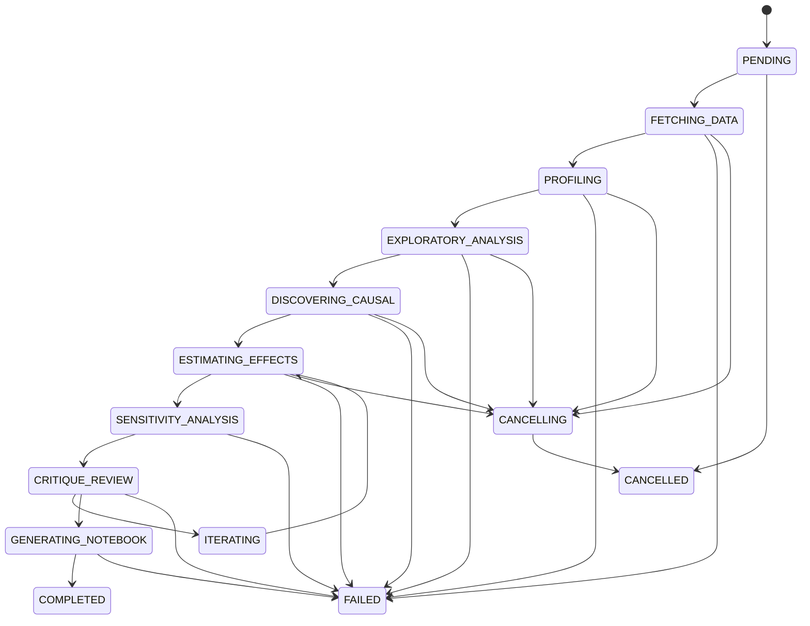
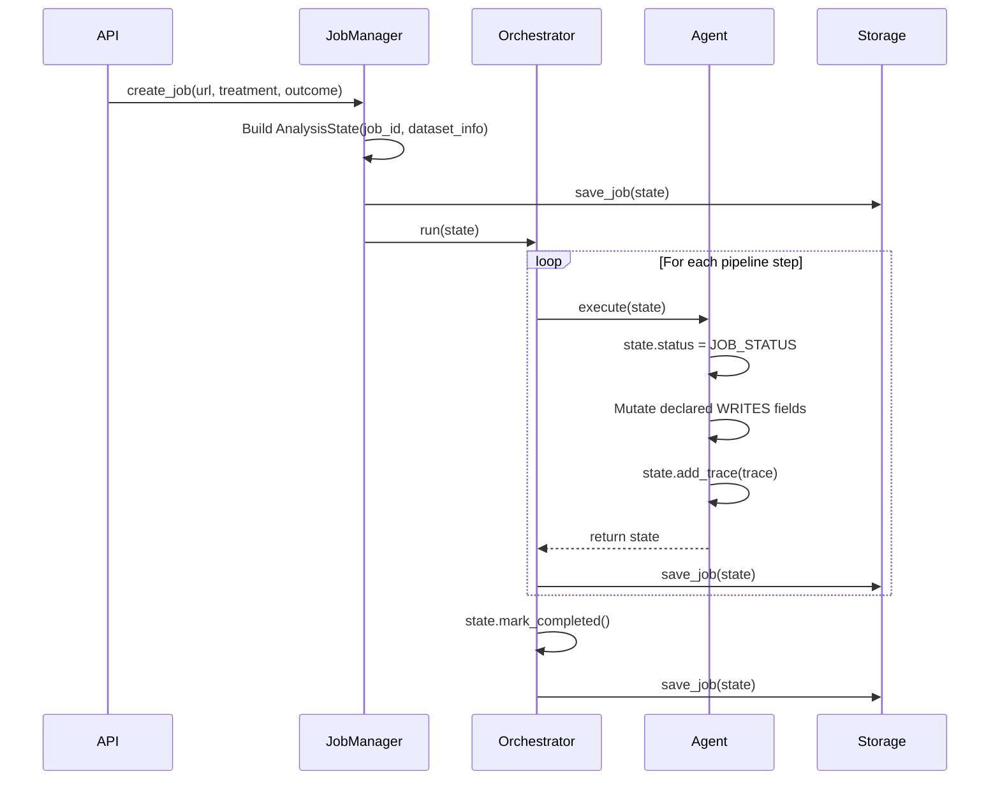

# State Schema Reference

All agents in the pipeline share a single `AnalysisState` object. Each agent declares which fields it reads (`REQUIRED_STATE_FIELDS`) and which it writes (`WRITES_STATE_FIELDS`). This document defines every field, every nested model, and every helper method on that state object.

Source: `backend/src/agents/base/state.py`

---

## AnalysisState

Pydantic `BaseModel`. Created once per job, mutated by each agent in sequence, persisted to storage after each agent completes.

### Field Reference

| Field | Type | Default | Written By | Read By |
|-------|------|---------|-----------|---------|
| `job_id` | `str` | (required) | JobManager | All agents |
| `dataset_info` | `DatasetInfo` | (required) | JobManager | data_profiler, domain_knowledge |
| `status` | `JobStatus` | `PENDING` | Each agent (via `JOB_STATUS`) | API, JobManager |
| `treatment_variable` | `str \| None` | `None` | User or Orchestrator | effect_estimator, sensitivity_analyst, notebook_generator |
| `outcome_variable` | `str \| None` | `None` | User or Orchestrator | effect_estimator, sensitivity_analyst, notebook_generator |
| `raw_metadata` | `dict \| None` | `None` | Metadata extractor (Kaggle) | domain_knowledge |
| `domain_knowledge` | `dict \| None` | `None` | domain_knowledge | notebook_generator, orchestrator |
| `data_profile` | `DataProfile \| None` | `None` | data_profiler | eda_agent, causal_discovery, dag_expert, confounder_discovery, data_repair, ps_diagnostics, effect_estimator, notebook_generator |
| `dataframe_path` | `str \| None` | `None` | data_profiler | eda_agent, causal_discovery, confounder_discovery, data_repair, ps_diagnostics, effect_estimator, sensitivity_analyst |
| `eda_result` | `EDAResult \| None` | `None` | eda_agent | orchestrator, critique, notebook_generator |
| `proposed_dag` | `CausalDAG \| None` | `None` | causal_discovery, dag_expert | dag_expert, notebook_generator |
| `treatment_effects` | `list[TreatmentEffectResult]` | `[]` | effect_estimator, effect_estimator_react | sensitivity_analyst, critique, notebook_generator |
| `analyzed_pairs` | `list[CausalPair]` | `[]` | effect_estimator | notebook_generator |
| `sensitivity_results` | `list[SensitivityResult]` | `[]` | sensitivity_analyst | critique, notebook_generator |
| `confounder_discovery` | `dict \| None` | `None` | confounder_discovery | notebook_generator |
| `ps_diagnostics` | `dict \| None` | `None` | ps_diagnostics | notebook_generator |
| `data_repairs` | `list[dict]` | `[]` | data_repair | notebook_generator |
| `debate_history` | `list[dict]` | `[]` | critique | notebook_generator |
| `critique_history` | `list[CritiqueFeedback]` | `[]` | critique | orchestrator, notebook_generator |
| `iteration_count` | `int` | `0` | orchestrator | critique |
| `max_iterations` | `int` | `3` | config | orchestrator |
| `notebook_path` | `str \| None` | `None` | notebook_generator | API (file download) |
| `recommendations` | `list[str]` | `[]` | orchestrator | notebook_generator |
| `agent_traces` | `list[AgentTrace]` | `[]` | All agents (via `add_trace`) | API (traces endpoint) |
| `error_message` | `str \| None` | `None` | `mark_failed()` | API |
| `error_agent` | `str \| None` | `None` | `mark_failed()` | API |
| `created_at` | `datetime` | `utcnow()` | JobManager | API |
| `updated_at` | `datetime` | `utcnow()` | Every mutation | API |
| `completed_at` | `datetime \| None` | `None` | `mark_completed()` | API |

### Trace Management Constants

| Constant | Value | Purpose |
|----------|-------|---------|
| `MAX_TRACES` | 50 | Maximum detailed traces kept before compression |
| `MAX_TRACE_OUTPUT_LEN` | 500 | Character limit for trace output values |
| `MAX_TRACE_REASONING_LEN` | 1000 | Character limit for trace reasoning text |

---

## Agent State Contracts

Each agent declares its dependencies and outputs via class attributes. The orchestrator uses these to validate dispatch order and merge parallel results.

| Agent | Registered Name | REQUIRED_STATE_FIELDS | WRITES_STATE_FIELDS |
|-------|----------------|----------------------|---------------------|
| DataProfilerAgent | `data_profiler` | `dataset_info` | `data_profile`, `dataframe_path` |
| DomainKnowledgeAgent | `domain_knowledge` | `dataset_info` | `domain_knowledge` |
| DataRepairAgent | `data_repair` | `data_profile`, `dataframe_path` | `data_repairs` |
| EDAAgent | `eda_agent` | `data_profile`, `dataframe_path` | `eda_result` |
| CausalDiscoveryAgent | `causal_discovery` | `data_profile`, `dataframe_path` | `proposed_dag` |
| DAGExpertAgent | `dag_expert` | `data_profile`, `proposed_dag` | `proposed_dag` |
| ConfounderDiscoveryAgent | `confounder_discovery` | `data_profile`, `dataframe_path` | `confounder_discovery` |
| PSDiagnosticsAgent | `ps_diagnostics` | `data_profile`, `dataframe_path` | `ps_diagnostics` |
| EffectEstimatorAgent | `effect_estimator` | `data_profile`, `dataframe_path` | `treatment_effects` |
| EffectEstimatorReActAgent | `effect_estimator_react` | `data_profile`, `dataframe_path` | `treatment_effects` |
| SensitivityAnalystAgent | `sensitivity_analyst` | `treatment_effects`, `dataframe_path` | `sensitivity_results` |
| CritiqueAgent | `critique` | `treatment_effects` | `critique_history` |
| NotebookGeneratorAgent | `notebook_generator` | `data_profile` | `notebook_path` |

Note: The orchestrator agent does not declare these fields. It reads and writes state implicitly through its dispatch and merge logic.

---

## Data Models

### DatasetInfo

Information about the input dataset, populated at job creation time and enriched by Kaggle metadata extraction.

```python
class DatasetInfo(BaseModel):
    url: str                                         # Dataset URL or local path
    name: str | None = None                          # Human-readable name
    local_path: str | None = None                    # Path after download
    n_samples: int | None = None                     # Row count
    n_features: int | None = None                    # Column count
    kaggle_description: str | None = None            # Kaggle dataset description
    kaggle_column_descriptions: dict[str, str] = {}  # Column name -> description
    kaggle_tags: list[str] = []                      # Kaggle tags
    kaggle_domain: str | None = None                 # Inferred domain (healthcare, economics, etc.)
    metadata_quality: str = "unknown"                # high, medium, low, unknown
```

### DataProfile

Output of the DataProfilerAgent. Contains statistical summaries and causal-specific variable classifications.

```python
class DataProfile(BaseModel):
    n_samples: int
    n_features: int
    feature_names: list[str]
    feature_types: dict[str, str]              # feature -> "numeric", "categorical", "binary", "ordinal"
    missing_values: dict[str, int]             # feature -> missing count
    numeric_stats: dict[str, dict[str, float]] # feature -> {mean, std, min, max}
    categorical_stats: dict[str, dict[str, int]] # feature -> {value: count}

    # Causal-specific classifications
    treatment_candidates: list[str] = []
    outcome_candidates: list[str] = []
    potential_confounders: list[str] = []
    potential_instruments: list[str] = []
    has_time_dimension: bool = False
    time_column: str | None = None
    discontinuity_candidates: list[str] = []
```

### CausalPair

A treatment-outcome variable pair, used to track which pairs the pipeline has analyzed.

```python
class CausalPair(BaseModel):
    treatment: str
    outcome: str
    rationale: str = ""
    priority: int = 1   # 1 = primary, 2 = secondary, 3 = exploratory
```

### CausalEdge

A single edge in a causal graph.

```python
class CausalEdge(BaseModel):
    source: str
    target: str
    edge_type: str = "directed"   # "directed", "bidirected", "undirected"
    confidence: float = 1.0
```

### CausalDAG

A causal directed acyclic graph, output of the CausalDiscoveryAgent and refined by DAGExpertAgent.

```python
class CausalDAG(BaseModel):
    nodes: list[str]
    edges: list[CausalEdge]
    discovery_method: str                    # "PC", "FCI", "GES", "NOTEARS", "LiNGAM"
    treatment_variable: str | None = None
    outcome_variable: str | None = None
    interpretation: str = ""                 # LLM-generated interpretation
```

### TreatmentEffectResult

A single estimation result from one method applied to one treatment-outcome pair.

```python
class TreatmentEffectResult(BaseModel):
    method: str                              # "OLS", "IPW", "AIPW", "PSM", etc.
    estimand: str                            # "ATE", "ATT", "CATE", "LATE"
    estimate: float
    std_error: float
    ci_lower: float
    ci_upper: float
    p_value: float | None = None
    assumptions_tested: list[str] = []
    details: dict[str, Any] = {}

    # Multi-pair tracking
    treatment_variable: str | None = None
    outcome_variable: str | None = None
```

### SensitivityResult

Output of a single sensitivity analysis method.

```python
class SensitivityResult(BaseModel):
    method: str                              # "E-value", "Rosenbaum bounds", etc.
    robustness_value: float
    interpretation: str
    details: dict[str, Any] = {}
```

### EDAResult

Output of the EDAAgent. Contains distribution analysis, correlation analysis, outlier detection, multicollinearity checks, and covariate balance assessment.

```python
class EDAResult(BaseModel):
    # Correlation analysis
    correlation_matrix: dict[str, dict[str, float]] = {}
    high_correlations: list[dict[str, Any]] = []     # Pairs with |r| > 0.7

    # Distribution analysis
    distribution_stats: dict[str, dict[str, Any]] = {} # Skewness, kurtosis, normality

    # Outlier detection
    outliers: dict[str, dict[str, Any]] = {}          # column -> {count, indices, method}

    # Multicollinearity
    vif_scores: dict[str, float] = {}                 # Variance Inflation Factor
    multicollinearity_warnings: list[str] = []

    # Covariate balance (treatment vs control)
    covariate_balance: dict[str, dict[str, float]] = {} # SMD, p-values
    balance_summary: str = ""

    # Data quality
    data_quality_score: float = 0.0
    data_quality_issues: list[str] = []

    # Visualization paths
    plot_paths: dict[str, str] = {}

    # Summary statistics
    summary_table: dict[str, dict[str, Any]] = {}
```

### CritiqueDecision

Enum of possible critique outcomes.

```python
class CritiqueDecision(StrEnum):
    APPROVE = "APPROVE"     # Analysis passes quality checks
    ITERATE = "ITERATE"     # Needs improvement, re-run some agents
    REJECT = "REJECT"       # Fundamental problems, cannot proceed
```

### CritiqueFeedback

One critique evaluation. Multiple entries accumulate in `critique_history` across iterations.

```python
class CritiqueFeedback(BaseModel):
    decision: CritiqueDecision
    iteration: int
    scores: dict[str, int]          # dimension -> score (1-5)
    issues: list[str]
    improvements: list[str]
    reasoning: str
```

### AgentTrace

A record of a single agent action, used for observability and debugging.

```python
class AgentTrace(BaseModel):
    agent_name: str
    timestamp: datetime = Field(default_factory=datetime.utcnow)
    action: str
    reasoning: str
    inputs: dict[str, Any] = {}
    outputs: dict[str, Any] = {}
    tools_called: list[str] = []
    duration_ms: int = 0
    token_usage: dict[str, int] = {}
```

---

## JobStatus Enum

14 values representing the lifecycle of a job. Each agent sets the status to its declared `JOB_STATUS` value when it starts executing.



| Value | String | Description |
|-------|--------|-------------|
| `PENDING` | `"pending"` | Job created, not yet started |
| `FETCHING_DATA` | `"fetching_data"` | Downloading dataset |
| `PROFILING` | `"profiling"` | DataProfiler, DomainKnowledge, or DataRepair running |
| `EXPLORATORY_ANALYSIS` | `"exploratory_analysis"` | EDA agent running |
| `DISCOVERING_CAUSAL` | `"discovering_causal"` | CausalDiscovery, DAGExpert, or ConfounderDiscovery running |
| `ESTIMATING_EFFECTS` | `"estimating_effects"` | EffectEstimator or PSDiagnostics running |
| `SENSITIVITY_ANALYSIS` | `"sensitivity_analysis"` | SensitivityAnalyst running |
| `CRITIQUE_REVIEW` | `"critique_review"` | CritiqueAgent evaluating results |
| `ITERATING` | `"iterating"` | Re-running agents after ITERATE decision |
| `GENERATING_NOTEBOOK` | `"generating_notebook"` | NotebookGenerator building report |
| `COMPLETED` | `"completed"` | Pipeline finished successfully |
| `FAILED` | `"failed"` | Unrecoverable error |
| `CANCELLING` | `"cancelling"` | Graceful shutdown in progress |
| `CANCELLED` | `"cancelled"` | User-initiated cancellation completed |

---

## Helper Methods

### add_trace(trace: AgentTrace) -> None

Appends a trace to `agent_traces` with automatic truncation and compression.

- Truncates `outputs` values longer than 500 characters
- Truncates `reasoning` longer than 1000 characters
- When trace count exceeds `2 * MAX_TRACES` (100), compresses older traces into a single summary trace keeping only the most recent 25

### should_iterate() -> bool

Returns `True` if the latest critique decision is `ITERATE` and `iteration_count < max_iterations`.

### is_approved() -> bool

Returns `True` if the latest critique decision is `APPROVE`.

### get_primary_pair() -> tuple[str | None, str | None]

Returns the primary treatment-outcome pair with this priority:
1. User-specified `treatment_variable` and `outcome_variable`
2. First entry in `analyzed_pairs`
3. Variables from the first `TreatmentEffectResult`
4. `(None, None)`

### get_effects_for_pair(treatment, outcome) -> list[TreatmentEffectResult]

Filters `treatment_effects` to results matching a specific variable pair.

### get_all_pairs() -> list[tuple[str, str]]

Returns all unique treatment-outcome pairs, preferring `analyzed_pairs` and falling back to extracting pairs from `treatment_effects`.

### mark_failed(error: str, agent: str) -> None

Sets `status = FAILED`, records `error_message` and `error_agent`.

### mark_completed() -> None

Sets `status = COMPLETED` and records `completed_at` timestamp.

### mark_cancelling() -> None

Sets `status = CANCELLING`.

### mark_cancelled(reason: str = "Cancelled by user") -> None

Sets `status = CANCELLED` and records reason in `error_message`.

---

## State Lifecycle



1. **Creation**: `JobManager` constructs `AnalysisState` with `job_id` and `DatasetInfo`, saves to storage
2. **Execution**: The orchestrator dispatches agents one at a time (or in parallel for EDA + CausalDiscovery). Each agent mutates state in place, adding traces and writing its declared output fields
3. **Persistence**: After each agent returns, the orchestrator persists the updated state to storage
4. **Completion**: `mark_completed()` or `mark_failed()` sets the terminal status and timestamps

---

## Known Issues

1. **Mutable state object**: `AnalysisState` is a regular Pydantic `BaseModel` (not frozen). Any code with a reference can mutate any field, regardless of `WRITES_STATE_FIELDS` declarations. The contracts are advisory, not enforced.

2. **Shallow copy in parallel dispatch**: When the orchestrator runs agents in parallel, it creates shallow copies of state. Mutations to nested objects (lists, dicts) in one copy can bleed into others.

3. **Trace compression loses detail**: When traces exceed 100 entries, older traces are replaced by a single summary containing only agent names and action counts. Individual reasoning, outputs, and tool calls are discarded.

4. **`progress_percentage` referenced but undefined**: Some code references `state.progress_percentage` but this field does not exist on the model. Progress is calculated externally from `PROGRESS_WEIGHT` metadata.

5. **`updated_at` inconsistency**: Only `add_trace()` and the `mark_*` methods update `updated_at`. Direct field mutations by agents (e.g., `state.treatment_effects.append(...)`) do not touch it.

6. **Treatment/outcome variable resolution**: Multiple fallback paths exist (`get_primary_pair`, direct field access, extraction from effects). Different agents use different resolution strategies, which can produce inconsistent variable references.
