# Intake boundary

Intake turns a question, optional context, and a Kaggle reference into preserved
source bytes, measured profiles, citable evidence, explicit semantic availability,
and an immutable `IntakeOutcome`. It makes no model call and chooses no causal roles.

```mermaid
flowchart LR
    CLI[CLI commands] --> Runtime[Application runtime]
    Runtime --> Entry[Intake entry and run session]
    Entry --> Capture[Versioned source capture]
    Capture --> Resources[Archive inventory and resource results]
    Resources --> Evidence[Profiles, evidence and semantic availability]
    Evidence --> Outcome[Committed IntakeOutcome]
    Outcome --> Design[Design entry and causal reasoning]
```

| Owner | Responsibility |
| --- | --- |
| `entry.py` | Public `IntakeDeps` / `run_intake` API, replay, invocation identities, artifact commits, and completion. |
| `coordinator.py` | Existing reusable `IntakeCoordinator` constructor, `run`, and `open_handoff` interface; no mutable execution state. |
| `workflow.py` | Sequence capture, inventory, per-resource results, deterministic fan-in, evidence publication, and outcome policy. |
| `kaggle.py` | Resolve the source version, collect provider responses, download the archive, and normalize provider/client construction failures. |
| `archive.py`, `resources.py` | Admission, immutable member inventory, terminal parse results, and isolation of individual extraction failures; no storage or event dependencies. |
| `profiler.py` | Measured table facts and explicitly labelled hypotheses, including finite numeric summaries and counts of non-finite source values. |
| `fields.py`, `semantic.py`, `contracts.py` | Typed inputs, provider-field classification, citable evidence, and complete semantic-slot availability. |
| `catalog.py`, `outcome.py` | Catalogue writes, outcome summaries, and the intake handoff reader. |

The public entry accepts source, persistence, registry, event, and clock dependencies.
Its source client may be supplied directly or through a factory. Replay and conflicting
submission checks happen before the factory is called. Execution state lives in a new
session for every invocation. Existing CLI commands and artifact versions are preserved.

Every inventoried member retains a result. Duplicate filenames refuse archive admission.
A damaged member in an otherwise admitted archive fails independently, so good tables
can still produce a partial intake. Refused archives preserve their member inventory
without extracting it. Non-finite numeric values remain counted; numeric summaries use
finite values, and unavailable or overflowing summaries are null.

## CLI versus design

The CLI is the interface to the application, not an analysis stage.

| Command | Effect |
| --- | --- |
| `new` | Run deterministic intake and return its committed identity. |
| `run` | Start or advance design and subsequently the later pipeline stages. |
| `select-table`, `answer-context`, `approve-design` | Respond to a specific design interrupt. |
| `status` | Read the current application state. |
| `presentation` | Retrieve a finished presentation bundle. |

Design owns table selection, treatment/outcome roles, causal assumptions, method selection,
clarification, and approval. Intake supplies the evidence those decisions depend on.

## Remaining application limitations

The CLI still constructs the shared runtime eagerly. Using the independent intake entry
does not require a design graph, model, or checkpoint store, but the default CLI startup
still initializes downstream configuration before dispatching `new`.

The SQL availability views remain indexed by dataset version. A later intake of that same
version replaces those lookup rows; an earlier analysis rebuilding its design manifest
can therefore see the later analysis's profile pointers or metadata availability. Saved
outcomes, evidence, profiles, and previously committed manifests remain immutable.
Fixing this requires snapshot-scoped retrieval at the intake/design boundary.

Provider capture is still committed after all capture operations succeed, and unexpected
persistence failures retain the existing runtime recovery limitations. The refactor does
not claim a new transaction protocol or live-provider certification.
