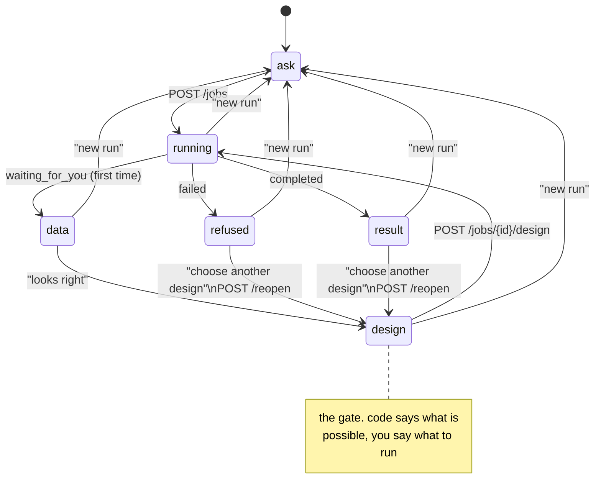

# The interaction graph

Every screen, every way in and out. Keep this file true: if a transition changes
in `App.tsx` and not here, the next person reads a map of a building that has
been rearranged.

## Who drives each transition

| from | to | driven by | costs |
|---|---|---|---|
| ask | running | you submit | a download, if from Kaggle |
| running | data | the server parking at the gate | 3 model calls: intake, roles, choose |
| data | design | you confirming the reading | nothing |
| design | running | you choosing a design | nothing |
| running | result / refused | the estimator finishing or declining | 1 model call: the readout |
| result / refused | design | you reopening | **nothing** — rewinds to the gate checkpoint |
| anywhere | ask | "new run" | discards the job entirely |

## Why `reopen` exists

The lanes are built to refuse: a dead instrument, an arm with five units, a
cutoff outside the data. Refusal is a normal outcome, not an error.

Before `reopen`, the only exit from a refusal was "new run", which threw away
the download and re-ran the intake, the roles and the recommendation. Four model
calls to change one dropdown. `POST /jobs/{id}/reopen` rewinds to the gate
checkpoint, which still holds all of it, so the retry costs nothing.

The same path serves a better purpose on success: running two designs against
the same data and comparing them is a thing an honest tool should make easy.

## Properties this graph is meant to have

- **No dead end.** Every state has an exit that is not "throw the job away".
  `result` and `refused` both lead back to `design`.
- **The screen follows the run, not the click.** `App.tsx` derives the view from
  `job.status`, so a reload lands where the run actually is rather than where
  you last clicked. The one piece of local state is `seenData`, which stops the
  data screen reappearing after you have confirmed it.
- **Reopening skips the data screen.** `reopen()` sets `seenData` so you land on
  the gate. You already checked the reading; being made to check it again would
  be a nag, not a safeguard.
- **The tape survives a reconnect.** Events live on the run's checkpoint, not in
  a queue, so `GET /stream` replays from the start.

## Known rough edges

- **No route back from `design` to `data`.** If you spot a misreading at the
  gate, you have to start over. It is a real gap; the fix is a back button that
  clears `seenData`.
- **`seenData` is not persisted.** Reload while parked and you are shown the
  data screen again. Harmless, mildly annoying.
- **`running` has no cancel.** A long estimate can only be waited out.
- **No history.** One job at a time, remembered in `localStorage`. Earlier runs
  are still on disk in `jobs.sqlite` but nothing surfaces them.
